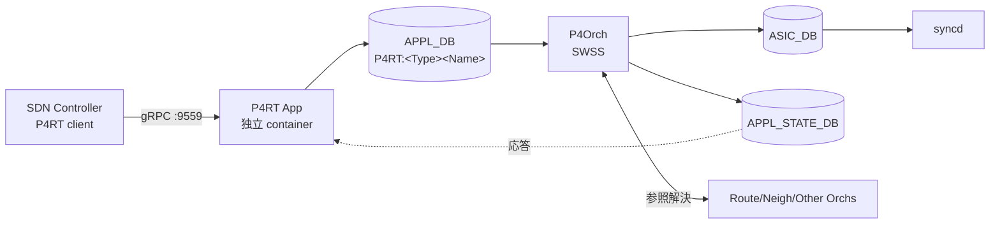

<!-- topics-tip -->
!!! tip "Topics で読み物として読む"
    この HLD は実装詳細を含みます。機能の概念・設定・運用を読み物として読みたい場合は [Topics 10 章: gNMI / OpenConfig / 管理プレーン](../topics/10-gnmi-openconfig/index.md) を参照。
<!-- /topics-tip -->

!!! note "裏取りステータス: code-verified（部分）"
    `sonic-swss/orchagent/p4orch/`（`p4orch.cpp` / `p4orch.h` ほか）と `sonic-buildimage/dockers/docker-sonic-p4rt/`（`p4rt.sh`, `p4rt_vars.j2`, `p4rt.service.j2`）、`rules/p4rt.{mk,dep}` 確認。`sonic-swss-common/common/schema.h` で `APPL_STATE_DB=14` / `DPU_APPL_STATE_DB=16` 定義。`send_to_ingress` netdev は HLD（`SONiC/doc/pins/Packet_io.md`）には設計されているが本リポ群の host config / kernel には現れず、vendor SAI / P4Runtime app 側で扱われる前提。`saip4ext.h` は OCP SAI submodule 側のため本リポでは未展開。

# PINS（P4 Integrated Network Stack）

## 読み手が知りたいこと

- [PINS](../reference/glossary.md#term-pins) とは何で、既存 [SONiC](../reference/glossary.md#term-sonic) に何を足すのか
- なぜ [SAI](../reference/glossary.md#term-sai) pipeline を **P4 で表現** するアプローチを取るのか
- 既存 RouteOrch / NeighOrch との **同 [ASIC](../reference/glossary.md#term-asic) table 共有** をどう成立させるのか
- 応答経路（response path）と新規 `APPL_STATE_DB` の役割
- Packet IO の **3 種類**（packet in / port 直送 / send_to_ingress）

## なぜ PINS が必要か

PINS は **P4Runtime ベースの SDN 制御 interface** を SONiC に **opt-in** で追加するプロジェクト[^1]。Google / ONF / Intel の初版に Microsoft SONiC team の feedback を取り込んだ。SONiC 従来パスを壊さず、remote SDN controller が forwarding を直接プログラムできる。

ねらい[^1]:

- SAI pipeline を P4 で表現し controller の interface を **SAI 経験者に親しみやすく** する
- vendor 間 SAI 実装差を縮小し pipeline の曖昧さを排除
- programmable HW 拡張は P4 拡張 + SAI 拡張（`saip4ext.h`）で吸収

## 全体アーキテクチャ

緑色パス（SAI fixed/configurable）は SAI pipeline を P4 でモデル化したテーブルを書く流路、赤色パス（SAI extension）は `saip4ext.h` 経由で HW 拡張を書く流路[^1]。

## 主要コンポーネント

| Component | 役割 |
|-----------|------|
| **[P4RT](../reference/glossary.md#term-p4rt) Application** | 独立 container、複数 gRPC client を受ける。[APPL_DB](../reference/glossary.md#term-appl_db) の P4RT table へ書込、結果を controller に通知。read も対応[^1] |
| **P4 Programs / P4Info** | SAI pipeline を P4 で記述、p4c コンパイル後の P4Info を controller が初回接続時に push |
| **P4 APPL_DB Tables** | `P4RT:<TableType><TableName>` 命名。`TableType ∈ {FIXED, ACL}`、TableName は SAI object（router_interface / neighbor / next_hop / IPV4 / IPV6 等）|
| **P4Orch** | APPL_DB → [ASIC_DB](../reference/glossary.md#term-asic_db) の翻訳。他 orch の SAI object を **参照しつつ refcount を上げる** |
| **APPL_STATE_DB** | 新 DB、app 向け state query。schema は APPL_DB と同形 |
| **SAI Extensions (`saip4ext.h`)** | programmable HW で user 定義拡張を vendor SAI に橋渡し |

## 並行 path 方式と応答 path

P4Orch は **同一 ASIC table への複数 writer（RouteOrch 等）** を扱う必要がある。現行 SWSS は **ownership tag と response path が無い** ため、緑色 path は既存テーブル使い回しでなく **並行 path** として実装される[^1]。将来 SWSS が同機能を持てば既存パスへ統合する方針。

応答 path: SWSS ↔ [syncd](../reference/glossary.md#term-syncd) の同期通信を **app まで延伸** する[^1]。SDN controller は各プログラム要求の成否 ack で次動作を決めるため必須。`APPL_STATE_DB` への応答書出しは config フラグで on/off できる設計。

## Packet IO

| 方向 | 機構 |
|------|------|
| **Packet In** | controller が [ACL](../reference/glossary.md#term-acl) を program して punt/copy。punt 先は `genetlink` type host interface（sFlow と同方式）。target egress port 等の追加属性は ASIC 非依存モデルで P4RT App container に渡す |
| **Packet Out (port 直送)** | 既存 port netdev を使い ingress pipeline をバイパス |
| **Packet Out (ASIC 経由)** | 新 netdev `send_to_ingress` を導入し ingress pipeline を通して送出 |

## Warm boot / Fast boot / SAI

- P4RT 未使用なら従来通り影響なし[^1]
- 使用時、**MVP では P4RT が作った object は warm/fast boot 非対応**。後続 release で対応予定
- 既存 SAI fixed/configurable はそのまま、programmable HW 向けに `saip4ext.h` を新設[^1]

## CLI / CONFIG_DB / YANG

- CLI 変更なし
- [CONFIG_DB](../reference/glossary.md#term-config_db) に PINS 機能 enable/disable フラグ（例: APPL_STATE_DB 応答書出しの on/off）
- gRPC listen はデフォルト **tcp/9559** ハードコード（将来 ConfigDB モデル化予定）

## 制限事項

- 初版 MVP は IP route / next hop / next hop group / ACL（drop / punt）のみ
- gRPC port は hardcode (`9559`)
- 関連 supplementary [HLD](../reference/glossary.md#term-hld)（P4RT App / P4Orch / SAI P4 / Packet IO / APPL_STATE_DB / P4 拡張 / DB Schema）の多くが `in_progress`

## 干渉する機能

- **RouteOrch / NeighOrch / AclOrch**: P4Orch が同 ASIC table を共有し SAI object 参照
- **sFlow**: packet-in の genetlink hostif 機構を共有
- **[gNMI](../reference/glossary.md#term-gnmi) / sonic-telemetry**: 将来 ConfigDB モデル化の参考
- **[DASH](../reference/glossary.md#term-dash) / [SmartSwitch](../reference/glossary.md#term-smartswitch)**: SDN モデルとして思想的近接

## 引用元

[^1]: `sonic-net/SONiC` `doc/pins/pins_hld.md` @ `49bab5b5ff0e924f1ea52b3d9db0dfa4191a7c06`

## 関連ページ

- [Topic: P4 / PINS](../topics/18-p4-pins/index.md)
- [HLD: P4Runtime PacketIO](packetio.md)
- [HLD: P4RT Application](p4rt-application-hld.md)
- [HLD: send_to_ingress](send-to-ingress-hld.md)

<!-- topics-back-ref -->
## 関連 Topics

- [Topics: P4 / PINS / Programmable Pipeline](../topics/18-p4-pins/index.md)

<!-- /topics-back-ref -->

<!-- glossary-links-injected: b59b552ea208 -->

<!-- ops-entry -->
## 運用入口

この HLD に対応する運用面の入口（CLI / CONFIG_DB / [YANG](../reference/glossary.md#term-yang) / Runbook）を以下にまとめる。

### 関連 Runbook

- [pins-grpc-unresponsive](../reference/runbooks/pins-grpc-unresponsive.md)

<!-- /ops-entry -->

<!-- glossary-links-injected: 4b7e3e133212 -->
