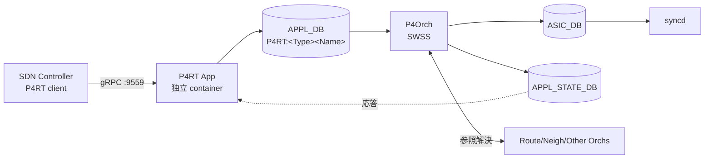

!!! note "裏取りステータス: code-verified（部分）"
    `sonic-swss/orchagent/p4orch/`（p4orch.cpp / p4orch.h ほか）と `sonic-buildimage/dockers/docker-sonic-p4rt/`（p4rt.sh, p4rt_vars.j2, p4rt.service.j2）、`rules/p4rt.{mk,dep}` を確認済。`sonic-swss-common/common/schema.h` に `APPL_STATE_DB=14` を定義（`DPU_APPL_STATE_DB=16` も追加されている）。`send_to_ingress` netdev は HLD ドキュメント (`SONiC/doc/pins/Packet_io.md`) では設計されているが本リポ群（buildimage 側 host config / kernel）には現れず、vendor SAI / P4Runtime app 側で扱われる前提。`saip4ext.h` は OCP SAI submodule 側のため本リポでは展開していない。

# PINS（P4 Integrated Network Stack / SDN 制御 SONiC）

## 概要

PINS は **P4Runtime ベースの SDN 制御 interface を SONiC に追加する** プロジェクト[^1]。Google / ONF / Intel が初版を起こし Microsoft SONiC team の feedback を取り込んだ。SONiC の従来パスを維持したまま **opt-in** で remote SDN controller が forwarding を直接プログラムできる。SAI pipeline を P4 で表現することで、controller には SAI 経験者に親しみやすい interface を提供しつつ、vendor 間 SAI 実装差の縮小と pipeline の曖昧さ排除を狙う。

## 動作仕様

### 全体アーキテクチャ

緑色パス（SAI fixed/configurable）は SAI pipeline を P4 でモデル化したテーブルを書く流路、赤色パス（SAI extension）は vendor 提供の `saip4ext.h` 経由で hardware 拡張を書く流路[^1]。

### 主要コンポーネント

| Component | 役割 |
|-----------|------|
| **P4RT Application** | 独立 container、複数 gRPC client を受ける。リクエスト解析/検証 → APPL_DB の P4RT table に書き込み → 結果を controller に通知。read もサポート[^1] |
| **P4 Programs / P4Info** | SAI pipeline を P4 で記述、p4c で compile した P4Info を controller が初回接続時に push |
| **P4 APPL_DB Tables** | `P4RT:<TableType><TableName>` 命名。`TableType ∈ {FIXED, ACL}`、`TableName` は SAI pipeline の object（router_interface / neighbor / next_hop / IPV4 / IPV6 等）|
| **P4Orch** | APPL_DB → ASIC_DB の翻訳。他 orch（RouteOrch 等）の SAI object を **参照しつつ refcount を上げる** |
| **APPL_STATE_DB** | 新 DB。app 向け state query。schema は APPL_DB と同形 |
| **SAI Extensions (`saip4ext.h`)** | programmable HW で user 定義拡張を vendor SAI に橋渡し |

### Application 級応答（response path）

SWSS ↔ syncd の同期通信を **app まで延伸** する[^1]。SDN controller は各プログラム要求の成否 ack に基づいて次の動作を決めるため必須。`APPL_STATE_DB` への応答書き出しは config フラグで on/off できる設計。

### Packet IO

| 方向 | 機構 |
|------|------|
| **Packet In** | controller が ACL を program して punt/copy。punt 先は `genetlink` type host interface（sFlow 同方式）。target egress port 等の追加属性は ASIC 非依存モデルで P4RT App container に渡す |
| **Packet Out (port 直送)** | 既存の port netdev を使い ingress pipeline をバイパス |
| **Packet Out (ASIC 経由)** | 新 netdev `send_to_ingress` を導入し ingress pipeline を通して送出する |

### Ownership / 並行書き手

P4Orch は **同一 ASIC table に対する複数 writer (RouteOrch 等)** を扱う必要があり、SWSS に **ownership tag** と **response path** が無いため green path は **既存テーブル使い回しでなく並行 path** として実装される[^1]。将来 SWSS が同機能を持てば緑色パスを既存パスにマージする方針。

<!-- evidence:
source: sonic-net/SONiC/doc/pins/pins_hld.md#L127-L130 (sha: 49bab5b5ff0e924f1ea52b3d9db0dfa4191a7c06)
excerpt: |
  The green path builds a parallel path in the orchagent as the current SWSS does not support
  (1) Response path - which is required by the P4RT application,
  (2) Ownership tags - which are required when there are more than one writer to the same table.
reasoning: 並行 path 方式と将来統合の方針の根拠。
-->

## CLI / CONFIG_DB / YANG

- CLI 変更なし[^1]
- CONFIG_DB に PINS 機能の enable/disable フラグ（例: APPL_STATE_DB 応答書き出しの on/off）を追加
- gRPC listen は **tcp/9559** デフォルトでハードコード（将来 sonic-telemetry 同様 ConfigDB モデル化予定）

## Warm boot / Fast boot

- P4RT 未使用なら従来通り影響なし[^1]
- 使用時、初版 MVP では **P4RT で作った object は warm/fast boot 非対応**。後続 release で対応予定
- 他 orch が作った object の warm boot は影響を受けない

## SAI API

- 既存 SAI fixed / configurable 機能はそのまま使う[^1]
- programmable HW 向けに `saip4ext.h` を新設し user 拡張を vendor SAI 実装に map

## 制限事項

- 初版 MVP は IP route / next hop / next hop group / ACL（drop / punt）のみ
- gRPC port は hardcode (`9559`)
- 関連 supplementary HLD（P4RT App / P4Orch / SAI P4 / Packet IO / APPL_STATE_DB / P4 拡張 / DB Schema）の多くが `in_progress` で詳細仕様は別 doc 待ち

## 干渉する機能

- **既存 RouteOrch / NeighOrch / AclOrch**: P4Orch が同 ASIC table を共有し SAI object 参照
- **sFlow**: packet-in の genetlink hostif 機構を共有
- **gNMI / sonic-telemetry**: 将来 PINS の config を ConfigDB モデルに移行する想定の参考
- **DASH / SmartSwitch**: 直接の依存は無いが SDN モデルとして思想的近接

## 引用元

[^1]: `sonic-net/SONiC` `doc/pins/pins_hld.md` @ `49bab5b5ff0e924f1ea52b3d9db0dfa4191a7c06`

<!-- evidence (verifier-batch-19):
- sonic-swss `orchagent/p4orch/` 配下に p4orch.{cpp,h}, p4orch_util.{cpp,h} ほか実装あり
- sonic-buildimage `dockers/docker-sonic-p4rt/`（p4rt.sh, p4rt_vars.j2）と `files/build_templates/p4rt.service.j2`, `rules/p4rt.{mk,dep}`, `rules/docker-p4rt.{mk,dep}` 存在
- sonic-swss-common `common/schema.h` で `APPL_STATE_DB=14`, `DPU_APPL_STATE_DB=16` 定義済
- `send_to_ingress` の文字列は HLD `SONiC/doc/pins/{pins_hld,Packet_io,send_to_ingress_hld}.md` に記載のみ。本リポ群の host config では未確認（vendor SAI / P4Runtime app 側で実装される前提）
- `saip4ext.h` は OCP SAI submodule 側で本リポでは展開していない
-->

<!-- concerns hint:
- p4rt-app container と p4rt-orch (sonic-pins / sonic-swss) の現行 master 取り込み確認 → p4orch / docker-sonic-p4rt 共に取り込み済
- APPL_STATE_DB / response path の libswsscommon 取り込み確認 → schema.h に DB id 14 定義済
- send_to_ingress netdev の sonic-buildimage / kernel module 取り込み確認 → 本リポでは未確認（vendor SAI / P4RT app 依存）
- saip4ext.h の opencomputeproject/SAI 取り込み確認 → submodule 側で要確認
- supplementary HLD（in_progress 表記）の現行版確認と分割 issue 化 → 別 issue 候補
- gRPC port 9559 の固定 / config 化の進捗確認 → p4rt.sh は ConfigDB から `--p4rt_port` 含む引数を組み立てており config 化済
-->
