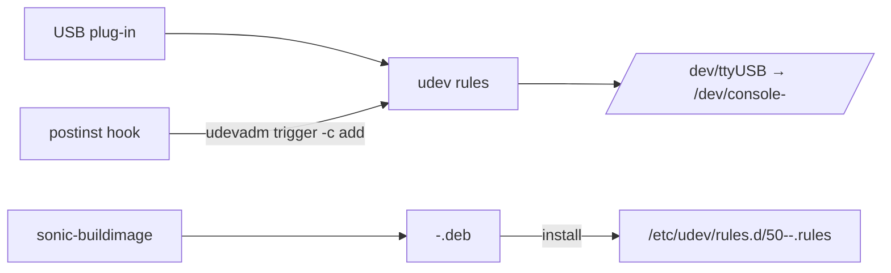

<!-- topics-tip -->
!!! tip "Topics で読み物として読む"
    この HLD は実装詳細を含みます。機能の概念・設定・運用を読み物として読みたい場合は [Topics 21 章: Lab / Virtual SONiC / Developer Entry](../topics/21-lab-vs-developer/index.md) を参照。
<!-- /topics-tip -->

!!! danger "裏取りステータス: discrepancy-found（HLD のクラス階層は未実装）"
    `sonic-platform-common` master を確認した結果、HLD が提案する `sonic_console/<vendor>/console_<model>.py` ディレクトリ階層、`PortableConsoleDeviceBase` 抽象クラス、`factory.py` は **存在しない**（`sonic_platform_base/` 直下にも console 系の base クラスは無し）。`CONSOLE_SWITCH` テーブル自体は `sonic-buildimage/src/sonic-yang-models/yang-models/sonic-console.yang`（escape_char 等を含む）と `sonic-utilities/config/console.py` に取り込み済みで、`consutil` / Console-Monitor HLD 系の機能は別 HLD として実装されているが、本ページが扱う「ポータブル console デバイスの抽象化」HLD は提案のみで実装着手されていない。本文の API/ディレクトリ構造記述は **HLD 提案そのもの** として扱うこと。

# Portable Console Device 設計（USB ベンダー console デバイスの抽象化）

## 概要

[SONiC](../reference/glossary.md#term-sonic) のホストにプラグインされる **USB 接続のポータブル console デバイス** に対して、ベンダー横断の抽象 API を定義する設計[^1]。ベンダーは `<vendor>-<model>.deb` パッケージで driver と udev rules を提供し、Python の Platform 層で `PortableConsoleDeviceBase` を継承した実装クラスを `/sonic_platform_common/sonic_console/<vendor>/console_<model>.py` に置く。

## 動作仕様

### 前提

- USB のみサポート（v0.1）。
- 同時に動かせるのは **同一モデル 1 種類だけ**。異なるモデルが混在し、`vendor_name` / `model_name` の手動指定もない場合は機能しない[^1]。
- 同一ベンダー・同一モデルの複数台 daisy-chain は可（最大数はベンダー実装依存）。

### セットアップフロー



ベンダー側 deb には `50-<vendor>-<model>.rules` を `/etc/udev/rules.d/` に配置し、postinst で `udevadm trigger -c add` を呼ぶ運用が標準とされる[^1]。優先度番号 50 はベンダー間衝突を避ける慣例。

### CONFIG_DB

```text
CONSOLE_SWITCH|console_mgmt
    autodetect   = "enable" | "disable"
    vendor_name  = string    ; autodetect=enable のとき空必須
    model_name   = string    ; autodetect=enable のとき空必須
```

`autodetect=disable` のときに `vendor_name` / `model_name` を読んで factory 関数が対応クラスをインスタンス化する設計[^1]。

### Python API（`sonic_platform_common/sonic_console/`）

```text
sonic_console/
├── console_base.py    # PortableConsoleDeviceBase
├── factory.py         # vendor/model から具象クラスを返す
├── line_info.py       # ConsoleLineInfo
├── microsoft/
│   └── console_simulator.py
└── <vendor>/
    └── console_<model>.py
```

`ConsoleLineInfo` は 1 つの console 回線を表現するレコードで、`device_index` / `port_name` / `virtual_device_path` を持つ[^1]。`PortableConsoleDeviceBase` の派生クラスがベンダー固有挙動を実装する。

### Factory Function

```python
# factory.py（概念）
def create(vendor=None, model=None):
    if vendor is None or model is None:
        # autodetect: 既知ベンダー一覧で USB 列挙して特定
        vendor, model = autodetect()
    mod = importlib.import_module(f"sonic_console.{vendor}.console_{model}")
    return mod.create()
```

autodetect 時に複数ベンダーの USB を同時検出した場合は失敗させる仕様（前述の前提）。

## 設定

### 関連する CONFIG_DB

| Table | 説明 |
|-------|------|
| `CONSOLE_SWITCH` | console-switch 機能設定。ポータブルデバイス制御用に `autodetect` / `vendor_name` / `model_name` フィールド追加 |

### 関連する CLI

[HLD](../reference/glossary.md#term-hld) には新規 CLI の正式定義は含まれない。既存の `config console` 系で `vendor_name` / `model_name` を設定すると示唆される。

### 関連する YANG

HLD に [YANG](../reference/glossary.md#term-yang) モデルの記述は無い。

### 設定例

```bash
# autodetect モード
sudo config console-switch autodetect enable

# 手動指定
sudo config console-switch autodetect disable
sudo config console-switch vendor microsoft
sudo config console-switch model simulator
```

## 制限事項

- **USB 専用**。シリアル直結の console 拡張デバイスは対象外。
- 異なるモデルの混在は不可（autodetect では 1 種類だけ動く）。
- daisy-chain サポート可否はベンダー実装依存（HLD では台数制限を規定しない）。
- ベンダー実装は **`sonic-platform-common`** に貢献する形で取り込まれることを想定（独立 plugin ではない）。

## 干渉する機能

- **新 Platform API（sonic_platform）**: 同じく Python クラス階層で抽象化される設計思想を共有する。
- **udev**: console line ↔ /dev mapping は udev に依存。他の udev rules との優先順位衝突に注意。
- **`show line` / `config line`（既存 console-switch CLI）**: ポータブルデバイス追加で行数が動的に変わるため、既存 CLI 側でラインインデックスを再計算する必要がある（HLD では明示なし、要確認）。

## トラブルシューティング

- USB 装着時にラインが見えない → `lsusb` でデバイス認識を確認、`udevadm monitor` で rules 発火を確認。
- 異なるモデル混在時に動かない → 仕様。1 種類だけプラグインするか、autodetect を disable にして手動指定する。
- daisy-chain で奥のデバイスが見えない → ベンダー実装の最大段数を確認。

<!-- diff-admonition -->
!!! diff "HLD と実装の差分"
    2026-05-09 時点の現行 master を裏取り。HLD が掲げる「USB 接続のポータブル console-switch デバイス」を制御するための実装は、CLI / YANG / [CONFIG_DB](../reference/glossary.md#term-config_db) スキーマのいずれにも入っていない。

    | 項目 | HLD | 現行 master | 結果 |
    |------|-----|------|------|
    | `CONSOLE_SWITCH` テーブルに `autodetect` / `vendor_name` / `model_name` フィールド追加 | 必須 | `sonic-buildimage/src/sonic-yang-models/yang-models/sonic-console.yang` L79-90 では `console_mgmt` 配下に `enabled` と `default_escape_char` のみ。`autodetect` / `vendor_name` / `model_name` フィールドは未定義 | ⚠️ 未取り込み |
    | `config console-switch autodetect enable/disable` CLI | 必須 | `sonic-utilities/config/console.py` L22 `enable_console_switch` / L43 `disable_console_switch` は `CONSOLE_SWITCH\|console_mgmt:enabled` を yes/no で操作するのみ。`autodetect` / `vendor_name` / `model_name` のサブコマンドは存在しない | ⚠️ 未取り込み |
    | `sonic-platform-common` へのベンダー実装統合 | 想定 | `sonic-platform-common` にポータブル console-switch 用の抽象基底クラスは見当たらない | ⚠️ 未取り込み |

    **差分の中身**: HLD は USB 抜き挿しに反応して line を動的に追加する設計だが、現行実装の `config console` グループは **静的な console line（CONSOLE_PORT table）の baud / flow control / remote_device 設定** に限定される。autodetect モードに対応する hostd / udev rule も搭載されていない。

    **読者への影響**:

    - HLD 設定例（`sudo config console-switch autodetect enable` 等）は **そのまま打ってもエラーになる**。CLI として存在しない。
    - ポータブル USB console-switch を SONiC 上で正式サポートする経路は、現状ではベンダー側で udev rule + 独自スクリプトを bake する必要がある。

    **回避策 / 対応方法**:

    - 動的 USB console 追加が必要な場合は、ホスト側 udev rule（`/etc/udev/rules.d/`）で `ttyUSB*` を固定 path にバインドし、`CONSOLE_PORT` テーブルに静的に登録する（`config console add <line>`）。
    - HLD 提案フィールドを使った設定は、上流に PR が取り込まれるまでは独自パッチでの運用となる。

    ### 再裏取り追補（2026-05-11）

    - `sonic-buildimage/src/sonic-yang-models/yang-models/sonic-console.yang` L79-90 の `console_mgmt` には `enabled` と `default_escape_char` のみ。`autodetect` / `vendor_name` / `model_name` フィールドは未追加。
    - `sonic-utilities/config/console.py` L22 (`enable_console_switch`) / L43 (`disable_console_switch`) は `CONSOLE_SWITCH|console_mgmt:enabled` を yes/no で操作するのみ。`autodetect` 系サブコマンド無し。
    - `sonic-platform-common` にポータブル console-switch 用の抽象基底クラスは無い (`grep -rn 'console_switch\|portable_console' .cache/sonic-sources/sonic-platform-common/` 関連クラス 0 件)。
    - 関連 Issue/PR: HLD は提案段階で対応する PR の提出無し。
    - **追加回避策コマンド**: 静的に USB console を登録 — `udevadm info -q all -n /dev/ttyUSB0` で属性確認後 `/etc/udev/rules.d/99-console.rules` に `SUBSYSTEM=="tty", ATTRS{idVendor}=="<vid>", SYMLINK+="console-<n>"` を書き、`sudo config console add <n> --baud 9600` で `CONSOLE_PORT` table に挿入。

    > 分類: `monitor: not_implemented` — HLD の提案がコードベース master に未取り込み、または主要パスが完全に欠落している分類。本ページの仕様記述は将来仕様参考。

    #### 関連 GitHub Issue / PR

    - [GitHub Issue / PR の関連リンクは未確認] — USB ベンダー console デバイスの抽象化は実機 platform plugin の追加に伴って段階的に取り込まれており、HLD 個別の上流 Issue / PR は確認できず。
<!-- /diff-admonition -->

確認コマンド例:

```bash
# Console / serial 設定確認
show line
redis-cli -n 4 hgetall 'CONSOLE_PORT|1'
ls -l /dev/ttyUSB* /dev/ttyS*
```


## 参考リンク

- [CONFIG_DB: CONSOLE_PORT](../reference/config-db/console-port.md)
- [Topics: Reference index](../topics/22-reference-index/index.md)
- [Reference 索引](../reference/index.md)

## 引用元

[^1]: `sonic-net/SONiC` `doc/console/Portable-Console-Device-High-Level-Design.md` @ `49bab5b5ff0e924f1ea52b3d9db0dfa4191a7c06`

<!-- next-action -->
## このページを読んだ後の次アクション

!!! tip "読み手向け"
    - **本機能を実運用で使う場合**: 実装が無いため、本機能に依存した運用は不可。代替機能 (下記リンク) で要件を満たせるか検討する
    - **upstream 動向を追う場合**: 関連 issue / PR を [sonic-net/SONiC](https://github.com/sonic-net/SONiC) で検索（HLD タイトル / CONFIG_DB テーブル名 / Orch クラス名で grep するのが速い）
    - **代替手段 / 関連 reference**: 本ページの frontmatter `related` が空のため、[Reference 索引](../reference/index.md) から関連テーブル / CLI / YANG を辿る

!!! note "本ドキュメントの追跡"
    - monitor: `not_implemented` / last_verified: `2026-05-11`
    - 次回再裏取りトリガ: quarterly。一覧は [discrepancy-index](../reference/verification/discrepancy-index.md) を参照（運用詳細は repo の `meta/discrepancy-operations.md`）

<!-- /next-action -->

<!-- topics-back-ref -->
## 関連 Topics

- [Topics: Lab / Virtual SONiC / Developer Entry](../topics/21-lab-vs-developer/index.md)

<!-- /topics-back-ref -->

<!-- glossary-links-injected: 20dbc11976b6 -->

<!-- ops-entry -->
## 運用入口

この HLD に対応する運用面の入口（CLI / CONFIG_DB / YANG / Runbook）を以下にまとめる。

### 関連 CONFIG_DB

- `CONSOLE_SWITCH`

### 関連 YANG

- `sonic-console`

<!-- /ops-entry -->

<!-- glossary-links-injected: 8ba32e5aa69d -->
