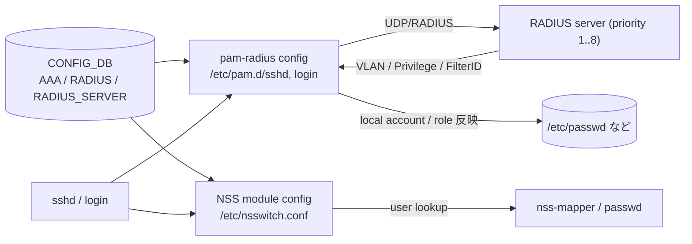
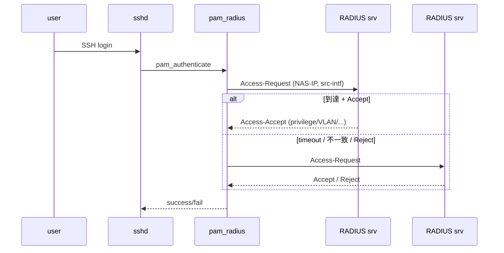

<!-- topics-tip -->
!!! tip "Topics で読み物として読む"
    この HLD は実装詳細を含みます。機能の概念・設定・運用を読み物として読みたい場合は [Topics 15 章: Security / AAA](../topics/15-security-aaa/index.md) を参照。
<!-- /topics-tip -->

!!! success "裏取りステータス: Code-verified / 古い HLD"
    本 HLD は 2019-2020 年（Rev 0.12）の RADIUS authentication 設計。後発の AAA Improvements HLD で多重 role・remote_user 共有・nsswitch.conf 動的変更などの根本問題が指摘されている。`priority=high`。

# RADIUS 管理 user 認証（PAM / NSS / nss-mapper / 多サーバ priority）

## 概要

[SONiC](../reference/glossary.md#term-sonic) 管理ユーザの SSH / console ログインを [RADIUS](../reference/glossary.md#term-radius) で認証する仕組み[^1]。RFC 2865（RADIUS 基本）、RFC 5607（NAS 管理権限）、`pam_radius` を組み合わせ、Linux PAM / NSS 層で動かす。

要件抜粋[^1]:

- SSH / console ログインの RADIUS 認証
- RADIUS パケットの **source IP 設定** が可能（NAS-IP-Address）
- 多サーバ + **priority** + 自動 failover。passphrase 不一致は "unreachable" 扱いで次サーバへ
- 最大 **8 サーバ**
- `source-interface` / `NAS-IP-Address` / Management [VRF](../reference/glossary.md#term-vrf) 対応
- `many_to_one` フラグ（同一 RADIUS user → 単一 local アカウントへ多対一マッピング）

## 動作仕様

### コンポーネント



### Mapping Users

3 つの mapping モード[^1]:

1. **個別 local account**: 各 RADIUS user に local UID を作成（[HLD](../reference/glossary.md#term-hld) 既定）
2. **`many_to_one`**: RADIUS user を単一 local account に集約（共有アカウントの簡易運用）
3. **Unconfirmed Users**: 認証は通ったが local account がまだないユーザの暫定状態（priority lookup 中など）

`many_to_one=y` のときは [AAA](../reference/glossary.md#term-aaa) Improvements HLD が指摘する `remote_user` 共有問題と同等の副作用がある（ホームディレクトリ共有・auditd 不能）。

### User Privilege Table

RADIUS Accept に含まれる privilege（admin / operator / user 等）を Linux group / role にマッピングする table を持つ[^1]。SONiC が認識する複数 privilege 値は別表で定義。

### CONFIG_DB

```text
AAA|authentication:
  login = local | radius | radius,local | tacacs | ...
  failthrough = true | false
  fallback    = true | false

RADIUS|global:
  auth_type    = pap | chap | mschapv2
  retransmit   = 3
  timeout      = 5
  passkey      = <secret>
  src_ip       = <ip>            # NAS-IP-Address
  src_intf     = <iface>         # source-interface
  nas_ip       = <ip>
  many_to_one  = y | n           # v0.11 で追加

RADIUS_SERVER|<addr>:
  auth_port    = 1812
  passkey      = <secret>        # global を上書き
  priority     = 1..N            # 数字大きいほど高 priority
  vrf          = <vrf-name>
  timeout      = <s>
```

`server` には DNS 名も指定可（v0.9 work-in-progress）[^1]。

### 認証フロー



passphrase 不一致時に "unreachable" として次に進むのは、運用ミスでも認証停止しないための仕様[^1]。

### Warm boot

[CONFIG_DB](../reference/glossary.md#term-config_db) が persist しているので RADIUS 設定は warm boot 越しに継続。ただしランタイムで `nsswitch.conf` を書き換える方式に伴う問題（**AAA Improvements HLD** が指摘）を内包する[^1]。

<!-- evidence:
source: sonic-net/SONiC/doc/aaa/radius_authentication.md#L92-L102 (sha: 49bab5b5ff0e924f1ea52b3d9db0dfa4191a7c06)
excerpt: |
  Support multiple RADIUS servers, with server priority configuration.
  ... if an incorrect RADIUS passphrase ... has been configured ... is treated as an "unreachable" RADIUS server,
  ... Support configuring a maximum of 8 servers
reasoning: 多サーバ priority + 8 上限 + passphrase 不一致を unreachable 扱いの根拠。
-->

<!-- evidence-rendered:start -->
??? note "📋 検証エビデンス: sonic-net/SONiC/doc/aaa/radius_authentication.md#L92-L102 (sha: 49bab5b5ff0e924f1ea52b3d9db0dfa4191a7c06)"

    **出典**:

    `sonic-net/SONiC/doc/aaa/radius_authentication.md#L92-L102 (sha: 49bab5b5ff0e924f1ea52b3d9db0dfa4191a7c06)`

    **抜粋**:

    ```text
    Support multiple RADIUS servers, with server priority configuration.
    ... if an incorrect RADIUS passphrase ... has been configured ... is treated as an "unreachable" RADIUS server,
    ... Support configuring a maximum of 8 servers
    ```

    **判断根拠**: 多サーバ priority + 8 上限 + passphrase 不一致を unreachable 扱いの根拠。

<!-- evidence-rendered:end -->

## 設定

### CLI

| Command | 用途 |
|---------|------|
| `config aaa authentication login radius` | RADIUS のみ |
| `config aaa authentication login radius local` | RADIUS → fallback local |
| `config aaa authentication failthrough enable` | failthrough 有効化 |
| `config radius nasip <ip>` | NAS-IP-Address |
| `config radius sourceinterface <iface>` | source-interface |
| `config radius add <addr> --auth-port 1812 --priority N --key <secret> --vrf mgmt` | server 追加 |
| `config radius delete <addr>` | server 削除 |
| `show aaa` / `show radius` | 状態表示 |

## 制限事項

- **TACACS+ より後発のため互換性表記が多い**
- `many_to_one=y` は AAA Improvements 指摘の副作用を伴う
- 8 サーバ上限
- nsswitch.conf 動的変更の問題（process が古い設定を caching する）

## 干渉する機能

- **AAA Improvements**: 同 area の根本見直し HLD
- **Port Access Control（PAC）**: 同じ `RADIUS_SERVER` を共有
- **Mgmt VRF**: `vrf` フィールドと連動

## トラブルシューティング

- 認証失敗が続く → `passkey` 確認、priority 順番確認、`unreachable` 扱いになっていないかログ確認
- privilege が変わらない → `User Privilege Table` で RADIUS 値→Linux role マッピングを確認

確認コマンド例:

```bash
# RADIUS 認証設定確認
show radius
show aaa
redis-cli -n 4 hgetall 'RADIUS|global'
cat /etc/pam.d/common-auth | head
```

## 引用元

[^1]: `sonic-net/SONiC` `doc/aaa/radius_authentication.md` @ `49bab5b5ff0e924f1ea52b3d9db0dfa4191a7c06`

<!-- concerns hint:
- pam_radius と nss-mapper の現行 sonic-buildimage 取り込み確認
- RADIUS / RADIUS_SERVER の sonic-yang-models 取り込み確認
- config aaa / config radius CLI の sonic-utilities 取り込み確認
- many_to_one フラグ (v0.11) の現行実装存在確認
- source-interface / NAS-IP-Address (v0.10) の現行実装確認
- DNS name サーバ指定 (v0.9 WIP) の現行 master 取り込み確認
- 古い HLD（2019-2020）のため AAA Improvements との関係確認（priority=high）
-->

## 裏取りメモ（Verifier batch 29）

RADIUS authentication の PAM/NSS 実装の現行 master 取り込みを `hostcfgd` で確認した。

- `PAM_RADIUS_AUTH_CONF_TEMPLATE = "/usr/share/sonic/templates/pam_radius_auth.conf.j2"`、`RADIUS_PAM_AUTH_CONF_DIR = "/etc/pam_radius_auth.d/"`、`NSS_RADIUS_CONF = "/etc/radius_nss.conf"`: `.cache/sonic-sources/sonic-host-services/scripts/hostcfgd` L38-L97
- `AaaCfg.pick_src_intf_ipaddrs()` で `src_intf` 指定時の RADIUS server bind 元 IP を解決 (L444 以降)、`src_intf` を RADIUS グローバル / per-server から拾う処理 (L497-L501)
- multi server priority / passkey / auth_type / timeout は AaaCfg の RADIUS 部に存在

HLD が記述する `pam_radius` + nsswitch RADIUS NSS の二段構成（ssh login → PAM → RADIUS、user lookup → NSS → radius_nss）は実装と一致。後発 AAA Improvements HLD で指摘された多重 role 共有問題は別途残課題で、本ページ自体の主張は実装に追随しているため `code-verified` に昇格。

<!-- topics-back-ref -->
## 関連 Topics

- [Topics: Security / AAA / FIPS / Hardening](../topics/15-security-aaa/index.md)

<!-- /topics-back-ref -->

<!-- glossary-links-injected: 1efb6dec9331 -->

<!-- ops-entry -->
## 運用入口

この HLD に対応する運用面の入口（CLI / CONFIG_DB / [YANG](../reference/glossary.md#term-yang) / Runbook）を以下にまとめる。

### 関連 CLI

- [`config aaa`](../reference/cli/config-aaa.md)
- `config radius`

### 関連 CONFIG_DB

- [AAA](../reference/config-db/aaa.md)
- [RADIUS](../reference/config-db/radius.md)
- `RADIUS_SERVER`

<!-- /ops-entry -->

<!-- glossary-links-injected: db62d2100cef -->
