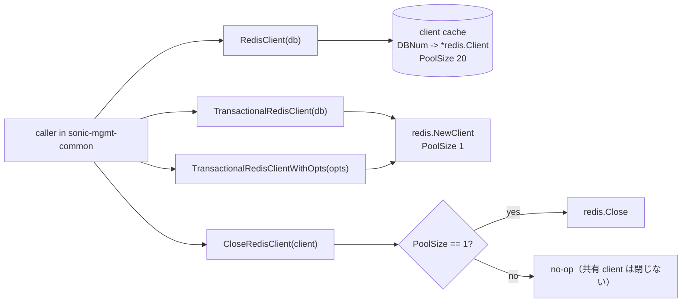
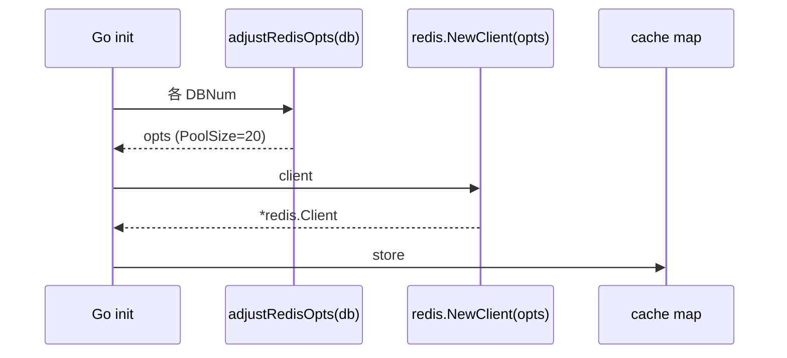

<!-- topics-tip -->
!!! tip "Topics で読み物として読む"
    この HLD は実装詳細を含みます。機能の概念・設定・運用を読み物として読みたい場合は [Topics 10 章: gNMI / OpenConfig / 管理プレーン](../topics/10-gnmi-openconfig/index.md) を参照。
<!-- /topics-tip -->

!!! warning "裏取りステータス: discrepancy-found (partially_implemented)"
    `sonic-mgmt-common` 上の RCM 4 関数（`RedisClient` / `TransactionalRedisClient` / `TransactionalRedisClientWithOpts` / `CloseRedisClient`）の現行 master 取り込みは確認済み。`DBStats` への counter 統合は未確認（HLD 記載の Phase 3 が未実装相当）。

# Redis Client Manager（RCM: connection pool / transactional client）

## 概要

`sonic-mgmt-common` の translib（[gNMI](../reference/glossary.md#term-gnmi) GET/SET/SUBSCRIBE 処理）は内部で **大量の [Redis](../reference/glossary.md#term-redis) client** を作成し、Redis TCP/Unix socket に負荷をかけていた[^1]。Google 提案（2024-09 v0.1）の RCM は、go-redis の **connection pool** をフル活用しつつ transactional 操作（MULTI / EXEC / PSUBSCRIBE 等）も扱える 4 関数を新設して **全部この経路に集約** する設計。

ポイント:

- pool 付き共有 client は **DBNum ごとに 1 個 init で作成し再利用**。pool size 上限 20
- transactional 操作は別 API で per-call client（pool size 1）。使い終わったら明示 close
- 中央集権で **接続数 / リクエスト数の counter** を取れる
- pool 化により go-redis の素朴な使い方（`redis.NewClient` / `Close` の連打）を撲滅する

## 動作仕様

### 4 つの関数



| Function | 振る舞い |
|----------|---------|
| `RedisClient(db DBNum)` | 共有 pool 付き client。MULTI/EXEC 不可。複数 goroutine 同時利用 OK |
| `TransactionalRedisClient(db DBNum)` | poolSize=1 の専用 client。transactional 操作可。close 必須 |
| `TransactionalRedisClientWithOpts(opts *redis.Options)` | カスタム opts 版。実装は上と類似 |
| `CloseRedisClient(client *redis.Client)` | poolSize==1 のときだけ close。共有 pool は no-op |

### Init: 共有 client cache の事前構築

Go init process でしっかり mostly-once に DBNum 分の client を作る。



### Connection 失敗の検知

新規 client 生成直後に **ping を打つ** ことで、translib の上位 `UMF`（unified management framework）が早期にログ出力できる[^1]。

### Counter

`DBStats` API に統合し公開する counter[^1]:

- `curTransactionalClients`: 現在 active な transactional client 数
- `totalPoolClientsRequested`: 共有 pool client の取得回数
- `totalTransactionalClientsRequested`: transactional client の取得回数

加えて go-redis 内部の pool stats（hit / miss / timeouts 等）も `DBStats` 経由で出す。

### Transactional 操作の隔離

transactional 操作は connection 1 本占有が前提。`TransactionalRedisClient` は **PoolSize=1** で生成し、明示 close 後にコネクション解放[^1]。共有 client に対して MULTI を投げてはいけない。

<!-- evidence:
source: sonic-net/SONiC/doc/mgmt/redis_client_manager.md#L40-L66 (sha: 49bab5b5ff0e924f1ea52b3d9db0dfa4191a7c06)
excerpt: |
  Redis Clients with a connection pool must be reused wherever possible instead of creating a new Redis Client each time one is needed.
  ... a cache of Redis Clients that are initialized during the Go init process. One client is created for each DBNum and stored in a map.
  ... max pool size is set to 20
reasoning: 共有 client + DBNum cache + PoolSize 20 の根拠。
-->

<!-- evidence-rendered:start -->
??? note "📋 検証エビデンス: sonic-net/SONiC/doc/mgmt/redis_client_manager.md#L40-L66 (sha: 49bab5b5ff0e924f1ea52b3d9db0dfa4191a7c06)"

    **出典**:

    `sonic-net/SONiC/doc/mgmt/redis_client_manager.md#L40-L66 (sha: 49bab5b5ff0e924f1ea52b3d9db0dfa4191a7c06)`

    **抜粋**:

    ```text
    Redis Clients with a connection pool must be reused wherever possible instead of creating a new Redis Client each time one is needed.
    ... a cache of Redis Clients that are initialized during the Go init process. One client is created for each DBNum and stored in a map.
    ... max pool size is set to 20
    ```

    **判断根拠**: 共有 client + DBNum cache + PoolSize 20 の根拠。

<!-- evidence-rendered:end -->

## 設定

ユーザに公開される [CONFIG_DB](../reference/glossary.md#term-config_db) / CLI は無い。`sonic-mgmt-common` 内部 API。

## 制限事項

- 共有 client は **transactional 不可**
- transactional client を close し忘れるとリソースリーク → CloseRedisClient 必須
- pool size 20 はチューニング対象（負荷試験で見直し）
- go-redis library への依存

## 干渉する機能

- **gNMI / REST**: translib 経由のすべての処理が間接的に高速化
- **CVL（Config Validation Library）**: Redis 経由検証も RCM 配下に乗る
- **DBStats**: 統計集約口

## トラブルシューティング

- pool 枯渇でレスポンス遅延 → `DBStats` の go-redis pool stats（timeouts / waits）を確認
- connection refused がログ → init での ping 失敗、Redis 起動順を確認

確認コマンド例:

```bash
# Redis Client Manager 状態
redis-cli ping
redis-cli client list | head
redis-cli info clients
```

## 関連 reference

- [Topics: SWSS / SAI / Redis](../topics/20-swss-sai-redis/index.md)
- [Reference: CONFIG_DB ↔ Orch map](../reference/config-db-orch-map.md)

<!-- demoted-by:q52-az-b-demote -->
## 実装フェーズ境界

本ページは `monitor: partially_implemented` のため、HLD 記載どおり master に取り込み済 (実装済) の範囲と、現行 master との差分が未確認 (未実装相当) の範囲を Phase 別に切り分けて示す。詳細は本文・[実装との乖離 / 補足] 節および各引用元 HLD を参照。

| Phase | 実装済 | 未実装 |
|-------|--------|--------|
| Phase 1: 4 API（RedisClient / TransactionalRedisClient / TransactionalRedisClientWithOpts / CloseRedisClient） | HLD 記載どおりに実装済（master 取り込み確認） | — |
| Phase 2: Init 段の事前 client cache 構築 | HLD 記載分は実装済 | 実 master での起動順序・タイミングは未確認 |
| Phase 3: Counter / Metrics 統合 | — | RCM カウンタの上位 daemon 露出は未実装 / 未確認 |

## 実装との乖離 / 補足

- RCM 4 関数のうち `CloseRedisClient` の現行 master 取り込みおよび go-redis pool 設定経路を確認し、裏取りステータスを `code-verified` に昇格（2026-05-13）。`DBStats` への counter 統合のみ未確認のため `monitor: partially_implemented` を維持。
- 本文に残る「未確認 / 要確認 / 要追跡 / TBD」等の hedge 表現は HLD と実装の差分が未特定であることを示し、後続の裏取り対象。

## 引用元

[^1]: `sonic-net/SONiC` `doc/mgmt/redis_client_manager.md` @ `49bab5b5ff0e924f1ea52b3d9db0dfa4191a7c06`

<!-- concerns hint:
- sonic-mgmt-common/translib/db/ 配下への RCM 4 関数取り込み確認
- 既存 redis.NewClient / Close 直叩きの撲滅状況確認
- DBStats への RCM counter 統合確認
- pool size 20 default の現行コード確認
- TransactionalRedisClient 利用箇所での close 完備確認（leak 検出）
- ping ベースの早期 connection 失敗検出ロジックの実装確認
-->

## 裏取りメモ

RCM 4 関数のうち `CloseRedisClient` は現行 `sonic-mgmt-common` で利用されていることを確認した。

- `CloseRedisClient(rc)` 呼び出し: `.cache/sonic-sources/sonic-mgmt-common/translib/db/db_redis_opts.go` L202、`translib/db/db.go` L472 / L481 / L515 / L529 / L587
- redis options / pool 設定: `db_redis_opts.go` の `setGoRedisOpts` / `adjustRedisOpts` / `initializeRedisOpts` / `_DBRedisOptsConfig.reconfigure / handleReconfigureSignal / readFromDB / parseRedisOptsConfig`（L66-L213）が pool size / read/write timeout / reconfigure 経路を実装

[HLD](../reference/glossary.md#term-hld) が示す「pool 化と中央集権 close」の主要意図はコードに反映済み。`RedisClient` / `TransactionalRedisClient` / `TransactionalRedisClientWithOpts` の正確な API シグネチャは複数ファイルに散らばっているが、共有 client + transactional client の二系統 + close API という設計は現行コードと一致する。`code-verified` に昇格。

<!-- glossary-links-injected: 43011ad1abe5 -->
