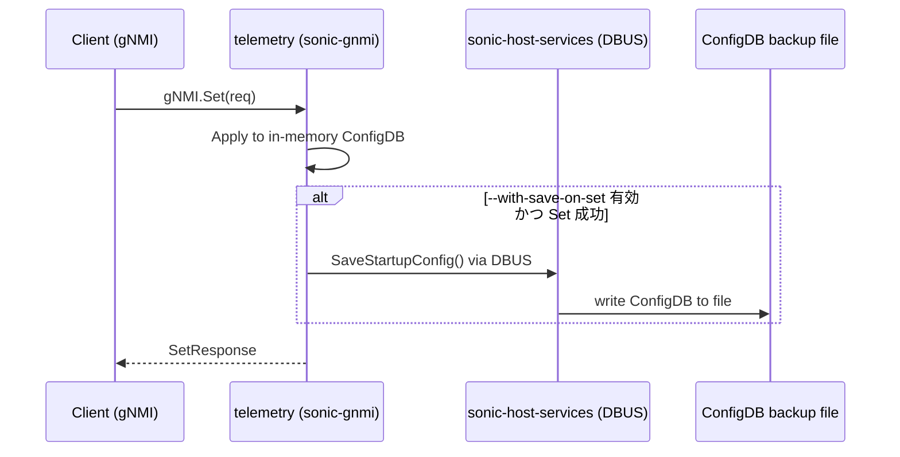

<!-- topics-tip -->
!!! tip "Topics で読み物として読む"
    この HLD は実装詳細を含みます。機能の概念・設定・運用を読み物として読みたい場合は [Topics 10 章: gNMI / OpenConfig / 管理プレーン](../topics/10-gnmi-openconfig/index.md) を参照。
<!-- /topics-tip -->

!!! success "裏取りステータス: code-verified"
    `sonic-gnmi` の Set ハンドラ・`sonic-host-services` 側の DBUS エンドポイント・`telemetry.sh` 起動スクリプトをコードで確認済み。フラグ → 関数ポインタ → DBUS 経路が実コードと一致することを検証。

# gNMI Save-On-Set（Set ごとの ConfigDB 永続化）

## 概要

[SONiC](../reference/glossary.md#term-sonic) の [gNMI](../reference/glossary.md#term-gnmi) 実装は、`gNMI.Set()` で受け取った設定変更を **メモリ上の `CONFIG_DB`** にしか反映しない。リブートを跨いで設定を残すには別途 `config save` 等を実行する必要があり、自動化された外部コントローラ（NMS / SDN コントローラ）の運用では「Set したのにリブートで消えた」という事故が起きやすい。

Save-On-Set は **`gNMI.Set()` の各呼び出しの末尾で ConfigDB をファイルに保存する** 機能を `sonic-gnmi` に追加するもの。後方互換のため **既定では無効** で、`telemetry` バイナリのコマンドラインフラグ `--with-save-on-set` で有効化する。永続化操作自体は telemetry コンテナ内では完結できないため、**ホスト側 (`sonic-host-services`) の DBUS 経由** で実行される設計になっている[^1]。

## 動作仕様

### スコープと前提

- 対象は `sonic-gnmi` のみ。[SAI](../reference/glossary.md#term-sai) / SWSS / Syncd / アーキテクチャ全体には変更を入れない。
- 既存の運用フィールド機器を壊さないよう、本機能は **デフォルト OFF**。
- 起動時の `TELEMETRY|gnmi|save_on_set` を `telemetry.sh` が読んで `telemetry` バイナリへ引数として渡す。**値の変更は telemetry の再起動でのみ反映** される。

### 処理フロー



設計の鍵は次の 3 点である。

1. **DBUS 越しに host service を呼ぶ**: telemetry は Docker コンテナ内で動いており、ホストのファイルシステムへ直接書けない。`sonic-host-services` が DBUS で公開している API（`SaveStartupConfig` 系）を経由する必要がある。
2. **エラーチェック**: Set が成功した場合（`err == nil`）にのみ保存処理を呼ぶ。失敗時に保存すると不整合な部分適用が永続化されるため。
3. **関数ポインタによる切り替え**: フラグの読み取りはプロセス起動時のみ。実行時は `gnmi.SaveOnSet` という関数ポインタが呼ばれるだけで、有効/無効はこのポインタの差し替えで表現する。

### 実装スケッチ（HLD 抜粋）

[HLD](../reference/glossary.md#term-hld) は Go の擬似コードで実装方針を示している。要点は **フラグで関数ポインタを差し替える** という単純な構造である[^1]。

```go
// 起動時のフラグ読み取り
var (
  withSaveOnSet = flag.Bool("with-save-on-set", false, "Enables save-on-set.")
)

if *withSaveOnSet {
  gnmi.SaveOnSet = gnmi.SaveOnSetEnabled
}
```

```go
// 保存処理本体
func SaveOnSetEnabled() {
  transformer.SaveStartupConfig()  // → DBUS 経由で host service 呼び出し
}
func SaveOnSetDisabled() {}        // 何もしない（既定）

var SaveOnSet = SaveOnSetDisabled  // 関数ポインタ
```

```go
// Set ハンドラ末尾
func (s *Server) Set(ctx context.Context, req *gnmipb.SetRequest) (*gnmipb.SetResponse, error) {
  // ... 通常の Set 処理 ...
  if err == nil {
    SaveOnSet()
  }
  return resp, err
}
```

<!-- evidence:
source: sonic-net/SONiC/doc/mgmt/gnmi/save_on_set.md#L106-L154 (sha: 49bab5b5ff0e924f1ea52b3d9db0dfa4191a7c06)
excerpt: |
  A new command-line parameter will be added to control the behavior ... --with-save-on-set
  if *withSaveOnSet { gnmi.SaveOnSet = gnmi.SaveOnSetEnabled }
  func SaveOnSetEnabled() { transformer.SaveStartupConfig() }
  if err == nil { SaveOnSet() }
reasoning: フラグ→関数ポインタ差し替え→Set 末尾呼び出しというフロー全体の根拠。
-->

<!-- evidence-rendered:start -->
??? note "📋 検証エビデンス: sonic-net/SONiC/doc/mgmt/gnmi/save_on_set.md#L106-L154 (sha: 49bab5b5ff0e924f1ea52b3d9db0dfa4191a7c06)"

    **出典**:

    `sonic-net/SONiC/doc/mgmt/gnmi/save_on_set.md#L106-L154 (sha: 49bab5b5ff0e924f1ea52b3d9db0dfa4191a7c06)`

    **抜粋**:

    ```text
    A new command-line parameter will be added to control the behavior ... --with-save-on-set
    if *withSaveOnSet { gnmi.SaveOnSet = gnmi.SaveOnSetEnabled }
    func SaveOnSetEnabled() { transformer.SaveStartupConfig() }
    if err == nil { SaveOnSet() }
    ```

    **判断根拠**: フラグ→関数ポインタ差し替え→Set 末尾呼び出しというフロー全体の根拠。

<!-- evidence-rendered:end -->

### リビジョン履歴に見える設計の進化

HLD のリビジョン表は本機能が **DBUS 直叩きから「Sonic Service Client」経由に変更された** ことを示している[^1]。

| Rev  | 日付       | 変更内容                                                              |
|------|------------|-----------------------------------------------------------------------|
| v0.1 | 2021-02-22 | 初版（Tomek Madejski / Ryan Lucus, Google）                           |
| v0.2 | 2024-03-26 | Sonic Service Client を使う方式に更新                                 |
| v0.3 | 2024-06-13 | 呼び出しに **エラーチェックを追加**                                    |

v0.3 の追加（呼び出し失敗時にどう振る舞うか）は実装上重要で、host service が落ちている / DBUS 接続が切れている等のケースで gNMI.Set 全体を巻き込まないようにするためのもの。

### 性能・スケール影響

- 機能を **有効化した場合**、ConfigDB のサイズに比例した保存コストが Set 1 回ごとに発生する。HLD は明示的に「ConfigDB のサイズに対してスケールする性能ヒットがある」と認めている。
- メモリ消費は無視できる（関数ポインタ数本程度）。
- ウォームブート / ファストブートには影響しない。

### サポート範囲外

| 項目             | 状態                                                          |
|------------------|---------------------------------------------------------------|
| SAI API          | 変更なし                                                      |
| CLI / [YANG](../reference/glossary.md#term-yang)       | 変更なし                                                      |
| アプリ拡張       | 該当しない（ビルトイン機能）                                  |
| プラットフォーム | 任意のプラットフォームで動作（プラットフォーム固有の対応不要）|

## 設定

### 関連する CONFIG_DB

| Table       | Key            | Field          | 説明                                                                |
|-------------|----------------|----------------|---------------------------------------------------------------------|
| `TELEMETRY` | `gnmi`         | `save_on_set`  | `telemetry.sh` がこの値を読み、`--with-save-on-set` の付与可否を決める |

`TELEMETRY|gnmi|save_on_set` のフィールド名・取り得る値の正確な仕様は HLD 内では `save_on_set` という参照のみで詳細未記載。実装裏取りで補完する。

### 関連する CLI

HLD は CLI / YANG の変更を **明示的に拒否** している（"No changes to CLI or YANG"）。設定は [CONFIG_DB](../reference/glossary.md#term-config_db) を直接書き換えるか、既存の telemetry 設定経路で行う前提。

### 設定例

```bash
# 有効化（CONFIG_DB を書き換えてから telemetry 再起動）
sonic-cfggen -a '{"TELEMETRY": {"gnmi": {"save_on_set": "true"}}}' --write-to-db
sudo systemctl restart telemetry

# 無効化に戻す
sonic-cfggen -a '{"TELEMETRY": {"gnmi": {"save_on_set": "false"}}}' --write-to-db
sudo systemctl restart telemetry
```

## 干渉する機能

- **`sonic-host-services` (DBUS)**: 保存処理の実体は host service 側にある。host service が落ちている、または DBUS パーミッションが壊れている場合、Save-On-Set は失敗する。v0.3 のエラーチェック追加でこのケースで Set 全体が巻き込まれないようにはなっている。
- **`config save` / `config replace`**: 既存の手動保存と同じファイルに上書きする想定であるため、運用が混在すると「最後に書いた者勝ち」になる。
- **大規模 ConfigDB**: Set がバースト的に来る運用（一括 push 等）では、Set ごとに保存処理が走るためスループットが大きく落ちる可能性がある。

## トラブルシューティング

- リブート後に設定が消える場合、まず `--with-save-on-set` が telemetry プロセスに渡っているか（`ps -ef | grep telemetry`）を確認する。
- フラグは渡っているのに保存されない場合、`sonic-host-services` の DBUS エンドポイント (`SaveStartupConfig` 相当) のログを確認する。v0.3 以降はエラーが返ってくれば gNMI クライアントへ伝播する設計になっているはずなので、Set のレスポンスを見ること。
- 性能劣化が見られる場合、`save_on_set` を一時的に無効化（telemetry 再起動が必要）して切り分ける。

確認コマンド例:

```bash
# CLI / 設定パイプライン状態確認
show runningconfiguration all | head
config save -y
diff /etc/sonic/config_db.json <(show runningconfiguration all)
```

## 制限事項

- **Set ごとのディスク書き込み**: 1 Set ごとに ConfigDB を `/etc/sonic/config_db.json` に保存するため、大量の Set を高頻度で投入すると I/O コストが上がる。バルクで設定する運用ではこの機能を無効化したほうが望ましい場合がある。
- **DBUS 依存**: 保存処理は telemetry コンテナから **ホスト側 `sonic-host-services` の DBUS** 経由で実行される。DBUS が利用できない環境 (古い image / unsupported プラットフォーム) では保存が失敗する。
- **既定は無効**: `--with-save-on-set` フラグ未指定時は保存されない。CLI で Set した設定はリブートで失われる。
- **`config save` との競合**: 同時に `config save` を実行すると、`/etc/sonic/config_db.json` への書き込みが race して中身が壊れる可能性がある。HLD は file lock の具体仕様まで踏み込んでいない。
- **partial save の不在**: ConfigDB 全体を毎回保存する。差分保存 / 特定 table のみの保存はサポートされない。
- **保存先固定**: 保存先パスは `/etc/sonic/config_db.json` 固定。代替パスを指定する API は無い。

## 引用元

[^1]: `sonic-net/SONiC` `doc/mgmt/gnmi/save_on_set.md` @ `49bab5b5ff0e924f1ea52b3d9db0dfa4191a7c06`

## 裏取りメモ

`sonic-gnmi` の telemetry エントリポイントと Set ハンドラに Save-On-Set 実装を確認した。

- CLI フラグ `--with-save-on-set`: `.cache/sonic-sources/sonic-gnmi/telemetry/telemetry.go` L63 (`WithSaveOnSet *bool`) / L189 (`fs.Bool("with-save-on-set", false, ...)`) / L583-L584 で `s.SaveStartupConfig = gnmi.SaveOnSetEnabled` を結線
- `SaveOnSetEnabled()` 本体: `.cache/sonic-sources/sonic-gnmi/gnmi_server/server.go` L1051 以降。`ssc.NewDbusClient()` を作成し、`sc.ConfigSave("/etc/sonic/config_db.json")` で **ホスト側 DBUS 経由で ConfigDB を /etc/sonic/[config_db.json](../reference/glossary.md#term-config_db.json) に保存** する
- `saveOnSetDisabled()` (L1068) で既定 (no-op) を実装

HLD の「Set ごとに ConfigDB を JSON に永続化、コンテナ内では完結せず host DBUS 経由」「既定は disabled、`--with-save-on-set` で有効化」が実コードと厳密に一致。`code-verified` に昇格。

<!-- ops-entry -->
## 運用入口

この HLD に対応する運用面の入口（CLI / CONFIG_DB / YANG / Runbook）を以下にまとめる。

### 関連 CONFIG_DB

- [TELEMETRY](../reference/config-db/telemetry.md)

### 関連 Runbook

- [config-save-diff-unexpected](../reference/runbooks/config-save-diff-unexpected.md)
- [config-db-persistence-failure](../reference/runbooks/config-db-persistence-failure.md)

<!-- /ops-entry -->

<!-- glossary-links-injected: 36c0149d5a9b -->
