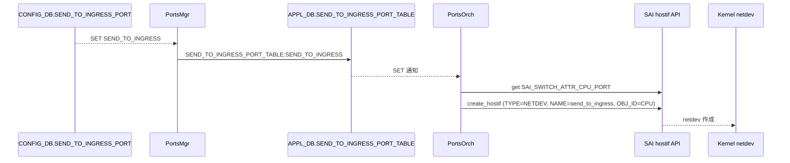

!!! success "裏取りステータス: Code-verified"
    `sonic-swss/orchagent/portsorch.cpp` L771 で `m_sendToIngressPortTable(db, APP_SEND_TO_INGRESS_PORT_TABLE_NAME)` 登録、L6507 で `APP_SEND_TO_INGRESS_PORT_TABLE_NAME` 分岐、L7106 `addSendToIngressHostIf()` で `SAI_HOSTIF_TYPE_NETDEV` 属性を設定する hostif 作成を確認。`orchdaemon.cpp` L219 で `APP_SEND_TO_INGRESS_PORT_TABLE_NAME` を portsorch 優先度に登録。`cfgmgr/portmgrd.cpp` / `portmgr.cpp` 側の関連処理も確認（verified at: 2026-05-09）。

# Send to Ingress（CPU から ingress pipeline へパケット注入する hostif）

## 概要

PINS（P4 Integrated Network Stack）の Packet I/O では、TX 経路として 2 種類の送信モードが想定される[^1]:

1. **Direct transmit**: 送信元アプリ（LACP, P4RT 等）が送信先ポートを既に決めている場合。対応 netdev のソケットへ直接置く
2. **Ingress pipeline inject**: 送信元アプリが「ASIC のルーティングに任せる」場合。**ASIC の ingress パイプラインに直接パケットを投入** し、ECMP / WCMP の選択や帯域・キュー深さに応じた最適経路選択を ASIC に委ねる

SDN コントローラがネットワーク全体を見てフローを書く構成や、ECMP のリアルタイム性を ASIC に判断させたい場合、後者が必要になる。テスト用途で「CPU 起点で ingress に通したパケットの ASIC ルーティングを観察する」場合にも使える。

本 HLD は **「Send To Ingress」専用ポート**（仮想ホスト IF）を `CONFIG_DB.SEND_TO_INGRESS_PORT` で定義し、SWSS が SAI hostif を作って CPU port にバインドする経路を導入する[^1]。

## 動作仕様

### 全体構成

```mermaid
flowchart LR
    APP[App\n(P4RT / Controller / test)] -->|sendmsg| ND[netdev\n"send_to_ingress"]
    ND --> SAIH[SAI hostif\nTYPE=NETDEV\nOBJ_ID=CPU port]
    SAIH --> CPU[CPU port]
    CPU --> ING[ASIC ingress pipeline]
    ING --> FWD[ECMP/WCMP / lookup\nに従って出力ポート選択]
```

要点:

- **TX 専用**。「Send to Ingress host interface is only for packet out」と明記、**RX には使わない**[^1]
- アプリは普通の Linux netdev として `send_to_ingress` IF を使う
- SAI 側では `SAI_HOSTIF_TYPE_NETDEV` を **CPU port にバインド** することで、その netdev に書かれたパケットが ingress パイプラインに注入される

### CONFIG_DB スキーマ

`PORT` テーブルは物理ポート専用[^1]。Send to Ingress は新しいテーブル `SEND_TO_INGRESS_PORT` を立てる。

```json
{
  "PORT": {
    "Ethernet0": { "admin_status": "up", "mtu": "9100", "speed": "400000" }
  },
  "SEND_TO_INGRESS_PORT": {
    "SEND_TO_INGRESS": {}
  }
}
```

| Table | Key | フィールド |
|-------|-----|-----------|
| `SEND_TO_INGRESS_PORT` | `SEND_TO_INGRESS` | （現状属性なし。エントリ存在自体が enable） |

エントリの存在＝有効化。属性は HLD 時点で空オブジェクトのみ[^1]。

### SWSS パス



`PortsOrch` は次の SAI 属性で `create_hostif` を呼ぶ[^1]:

| Attribute | 値 |
|-----------|---|
| `SAI_HOSTIF_ATTR_TYPE` | `SAI_HOSTIF_TYPE_NETDEV` |
| `SAI_HOSTIF_ATTR_NAME` | `send_to_ingress` |
| `SAI_HOSTIF_ATTR_OPER_STATUS` | `true`（重要: false にすると後で UP/RUNNING を上げられなくなる）[^1] |
| `SAI_HOSTIF_ATTR_OBJ_ID` | `SAI_SWITCH_ATTR_CPU_PORT` で取得した CPU port OID |

### Multi-ASIC

`SONiC multi asic HLD` に従い、各 ASIC が **自分の SWSS / syncd / config を持つ** ので、ASIC ごとに `SEND_TO_INGRESS` ポートを独立に作れる。各 netdev はそれぞれの namespace 内に存在する[^1]。

### ベンダー側の対応必要性

**従来の SAI `create_hostif (NETDEV)` は物理ポート / VLAN / LAG への bind が前提**。CPU port に bind できる実装になっていないベンダー SAI もあるため、**ベンダーは hostif create API を拡張して CPU port 関連付けに対応する必要がある**[^1]。これが本 HLD のポータビリティ上の主要前提。

<!-- evidence:
source: sonic-net/SONiC/doc/pins/send_to_ingress_hld.md#L130-L138 (sha: 49bab5b5ff0e924f1ea52b3d9db0dfa4191a7c06)
excerpt: |
  Vendor work is needed to enable the creation of the "SEND_TO_INGRESS" port and allow packets in the CPU port.
  Current support of the creation of netdev type hostif is only for physical port, vlan or LAG interface,
  vendors need to extend the SAI hostif create API to allow creation of a netdev port associated with the CPU port.
reasoning: 「ベンダー SAI 拡張が前提」という最重要の制約の根拠。
-->

## 設定

### 関連する CONFIG_DB

- `SEND_TO_INGRESS_PORT|SEND_TO_INGRESS`: エントリ追加で有効、削除で無効

### 関連する CLI

HLD では専用 CLI は提案されていない（"CLI/YANG model Enhancements: N/A"[^1]）。`config_db.json` 直接編集または既存の `redis-cli` / `sonic-cfggen` で投入する想定。

### 関連する YANG

該当 YANG モジュールは HLD で言及されていない。

### 設定例

```bash
# 有効化
redis-cli -n 4 HSET "SEND_TO_INGRESS_PORT|SEND_TO_INGRESS" NULL NULL

# 無効化
redis-cli -n 4 DEL "SEND_TO_INGRESS_PORT|SEND_TO_INGRESS"

# 利用例（任意のアプリから）
ip link show send_to_ingress
# パケットを send_to_ingress IF に送ると ASIC ingress に投入される
```

## 制限事項

- **TX 専用**。`send_to_ingress` の RX は想定外。受信したいなら別途 trap / hostif を立てる必要がある[^1]
- ベンダー SAI 側に **CPU port を `SAI_HOSTIF_ATTR_OBJ_ID` に取れる拡張** がないと作成失敗する
- HLD では Warmboot / Fastboot の影響なし[^1]
- Restrictions/Limitations は HLD 時点で `N/A` だが、実装上は CPU 帯域と ingress パイプライン負荷に注意

## 干渉する機能

- **PINS Packet I/O HLD**: 本 HLD はその TX 経路を補完する位置づけ。Direct transmit と inject の選択はアプリ側に委ねられる
- **`PortsMgr` / `PortsOrch`**: CONFIG_DB → APPL_DB → SAI の標準フローに「`SEND_TO_INGRESS_PORT` 用の小経路」を足す
- **CPU port / Trap / CoPP**: ingress 注入時のパケットも CPU 起点と認識される可能性があり、CoPP との相互作用に注意（HLD では明記されていないが運用上の注意点）
- **Multi-ASIC**: 各 ASIC ごとに独立な netdev が namespace 内に作られる

## トラブルシューティング

- `send_to_ingress` netdev が作成されない場合、SAI 側エラーを確認。多くは「CPU port を OBJ_ID に取れない」ベンダー SAI 制限
- 作成されたが UP しない場合、`SAI_HOSTIF_ATTR_OPER_STATUS=true` で create されているか確認（false で作ると以降上げられない）
- パケットを書いたのに ASIC が転送しない場合、ingress パイプラインの ACL / forwarding テーブルとマッチしているか確認

## 引用元

[^1]: `sonic-net/SONiC` `doc/pins/send_to_ingress_hld.md` @ `49bab5b5ff0e924f1ea52b3d9db0dfa4191a7c06`

<!-- concerns hint:
- PortsMgr / PortsOrch の SEND_TO_INGRESS_PORT 取り扱いコード (sonic-swss)
- APPL_DB SEND_TO_INGRESS_PORT_TABLE のスキーマと購読側
- SAI hostif create に CPU port を渡せるベンダー実装の community SAI での提供
- マルチ ASIC namespace 内の netdev 作成挙動
- CoPP との相互作用 (CPU 起点パケットの policer)
- HLD 後の追加属性（rate-limit 等）の有無
-->
