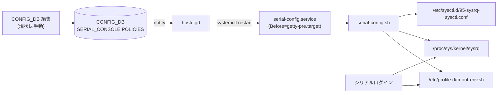
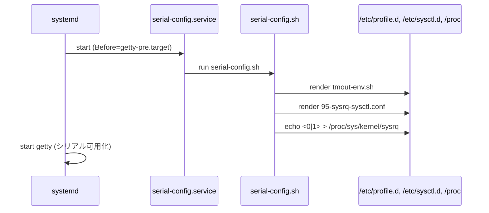

<!-- topics-tip -->
!!! tip "Topics で読み物として読む"
    この HLD は実装詳細を含みます。機能の概念・設定・運用を読み物として読みたい場合は [Topics 15 章: Security / AAA](../topics/15-security-aaa/index.md) を参照。
<!-- /topics-tip -->

!!! success "裏取りステータス: code-verified"
    `sonic-buildimage/files/image_config/cli_sessions/` 配下に `serial-config.service`, `serial-config.sh`, `tmout-env.sh.j2`, `sysrq-sysctl.conf.j2` が存在。`sonic-host-services/scripts/hostcfgd` 内 `serial_console_config_handler`（`config_db.subscribe('SERIAL_CONSOLE', ...)` を含む）と `init_data.get('SERIAL_CONSOLE', {})` 初期化を確認。

# シリアルコンソール全体設定（SERIAL_CONSOLE.POLICIES）

## 概要

シリアル（`tty`）経由のローカルログインは、ネットワークが切れた状況下での最終手段として残されているため、**自動ログアウトのタイマー** と **SysRq カパビリティ** を運用ポリシーに合わせて設定したいという要件がある。[SONiC](../reference/glossary.md#term-sonic) は当初これらをハードコードしていたが、本機能はそれらを [CONFIG_DB](../reference/glossary.md#term-config_db) から制御できるようにする[^1]。

Phase 1 では次の 2 ポリシーを対象とする[^1]。

| ポリシー | 値域 | 既定 |
|---------|------|------|
| `inactivity_timeout` | 0–35000（分） | 15 |
| `sysrq_capabilities` | `enabled` / `disabled` | `disabled` |

実装は **CONFIG_DB → [hostcfgd](../reference/glossary.md#term-hostcfgd) → serial-config.service → /etc/profile.d, /proc/sys/kernel/sysrq, /etc/sysctl.d** の経路で、ホスト側 OS 設定ファイルを書き換えることで反映する。

## 動作仕様

### 全体経路



`serial-config.service` は **`getty-pre.target` より前** に起動する設計で、シリアルコンソールが利用可能になる前に設定が適用される[^1]。

### 設定の適用先

#### inactivity_timeout

`/etc/profile.d/tmout-env.sh` を jinja テンプレートから生成する。シリアル `tty` のセッションのみで `TMOUT` を設定する仕掛けで、分単位の値を秒に換算する[^1]:

```jinja

tty | grep -q tty && \
export TMOUT={{ serial_pol.inactivity_timeout | int * 60 }}
```

`tty | grep -q tty` 判定は SSH セッション等を除外するためで、ネットワーク経由のセッションには影響しない（`SSH_CONNECTION` の有無で分岐する `pty` セッションは false）。

#### sysrq_capabilities

`/etc/sysctl.d/95-sysrq-sysctl.conf` に `kernel.sysrq=0/1` を書き出し、起動時の sysctl 反映に使う。同時に runtime にも反映するため `/proc/sys/kernel/sysrq` への書き込みも行うと [HLD](../reference/glossary.md#term-hld) は明記している[^1]。

```jinja





kernel.sysrq={{ sysrq }}
```

### 起動時シーケンス



### 既定値の出所

`init_cfg.json.j2` に既定値を埋め込む設計で、ファクトリイメージ起動時にも `inactivity_timeout=15`, `sysrq_capabilities=disabled` が反映される[^1]。

<!-- evidence:
source: sonic-net/SONiC/doc/console/serial-console-HLD.md#L82-L113 (sha: 49bab5b5ff0e924f1ea52b3d9db0dfa4191a7c06)
excerpt: |
  | inactivity timeout | Inactivity timeout for serial-console session                         | 0-35000 (minutes)   | 15           |
  | sysrq capabilities | Enabling or disabling SysRq functionality for serial-consoles         | enabled/disabled    | disabled     |
  ...
  Default values will be added to init_cfg.json.j2
reasoning: 2 ポリシーの値域・既定値・初期化経路の根拠。
-->

<!-- evidence-rendered:start -->
??? note "📋 検証エビデンス: sonic-net/SONiC/doc/console/serial-console-HLD.md#L82-L113 (sha: 49bab5b5ff0e924f1ea52b3d9db0dfa4191a7c06)"

    **出典**:

    `sonic-net/SONiC/doc/console/serial-console-HLD.md#L82-L113 (sha: 49bab5b5ff0e924f1ea52b3d9db0dfa4191a7c06)`

    **抜粋**:

    ```text
    | inactivity timeout | Inactivity timeout for serial-console session                         | 0-35000 (minutes)   | 15           |
    | sysrq capabilities | Enabling or disabling SysRq functionality for serial-consoles         | enabled/disabled    | disabled     |
    ...
    Default values will be added to init_cfg.json.j2
    ```

    **判断根拠**: 2 ポリシーの値域・既定値・初期化経路の根拠。

<!-- evidence-rendered:end -->

## 設定

### 関連する CONFIG_DB

| Table | Key | フィールド | 説明 |
|-------|-----|-----------|------|
| `SERIAL_CONSOLE` | `POLICIES` | `inactivity_timeout` | 分単位 0..35000（既定 15）|
| | | `sysrq_capabilities` | `enabled` / `disabled`（既定 `disabled`）|

JSON サンプル[^1]:

```json
{
    "SERIAL_CONSOLE": {
        "POLICIES": {
            "inactivity_timeout": "15",
            "sysrq_capabilities": "disabled"
        }
    }
}
```

### 関連する CLI

HLD 上では「**現状は CONFIG_DB を手動で編集**」と書かれており、`config serial-console ...` のような専用 CLI は Phase 1 では定義されていない。`config_db.json` 直接編集 / `sonic-cfggen` / [gNMI](../reference/glossary.md#term-gnmi) 経由で投入する想定。

### 関連する YANG

`sonic-serial-console.yang` の `SERIAL_CONSOLE.POLICIES` コンテナに 2 leaf を定義[^1]:

```yang
container POLICIES {
    leaf inactivity_timeout {
        type int32 { range "0..35000"; }
        default 15;
    }
    leaf sysrq_capabilities {
        type enumeration { enum disabled; enum enabled; }
        default disabled;
    }
}
```

### 設定例

```bash
# 自動ログアウトを 5 分にし、SysRq を有効化
redis-cli -n 4 hset 'SERIAL_CONSOLE|POLICIES' inactivity_timeout 5
redis-cli -n 4 hset 'SERIAL_CONSOLE|POLICIES' sysrq_capabilities enabled

# 永続化
config save
```

設定すると `hostcfgd` が反応して `serial-config.service` が再走し、`/etc/profile.d/tmout-env.sh` と `/etc/sysctl.d/95-sysrq-sysctl.conf` が更新されたうえで、現在のカーネルにも `/proc/sys/kernel/sysrq` 経由で即時反映される。

## 干渉する機能

- **SSH セッション**: `tmout-env.sh` は `tty | grep -q tty` ガードで真の tty のみに適用される。SSH 経由の擬似端末では `TMOUT` は設定されない設計。
- **既存の bash 設定**: 他の `/etc/profile.d/*.sh` で `TMOUT` を別の値にしていると上書き合戦になる可能性。本テンプレートが優先される並びかは Debian 側のファイル名順序（数字プレフィックス）に依存。
- **SysRq の運用ポリシー**: `kernel.sysrq=1` は **すべての SysRq マスク有効** を意味する。リスクを限定したい場合は `0` / `1` 以外の値（ビットマスク）を使うが、本 HLD では 2 値のみ扱う。
- **warm/fast boot**: HLD は影響なし (NA) と明記。

## トラブルシューティング

- 自動ログアウトが効かない: シリアルログイン直後に `echo $TMOUT` を確認。`/etc/profile.d/tmout-env.sh` が生成されているか、`tty | grep -q tty` が真になっているかを確認する。`bash` の login shell 設定（`-l`）でないと `/etc/profile.d/*` を読まない点に注意。
- SysRq が効かない: `cat /proc/sys/kernel/sysrq` を確認。`/etc/sysctl.d/95-sysrq-sysctl.conf` の値と一致しているか。`serial-config.service` が runtime 反映を入れているはず。
- 再起動後にロスト: `config save` 漏れ。CONFIG_DB の SERIAL_CONSOLE は `config_db.json` に保存されないと cold/fast boot で消える。
- `inactivity_timeout=0`: HLD では 0 が「無効化」かどうかの解釈は明記されていない。実装裏取りで挙動確認が必要。

確認コマンド例:

```bash
# Console / serial 設定確認
show line
redis-cli -n 4 hgetall 'CONSOLE_PORT|1'
ls -l /dev/ttyUSB* /dev/ttyS*
```

## 引用元

[^1]: `sonic-net/SONiC` `doc/console/serial-console-HLD.md` @ `49bab5b5ff0e924f1ea52b3d9db0dfa4191a7c06`

<!-- evidence (verifier-batch-19):
- sonic-buildimage `files/image_config/cli_sessions/serial-config.service` / `serial-config.sh` 存在
- 同 `files/image_config/cli_sessions/tmout-env.sh.j2` / `sysrq-sysctl.conf.j2` 存在
- sonic-host-services `scripts/hostcfgd` 内 `init_data.get('SERIAL_CONSOLE', {})` (l.2258), `serial_console_config_handler` (l.2439), `config_db.subscribe('SERIAL_CONSOLE', ...)` (l.2481)
- `init_cfg.json.j2` 既定値 / `inactivity_timeout=0` 動作は引き続きランタイム検証要
-->

<!-- concerns hint:
- serial-config.service / serial-config.sh 実装の存在とパス確認 → `files/image_config/cli_sessions/` 配下で確認
- tmout-env.sh.j2 / sysrq-sysctl.conf.j2 テンプレートの配置確認 → 同パスで確認
- init_cfg.json.j2 に既定値が入っているか確認 → 別途要確認
- inactivity_timeout=0 の扱い (無効化か即ログアウトか) の動作確認 → 実機検証要
-->

<!-- topics-back-ref -->
## 関連 Topics

- [Topics: Security / AAA / FIPS / Hardening](../topics/15-security-aaa/index.md)

<!-- /topics-back-ref -->

<!-- glossary-links-injected: 9b26b6a2b5fc -->

<!-- ops-entry -->
## 運用入口

この HLD に対応する運用面の入口（CLI / CONFIG_DB / [YANG](../reference/glossary.md#term-yang) / Runbook）を以下にまとめる。

### 関連 CONFIG_DB

- `SERIAL_CONSOLE`

### 関連 YANG

- `sonic-serial-console`

<!-- /ops-entry -->

<!-- glossary-links-injected: 8ba32e5aa69d -->
