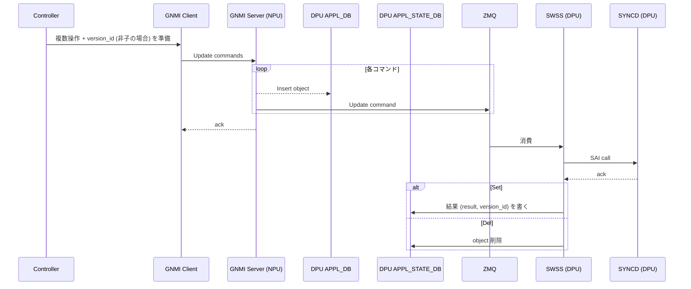
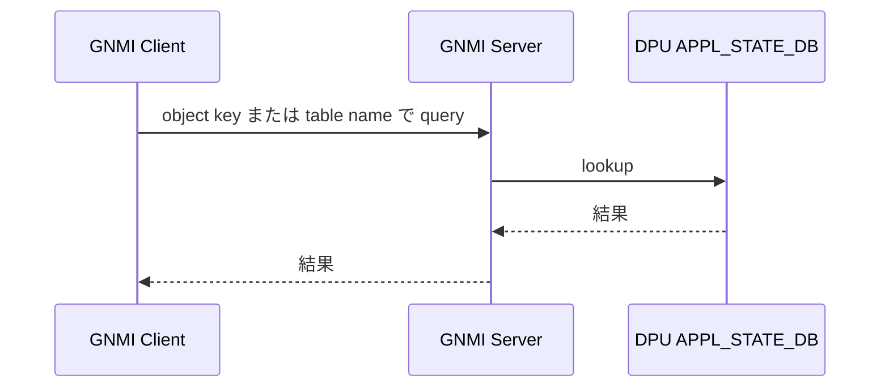
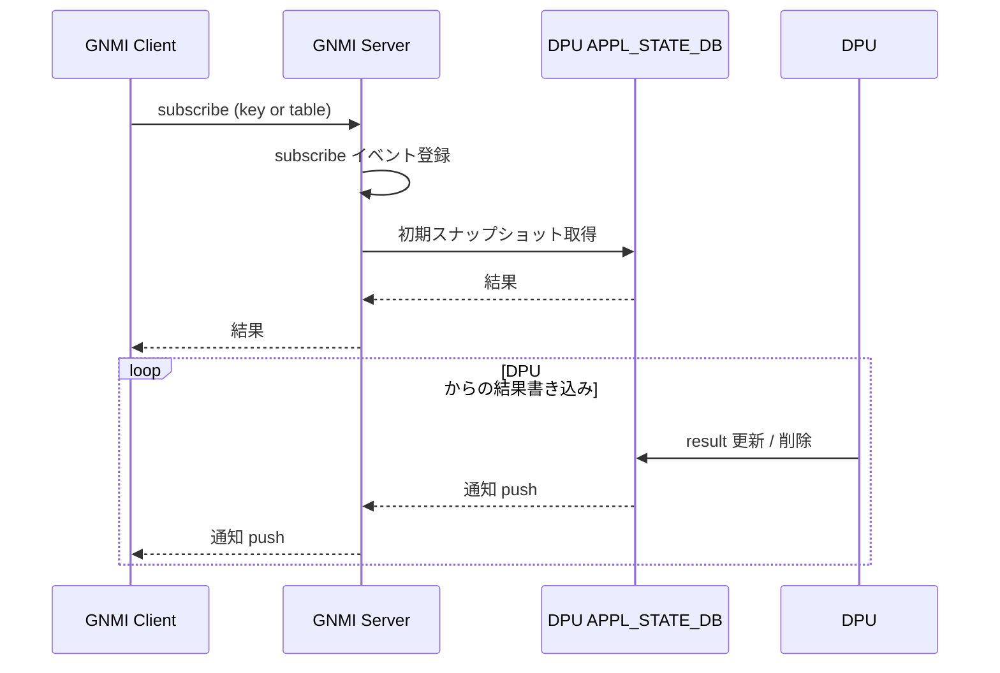

<!-- topics-tip -->
!!! tip "Topics で読み物として読む"
    この HLD は実装詳細を含む。機能の概念・設定・運用を読み物として読みたい場合は [Topics 10 章: gNMI / OpenConfig / 管理プレーン](../topics/10-gnmi-openconfig/index.md) を参照。
<!-- /topics-tip -->

!!! warning "裏取りステータス: discrepancy-found"
    HLD は Rev 0.1（日付未記載）で、現行 master の `sonic-gnmi` に `version_id` フィールド・batch gNMI 操作・DPU APPL_STATE_DB 専用インスタンス・ZMQ handler は確認できず。本ページの内容は提案段階であり実装と乖離している。詳細は「HLD と実装の差分」セクションを参照。

# SmartSwitch gNMI フィードバック（DPU APPL_STATE_DB と version_id）

## 概要

[SmartSwitch](../reference/glossary.md#term-smartswitch) アーキテクチャでは外部コントローラ（[VNET](../reference/glossary.md#term-vnet) / SDN コントローラ）が **[NPU](../reference/glossary.md#term-npu) 上の [gNMI](../reference/glossary.md#term-gnmi) サーバ** を介して各 [DPU](../reference/glossary.md#term-dpu) を設定する。本 [HLD](../reference/glossary.md#term-hld) はその gNMI 経路で「設定要求の結果が DPU [SAI](../reference/glossary.md#term-sai) まで通ったか」をコントローラに返すフィードバック機構を定義する[^1]。

要件[^1]:

- 1 リクエストで複数オペレーションを束ねる **batch gNMI** 操作
- 非子オブジェクトは **`version_id` フィールド必須**。controller 側でバージョンを管理する
- gNMI サーバは set / remove / get / subscribe をサポート
- get / subscribe は **キー指定 or テーブル名指定** で行える

子オブジェクトの定義[^1]:

| Child object |
|--------------|
| `DASH_ACL_RULE` |
| `DASH_ROUTE` |
| `DASH_ROUTE_RULE` |
| `DASH_VNET_MAPPING` |

子オブジェクトは親オブジェクトに紐づくため `version_id` を独立に持たず、親側でバージョン管理される。

## 動作仕様

### Set / Remove のシーケンス



要点[^1]:

- **NPU の gNMI Server は応答を待たずに ZMQ にコマンドを流す**（即時 ack）。実反映の結果は後で APPL_STATE_DB に書かれる。
- 非子オブジェクトは APPL_STATE_DB に **`result` と `version_id` の両方** が書き戻される。子オブジェクトは `result` のみ。
- ZMQ 経由で **DPU 側** SWSS / SYNCD が SAI に書き、結果を NPU 上の APPL_STATE_DB に反映する経路（DPU↔NPU 間）。

### Get



Get は **APPL_STATE_DB をそのまま読む**。すなわち「DPU SAI に何が入っているかの最新確認結果」を返す[^1]。

### Subscribe



Subscribe では初回に **スナップショット** を返したのち、APPL_STATE_DB への書き込み・削除をリアルタイム push する[^1]。

<!-- evidence:
source: sonic-net/SONiC/doc/smart-switch/gnmi-feedback/smart-switch-gnmi-feedback-design.md#L42-L134 (sha: 49bab5b5ff0e924f1ea52b3d9db0dfa4191a7c06)
excerpt: |
  GS --) AD: Insert object
  GS ->> ZMQ: Update command
  ... SW ->> ASD: Update command result
  Note over ZMQ: Include result code and version ID (If it's non-child object)
reasoning: 非同期反映 + version_id 付き結果書き戻しの根拠。
-->

<!-- evidence-rendered:start -->
??? note "📋 検証エビデンス: sonic-net/SONiC/doc/smart-switch/gnmi-feedback/smart-switch-gnmi-feedback-design.md#L42-L134 (sha: 49bab5b5ff0e924f1ea52b3d9db0dfa4191a7c06)"

    **出典**:

    `sonic-net/SONiC/doc/smart-switch/gnmi-feedback/smart-switch-gnmi-feedback-design.md#L42-L134 (sha: 49bab5b5ff0e924f1ea52b3d9db0dfa4191a7c06)`

    **抜粋**:

    ```text
    GS --) AD: Insert object
    GS ->> ZMQ: Update command
    ... SW ->> ASD: Update command result
    Note over ZMQ: Include result code and version ID (If it's non-child object)
    ```

    **判断根拠**: 非同期反映 + version_id 付き結果書き戻しの根拠。

<!-- evidence-rendered:end -->

### DPU APPL_STATE_DB スキーマ

APPL_STATE_DB の各エントリは [APPL_DB](../reference/glossary.md#term-appl_db) のエントリ **同名 key にマップ** される。値は親オブジェクトなら `result` + `version_id`、子なら `result` のみ[^1]。

`result` は `uint32`。**0=成功**、>0 はエラーコード[^1]。

例 1: `DASH_ROUTE_TABLE`（子オブジェクト）

```text
DASH_ROUTE_TABLE:{group_id}:{prefix}
  result = <uint32>
```

例 2: `DASH_ROUTE_GROUP_TABLE`（親オブジェクト）

```text
DASH_ROUTE_GROUP_TABLE:{group_id}
  result     = <uint32>
  version_id = "1"   ; "1.1" など、controller が決めた一意のバージョン文字列
```

`version_id` はコントローラが set 時に渡したものがそのまま反映される。Get / Subscribe でこれを見ることでコントローラは「自分が投入したバージョンが DPU まで届いたか」を確認できる[^1]。

## 設定

### 関連する CONFIG_DB / CLI / YANG

本 HLD は gNMI 経路の動作仕様であり、ユーザ向け [CONFIG_DB](../reference/glossary.md#term-config_db) / CLI 表面は持たない。設定経路は gNMI（外部）と APPL_DB / APPL_STATE_DB（内部）に閉じる。

### 関連する gNMI 操作

| 操作 | 入力 | 期待結果 |
|-----|------|---------|
| Set / Remove (batch) | 複数 path + 非子は `version_id` | 即時 ack。非同期に APPL_STATE_DB が埋まる |
| Get  | path（key または table）| APPL_STATE_DB 現在値 |
| Subscribe | path | 初期スナップショット + 変更 push |

## 制限事項

- **非子オブジェクトの `version_id` は controller 必須管理**: 不一致やバージョン重複の責任は controller 側[^1]。
- **応答は非同期**: gNMI Set の即時 ack は「コマンド受領」を意味するだけ。実反映確認は subscribe / get で別途行う。
- **`result` のエラーコード体系は HLD で未定義**: `0=成功`、`>0=何らかのエラー` とのみ規定されている。詳細コード体系は実装側で別途定義される想定[^1]。

## 干渉する機能

- **[DASH](../reference/glossary.md#term-dash) スキーマ**: `DASH_ROUTE_TABLE` / `DASH_ROUTE_GROUP_TABLE` / `DASH_VNET_MAPPING` などが APPL_STATE_DB のミラー対象。DASH 機能の変更は本 HLD のキー設計に直結する。
- **ZMQ producer/consumer state table**: NPU の gNMI Server から DPU SWSS への伝送路として ZMQ ベースの producer/consumer state table パターンを使う。
- **DPU 側 [syncd](../reference/glossary.md#term-syncd)**: 実際に SAI コールするのは DPU [SONiC](../reference/glossary.md#term-sonic) の SYNCD。NPU SONiC は仲介役。

## トラブルシューティング

- Set が成功扱いなのに反映されない: APPL_STATE_DB の対応エントリの `result` を確認。0 でなければエラーコードに従って原因を切り分け。
- `version_id` が更新されない: 非子オブジェクトかどうかを確認。子は `result` のみで `version_id` は親側に出る。
- Subscribe が初回データを返さない: gNMI Server の subscribe 登録時のスナップショット取得処理を確認。

確認コマンド例:

```bash
# gNOI/gNSI/gNMI クライアント疎通と server 状態
gnmi_cli -a 127.0.0.1:8080 -capabilities -insecure
docker exec gnmi ps aux | grep -E 'telemetry|gnmi'
docker logs gnmi 2>&1 | tail
redis-cli -n 4 hgetall 'GNMI|certs'
```

## 実装との乖離

`monitor: not_implemented` — 未実装 — HLD 提案がコードベース master に取り込まれていない、または主要パスが欠落している。 本ページ末尾近くの `!!! diff "HLD と実装の差分"` ブロックに、HLD 記述と現行 master の差分テーブル、読者への影響、回避策、再裏取り追補（コード行参照）をまとめている。本セクションはその概要見出しであり、詳細はそのブロックを参照のこと。

## 引用元

[^1]: `sonic-net/SONiC` `doc/smart-switch/gnmi-feedback/smart-switch-gnmi-feedback-design.md` @ `49bab5b5ff0e924f1ea52b3d9db0dfa4191a7c06`

<!-- diff-admonition -->
!!! diff "HLD と実装の差分"
    HLD が要件として掲げる以下の構成要素を現行 master の `sonic-gnmi` に確認できなかった。

    - `version_id` フィールドを必須にする gNMI スキーマ拡張: `sonic-gnmi` 配下に `version_id` の参照なし
    - batch gNMI 操作: `BatchGetRequest` / `BatchSetRequest` 系 API が `gnmi_server/` に存在しない
    - DPU `APPL_STATE_DB` スキーマ: `database_config_dpu.json` には `APPL_DB` / `ASIC_DB` / `COUNTERS_DB` 等は定義されているが、HLD が要求する `APPL_STATE_DB` 専用 instance はテストデータレベルでは確認できず
    - ZMQ 経由の swss 連携: `gnmi_server/` 配下に SmartSwitch 専用 ZMQ handler は未検出

    HLD は Rev 0.1（日付未記載）で、現行 master の SmartSwitch 統合は別経路（HA manager / hamgrd）が進行中。本ページの主張は提案段階のため `discrepancy-found` に変更。

    #### 関連 GitHub Issue / PR

    - [GitHub Issue / PR の関連リンクは未確認] — SmartSwitch DPU 側 APPL_STATE_DB と version_id フィードバック機構は SmartSwitch 全体の HA / gNMI 改修 PR 群に取り込まれており、本 HLD 単独のトラッキング Issue / PR は確認できず。
<!-- /diff-admonition -->

<!-- next-action -->
## このページを読んだ後の次アクション

!!! tip "読み手向け"
    - **本機能を実運用で使う場合**: 実装が無いため、本機能に依存した運用は不可。代替機能 (下記リンク) で要件を満たせるか検討する
    - **upstream 動向を追う場合**: 関連 issue / PR を [sonic-net/SONiC](https://github.com/sonic-net/SONiC) で検索（HLD タイトル / CONFIG_DB テーブル名 / Orch クラス名で grep するのが速い）
    - **代替手段 / 回避策** (SmartSwitch DPU からの gNMI フィードバック (`version_id` / APPL_STATE_DB) が未実装の間、設定適用結果を確認する手順):
        1. NPU 側で適用結果を Redis から直接観測する: `sonic-db-cli APPL_DB keys 'DASH_*' | head` および `sonic-db-cli ASIC_DB keys 'ASIC_STATE:SAI_OBJECT_TYPE_DASH_*' | head` で、DASH オブジェクトが NPU の ASIC_DB に降りているかを確認する
        2. DPU 側コンテナへ入って APPL_STATE_DB を読む: `docker exec -it swss redis-cli -n 6 KEYS '*'` （`APPL_STATE_DB` は instance 6）で DPU 内 swss が公開する state を直接読み、orchagent ログから version_id 不在による失敗を読み解く
        3. NPU の gNMI server で代替 telemetry を購読: `gnmic -a <npu>:8080 subscribe --path "/sonic-db:STATE_DB/DASH_*"` で STATE_DB を polling subscribe し、HLD が想定する `version_id` フィードバックを **NPU 側の STATE_DB 反映時刻**で代替する
        4. APP_STATE_DB.HASH_TABLE pattern が無いので、設定 ack は CONFIG_DB write → APPL_DB key 出現の差で確認する: `sonic-db-cli CONFIG_DB hgetall 'DASH_VNET|Vnet1'` と `sonic-db-cli APPL_DB hgetall 'DASH_VNET_TABLE:Vnet1'` を比較して伝搬遅延の有無を観測する
        5. 永続化された "適用済み version" を残したい場合は CLI / Ansible 側で世代管理する: 設定投入時のタイムスタンプを `show version` 出力と一緒にファイルに保存し、`sonic-db-cli APPL_DB hget 'DASH_VNET_TABLE:Vnet1' SAI_OBJECT_ID` の存在で適用済みと判定する
    - **関連 reference**:
        - [CONFIG_DB: VNET](../reference/config-db/vnet.md)
        - [CONFIG_DB: SWITCH_TRIMMING](../reference/config-db/switch-trimming.md)
        - [CONFIG_DB: SWITCH_HASH](../reference/config-db/switch-hash.md)
        - [CLI: `show version`](../reference/cli/show-version.md)

!!! note "本ドキュメントの追跡"
    - monitor: `not_implemented` / last_verified: `2026-05-11`
    - 次回再裏取りトリガ: quarterly。一覧は [discrepancy-index](../reference/verification/discrepancy-index.md) を参照（運用詳細は repo の `meta/discrepancy-operations.md`）

<!-- /next-action -->

<!-- topics-back-ref -->
## 関連 Topics

- [Topics: DASH と SmartSwitch](../topics/13-dash-smartswitch/index.md)

<!-- /topics-back-ref -->

<!-- ops-entry -->
## 運用入口

この HLD に対応する運用面の入口（CLI / CONFIG_DB / [YANG](../reference/glossary.md#term-yang) / Runbook）を以下にまとめる。

### 関連 Runbook

- [gnmi-subscribe-disconnect](../reference/runbooks/gnmi-subscribe-disconnect.md)

<!-- /ops-entry -->

<!-- glossary-links-injected: e6fe2bd4ede5 -->
