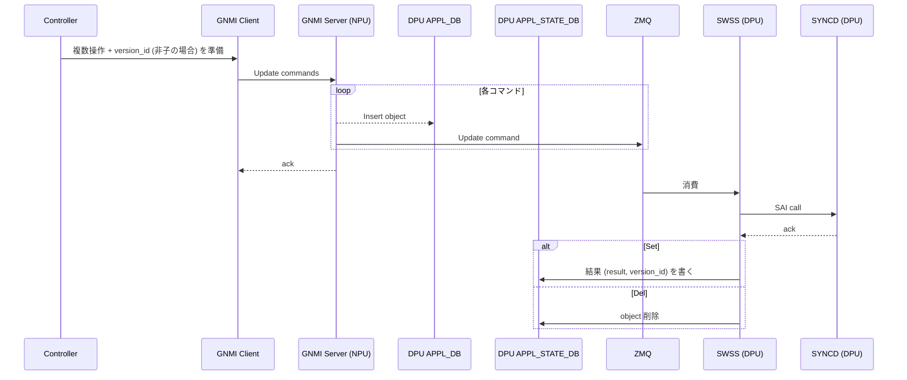
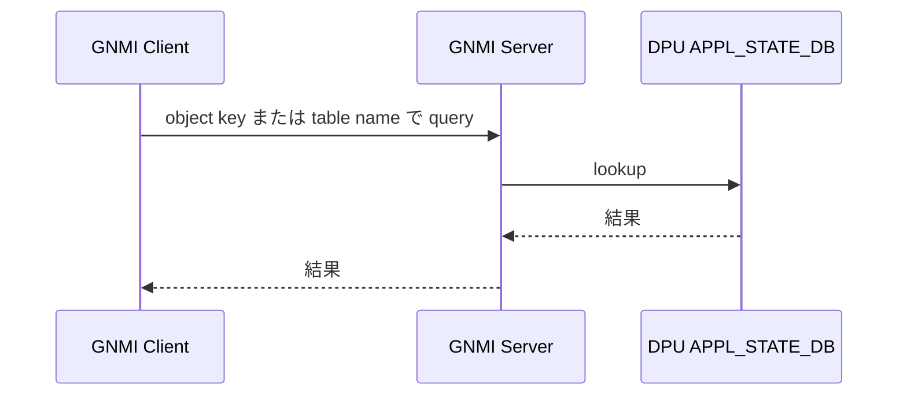
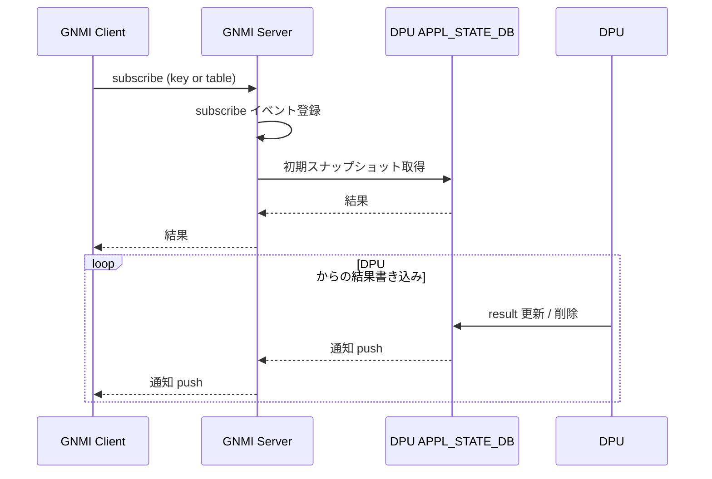

!!! warning "裏取りステータス: HLD-only"
    HLD は Rev 0.1 のみで日付未記載。`gnmi-server` の SmartSwitch 拡張、DPU APPL_STATE_DB スキーマ、ZMQ 経由の swss 連携実装は要裏取り。

# SmartSwitch gNMI フィードバック（DPU APPL_STATE_DB と version_id）

## 概要

SmartSwitch アーキテクチャでは外部コントローラ（VNET / SDN コントローラ）が **NPU 上の gNMI サーバ** を介して各 DPU を設定する。本 HLD はその gNMI 経路で「設定要求の結果が DPU SAI まで通ったか」をコントローラに返すフィードバック機構を定義する[^1]。

要件[^1]:

- 1 リクエストで複数オペレーションを束ねる **batch gNMI** 操作
- 非子オブジェクトは **`version_id` フィールド必須**。controller 側でバージョンを管理する
- gNMI サーバは set / remove / get / subscribe をサポート
- get / subscribe は **キー指定 or テーブル名指定** で行える

子オブジェクトの定義[^1]:

| Child object |
|--------------|
| `DASH_ACL_RULE` |
| `DASH_ROUTE` |
| `DASH_ROUTE_RULE` |
| `DASH_VNET_MAPPING` |

子オブジェクトは親オブジェクトに紐づくため `version_id` を独立に持たず、親側でバージョン管理される。

## 動作仕様

### Set / Remove のシーケンス



要点[^1]:

- **NPU の gNMI Server は応答を待たずに ZMQ にコマンドを流す**（即時 ack）。実反映の結果は後で APPL_STATE_DB に書かれる。
- 非子オブジェクトは APPL_STATE_DB に **`result` と `version_id` の両方** が書き戻される。子オブジェクトは `result` のみ。
- ZMQ 経由で **DPU 側** SWSS / SYNCD が SAI に書き、結果を NPU 上の APPL_STATE_DB に反映する経路（DPU↔NPU 間）。

### Get



Get は **APPL_STATE_DB をそのまま読む**。すなわち「DPU SAI に何が入っているかの最新確認結果」を返す[^1]。

### Subscribe



Subscribe では初回に **スナップショット** を返したのち、APPL_STATE_DB への書き込み・削除をリアルタイム push する[^1]。

<!-- evidence:
source: sonic-net/SONiC/doc/smart-switch/gnmi-feedback/smart-switch-gnmi-feedback-design.md#L42-L134 (sha: 49bab5b5ff0e924f1ea52b3d9db0dfa4191a7c06)
excerpt: |
  GS --) AD: Insert object
  GS ->> ZMQ: Update command
  ... SW ->> ASD: Update command result
  Note over ZMQ: Include result code and version ID (If it's non-child object)
reasoning: 非同期反映 + version_id 付き結果書き戻しの根拠。
-->

### DPU APPL_STATE_DB スキーマ

APPL_STATE_DB の各エントリは APPL_DB のエントリ **同名 key にマップ** される。値は親オブジェクトなら `result` + `version_id`、子なら `result` のみ[^1]。

`result` は `uint32`。**0=成功**、>0 はエラーコード[^1]。

例 1: `DASH_ROUTE_TABLE`（子オブジェクト）

```
DASH_ROUTE_TABLE:{group_id}:{prefix}
  result = <uint32>
```

例 2: `DASH_ROUTE_GROUP_TABLE`（親オブジェクト）

```
DASH_ROUTE_GROUP_TABLE:{group_id}
  result     = <uint32>
  version_id = "1"   ; "1.1" など、controller が決めた一意のバージョン文字列
```

`version_id` はコントローラが set 時に渡したものがそのまま反映される。Get / Subscribe でこれを見ることでコントローラは「自分が投入したバージョンが DPU まで届いたか」を確認できる[^1]。

## 設定

### 関連する CONFIG_DB / CLI / YANG

本 HLD は gNMI 経路の動作仕様であり、ユーザ向け CONFIG_DB / CLI 表面は持たない。設定経路は gNMI（外部）と APPL_DB / APPL_STATE_DB（内部）に閉じる。

### 関連する gNMI 操作

| 操作 | 入力 | 期待結果 |
|-----|------|---------|
| Set / Remove (batch) | 複数 path + 非子は `version_id` | 即時 ack。非同期に APPL_STATE_DB が埋まる |
| Get  | path（key または table）| APPL_STATE_DB 現在値 |
| Subscribe | path | 初期スナップショット + 変更 push |

## 制限事項

- **非子オブジェクトの `version_id` は controller 必須管理**: 不一致やバージョン重複の責任は controller 側[^1]。
- **応答は非同期**: gNMI Set の即時 ack は「コマンド受領」を意味するだけ。実反映確認は subscribe / get で別途行う。
- **`result` のエラーコード体系は HLD で未定義**: `0=成功`、`>0=何らかのエラー` とのみ規定されている。詳細コード体系は実装側で別途定義される想定[^1]。

## 干渉する機能

- **DASH スキーマ**: `DASH_ROUTE_TABLE` / `DASH_ROUTE_GROUP_TABLE` / `DASH_VNET_MAPPING` などが APPL_STATE_DB のミラー対象。DASH 機能の変更は本 HLD のキー設計に直結する。
- **ZMQ producer/consumer state table**: NPU の gNMI Server から DPU SWSS への伝送路として ZMQ ベースの producer/consumer state table パターンを使う。
- **DPU 側 syncd**: 実際に SAI コールするのは DPU SONiC の SYNCD。NPU SONiC は仲介役。

## トラブルシューティング

- Set が成功扱いなのに反映されない: APPL_STATE_DB の対応エントリの `result` を確認。0 でなければエラーコードに従って原因を切り分け。
- `version_id` が更新されない: 非子オブジェクトかどうかを確認。子は `result` のみで `version_id` は親側に出る。
- Subscribe が初回データを返さない: gNMI Server の subscribe 登録時のスナップショット取得処理を確認。

## 引用元

[^1]: `sonic-net/SONiC` `doc/smart-switch/gnmi-feedback/smart-switch-gnmi-feedback-design.md` @ `49bab5b5ff0e924f1ea52b3d9db0dfa4191a7c06`
