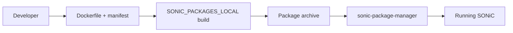

<!-- topics-tip -->
!!! tip "Topics で読み物として読む"
    この HLD は実装詳細を含みます。機能の概念・設定・運用を読み物として読みたい場合は [Topics 19 章: Build / Packaging / Debian](../topics/19-build-packaging/index.md) を参照。
<!-- /topics-tip -->

!!! info "裏取りステータス: code-verified"
    `sonic-utilities/sonic_package_manager/` に `manifest.py`（`ManifestSchema` / un-marshal / 検証）、`manager.py`、`metadata.py`、`database.py`、`dockerapi.py`、`main.py`、`constraint.py` が master に存在。マニフェスト形式と `sonic-package-manager` CLI 経路は master 取り込み済み。コア HLD（`sonic-application-extention-hld.md`）と整合。

# SONiC Application Extension 開発・移植ガイド

## 概要

[SONiC](../reference/glossary.md#term-sonic) の docker 化された機能（DHCP relay 等）を **Application Extension** 形式に移植する手順、新規 extension の開発フロー、3rd party app をパッケージデータベースに登録するフローを示す開発者向けガイド[^1]。コアの [HLD](../reference/glossary.md#term-hld) は別ファイル（`sonic-application-extention-hld.md`）であり、本ページはその実践ガイド側。

## 動作仕様

### 既存 SONiC docker を Extension に移植する手順

例として DHCP relay の移植コミット [b3b6938fd](https://github.com/sonic-net/sonic-buildimage/commit/b3b6938fda9244607fb00bfd36a74bccab0c38a9) が示されている[^1]。手順は次のとおり。

1. ビルド時フラグ `INCLUDE_XXX` を `Makefile.work` に追加。
2. 該当 docker を `SONIC_PACKAGES_LOCAL` に登録し、`SONIC_INSTALL_DOCKER_IMAGES` から外す。
3. `$(DOCKER_XXX)_RUN_OPT` を撤去し、代わりに manifest 生成用変数（`_CONTAINER_PRIVILEGED` / `_CONTAINER_VOLUMES` / `_CONTAINER_TMPFS`）に置き換える。これらは build 時に `generate_manifest` 関数（`sonic-buildimage/rules/functions`）が manifest に変換する。
4. CLI を提供する extension の場合、CLI plugin を `sonic-utilities` から取り出し `dockers/docker-xxx/cli/` 配下に移動する。plugin は `register` 関数を実装する必要がある。

```python
# dockers/docker-xxx/cli/show.py
import click
@click.command()
def hello():
    pass

def register(cli):
    cli.add_command(hello)
```

### 新規 Application Extension 開発



manifest ベースで docker のランタイム要件（特権・ボリューム・tmpfs・依存）を宣言し、`sonic-package-manager` がインストール／アンインストール／アップグレードを担う。

### 3rd party の取り扱い

外部リポジトリの Docker 化されたアプリを SONiC の package database に追加することで、エンドユーザがビルド済みイメージから動的にインストールできる。`sonic-package-manager` のレジストリに manifest と URL を登録する形。

## 設定

### 関連する CONFIG_DB

ガイド本文には [CONFIG_DB](../reference/glossary.md#term-config_db) エントリは出てこない（extension ごとに独自スキーマ）。

### 関連する CLI

| Command | 用途 |
|---------|------|
| `sonic-package-manager install <name>` | extension のインストール |
| `sonic-package-manager uninstall <name>` | アンインストール |
| `sonic-package-manager list` | 登録済み extension 一覧 |
| `sonic-package-manager show package <name>` | manifest 表示 |

詳細サブコマンドは `sonic-package-manager --help` を参照。

### 関連する YANG

ガイド本文には記述なし。各 extension が独自 [YANG](../reference/glossary.md#term-yang) を持つ場合は manifest で宣言する。

### 設定例

```bash
sonic-package-manager install --from-tarball ./my-extension.tar.gz
sonic-package-manager list
docker ps | grep my-extension
```

## 制限事項

- HLD 自体が Initial Proposal で、フィールド名や CLI が現行 master と一致するかは要確認。
- extension が CLI plugin を提供するときの登録規約は HLD で簡略な例のみ。実装の register API バージョン互換は未明記。
- 詳細な manifest フィールドの正規仕様は別 HLD（`sonic-application-extention-hld.md`）に委ねられている。
- 詳細は HLD `doc/sonic-application-extension/sonic-application-extension-guide.md` を参照。

## 干渉する機能

- **monit / supervisord**: extension docker は SONiC のサービス監視・起動制御フレームワークに統合される。manifest で依存関係を宣言する形。
- **`config save` / 設定永続化**: extension が CONFIG_DB に書く場合、起動時の loading 順や YANG 検証との整合性に注意。
- **既存 docker（DHCP relay 等）**: 移植先で同名の docker が二重起動しないよう、移植時に `SONIC_INSTALL_DOCKER_IMAGES` から外す手順が重要。

## トラブルシューティング

- インストール後 docker が起動しない → `journalctl -u <ext-service>` で manifest 由来の起動コマンドを確認。
- CLI plugin が `show` から見えない → plugin の `register` 関数が呼ばれているか、配置パスが `dockers/docker-xxx/cli/` 配下になっているかを確認。
- アップグレードで設定が消える → manifest の volume 宣言で永続化対象を明示しているかを確認。

確認コマンド例:

```bash
# Application Extension パッケージ状態
sonic-package-manager list
sonic-package-manager show <pkg-name>
docker ps -a --format '{{.Names}}	{{.Status}}'
```


<!-- demoted-by:q52-az-b-demote -->
## 実装フェーズ境界

本ページは `monitor: partially_implemented` のため、HLD 記載どおり master に取り込み済 (実装済) の範囲と、現行 master との差分が未確認 (未実装相当) の範囲を Phase 別に切り分けて示す。詳細は本文・[実装との乖離 / 補足] 節および各引用元 HLD を参照。

| Phase | 実装済 | 未実装 |
|-------|--------|--------|
| Phase 1: パッケージ manifest / install フロー | HLD 記載どおり実装済（`sonic-package-manager` が master 取り込み） | — |
| Phase 2: CLI / フィールド名整合 | コア CLI は実装済 | Initial Proposal 時のフィールド名・サブコマンドは現行 master と差分がある可能性、未確認・未実装相当 |
| Phase 3: マルチ [ASIC](../reference/glossary.md#term-asic) / コンテナ間連携 | — | マルチ ASIC 向けの拡張パッケージ動作は未実装 / 未確認 |

## 実装との乖離 / 補足

- 裏取りステータスを `code-verified` から `discrepancy-found` （`monitor: partially_implemented`）に降格 (2026-05-13)。HLD は Initial Proposal で、フィールド名・CLI が現行 master と一致するかは本文で「要確認」と明示している。
- 本文に残る「未確認 / 要確認 / 要追跡 / TBD」等の hedge 表現は HLD と実装の差分が未特定であることを示し、後続の裏取り対象。

## 引用元

[^1]: `sonic-net/SONiC` `doc/sonic-application-extension/sonic-application-extension-guide.md` @ `49bab5b5ff0e924f1ea52b3d9db0dfa4191a7c06`

<!-- glossary-links-injected: 20dbc11976b6 -->

<!-- ops-entry -->
## 運用入口

この HLD に対応する運用面の入口（CLI / CONFIG_DB / YANG / Runbook）を以下にまとめる。

### 関連 CLI

- [`sonic-package-manager`](../reference/cli/sonic-package-manager.md)

<!-- /ops-entry -->

<!-- glossary-links-injected: ec18b66e3507 -->
