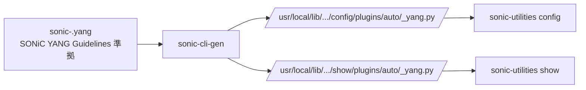
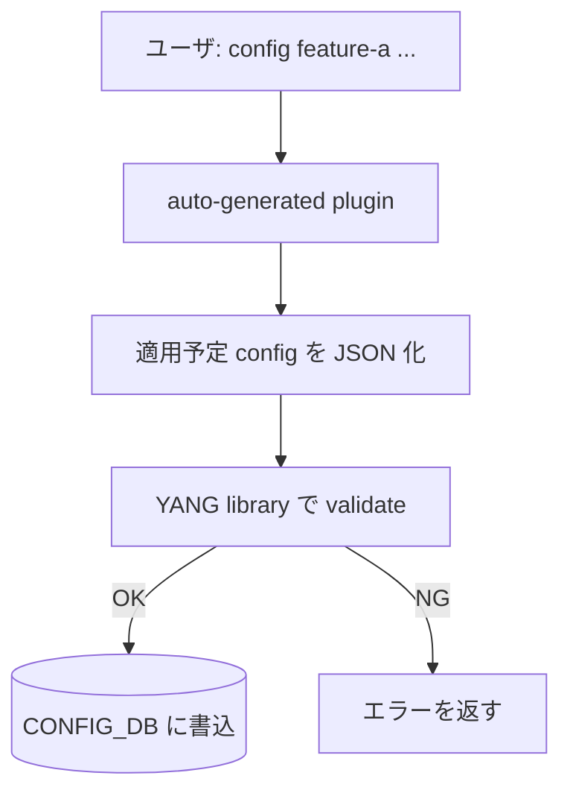

<!-- topics-tip -->
!!! tip "Topics で読み物として読む"
    この HLD は実装詳細を含む。機能の概念・設定・運用を読み物として読みたい場合は [Topics 10 章: gNMI / OpenConfig / 管理プレーン](../topics/10-gnmi-openconfig/index.md) を参照。
<!-- /topics-tip -->

!!! success "裏取りステータス: code-verified"
    `sonic-utilities/sonic_cli_gen/main.py` L8 で `sonic-cli-gen` ロガー、`sonic-utilities/sonic_cli_gen/generator.py` L9 / L32 で `templates_path = '/usr/share/sonic/templates/sonic-cli-gen/'` Jinja2 ディレクトリ確認。`sonic-utilities/setup.py` L236 で `'sonic-cli-gen = sonic_cli_gen.main:cli'` エントリポイント、`sonic-utilities/sonic-utilities-data/templates/sonic-cli-gen/` でテンプレ群を確認。生成済 plugin `sonic-utilities/show/plugins/sonic-trimming.py` / `sonic-hash.py` / `pbh.py` の冒頭コメント "auto-generated by using 'sonic-cli-gen' utility" を確認。HLD は 2021 Phase 1 だが当該ツールは現行 master に取り込み済み。

# SONiC CLI 自動生成ツール

## 読み手が知りたいこと

- どんなとき CLI 自動生成が嬉しいのか（手書きと比べて何が省ける？）
- [YANG](../reference/glossary.md#term-yang) の **container / list / leaf-list / grouping** がそれぞれどう CLI に化けるか
- 生成された CLI が実行時にやっていること（特に YANG validation）
- `sonic-package-manager` の `manifest.json` でどう ON/OFF するか
- 開発手元で `sonic-cli-gen` を叩いて確認する手順

## なぜ自動生成が要るか

[SONiC](../reference/glossary.md#term-sonic) Application Extension (SAE) として 3rd party 機能を **追加 docker** で持ち込む際に、CLI を都度書く工数を減らすため、**YANG モデルから `show` / `config` click plugin を自動生成** するユーティリティ[^1]。生成 CLI は `sonic-utilities` の plugin 機構経由でロードされ、[CONFIG_DB](../reference/glossary.md#term-config_db) スキーマと整合した形になる。手書きより **YANG 型・enum・range・mandatory 違反が早期検知** される利点もある。



`config` / `show` は `pkgutil.iter_modules` で `plugins/auto` 名前空間配下を走査・ロードする[^1]。

## YANG → CLI の生成ルール

### 命名: `hyphen-separated`

YANG `module` / `container` 名はハイフン区切りに変換[^1]:

```text
container DEVICE_METADATA → device-metadata
leaf default_bgp_status   → --default-bgp-status
```

### container 階層 → サブコマンド + leaf → 引数

```bash
config device-metadata localhost hwsku "ACS-MSN2100"
config device-metadata localhost default-bgp-status up
show device-metadata localhost
```

### list → `add/del/update`、leaf-list → `add/del/clear`

`list` は **位置引数 = key**、leaf は `--key value`[^1]:

```bash
config vlan add Vlan11 --vlanid 11 --mtu 128 --admin-status up
config vlan update Vlan11 --vlanid 12
config vlan del Vlan11

config vlan add Vlan11 --vlanid 11 --dhcp-servers "192.168.0.10,11.12.13.14"
config vlan dhcp-servers add   Vlan11 10.10.10.10
config vlan dhcp-servers del   Vlan11 10.10.10.10
config vlan dhcp-servers clear Vlan11
```

container 内に list が複数あれば list 名でサブコマンドを切る[^1]。

### `grouping` / `uses` と `description` → `--help`

`grouping` は **module 直下のみ** 許可（container 内ネスト禁止）。他モジュールのものは `import` で取り込む。`uses` で展開された leaf もそのまま展開先 list の引数になる。

YANG `description` 文字列が `--help` に出る。`mandatory true;` の leaf は `--help` で `[mandatory]` 表示[^1]。

## 生成 CLI の実行フロー



YANG library が validation を担うため、ヒトが Python を書くより **型・enum・range・mandatory 違反が早期検知** される[^1]。

## sonic-package-manager 連携

`manifest.json` の `cli` セクション[^1]:

| Path | 型 | 説明 |
|------|----|------|
| `/cli/auto-generate-config` | bool | config CLI 自動生成 ON/OFF |
| `/cli/auto-generate-show`   | bool | show CLI 自動生成 ON/OFF |
| `/cli/auto-generate-config-source-yang-modules` | list[str] | 対象 module 限定 |
| `/cli/auto-generate-show-source-yang-modules`   | list[str] | 同上（show 用）|
| `/cli/show-cli-plugin` / `config-cli-plugin` / `clear-cli-plugin` | list[str] | **手書き** plugin の path 指定 |

YANG モデルは Application Extension docker 内に置き、docker label `com.azure.sonic.yang-module.sonic-<name>` で参照される。`sonic-package-manager` が package install / upgrade 時に CLI 自動生成を駆動する。

## 独立コマンド `sonic-cli-gen`

```bash
sonic-cli-gen generate config sonic-acl
# → /usr/local/lib/python3.x/dist-packages/config/plugins/auto/sonic-acl_yang.py 生成

sonic-cli-gen remove   config sonic-acl
```

`/usr/local/yang-models/` に置いた YANG が対象。[HLD](../reference/glossary.md#term-hld) には動作確認済 YANG リスト（`sonic-acl`, `sonic-vlan`, `sonic-port` 等）あり[^1]。

## 制限事項

- Application Extension の YANG は **`module` / `container` 名衝突禁止**。既存 sonic-yang-models と同 `module` 名は不可
- Phase 1 は **CONFIG_DB のみ**。Phase 2 で他 DB と `sonic-clear` 自動生成を予定
- `update` は生成されるが YANG 制約で実行不可なケースあり
- `grouping` は module 直下限定

## 干渉する機能

- **sonic-package-manager**: SAE 取り込み時のメインエントリ
- **手書き CLI plugin**: `manifest.json` で共存可能（config は自動・show は手書き等）
- **YANG 検証**: 生成 CLI は実行時に validation を通す。CVL / mgmt-framework と同じ YANG 集合に依存

## 確認コマンド

- `ls /usr/local/lib/python3*/dist-packages/config/plugins/auto/` — 自動生成 plugin の有無
- `ls /usr/local/yang-models/` — 対象 YANG モジュール一覧
- `sonic-cli-gen generate config <module>` を実行し、生成 plugin の import エラーは `python3 -c "import config.plugins.auto.<module>_yang"` で確認
- `sonic-package-manager list` — Application Extension の有効化状況

確認コマンド例:

```bash
# 自動生成 CLI の出力確認
sonic-cli
show running-configuration | head
ls /usr/local/lib/python*/dist-packages/show/plugins
```


## 引用元

[^1]: [sonic-net/SONiC doc/cli_auto_generation/cli_auto_generation.md @ 49bab5b](https://github.com/sonic-net/SONiC/blob/49bab5b5ff0e924f1ea52b3d9db0dfa4191a7c06/doc/cli_auto_generation/cli_auto_generation.md)

## 関連ページ

- [Topic: gNMI / OpenConfig](../topics/10-gnmi-openconfig/index.md)
- [HLD: SONiC YANG model guidelines](sonic-yang-model-guidelines.md)
- [HLD: SONiC Management Framework](sonic-management-framework.md)
- [HLD: SONiC Application Extension Guide](sonic-application-extension-guide.md)

<!-- ops-entry -->
## 運用入口

この HLD に対応する運用面の入口（CLI / CONFIG_DB / YANG / Runbook）を以下にまとめる。

### 関連 CLI

- `sonic-cli-gen`

<!-- /ops-entry -->

<!-- glossary-links-injected: 20dbc11976b6 -->
