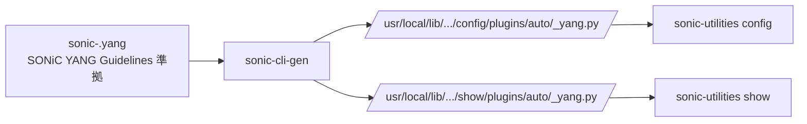

!!! success "裏取りステータス: Code-verified"
    `sonic-utilities/sonic_cli_gen/main.py` L8 で `sonic-cli-gen` ロガー、`sonic-utilities/sonic_cli_gen/generator.py` L9 / L32 で `templates_path = '/usr/share/sonic/templates/sonic-cli-gen/'` Jinja2 ディレクトリを確認。`sonic-utilities/setup.py` L236 で `'sonic-cli-gen = sonic_cli_gen.main:cli'` エントリポイント、`sonic-utilities/sonic-utilities-data/templates/sonic-cli-gen/` でテンプレ群を確認。生成済み plugin として `sonic-utilities/show/plugins/sonic-trimming.py` / `sonic-hash.py` / `pbh.py` 冒頭コメント "auto-generated by using 'sonic-cli-gen' utility" を確認（verified at: 2026-05-09）。HLD は 2021 Phase 1 だが当該ツールは現行 master に取り込み済み。

# SONiC CLI 自動生成ツール（YANG → click plugin 自動生成）

## 概要

SONiC Application Extension (SAE) として 3rd party 機能を **追加 docker** で持ち込む際、CLI を都度書く工数を減らすため、**YANG モデルから `show` / `config` の click plugin を自動生成** するユーティリティ[^1]。生成 CLI は `sonic-utilities` の plugin 機構経由でロードされ、CONFIG DB スキーマと整合する形になる。

## 動作仕様

### 全体像



`config` / `show` は `pkgutil.iter_modules` で `plugins/auto` 名前空間配下の plugin を走査・ロードする[^1]。

### 生成ルール

#### 1. ハイフン区切りの命名

YANG `module` 名 / `container` 名は **`hyphen-separated`** に変換[^1]:

```text
container DEVICE_METADATA → device-metadata
leaf default_bgp_status   → --default-bgp-status
```

#### 2. container 階層 → サブコマンド + leaf → 引数

`container` ごとにサブコマンドが切られ、内側の `leaf` は引数になる[^1]:

```bash
config device-metadata localhost hwsku "ACS-MSN2100"
config device-metadata localhost default-bgp-status up
config device-metadata localhost hostname "r-sonic-switch"
config device-metadata localhost platform "x86_64-mlnx_msn2100-r0"

show device-metadata localhost
HWSKU        DEFAULT BGP STATUS  HOSTNAME        PLATFORM
ACS-MSN2100  UP                  r-sonic-switch  x86_64-mlnx_msn2100-r0
```

#### 3. list → `add/del/update`

`list` には **位置引数 = key**、leaf は `--key value` で渡す[^1]:

```bash
config vlan add Vlan11 --vlanid 11 --mtu 128 --admin-status up
config vlan update Vlan11 --vlanid 12
config vlan del Vlan11
```

container 内に list が複数あれば list 名でサブコマンドを切る[^1]:

```bash
config vlan-interface vlan-interface-list add ...
config vlan-interface vlan-interface-ipprefix-list add ...
```

#### 4. leaf-list → `add/del/clear` + カンマ区切り

```bash
config vlan add Vlan11 --vlanid 11 --dhcp-servers "192.168.0.10,11.12.13.14"
config vlan dhcp-servers add   Vlan11 10.10.10.10
config vlan dhcp-servers del   Vlan11 10.10.10.10
config vlan dhcp-servers clear Vlan11
```

#### 5. `grouping` / `uses`

`grouping` は **module 直下のみ** 許可（container 内ネストは禁止）。他モジュールのものは `import` で取り込む。`uses` で展開された leaf もそのまま展開先 list の引数になる[^1]:

```bash
config feature-a add Linux --address "10.10.10.10" --port 1024
```

#### 6. `description` → `--help`

YANG の `description` 文字列がそのまま `--help` に出る。`mandatory true;` の leaf は `--help` で `[mandatory]` 表示[^1]。

### Workflow（生成 CLI の動作）


YANG library が validation を担うため、ヒトが Python を書くより **型・enum・range・mandatory 違反が早期検知** される[^1]。

### sonic-package-manager 連携

`manifest.json`:

| Path | 型 | 説明 |
|------|----|------|
| `/cli/auto-generate-config` | bool | config CLI 自動生成 ON/OFF |
| `/cli/auto-generate-show` | bool | show CLI 自動生成 ON/OFF |
| `/cli/auto-generate-config-source-yang-modules` | list[str] | 適用対象を絞る場合の module 名リスト |
| `/cli/auto-generate-show-source-yang-modules` | list[str] | 同上（show 用） |
| `/cli/show-cli-plugin` / `config-cli-plugin` / `clear-cli-plugin` | list[str] | **手書き** plugin の path 指定 |

YANG モデルは Application Extension docker 内に置き、docker label `com.azure.sonic.yang-module.sonic-<name>` で参照される[^1]。`sonic-package-manager` は package install / upgrade フックで CLI 自動生成を駆動する。

### 独立コマンド `sonic-cli-gen`

```bash
sonic-cli-gen generate config sonic-acl
# → /usr/local/lib/python3.x/dist-packages/config/plugins/auto/sonic-acl_yang.py 生成

sonic-cli-gen remove   config sonic-acl
```

`/usr/local/yang-models/` に置いた YANG が対象。HLD が動作確認した既存 YANG リスト（`sonic-acl`, `sonic-vlan`, `sonic-port` 等）あり[^1]。

## 制限事項

- Application Extension の YANG は **`module` / `container` 名の衝突禁止**。既存 sonic-yang-models と同じ `module` 名は不可、衝突時は CLI 生成エラー[^1]
- Phase 1 は **CONFIG_DB のみ**。Phase 2 で他 DB と `sonic-clear` 自動生成を予定[^1]
- `update` サブコマンドは生成されるが YANG 制約で実行不可なケースあり（バリデータがエラーを返す）
- `grouping` の場所制約（module 直下のみ）

## 干渉する機能

- **sonic-package-manager**: SAE 取り込み時のメインエントリ
- **手書き CLI plugin**: `manifest.json` の `*-cli-plugin` で共存可能。例えば config だけ自動生成・show は手書き
- **YANG 検証**: 生成 CLI は実行時に YANG validation を通す。CVL / mgmt-framework と同じ YANG 集合に依存

## 引用元

[^1]: [sonic-net/SONiC doc/cli_auto_generation/cli_auto_generation.md @ 49bab5b](https://github.com/sonic-net/SONiC/blob/49bab5b5ff0e924f1ea52b3d9db0dfa4191a7c06/doc/cli_auto_generation/cli_auto_generation.md)
