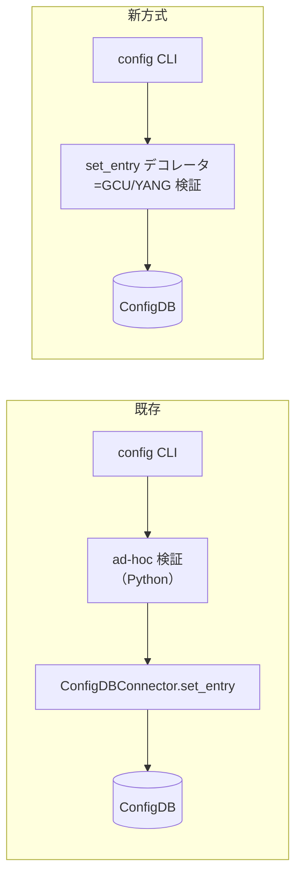

<!-- topics-tip -->
!!! tip "Topics で読み物として読む"
    この HLD は実装詳細を含みます。機能の概念・設定・運用を読み物として読みたい場合は [Topics 10 章: gNMI / OpenConfig / 管理プレーン](../topics/10-gnmi-openconfig/index.md) を参照。
<!-- /topics-tip -->

!!! success "裏取りステータス: code-verified"
    `sonic-buildimage/src/sonic-yang-models/yang-models/sonic-device_metadata.yang` L148 で `yang_config_validation` leaf 定義、`Configuration.md` L1111 で既定 `"yang_config_validation": "disable"`、`tests/yang_model_tests/tests/device_metadata.json` でデフォルト validation テストを確認。`sonic-utilities/config/validated_config_db_connector.py` と `tests/validated_config_db_connector_test.py` で `ValidatedConfigDBConnector` クラスを確認、各 feature テスト（`tests/sflow_test.py` L66 ほか radius / kube / config_snmp / feature 等）が `validated_config_db_connector.device_info.is_yang_config_validation_enabled` と `ValidatedConfigDBConnector.validated_set_entry` / `validated_mod_entry` をモックする形で取り込みを確認。`sonic-utilities/generic_config_updater/main.py` で GCU エンジン（`GenericConfigUpdaterError` ほか）が patch ベース更新を担うことを確認（verified at: 2026-05-09）。

# YANG モデルによる ConfigDB 更新検証（GCU + ConfigDBConnector デコレータ）

## 概要

[SONiC](../reference/glossary.md#term-sonic) では従来、`config <feature>` 系 CLI が ConfigDB に書き込む前のフィールド検証を **Python のハードコード（ad-hoc）と [YANG](../reference/glossary.md#term-yang) モデルの両方** で重複定義していた。同じ制約を 2 箇所で書くと乖離が起きやすく、保守コストが高い[^1]。

本プロジェクトはその二重管理を解消し、**既存の YANG モデルを単一の Source of Truth** として ConfigDB 更新時に再利用する。具体的には Generic Config Updater ([GCU](../reference/glossary.md#term-gcu)) を介した JSON patch 検証を `ConfigDBConnector.set_entry()` のデコレータとして注入する[^1]。

## 動作仕様

### 既存の 2 ステップ vs 新方式



新方式では **デコレータが既存 `set_entry` をラップ** し、内部で update を JSON patch に変換して `GenericConfigUpdater.apply_patch()` を呼ぶ。検証通過時のみ ConfigDB に書く[^1]。

```python
def validate_decorator(config_db_connector):
    def validated_set_entry(updated_value):
        update_json_patch = updated_value.to_json_patch()
        GenericConfigUpdater.apply_patch(update_json_patch)
    config_db_connector.set_entry = validated_set_entry
```

デコレータ採用の利点[^1]:

- 既存 `ConfigDBConnector` インスタンスを差し替えずに使える
- 必要な箇所だけデコレートできる
- 書き込みを伴わない `ConfigDBConnector` の利用は無改修で残る

### スコープ（Phase 1）

#### Python（`sonic-utilities/config/`）

`config <feature>` 系 CLI のうち、[HLD](../reference/glossary.md#term-hld) で列挙されているもの[^1]:

> [AAA](../reference/glossary.md#term-aaa) / [ACL](../reference/glossary.md#term-acl) / [BGP](../reference/glossary.md#term-bgp) / Console / [DHCP Relay](../reference/glossary.md#term-dhcp-relay) / Drop Counter / Dynamic Buffer Management / ECN / Feature / Interface / Interface Naming Mode / Interface Vrf Binding / IPv6 Link Local / Kubernetes / Linux Kernel Dump / Loopback Interfaces / [VRF](../reference/glossary.md#term-vrf) / Management VRF / Mirroring / Muxcable / [NAT](../reference/glossary.md#term-nat) / NTP / NVGRE / PBH / Platform Component Firmware / [PortChannel](../reference/glossary.md#term-portchannel) / [QoS](../reference/glossary.md#term-qos) / sFlow / [SNMP](../reference/glossary.md#term-snmp) / Subinterfaces / [Syslog](../reference/glossary.md#term-syslog) / [VLAN](../reference/glossary.md#term-vlan) / Warm Restart / Watermark / [ZTP](../reference/glossary.md#term-ztp)

加えて ACL rules（incremental update / delete）、`pfc`、`crm`、`mclag`、`counterpoll`、および以下のスクリプト: `configlet` / `db_migrator` / `dropconfig` / `mellanox_buffer_migrator` / `neighbor_advertisor` / `null_route_helper` / `hostcfgd`。

#### C++

`buffermgrd` のみ。Python から呼ぶ手段として HLD は 3 案を挙げ、**D-Bus GCU API** を本プロジェクトの推奨手段としている（[gNMI](../reference/glossary.md#term-gnmi) プロジェクトが既に採用中）[^1]。

### 不足 YANG への対応

ad-hoc 検証で行われていたが YANG に未反映の制約は、**YANG infra でカバー可能なものは GitHub issue を立てて YANG を埋めていく**。YANG 側で表現できないチェックのみ ad-hoc 検証を残す[^1]。

移行期間中は ad-hoc を残し、フラグで切替可能とする。安定後に非性能要件箇所から ad-hoc を削除する設計[^1]。

### 性能インパクト

GCU 経由は ad-hoc より遅い。HLD の実測例[^1]:

| 検証方式 | 例 | 実測時間 |
|---------|----|---------|
| GCU/YANG | `config portchannel add PortChannel04` | **5.177s** |
| ad-hoc   | 同上 | 0.453s |

CLI 用途では許容範囲だが、warm/fast reboot のような **性能要件のあるパス** は ad-hoc 検証を維持する方針が明記されている[^1]。

### 検証スキップ機構

GCU 検証バグでフィールドが不当にブロックされて運用停止に追い込まれる事故を避けるため、無効化フラグが用意される[^1]。

[CONFIG_DB](../reference/glossary.md#term-config_db):

```json
"DEVICE_METADATA": {
  "localhost": { "yang_config_validation": "disable" }
}
```

CLI:

```bash
config yang_config_validation enable
config yang_config_validation disable
```

`yang_config_validation` フィールド自体は YANG 検証を **絶対に通さない**（disable しようとした時点で詰むのを避けるため）[^1]。

<!-- evidence:
source: sonic-net/SONiC/doc/config_yang_validation/config_db_yang_validation.md#L196-L219 (sha: 49bab5b5ff0e924f1ea52b3d9db0dfa4191a7c06)
excerpt: |
  In some cases, we may need to disable YANG validation prior to modifying ConfigDB.
  ... we add a field to ConfigDB: `yangValidateEnabled` ... This field never undergoes any YANG validation.
reasoning: 緊急時の検証バイパスフラグの根拠。
-->

<!-- evidence-rendered:start -->
??? note "📋 検証エビデンス: sonic-net/SONiC/doc/config_yang_validation/config_db_yang_validation.md#L196-L219 (sha: 49bab5b5ff0e924f1ea52b3d9db0dfa4191a7c06)"

    **出典**:

    `sonic-net/SONiC/doc/config_yang_validation/config_db_yang_validation.md#L196-L219 (sha: 49bab5b5ff0e924f1ea52b3d9db0dfa4191a7c06)`

    **抜粋**:

    ```text
    In some cases, we may need to disable YANG validation prior to modifying ConfigDB.
    ... we add a field to ConfigDB: `yangValidateEnabled` ... This field never undergoes any YANG validation.
    ```

    **判断根拠**: 緊急時の検証バイパスフラグの根拠。

<!-- evidence-rendered:end -->

### 例外メッセージの保持

GCU が標準で吐く例外メッセージはユーザに分かりにくいため、各 CLI の呼び出し元で例外型を捕捉して **既存のエラーメッセージを再出力** する。複数のエラーが同じ例外型に集約される場合は統合メッセージを出す。YANG モデル側で `yang-error-msg` を設定可能なら、それで具体的な制約名を区別する[^1]。

## 設定

### 関連する CONFIG_DB

| Table | Key | フィールド | 説明 |
|-------|-----|-----------|------|
| `DEVICE_METADATA` | `localhost` | `yang_config_validation` | `enable` / `disable`。デフォルトは `disable` |

### 関連する CLI

| CLI | 用途 |
|-----|------|
| `config yang_config_validation enable` | YANG 検証を有効化 |
| `config yang_config_validation disable` | YANG 検証をスキップ |

### 設定例

```bash
sudo config yang_config_validation disable   # 緊急時のバイパス
sudo config portchannel add PortChannel04    # ad-hoc 検証だけが走る
```

## 制限事項

- **性能要件のあるシナリオでは ad-hoc を維持**: warm/fast reboot 等は GCU の数秒コストが許容できないため、引き続き ad-hoc 検証を使う[^1]。
- **YANG カバレッジに依存**: YANG モデルに未表現の制約は ad-hoc を残さざるを得ない。HLD は移行を段階的に進める前提を明記している[^1]。
- **buffermgrd の C++ 実装は別経路**: D-Bus GCU API が必要。ビルド・配備依存が増える。
- **エラーメッセージの後処理が必要**: GCU の例外を呼び出し元でキャッチして既存メッセージへ書き戻す対応を CLI ごとに入れる必要がある[^1]。

## 干渉する機能

- **GCU (Generic Config Updater)**: 本機能は GCU の `apply_patch` を内部で利用する。GCU 側のバグ・非互換は直接波及する。
- **gNMI**: 同じく D-Bus GCU API を使う。両者の検証経路が一貫する利点がある。
- **db_migrator** 等のスクリプト: ad-hoc 検証を持っていたものは GCU 経由に変える対象。マイグレーション時の検証失敗が新たな failure モードになりうる。

## トラブルシューティング

- CLI が予期せず失敗する: GCU の例外メッセージを直接表示している可能性。`config yang_config_validation disable` で一時回避し、原因 YANG 制約を特定する。
- 性能劣化: 性能要件のあるパスで GCU が走っていないか確認。warm/fast reboot は ad-hoc が望ましい[^1]。
- バイパスが効かない: `DEVICE_METADATA.localhost.yang_config_validation` の値を直接 redis で確認。

確認コマンド例:

```bash
# YANG validation 状態
show runningconfiguration all > /tmp/cfg.json
sonic-cfggen -j /tmp/cfg.json --print-data | head
yangcli --module=sonic-port -- 'xget /sonic-port:sonic-port'
```

## 引用元

[^1]: `sonic-net/SONiC` `doc/config_yang_validation/config_db_yang_validation.md` @ `49bab5b5ff0e924f1ea52b3d9db0dfa4191a7c06`

<!-- ops-entry -->
## 運用入口

この HLD に対応する運用面の入口（CLI / CONFIG_DB / YANG / Runbook）を以下にまとめる。

### 関連 CLI

- `config yang_config_validation`

### 関連 CONFIG_DB

- [DEVICE_METADATA](../reference/config-db/device-metadata.md)

### 関連 Runbook

- [config-save-diff-unexpected](../reference/runbooks/config-save-diff-unexpected.md)

<!-- /ops-entry -->

<!-- glossary-links-injected: a0345c62ade3 -->
