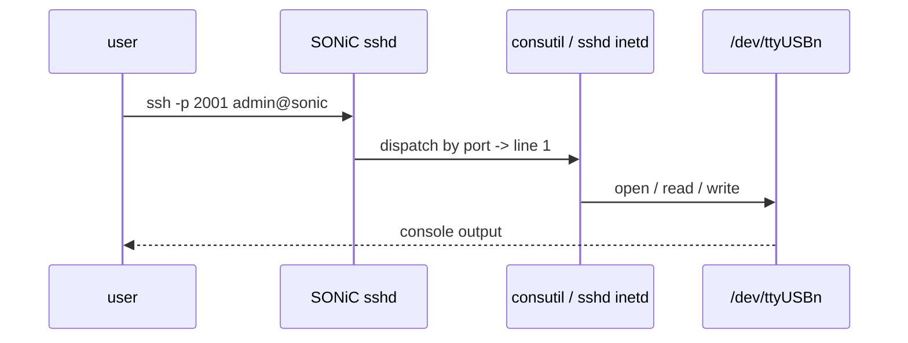

!!! warning "裏取りステータス: HLD-only / 古い HLD"
    本 HLD は 2020-12 Rev 1.1。`consoled` / `consutil` の現行 master 取り込み、CONSOLE_PORT の TTY device mapping、reverse SSH の port/IP forwarding ルールは未確認。`priority=medium`。

# Console Switch（serial hub の reverse SSH 集約）

## 概要

SONiC スイッチを「**network 機器を console（serial）経由で管理する集約ホスト**」として使うための機能[^1]。serial hub やオンボードの USB → serial アダプタを通じて多数の network device の console を接続し、SSH で SONiC スイッチに入った user が `consutil` で各 console line に入る運用を想定する。

特徴:

- **reverse SSH**: `ssh -p <line-port> <sonic-mgmt-ip>` で直接 line に接続できる
- **port-based forwarding** と **IP-based forwarding** の 2 方式
- 各 line ごとに baudrate / flow control / remote device name / management IP を CONFIG_DB に persist
- Active session は **1 line に 1 つ**[^1]

## 動作仕様

### 全体像

```mermaid
flowchart LR
    OPER[oper SSH] --> SONIC[SONiC switch]
    SONIC --> SHUB[Serial hub / on-board UART\n(USB / PCIe)]
    SHUB --> LINES[各 console line]
    LINES --> DUT1[network device 1 (console)]
    LINES --> DUT2[network device 2 (console)]
    SONIC -->|reverse SSH\nport-based / IP-based| OPER
```

### CONFIG_DB

```
CONSOLE_SWITCH:
  console_mgmt = enabled | disabled

CONSOLE_PORT|<line>:
  baud_rate    = <int>             # 例: 9600, 115200
  flow_control = enabled | disabled
  remote_device = <name>           # 識別用
  mgmt_ip      = <ip>              # IP-based forwarding 用
```

### STATE_DB

```
CONSOLE_PORT|<line>:
  state           # idle | busy
  current_session # 現在誰が使っているか
  start_time
```

### Underlying TTY device mapping

vendor / serial hub ドライバ依存で `/dev/ttyXXX` の番号と line number の対応が変わる。HLD は **mapping 定義 sample** を別表で示す[^1]:

```
line 1  -> /dev/ttyUSB0
line 2  -> /dev/ttyUSB1
...
```

### CLI（consutil）

| Command | 用途 |
|---------|------|
| `consutil show` | line の使用状況一覧 |
| `consutil show <line>` | 特定 line |
| `consutil clear <line>` | session 強制切断 |
| `consutil connect <line>` | 当該 line に接続（local 操作） |
| `consutil sync` | STATE_DB と実 TTY 状態の整合 |
| `config console add <line> --baud 9600 --flow-control enabled --device <name>` | line config 追加 |
| `config console del <line>` | line 削除 |
| `config console enable / disable` | global ON/OFF |
| `show line` | 高レベル view |

### Reverse SSH

3 方式[^1]:

1. **Basic Usage**: `consutil connect <line>` を SSH 経由で叩く
2. **Port-based forwarding**: SONiC mgmt IP の port `2000+line` 等で直接 line にマッピング
3. **IP-based forwarding**: 各 line に専用 IP（CONFIG_DB の `mgmt_ip`）を割り当て、SSH の `-p 22` で直接



### 制約

- **active session は line ごと 1**[^1]
- 設定は console line にのみ可能（network port には適用されない）
- USB serial の挿し直しで `/dev/ttyUSBn` の番号が変動するため mapping は固定が望ましい

## 設定

### 設定例

```bash
config console add 1 --baud 9600 --flow-control enabled --device router-A
config console add 2 --baud 115200 --device switch-B
config console enable
ssh -p 2001 admin@sonic-switch  # line 1 へ reverse SSH
```

## 制限事項

- console line のみ設定可（network port は対象外）[^1]
- 1 line / 1 active session
- TTY device 番号の安定化は外部運用で確保
- warm boot で TTY デバイスが再 enumeration されると active session は切れる

## 干渉する機能

- **AAA / RADIUS / TACACS+**: console session も RADIUS 認証可能か（PAM `login` 経由扱い）
- **reverse SSH の port range**: 既存 SSH (22) と衝突しないようにする
- **mgmt VRF**: line 用 management IP を mgmt VRF に置く運用が多い

## トラブルシューティング

- session が肌触りで切れない → `consutil clear <line>` で強制クリア。`consutil sync` で STATE_DB を実状態に揃える
- reverse SSH で繋がらない → SONiC sshd の port forwarding 設定、`/dev/ttyXXX` の存在 / 権限を確認

## 引用元

[^1]: `sonic-net/SONiC` `doc/console/SONiC-Console-Switch-High-Level-Design.md` @ `49bab5b5ff0e924f1ea52b3d9db0dfa4191a7c06`

<!-- concerns hint:
- consoled / consutil の現行 master (sonic-buildimage) 取り込み確認
- CONSOLE_SWITCH / CONSOLE_PORT YANG 取り込み確認
- TTY device mapping の現行運用方法（vendor template）確認
- reverse SSH の port-based / IP-based forwarding 実装方法確認
- AAA / PAM 経路で console session が RADIUS / TACACS で認証されるかの実装確認
- USB serial 挿抜時の TTY 番号安定化機構の現行実装確認
-->

## 実装との乖離（裏取りメモ（Verifier batch 29））

per-page queue で既出の通り、HLD 1.1 の中核実装は部分的のみ。再確認した結果:

- `consutil` CLI: `.cache/sonic-sources/sonic-utilities/consutil/{__init__.py,lib.py,main.py}` に存在 → 取り込み済み
- `sonic-console.yang` (CONSOLE_PORT / CONSOLE_SWITCH の YANG): `.cache/sonic-sources/sonic-buildimage/src/sonic-yang-models/yang-models/sonic-console.yang` に存在（revision 2026-02-12 `escape_char` 追加 / 2022-08-22 First Revision）
- `consoled` デーモン本体・`ser2net` 連携・reverse SSH の port/IP forwarding ロジック: `sonic-buildimage` / `sonic-host-services` のいずれにも検出できず

HLD が想定する「serial hub 機能を備えた switch hub としての reverse SSH 集約」までは未統合のため、`discrepancy-found` を維持。
