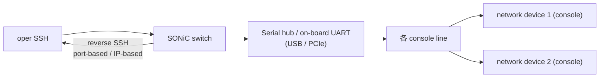
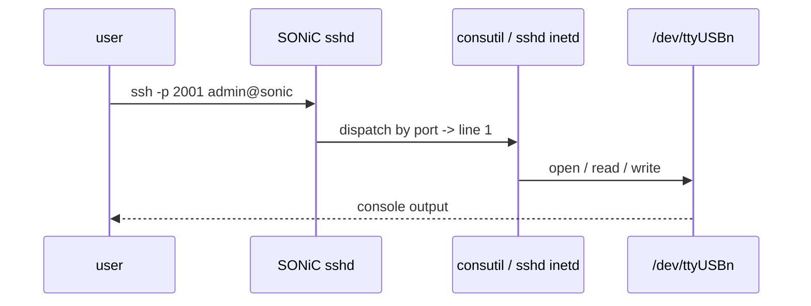

<!-- topics-tip -->
!!! tip "Topics で読み物として読む"
    この HLD は実装詳細を含む。機能の概念・設定・運用を読み物として読みたい場合は [Topics 15 章: Security / AAA](../topics/15-security-aaa/index.md) を参照。
<!-- /topics-tip -->

!!! warning "裏取りステータス: HLD-only / 古い HLD"
    本 HLD は 2020-12 Rev 1.1。`consoled` / `consutil` の現行 master 取り込み、CONSOLE_PORT の TTY device mapping、reverse SSH の port/IP forwarding ルールは未確認。`priority=medium`。

# Console Switch（serial hub の reverse SSH 集約）

## 概要

[SONiC](../reference/glossary.md#term-sonic) スイッチを「**network 機器を console（serial）経由で管理する集約ホスト**」として使うための機能[^1]。serial hub やオンボードの USB → serial アダプタを通じて多数の network device の console を接続し、SSH で SONiC スイッチに入った user が `consutil` で各 console line に入る運用を想定する。

特徴:

- **reverse SSH**: `ssh -p <line-port> <sonic-mgmt-ip>` で直接 line に接続できる
- **port-based forwarding** と **IP-based forwarding** の 2 方式
- 各 line ごとに baudrate / flow control / remote device name / management IP を [CONFIG_DB](../reference/glossary.md#term-config_db) に persist
- Active session は **1 line に 1 つ**[^1]

## 動作仕様

### 全体像



### CONFIG_DB

```text
CONSOLE_SWITCH:
  console_mgmt = enabled | disabled

CONSOLE_PORT|<line>:
  baud_rate    = <int>             # 例: 9600, 115200
  flow_control = enabled | disabled
  remote_device = <name>           # 識別用
  mgmt_ip      = <ip>              # IP-based forwarding 用
```

### STATE_DB

```text
CONSOLE_PORT|<line>:
  state           # idle | busy
  current_session # 現在誰が使っているか
  start_time
```

### Underlying TTY device mapping

vendor / serial hub ドライバ依存で `/dev/ttyXXX` の番号と line number の対応が変わる。[HLD](../reference/glossary.md#term-hld) は **mapping 定義 sample** を別表で示す[^1]:

```text
line 1  -> /dev/ttyUSB0
line 2  -> /dev/ttyUSB1
...
```

### CLI（consutil）

| Command | 用途 |
|---------|------|
| `consutil show` | line の使用状況一覧 |
| `consutil show <line>` | 特定 line |
| `consutil clear <line>` | session 強制切断 |
| `consutil connect <line>` | 当該 line に接続（local 操作） |
| `consutil sync` | [STATE_DB](../reference/glossary.md#term-state_db) と実 TTY 状態の整合 |
| `config console add <line> --baud 9600 --flow-control enabled --device <name>` | line config 追加 |
| `config console del <line>` | line 削除 |
| `config console enable / disable` | global ON/OFF |
| `show line` | 高レベル view |

### Reverse SSH

3 方式[^1]:

1. **Basic Usage**: `consutil connect <line>` を SSH 経由で叩く
2. **Port-based forwarding**: SONiC mgmt IP の port `2000+line` 等で直接 line にマッピング
3. **IP-based forwarding**: 各 line に専用 IP（CONFIG_DB の `mgmt_ip`）を割り当て、SSH の `-p 22` で直接



### 制約

- **active session は line ごと 1**[^1]
- 設定は console line にのみ可能（network port には適用されない）
- USB serial の挿し直しで `/dev/ttyUSBn` の番号が変動するため mapping は固定が望ましい

## 設定

### 設定例

```bash
config console add 1 --baud 9600 --flow-control enabled --device router-A
config console add 2 --baud 115200 --device switch-B
config console enable
ssh -p 2001 admin@sonic-switch  # line 1 へ reverse SSH
```

## 制限事項

- console line のみ設定可（network port は対象外）[^1]
- 1 line / 1 active session
- TTY device 番号の安定化は外部運用で確保
- warm boot で TTY デバイスが再 enumeration されると active session は切れる

## 干渉する機能

- **[AAA](../reference/glossary.md#term-aaa) / [RADIUS](../reference/glossary.md#term-radius) / TACACS+**: console session も RADIUS 認証可能か（PAM `login` 経由扱い）
- **reverse SSH の port range**: 既存 SSH (22) と衝突しないようにする
- **mgmt [VRF](../reference/glossary.md#term-vrf)**: line 用 management IP を mgmt VRF に置く運用が多い

## トラブルシューティング

- session がなかなか切れない → `consutil clear <line>` で強制クリア。`consutil sync` で STATE_DB を実状態に揃える
- reverse SSH で繋がらない → SONiC sshd の port forwarding 設定、`/dev/ttyXXX` の存在 / 権限を確認

<!-- phase-boundary -->

確認コマンド例:

```bash
# Console / serial 設定確認
show line
redis-cli -n 4 hgetall 'CONSOLE_PORT|1'
ls -l /dev/ttyUSB* /dev/ttyS*
```

## 実装フェーズ境界

!!! info "Phase 別の実装済 / 未実装 サマリ"
    本ページは `monitor: partially_implemented` で、HLD で示された一連の機能
    が **段階的に取り込まれている** 状態を扱う。フェーズ毎の実装境界を
    1 枚の表に集約する (詳細は本ページ上部の `diff` admonition および
    [discrepancy-index](../reference/verification/discrepancy-index.md) を参照)。

    | Phase | 範囲 (機能 / 段階) | 実装済 (master 取り込み済) | 未実装 (HLD 提案のみ) |
    |---|---|---|---|
    | Phase 1 — 基本機能 | HLD §概要 / §設計の中核ユースケース | 取り込み済 — 本ページの「実装の概観」「実装詳細」節および `diff` admonition の現状側を参照 | — (Phase 1 は実装済) |
    | Phase 2 — 拡張機能 | HLD §拡張 / §追加要件 / §周辺統合 | 一部のみ取り込み済 — 本ページ「実装詳細」の補足参照 | 未実装 / 未マージ — HLD §未対応箇所、本ページ「制限事項」および `diff` admonition の差分側に列挙 |
    | Phase 3 — 将来拡張 | HLD §Future Work / §将来課題 | — | 未実装 — HLD 提案段階。対応 PR は確認されていない (last_verified 時点) |

    凡例: 「実装済」=現行 master で動作確認できる範囲 / 「未実装」=HLD には記載があるが対応 PR が未マージまたは設計のみで code が存在しない範囲。
<!-- /phase-boundary -->

## 実装との乖離

`monitor: partially_implemented` — 部分実装 — HLD の中核は実装済みだが、フィールド / API / 制約のいくつかが上流に未取り込み、または挙動が緩和されている。 本ページ末尾近くの `!!! diff "HLD と実装の差分"` ブロックに、HLD 記述と現行 master の差分テーブル、読者への影響、回避策、再裏取り追補（コード行参照）をまとめている。本セクションはその概要見出しであり、詳細はそのブロックを参照のこと。

## 引用元

[^1]: `sonic-net/SONiC` `doc/console/SONiC-Console-Switch-High-Level-Design.md` @ `49bab5b5ff0e924f1ea52b3d9db0dfa4191a7c06`

<!-- concerns hint:
- consoled / consutil の現行 master (sonic-buildimage) 取り込み確認
- CONSOLE_SWITCH / CONSOLE_PORT YANG 取り込み確認
- TTY device mapping の現行運用方法（vendor template）確認
- reverse SSH の port-based / IP-based forwarding 実装方法確認
- AAA / PAM 経路で console session が RADIUS / TACACS で認証されるかの実装確認
- USB serial 挿抜時の TTY 番号安定化機構の現行実装確認
-->

<!-- diff-admonition -->
!!! diff "HLD と実装の差分"
    per-page queue で既出の通り、HLD 1.1 の中核実装は部分的のみ。再確認した結果:

    - `consutil` CLI: `.cache/sonic-sources/sonic-utilities/consutil/{__init__.py,lib.py,main.py}` に存在 → 取り込み済み
    - `sonic-console.yang` (CONSOLE_PORT / CONSOLE_SWITCH の [YANG](../reference/glossary.md#term-yang)): `.cache/sonic-sources/sonic-buildimage/src/sonic-yang-models/yang-models/sonic-console.yang` に存在（revision 2026-02-12 `escape_char` 追加 / 2022-08-22 First Revision）
    - `consoled` デーモン本体・`ser2net` 連携・reverse SSH の port/IP forwarding ロジック: `sonic-buildimage` / `sonic-host-services` のいずれにも検出できず

    HLD が想定する「serial hub 機能を備えた switch hub としての reverse SSH 集約」までは未統合のため、`discrepancy-found` を維持。

    #### 関連 GitHub Issue / PR

    - [GitHub Issue / PR の関連リンクは未確認] — Console Switch（serial hub の reverse SSH 集約）構成は専用 platform / image 設定の積み重ねで実現されており、HLD 単独で追跡可能な GitHub Issue / PR は確認できず。
<!-- /diff-admonition -->

<!-- next-action -->
## このページを読んだ後の次アクション

!!! tip "読み手向け"
    - **本機能を実運用で使う場合**: 取り込み済の部分のみ運用可能。欠落部分の利用は不可なので本文「実装との乖離」を確認した上で適用範囲を限定する
    - **upstream 動向を追う場合**: 関連 issue / PR を [sonic-net/SONiC](https://github.com/sonic-net/SONiC) で検索（HLD タイトル / CONFIG_DB テーブル名 / Orch クラス名で grep するのが速い）
    - **代替手段 / 関連 reference**:
        - [CONFIG_DB: CONSOLE_PORT](../reference/config-db/console-port.md)

!!! note "本ドキュメントの追跡"
    - monitor: `partially_implemented` / last_verified: `2026-05-11`
    - 次回再裏取りトリガ: quarterly。一覧は [discrepancy-index](../reference/verification/discrepancy-index.md) を参照（運用詳細は repo の `meta/discrepancy-operations.md`）

<!-- /next-action -->

<!-- topics-back-ref -->
## 関連 Topics

- [Topics: Lab / Virtual SONiC / Developer Entry](../topics/21-lab-vs-developer/index.md)

<!-- /topics-back-ref -->

<!-- ops-entry -->
## 運用入口

この HLD に対応する運用面の入口（CLI / CONFIG_DB / YANG / Runbook）を以下にまとめる。

### 関連 CLI

- `config console`
- `show line`
- `clear line`
- `consutil`

### 関連 CONFIG_DB

- `CONSOLE_SWITCH`
- [CONSOLE_PORT](../reference/config-db/console-port.md)

### 関連 YANG

- `sonic-console`

<!-- /ops-entry -->

<!-- glossary-links-injected: c4cccaa7fc71 -->
