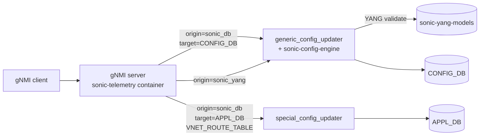

!!! warning "裏取りステータス: HLD-only / 古い HLD"
    HLD は 2022 年 5 月版 (Rev 0.1) で 4 年経過、Status=Initial。`sonic-gnmi` (旧 `sonic-telemetry`) における Set/Get RPC、Generic Config Updater 連携、host service (dbus 経由 `config apply-patch` / `config reload`)、`origin: sonic_db` / `sonic_yang` の分岐実装、heartbeat / reset status 公開は未裏取り。

# SONiC gNMI Server インタフェース設計（`CONFIG_DB` / SONiC YANG / Generic Config Updater 連携）

## 概要

`sonic-restapi` は case-by-case API で汎用性に欠け、`sonic-telemetry` は読み取り (gRPC) のみだった。本 HLD は `sonic-telemetry` 同コンテナ内に **gNMI server の Set/Get/Capabilities RPC** を実装し、CONFIG_DB / APPL_DB / StateDB / CountersDB を **SONiC DB schema または SONiC YANG schema** で読み書き可能にする。`sonic-restapi` は将来 gNMI に置き換える計画[^1]。

## 動作仕様

### Phase 1 / Phase 2 要件[^1]

**Phase 1**:
- Set / Get / Capabilities RPC
- 増分・全更新双方を Set でサポート
- 入力スキーマ: SONiC YANG または CONFIG_DB schema
- DB read: APPL/CONFIG/STATE/COUNTERS、DB write: APPL/CONFIG
- CONFIG_DB schema 入力でも **YANG 検証必須**
- VNET route の高速大量投入（APPL_DB）
- multi-ASIC、bulk 操作、TLS 相互認証

**Phase 2**: TACACS+ 認可、gNOI 経由のアップグレード。

### gNMI path の origin と target

origin で **どのスキーマか**、path 第 1 要素で **どの DB か**、第 2 要素で **どのインスタンスか** を表す[^1]:

| 要素 | 値 |
|------|----|
| `origin` | `sonic_db`（既定）/ `sonic_yang` |
| `elem[0]` | `CONFIG_DB` / `APPL_DB` / `STATE_DB` / `COUNTERS_DB` |
| `elem[1]` | `localhost` / `asic0`,`asic1`,... / `dpu0`,... |
| `elem[2..]` | DB schema ならテーブル名・キー、YANG なら `sonic-<feat>:<...>` |

1 リクエスト中で **YANG path と DB path を混在不可**[^1]。

### Stage 1 / Stage 2 のスキーマ展開



Stage 1 では **SONiC DB schema のみ** を実装し、Stage 2 で SONiC YANG path を追加する[^1]。

### トランザクションとロック

- 1 SetRequest = 1 トランザクション。並列 Set 不可。**single worker** がキューから処理する[^1]
- 操作順序: gNMI 仕様通り `delete` → `replace` → `update`
- Set 開始時に running config の **checkpoint** を取り、書込中の Get はその checkpoint を返す
- CONFIG_DB のロールバックは `generic_config_updater` の rollback を使う。**APPL_DB はロールバック非対応**で、VNET route が例外。クライアント側で逆操作で補う[^1]

### SetRequest → JsonPatch 変換

`generic_config_updater` の `apply-patch` API は JsonPatch を取る。gNMI の `delete` / `update` / `replace` を JsonPatch に翻訳する[^1]:

| gNMI | 説明 | JsonPatch |
|------|------|-----------|
| `Delete` | path を削除 | `remove` |
| `Update` | 値があれば create or update | `add` |
| `Replace`（値なし & default なし） | path を削除 | `remove` |
| `Replace`（値あり） | create or update | `add` |

例:
```text
replace { path: .../DEVICE_NEIGHBOR/Ethernet96 }
replace { path: .../DEVICE_NEIGHBOR/Ethernet8/port  val: "eth1" }

→ JsonPatch:
[{"op":"remove", "path":"/DEVICE_NEIGHBOR/Ethernet96"},
 {"op":"add",    "path":"/DEVICE_NEIGHBOR/Ethernet8/port", "value":"eth1"}]
```

### 全更新

ルート (`elem: CONFIG_DB / localhost`) に対する **`delete` + `update`** の組合せで全置換。`sonic-config-engine` を使う。後続の全更新 / 増分更新で上書きされる[^1]:

```text
delete { path: CONFIG_DB/localhost }
update { path: CONFIG_DB/localhost  val: <full json> }
```

### 永続化

CONFIG_DB の Set 成功は `/etc/sonic/config_db.json` に保存される。APPL_DB は永続化されない（リブート後 client が再投入）[^1]。

### Heartbeat / reprogram

クライアントは **Capabilities RPC を heartbeat** として使い、応答に含まれる **reset status** を見てフルリブートを検知し、APPL_DB を再投入する。gNMI コンテナ単独再起動なら再投入不要[^1]。

### 認証

`sonic-telemetry` の 3 方式を踏襲[^1]:

- **Password**: gRPC metadata で user/pass
- **JWT**: 認証後トークンを metadata
- **Client cert**: TLS 検証 + CN を username に

### Container ↔ Host 連携

`config apply-patch` と `config reload` は host で動かす設計のため、コンテナ内で `systemctl` 直接呼び出しは危険。**host service を dbus 経由で呼ぶ** 方式を採る[^1]。`config reload` 系は gNMI と gNOI を組み合わせる別経路も検討対象。

### Data protection（APPL_DB）

APPL_DB は YANG が無い旧テーブルが多い。新規 YANG が無いテーブルへの set は拒否、`config false` の path も拒否する方針[^1]。

## 関連 CLI

| Command | 用途 |
|---------|------|
| `config apply-patch <file>` | JsonPatch 増分適用（generic_config_updater） |
| `config reload [<file>]` | 全置換 |

## 制限事項

- 並列 Set 不可（serialize）
- APPL_DB rollback 無し（VNET route のみ）
- JSON value mixed schema（YANG path と DB path）禁止
- TLS 相互認証必須

## 干渉する機能

- **generic_config_updater**: gNMI 増分 Set の中核
- **sonic-config-engine**: 全更新の中核
- **sonic-restapi**: gNMI が完成したら廃止予定
- **TACACS+**: Phase 2 で AAA 連携

## 引用元

[^1]: [sonic-net/SONiC doc/mgmt/gnmi/SONiC_GNMI_Server_Interface_Design.md @ 49bab5b](https://github.com/sonic-net/SONiC/blob/49bab5b5ff0e924f1ea52b3d9db0dfa4191a7c06/doc/mgmt/gnmi/SONiC_GNMI_Server_Interface_Design.md)
