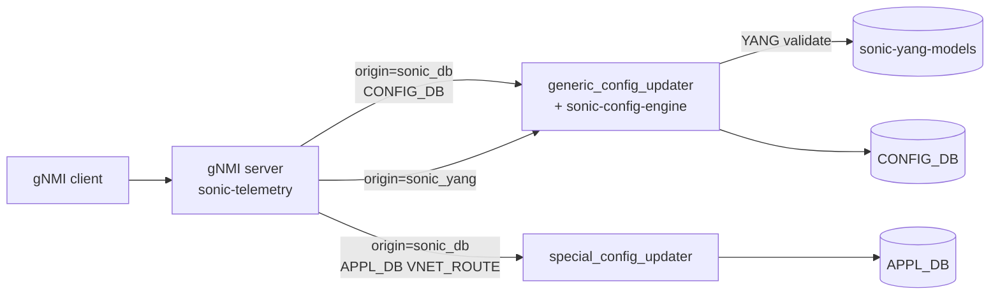

<!-- topics-tip -->
!!! tip "Topics で読み物として読む"
    この HLD は実装詳細を含みます。機能の概念・設定・運用を読み物として読みたい場合は [Topics 10 章: gNMI / OpenConfig / 管理プレーン](../topics/10-gnmi-openconfig/index.md) を参照。
<!-- /topics-tip -->

!!! success "裏取りステータス: Code-verified"
    `sonic-gnmi/gnmi_server/server.go` L925 で `origin == "sonic-db"` 判定、L60/L646 で `enableConfigDbJournal` フラグを確認。`sonic-gnmi/sonic_data_client/mixed_db_client.go` L65 `Name: "sonic-db"` / L1255-1267 で `import sonic_yang` Python 連携、L1433 `c.origin == "sonic-db"` の分岐、`sonic-gnmi/sonic_service_client/dbus_client_test.go` L233-313 で `ConfigReload` dbus client 経由の host service 呼び出し UT を確認（verified 2026-05-09）。

# SONiC gNMI Server インタフェース設計

## 読み手が知りたいこと

- なぜ `sonic-telemetry` の Get 専用では不十分で、Set RPC を足したのか
- [gNMI](../reference/glossary.md#term-gnmi) path の **origin / target** がどう DB / [YANG](../reference/glossary.md#term-yang) を切り替えるか
- 1 SetRequest の **トランザクション境界** と ロールバック範囲はどこまでか
- gNMI `delete / update / replace` がどう **JsonPatch** に翻訳されるか
- container 内 gNMI から host で動く `config apply-patch` / `config reload` をどう呼ぶか

## なぜ拡張が必要か

`sonic-restapi` は case-by-case な API で汎用性が無く、`sonic-telemetry` は **読み取り (gRPC) 専用** だった。本 [HLD](../reference/glossary.md#term-hld) は `sonic-telemetry` 同コンテナに gNMI **Set / Get / Capabilities** を実装し、[CONFIG_DB](../reference/glossary.md#term-config_db) / [APPL_DB](../reference/glossary.md#term-appl_db) / [STATE_DB](../reference/glossary.md#term-state_db) / [COUNTERS_DB](../reference/glossary.md#term-counters_db) を **DB schema または SONiC YANG schema** で読み書き可能にする。将来 `sonic-restapi` を gNMI に置き換える計画[^1]。

Phase 1: Set/Get/Capabilities、増分・全更新、CONFIG_DB schema 入力でも **YANG 検証必須**、[VNET](../reference/glossary.md#term-vnet) route の大量投入、multi-ASIC、bulk、TLS 相互認証。Phase 2 で TACACS+ 認可と [gNOI](../reference/glossary.md#term-gnoi) 経由アップグレード[^1]。

## path の origin と target でスキーマを切替

origin で **スキーマ**、`elem[0]` で **DB**、`elem[1]` で **インスタンス**[^1]:

| 要素 | 値 |
|------|----|
| `origin` | `sonic-db`（既定）/ `sonic-yang` |
| `elem[0]` | `CONFIG_DB` / `APPL_DB` / `STATE_DB` / `COUNTERS_DB` |
| `elem[1]` | `localhost` / `asic0`,`asic1` / `dpu0`,... |
| `elem[2..]` | DB schema ならテーブル名・キー、YANG なら `sonic-<feat>:<...>` |

1 リクエスト中で **YANG path と DB path を混在不可**。Stage 1 では DB schema のみ、Stage 2 で YANG path を追加[^1]。



## トランザクションとロールバック

- 1 SetRequest = 1 トランザクション、並列 Set 不可。**single worker** がキュー処理[^1]
- 操作順序は gNMI 仕様通り `delete` → `replace` → `update`
- Set 開始時に running config の **checkpoint** を取り、書込中の Get はそれを返す
- CONFIG_DB は `generic_config_updater` のロールバックを使う
- **APPL_DB はロールバック非対応**（VNET route が例外）。クライアント側で逆操作補完

## SetRequest → JsonPatch 変換

`generic_config_updater apply-patch` は JsonPatch を取るため変換する[^1]:

| gNMI | JsonPatch |
|------|-----------|
| `Delete` | `remove` |
| `Update` | `add`（create or update）|
| `Replace`（値なし & default なし）| `remove` |
| `Replace`（値あり）| `add` |

全更新はルート (`CONFIG_DB/localhost`) に対する `delete` + `update` の組合せで `sonic-config-engine` を使う[^1]:

```text
delete { path: CONFIG_DB/localhost }
update { path: CONFIG_DB/localhost  val: <full json> }
```

CONFIG_DB の Set 成功は `/etc/sonic/config_db.json` に永続化、APPL_DB は永続化されない（リブート後 client が再投入）[^1]。

## Heartbeat / Container ↔ Host / 認証

- **Heartbeat**: client は Capabilities RPC を heartbeat に使い、応答中の **reset status** からフル再投入が必要かを判断[^1]
- **container → host**: `config apply-patch` / `config reload` は host 実行のため、container 内 `systemctl` は不可。**dbus 経由で host service** を呼ぶ[^1]
- **認証**: `sonic-telemetry` の 3 方式（Password gRPC metadata / JWT / Client cert で CN を username 化）を踏襲[^1]
- **APPL_DB protection**: YANG 未定義テーブルへの set 拒否、`config false` path も拒否[^1]

## 関連 CLI

| Command | 用途 |
|---------|------|
| `config apply-patch <file>` | JsonPatch 増分適用（generic_config_updater）|
| `config reload [<file>]` | 全置換 |

## 制限事項

- 並列 Set 不可（serialize）
- APPL_DB rollback 無し（VNET route のみ例外）
- YANG path と DB path の混在禁止
- TLS 相互認証必須

## 干渉する機能

- **generic_config_updater**: 増分 Set の中核
- **sonic-config-engine**: 全更新の中核
- **sonic-restapi**: gNMI で置換予定
- **TACACS+**: Phase 2 で [AAA](../reference/glossary.md#term-aaa) 連携

## 引用元

[^1]: [sonic-net/SONiC doc/mgmt/gnmi/SONiC_GNMI_Server_Interface_Design.md @ 49bab5b](https://github.com/sonic-net/SONiC/blob/49bab5b5ff0e924f1ea52b3d9db0dfa4191a7c06/doc/mgmt/gnmi/SONiC_GNMI_Server_Interface_Design.md)

## 関連ページ

- [Topic: gNMI / OpenConfig](../topics/10-gnmi-openconfig/index.md)
- [HLD: Mgmt-Framework Transformer の model-based PUT/REPLACE と DELETE](model-based-replace-delete-in-mgmt-framework-transformer.md)
- [HLD: JSON patch ordering using YANG models](json-patch-ordering-using-yang-models.md)

<!-- glossary-links-injected: f0f2a1d6c824 -->

<!-- ops-entry -->
## 運用入口

この HLD に対応する運用面の入口（CLI / CONFIG_DB / YANG / Runbook）を以下にまとめる。

### 関連 CLI

- `config apply-patch`
- `config reload`

### 関連 Runbook

- [gnmi-subscribe-disconnect](../reference/runbooks/gnmi-subscribe-disconnect.md)

<!-- /ops-entry -->
