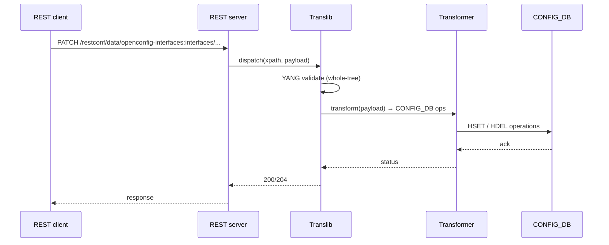

!!! warning "裏取りステータス: HLD-only / 大規模 HLD"
    HLD は 170KB 超の包括設計書。ここでは **architecturally distinctive な要素**（北/南境界の責務分担と Translib / Transformer の役割）に絞る。各 transformer・URL マッピング・openconfig モジュール対応など詳細は HLD `doc/mgmt/Management Framework.md` を参照。

# SONiC Management Framework（REST / gNMI / Translib / Transformer）

## 概要

`sonic-mgmt-framework` は外部 API（REST / gNMI / CLI）と内部 CONFIG_DB / 各種 daemon 間の **モデル翻訳層** を担う[^1]。中核は次の 4 つ:

- **北側 API server**: REST (OpenAPI)、gNMI（gRPC）、CLI（KLISH）からの要求を受ける
- **Translib**: YANG モデル（openconfig / IETF / sonic-*）と内部表現の間の汎用変換ライブラリ
- **Transformer**: モデル間（openconfig YANG ↔ sonic YANG / CONFIG_DB）の写像を per-module に実装
- **App-DB Layer**: CONFIG_DB / APPL_DB / STATE_DB へ Redis 経由で読み書き

## 動作仕様

```mermaid
flowchart LR
    REST[REST client\n(OpenAPI)] --> RS[REST server]
    GNMI[gNMI client] --> GS[gNMI server\n(telemetry)]
    KLISH[CLI / KLISH] --> CLI[clish/klish]

    RS --> TL[Translib]
    GS --> TL
    CLI --> TL

    TL -->|model based| TF[Transformer<br>(per-module)]
    TF --> CDB[(CONFIG_DB)]
    TF --> ADB[(APPL_DB / STATE_DB)]
    TF --> RPC[per-feature RPC<br>(openconfig actions)]
```

主要ポイント[^1]:

- **YANG が真実源**: openconfig / IETF / sonic-* YANG 全体を `sonic-yang-mgmt` がパースし、URL / xpath マッピングと validation を提供
- **Transformer は二種**: app-specific（openconfig ↔ sonic）と sonic-yang only（schema-driven）
- **gNMI subscription**: STATE_DB の更新を SAMPLE / ON_CHANGE で stream（別ページ「gNMI Subscription for YANG Data」を参照）
- **mgmt-framework container**: REST / Translib / Transformer / KLISH を 1 コンテナに同居させる構成
- **認証/認可**: TLS + client cert、TACACS+/RADIUS/LDAP は AAA 改善 HLD に従う

## 主要なフロー



## 設定 / 関連

このページは横断機能のため CONFIG_DB の特定テーブルには紐づかない。openconfig 各モジュール（interfaces / acl / network-instance / system 等）と sonic-* YANG が網羅対象。

### 関連 CLI

- KLISH ベースの CLI は別 docker `mgmt-framework` 内で動く（インタラクティブ shell）
- `sudo sonic-cli` で KLISH に入る系統と、従来 `sonic-utilities`（click ベース）の系統は **共存** する設計

## 制限事項

- **YANG モデルが定義されていない機能は API 化できない**: 機能側で sonic-* YANG を追加する必要がある
- **transformer は per-module 実装**: openconfig 側の新モジュール対応は手作業のコストが高い
- **ロールバック / 部分失敗**: GCU / JSON Patch ordering の HLD（同 architecture area）と組み合わせて初めて transactional になる
- **大規模 GET の性能**: tree 全体取得はオブジェクト変換コストが高く、`fields=` 限定や paginate 推奨

## 干渉する機能

- **gNMI Subscription**: telemetry stream は同じ Translib を介する。本 HLD と並読み推奨
- **Generic Config Update / Rollback (GCU)**: REST / gNMI Set のバックエンドとして動く可能性
- **AAA improvements**: REST / gNMI の認証は AAA HLD に統合される
- **KLISH CLI auto-generation**: KLISH コマンド定義の自動生成（同 area の別 HLD）と密に関係

## トラブルシューティング

- 404 が返る → URL の YANG モジュール prefix（openconfig-interfaces:）と xpath を確認
- 400 / validation 失敗 → mgmt-framework ログで YANG エラー詳細を確認
- gNMI subscription が来ない → STATE_DB へ更新が出ているか、subscription path が schema 上 valid か

## 引用元

[^1]: `sonic-net/SONiC` `doc/mgmt/Management Framework.md` @ `49bab5b5ff0e924f1ea52b3d9db0dfa4191a7c06`

<!-- concerns hint:
- sonic-mgmt-framework / sonic-mgmt-common の現行 master 取り込み確認
- Translib / Transformer のモジュール一覧（openconfig 各モジュールへの対応範囲）確認
- KLISH CLI と従来 sonic-utilities CLI の共存方針の現行実装確認
- REST / gNMI 認証（cert + TACACS+ / RADIUS / LDAP）の現行統合状態確認
- HLD は 170KB の包括設計書のため章ごとに別ページ化の検討（telemetry / openconfig 別 HLD と整理）
- GCU / JSON Patch ordering との transactional 統合確認
-->
