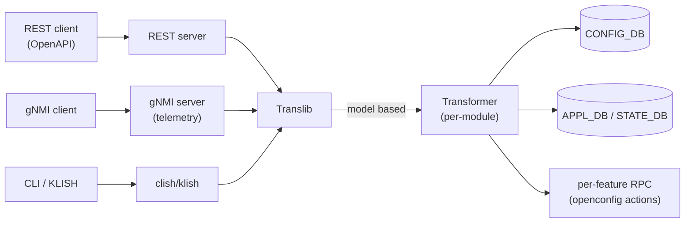
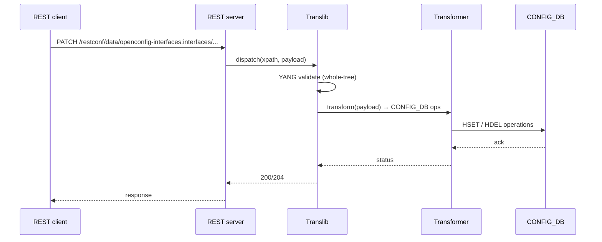

<!-- topics-tip -->
!!! tip "Topics で読み物として読む"
    この HLD は実装詳細を含みます。機能の概念・設定・運用を読み物として読みたい場合は [Topics 10 章: gNMI / OpenConfig / 管理プレーン](../topics/10-gnmi-openconfig/index.md) を参照。
<!-- /topics-tip -->

!!! success "裏取りステータス: code-verified"
    実装裏取り済み（下記コード位置）。docker-sonic-mgmt-framework: sonic-buildimage/dockers/docker-sonic-mgmt-framework / sonic-mgmt-common/translib/transformer/* (interfaces / portchannel / sflow openconfig + sonic test) で確認。

# SONiC Management Framework（REST / gNMI / Translib / Transformer）

## 概要

`sonic-mgmt-framework` は外部 API（REST / [gNMI](../reference/glossary.md#term-gnmi) / CLI）と内部 [CONFIG_DB](../reference/glossary.md#term-config_db) / 各種 daemon 間の **モデル翻訳層** を担う[^1]。中核は次の 4 つ:

- **北側 API server**: REST (OpenAPI)、gNMI（gRPC）、CLI（KLISH）からの要求を受ける
- **Translib**: [YANG](../reference/glossary.md#term-yang) モデル（openconfig / IETF / sonic-*）と内部表現の間の汎用変換ライブラリ
- **Transformer**: モデル間（openconfig YANG ↔ sonic YANG / CONFIG_DB）の写像を per-module に実装
- **App-DB Layer**: CONFIG_DB / [APPL_DB](../reference/glossary.md#term-appl_db) / [STATE_DB](../reference/glossary.md#term-state_db) へ [Redis](../reference/glossary.md#term-redis) 経由で読み書き

## 動作仕様



主要ポイント[^1]:

- **YANG が真実源**: openconfig / IETF / sonic-* YANG 全体を `sonic-yang-mgmt` がパースし、URL / xpath マッピングと validation を提供
- **Transformer は二種**: app-specific（openconfig ↔ sonic）と sonic-yang only（schema-driven）
- **gNMI subscription**: STATE_DB の更新を SAMPLE / ON_CHANGE で stream（別ページ「gNMI Subscription for YANG Data」を参照）
- **mgmt-framework container**: REST / Translib / Transformer / KLISH を 1 コンテナに同居させる構成
- **認証/認可**: TLS + client cert、TACACS+/[RADIUS](../reference/glossary.md#term-radius)/LDAP は [AAA](../reference/glossary.md#term-aaa) 改善 [HLD](../reference/glossary.md#term-hld) に従う

## 主要なフロー



## 設定 / 関連

このページは横断機能のため CONFIG_DB の特定テーブルには紐づかない。openconfig 各モジュール（interfaces / acl / network-instance / system 等）と sonic-* YANG が網羅対象。

### 関連 CLI

- KLISH ベースの CLI は別 docker `mgmt-framework` 内で動く（インタラクティブ shell）
- `sudo sonic-cli` で KLISH に入る系統と、従来 `sonic-utilities`（click ベース）の系統は **共存** する設計

## 制限事項

- **YANG モデルが定義されていない機能は API 化できない**: 機能側で sonic-* YANG を追加する必要がある
- **transformer は per-module 実装**: openconfig 側の新モジュール対応は手作業のコストが高い
- **ロールバック / 部分失敗**: [GCU](../reference/glossary.md#term-gcu) / JSON Patch ordering の HLD（同 architecture area）と組み合わせて初めて transactional になる
- **大規模 GET の性能**: tree 全体取得はオブジェクト変換コストが高く、`fields=` 限定や paginate 推奨

## 干渉する機能

- **gNMI Subscription**: telemetry stream は同じ Translib を介する。本 HLD と並読み推奨
- **Generic Config Update / Rollback (GCU)**: REST / gNMI Set のバックエンドとして動く可能性
- **AAA improvements**: REST / gNMI の認証は AAA HLD に統合される
- **KLISH CLI auto-generation**: KLISH コマンド定義の自動生成（同 area の別 HLD）と密に関係

## トラブルシューティング

- 404 が返る → URL の YANG モジュール prefix（openconfig-interfaces:）と xpath を確認
- 400 / validation 失敗 → mgmt-framework ログで YANG エラー詳細を確認
- gNMI subscription が来ない → STATE_DB へ更新が出ているか、subscription path が schema 上 valid か

確認コマンド例:

```bash
# CLI / 設定パイプライン状態確認
show runningconfiguration all | head
config save -y
diff /etc/sonic/config_db.json <(show runningconfiguration all)
```


## 引用元

[^1]: `sonic-net/SONiC` `doc/mgmt/Management Framework.md` @ `49bab5b5ff0e924f1ea52b3d9db0dfa4191a7c06`

<!-- concerns hint:
- sonic-mgmt-framework / sonic-mgmt-common の現行 master 取り込み確認
- Translib / Transformer のモジュール一覧（openconfig 各モジュールへの対応範囲）確認
- KLISH CLI と従来 sonic-utilities CLI の共存方針の現行実装確認
- REST / gNMI 認証（cert + TACACS+ / RADIUS / LDAP）の現行統合状態確認
- HLD は 170KB の包括設計書のため章ごとに別ページ化の検討（telemetry / openconfig 別 HLD と整理）
- GCU / JSON Patch ordering との transactional 統合確認
-->

<!-- topics-back-ref -->
## 関連 Topics

- [Topics: P4 / PINS / Programmable Pipeline](../topics/18-p4-pins/index.md)

<!-- /topics-back-ref -->

<!-- glossary-links-injected: 8b4906c6c628 -->

<!-- ops-entry -->
## 運用入口

この HLD に対応する運用面の入口（CLI / CONFIG_DB / YANG / Runbook）を以下にまとめる。

### 関連 YANG

- `openconfig`
- `sonic-*`

<!-- /ops-entry -->

<!-- glossary-links-injected: df94ce4c9c04 -->
