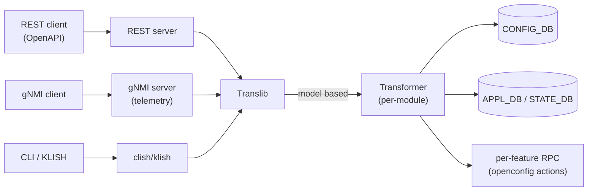
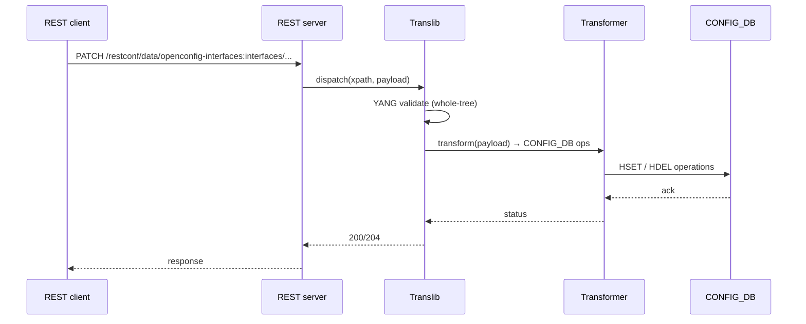

<!-- topics-tip -->
!!! tip "Topics で読み物として読む"
    この HLD は実装詳細を含む。機能の概念・設定・運用を読み物として読みたい場合は [Topics 10 章: gNMI / OpenConfig / 管理プレーン](../topics/10-gnmi-openconfig/index.md) を参照。
<!-- /topics-tip -->

!!! success "裏取りステータス: code-verified"
    実装裏取り済み（下記コード位置）。docker-sonic-mgmt-framework: sonic-buildimage/dockers/docker-sonic-mgmt-framework / sonic-mgmt-common/translib/transformer/* (interfaces / portchannel / sflow openconfig + sonic test) で確認。

# SONiC Management Framework（REST / gNMI / Translib / Transformer）

## 概要

`sonic-mgmt-framework` は外部 API（REST / [gNMI](../reference/glossary.md#term-gnmi) / CLI）と内部 [CONFIG_DB](../reference/glossary.md#term-config_db) / 各種 daemon 間の **モデル翻訳層** を担う[^1]。中核は次の 4 つ:

- **北側 API server**: REST (OpenAPI)、gNMI（gRPC）、CLI（KLISH）からの要求を受ける
- **Translib**: [YANG](../reference/glossary.md#term-yang) モデル（openconfig / IETF / sonic-*）と内部表現の間の汎用変換ライブラリ
- **Transformer**: モデル間（openconfig YANG ↔ sonic YANG / CONFIG_DB）の写像を per-module に実装
- **App-DB Layer**: CONFIG_DB / [APPL_DB](../reference/glossary.md#term-appl_db) / [STATE_DB](../reference/glossary.md#term-state_db) へ [Redis](../reference/glossary.md#term-redis) 経由で読み書き

## 動作仕様



主要ポイント[^1]:

- **YANG が真実源**: openconfig / IETF / sonic-* YANG 全体を `sonic-yang-mgmt` がパースし、URL / xpath マッピングと validation を提供
- **Transformer は二種**: app-specific（openconfig ↔ sonic）と sonic-yang only（schema-driven）
- **gNMI subscription**: STATE_DB の更新を SAMPLE / ON_CHANGE で stream（別ページ「gNMI Subscription for YANG Data」を参照）
- **mgmt-framework container**: REST / Translib / Transformer / KLISH を 1 コンテナに同居させる構成
- **認証/認可**: TLS + client cert、TACACS+/[RADIUS](../reference/glossary.md#term-radius)/LDAP は [AAA](../reference/glossary.md#term-aaa) 改善 [HLD](../reference/glossary.md#term-hld) に従う

## 主要コンポーネントの深掘り

原典 HLD は 2883 行 (170KB) ある包括設計書のため[^1]、本ページでは中心となる Translib / Transformer / Subscribe / CVL の interface とソース位置のみ要点を抜く。各章の詳細は HLD 該当節 (節番号で記載) を参照のこと。

### Translib App Interface（HLD 3.2.2.6）

Translib は北側 (REST / gNMI / CLI) からの xpath 要求を受け取り、`appInterface` を実装する app module に dispatch する。`appInterface` は translate / process 系の対称な対を持つ[^2]:

```go
// translib/app_interface.go L96-L112
type appInterface interface {
    initialize(data appData)
    translateCreate(d *db.DB)  ([]db.WatchKeys, error)
    translateUpdate(d *db.DB)  ([]db.WatchKeys, error)
    translateReplace(d *db.DB) ([]db.WatchKeys, error)
    translateDelete(d *db.DB)  ([]db.WatchKeys, error)
    translateGet(dbs [db.MaxDB]*db.DB) error
    translateAction(dbs [db.MaxDB]*db.DB) error
    translateSubscribe(req translateSubRequest) (translateSubResponse, error)
    processCreate(d *db.DB)  (SetResponse, error)
    processUpdate(d *db.DB)  (SetResponse, error)
    // ... processReplace / processDelete / processGet / processAction / processSubscribe
}
```

App module は `register(path, info)` で初期化時に URL prefix を登録する[^2]。openconfig 系の標準 app は `common_app.go` を経由して Transformer に委譲する設計。

- App registry: `translib/app_interface.go` L115-L133 の `register()`
- 既存 app 例: `acl_app.go` / `lldp_app.go` / `pfm_app.go` / `sys_app.go` / `common_app.go`

### Transformer callback 型（HLD 3.2.2.7）

Transformer は openconfig YANG ↔ sonic YANG / CONFIG_DB の写像を per-module Go callback で表現する[^3]。主要な callback 型:

| 型 | 用途 | source |
|----|----|--------|
| `KeyXfmrYangToDb` / `KeyXfmrDbToYang` | list key 双方向写像 | `xfmr_interface.go` L151-L157 |
| `FieldXfmrYangToDb` / `FieldXfmrDbToYang` | leaf field 値変換 | L163-, L246- |
| `SubTreeXfmrYangToDb` / `SubTreeXfmrDbToYang` | subtree 一括変換 | L175-L181 |
| `TableXfmrFunc` | 動的 Redis table 決定 | L208 |
| `PreXfmrFunc` / `PostXfmrFunc` | CREATE/UPDATE/DELETE 前後フック | L199-, L220- |
| `PathXfmrDbToYangFunc` | DB key→YANG key path 変換 | L226 |

これらは YANG 拡張 (`sonic-extensions`) の annotation で YANG モデルに紐付ける[^3]。詳細は HLD 3.2.2.7.5 (YANG Extensions) と 3.2.2.7.6 (Public Functions) 参照。

### gNMI Subscribe / Stream（HLD 3.2.2.6 + 4.4）

`translib/subscribe.go` の公開 API:

- `Subscribe(req SubscribeRequest) error` — 変更通知 stream (L171)[^4]
- `Stream(req SubscribeRequest) error` — 周期 push (L219)
- `IsSubscribeSupported(req IsSubscribeRequest)` — path ごとに subscribe 可否を返す (L264)

SAMPLE / ON_CHANGE の最小間隔は `apis.SAMPLE_NOTIFICATION_MIN_INTERVAL` に固定[^4] (`subscribe.go` L104-L107)。詳細フロー (gNMI handler → Translib → app `translateSubscribe`) は HLD 4.4 節。

### CVL (Config Validation Library)（HLD 3.2.2.8）

CVL は sonic-* YANG を使った CONFIG_DB 書き込み前 validation を提供する[^5]。主な API は `cvl/cvl_api.go`:

- `Initialize()` / `Finish()` (L123, L178)
- `ValidationSessOpen()` / `ValidationSessClose()` (L182, L202)
- `ValidateConfig(jsonData)` (L272) — startup config 用バルク検証
- `ValidateEditConfig(cfgData)` (L297) — [orchagent](../reference/glossary.md#term-orchagent) 等の差分書き込み検証
- `SortDepTables()` / `GetOrderedTables()` (L750, L767) — leafref 依存解決の topological sort

CVL は構文 (YANG schema) / 意味 (must / when / leafref) / Platform 制約 (静的 + 動的) の三層検証を行う (HLD 3.2.2.8.2)。

## 主要なフロー



## 設定 / 関連

このページは横断機能のため CONFIG_DB の特定テーブルには紐づかない。openconfig 各モジュール（interfaces / acl / network-instance / system 等）と sonic-* YANG が網羅対象。

### 関連 CLI

- KLISH ベースの CLI は別 docker `mgmt-framework` 内で動く（インタラクティブ shell）
- `sudo sonic-cli` で KLISH に入る系統と、従来 `sonic-utilities`（click ベース）の系統は **共存** する設計

## 制限事項

- **YANG モデルが定義されていない機能は API 化できない**: 機能側で sonic-* YANG を追加する必要がある
- **transformer は per-module 実装**: openconfig 側の新モジュール対応は手作業のコストが高い
- **ロールバック / 部分失敗**: [GCU](../reference/glossary.md#term-gcu) / JSON Patch ordering の HLD（同 architecture area）と組み合わせて初めて transactional になる
- **大規模 GET の性能**: tree 全体取得はオブジェクト変換コストが高く、`fields=` 限定や paginate 推奨

## 干渉する機能

- **gNMI Subscription**: telemetry stream は同じ Translib を介する。本 HLD と並読み推奨
- **Generic Config Update / Rollback (GCU)**: REST / gNMI Set のバックエンドとして動く可能性
- **AAA improvements**: REST / gNMI の認証は AAA HLD に統合される
- **KLISH CLI auto-generation**: KLISH コマンド定義の自動生成（同 area の別 HLD）と密に関係

## トラブルシューティング

- 404 が返る → URL の YANG モジュール prefix（openconfig-interfaces:）と xpath を確認
- 400 / validation 失敗 → mgmt-framework ログで YANG エラー詳細を確認
- gNMI subscription が来ない → STATE_DB へ更新が出ているか、subscription path が schema 上 valid か

確認コマンド例:

```bash
# CLI / 設定パイプライン状態確認
show runningconfiguration all | head
config save -y
diff /etc/sonic/config_db.json <(show runningconfiguration all)
```


## 開発者ワークフロー（HLD 5 章への入口）

新機能の API 化フローは標準 YANG ベース / 非標準 (sonic-* YANG only) の二系統に分かれる:

- **非標準 (sonic-* YANG only)**: HLD 5.1 節。sonic-* YANG 定義 → REST stub / Client SDK 自動生成 → Translation App (Go) 実装 → IS CLI / gNMI 配線
- **標準ベース (openconfig / IETF)**: HLD 5.2 節。標準 YANG を選定 → Redis schema 設計 → sonic-* YANG 定義 → Transformer callback 実装 (上記表参照) → IS CLI / gNMI

実装側のテンプレ・既存例は `sonic-mgmt-common/translib/transformer/` 配下 (例: `xfmr_intf.go` / `xfmr_sflow.go` / `xfmr_mclag.go` / `xfmr_system.go`) と `translib/*_app.go` を参照。

## 引用元

[^1]: `sonic-net/SONiC` `doc/mgmt/Management Framework.md` @ `49bab5b5ff0e924f1ea52b3d9db0dfa4191a7c06` (2883 行の包括 HLD)
[^2]: `sonic-net/sonic-mgmt-common` `translib/app_interface.go` L45-L186 @ master (`appInterface` / `register()`)
[^3]: `sonic-net/sonic-mgmt-common` `translib/transformer/xfmr_interface.go` L147-L266 @ master (callback 型定義)
[^4]: `sonic-net/sonic-mgmt-common` `translib/subscribe.go` L37-L270 @ master (`Subscribe` / `Stream` / `IsSubscribeSupported`)
[^5]: `sonic-net/sonic-mgmt-common` `cvl/cvl_api.go` L123-L800 @ master (CVL session / validation API)

<!-- concerns hint:
- sonic-mgmt-framework / sonic-mgmt-common の現行 master 取り込み確認
- Translib / Transformer のモジュール一覧（openconfig 各モジュールへの対応範囲）確認
- KLISH CLI と従来 sonic-utilities CLI の共存方針の現行実装確認
- REST / gNMI 認証（cert + TACACS+ / RADIUS / LDAP）の現行統合状態確認
- HLD は 170KB の包括設計書のため章ごとに別ページ化の検討（telemetry / openconfig 別 HLD と整理）
- GCU / JSON Patch ordering との transactional 統合確認
-->

<!-- topics-back-ref -->
## 関連 Topics

- [Topics: gNMI / OpenConfig / 管理プレーン](../topics/10-gnmi-openconfig/index.md)

<!-- /topics-back-ref -->

<!-- ops-entry -->
## 運用入口

この HLD に対応する運用面の入口（CLI / CONFIG_DB / YANG / Runbook）を以下にまとめる。

### 関連 YANG

- `openconfig`
- `sonic-*`

<!-- /ops-entry -->

<!-- glossary-links-injected: e2892b76fd9a -->
