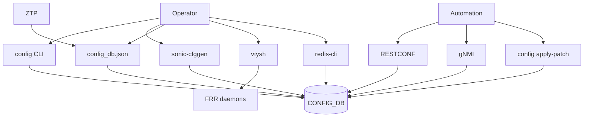
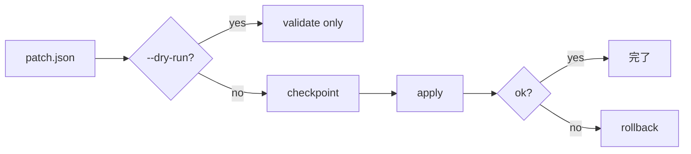

!!! info "裏取りステータス: code-verified / 概観文書"
    `sonic-utilities/config/main.py` で `apply-patch` / `replace` / `rollback` の 3 サブコマンドと `--dry-run` / `--ignore-non-yang-tables` / `--ignore-path` オプションを確認。`generic_config_updater/`、`sonic-buildimage/src/sonic-ztp`、`bgpcfgd` の存在も確認済み。本 HLD は概観文書で各機構の詳細は別 HLD に委ねる。

# SONiC NOS の設定手段一覧

## 読み手が知りたいこと

- SONiC で設定を入れる方法は何種類あり、どう使い分けるか
- 永続化されるのはどれか、再起動で消えるのはどれか
- 自動化／コントローラ統合に使えるのはどれか
- 「触ってはいけない」低レベル手段はどれか

## 入口は 10 種類、収束先は CONFIG_DB

SONiC は CONFIG_DB（Redis db 4）に **複数の入口** を提供し、最終的に `/etc/sonic/config_db.json` で永続化する[^1]。



## どれを使うべきか（比較表）

| 手段 | 永続化 | 検証 | 大規模 | 主用途 |
|------|--------|-----|-------|------|
| `config` CLI | save 後 | あり | × | 手動運用 |
| `show` CLI | - | - | - | 閲覧 |
| `sonic-cfggen` | save 経由 | schema 依存 | △ | スクリプト |
| `config_db.json` 直編集 | reload 後 | 起動時のみ | × | オフライン管理 |
| RESTCONF | 即時 | YANG | ○ | コントローラ |
| gNMI | 即時 | YANG | ◎ | 大規模 + telemetry |
| Ansible / NAPALM | playbook 次第 | playbook | ◎ | IaC |
| ZTP | 初回起動時 | スクリプト次第 | ◎ | 工場出荷 |
| `vtysh` | しない | FRR | × | routing 詳細 |
| `redis-cli` | しない | **無し** | × | デバッグ |
| `config apply-patch` | 即時 | dry-run | ○ | 構造化変更 |

## 各手段の要点

### CLI (`config` / `show`)

`config` は CONFIG_DB に直書き、`config save` で `/etc/sonic/config_db.json` に永続化[^1]:

```bash
config interface ip add Ethernet0 10.0.0.1/24
config save -y
```

`show` は STATE_DB / APPL_DB の閲覧専用。

### `sonic-cfggen`

JSON ↔ Redis のブリッジ。スクリプト/自動化用。入力 JSON は SONiC schema に従う必要があり、不適合だと書き込み時エラー[^1]。

### `config_db.json` 直編集

オフライン編集の元締め。全設定を 1 ファイルで Git 管理可能。構文エラーで起動不能リスクあり[^1]。

### RESTCONF / gNMI

YANG モデルに基づく標準 API。RESTCONF は OpenConfig 対応でマルチベンダ向け、gNMI は gRPC ベースで telemetry streaming もサポート。**明示的に有効化 + 認証設定** が必須[^1]。

### Ansible / NAPALM

宣言的に interface / BGP / VLAN / ACL を管理。CI/CD パイプライン統合に向く[^1]。

### ZTP

工場出荷後の初回 boot で DHCP option 67 または USB から設定スクリプトを取得し自動適用。ログは `/var/log/ztp.log`[^1]。

### `vtysh`（FRRouting）

BGP / OSPF の上級設定。**vtysh だけの変更は永続化されない**。CONFIG_DB / FRR テンプレートに転記しないと再起動で失われる[^1]。

### `redis-cli` 直接操作

```bash
redis-cli -n 4 hset 'PORT|Ethernet0' admin_status up
```

**SONiC のバリデーションをバイパス** するため整合性破壊リスク。デバッグ用途限定[^1]。

### `config apply-patch`

JSON/YAML パッチで CONFIG_DB を **動的・即時** に変更し、checkpoint + rollback をサポート[^1]:

```bash
config apply-patch --dry-run patch.json    # 検証のみ
config apply-patch patch.json              # 適用
```



## 制限事項

- vtysh の変更は永続化されない（CONFIG_DB / FRR テンプレート転記が必要）[^1]
- `redis-cli` 直接操作はバリデーション無し、不整合状態を作りうる[^1]
- ZTP boot failure はリカバリが面倒[^1]
- RESTCONF / gNMI は有効化と認証を別途設定[^1]
- `apply-patch` の checkpoint / rollback 実装の取り込みは要確認

## 干渉する機能

- **CONFIG_DB**: 全手段の収束先
- **`hostcfgd`**: CONFIG_DB → OS 側設定（systemd / 各種 conf）に反映
- **`bgpcfgd`** 等の orchestration daemon: CONFIG_DB → daemon 設定生成
- **`vtysh` ↔ `frr.conf` の整合**: 永続化は手作業

## トラブルシューティング

- 設定が再起動で消える → `config save -y` 忘れ、`config_db.json` の更新時刻を確認
- vtysh の変更が消える → CONFIG_DB / FRR テンプレートへの反映確認
- patch apply が反映されない → `hostcfgd` / `bgpcfgd` のログ確認
- ZTP が起動しない → `/var/log/ztp.log`、DHCP option 67 / USB 検出確認
- gNMI / RESTCONF 接続不可 → server 有効化と証明書/ユーザ設定確認

## 引用元

[^1]: `sonic-net/SONiC` `doc/configuration/SONiC_NOS_Configuration_Methods.md` @ `49bab5b5ff0e924f1ea52b3d9db0dfa4191a7c06`

## 関連ページ

- [Topic: BGP](../topics/02-bgp/index.md)
- [CLI: config-bgp](../reference/cli/config-bgp.md)

<!-- concerns hint:
- config apply-patch の checkpoint / rollback の sonic-utilities 取り込み確認
- ZTP の DHCP option 67 / USB 経路の現行実装確認
- RESTCONF / gNMI server 有効化手順の現行確認
-->

<!-- topics-back-ref -->
## 関連 Topics

- [Topics: SONiC 全体像と設定基盤](../topics/01-overview/index.md)
