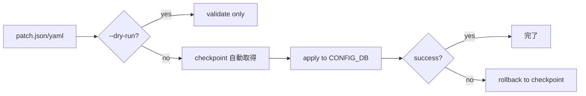

!!! warning "裏取りステータス: HLD-only / 概観文書"
    本 HLD は SONiC の設定手段を **概観する文書** であり、各機構の挙動詳細は別 HLD / 既存実装に依存する。`config apply-patch` の `--dry-run` / checkpoint / rollback フラグの現行 sonic-utilities 実装、ZTP の DHCP option 67 / USB 起動経路、RESTCONF / gNMI server 化の有効化方法などは別途裏取りが必要。

# SONiC NOS の設定手段一覧（CLI / sonic-cfggen / config_db.json / RESTCONF / gNMI / ZTP / vtysh / redis / apply-patch）

## 概要

SONiC は設定の入口を **複数提供** する。本 HLD は各手段の **目的と適用範囲** を比較整理する概観文書である[^1]:

- 手作業: `config` / `show` CLI
- スクリプト: `sonic-cfggen`
- ファイル直編集: `config_db.json`
- リモート / 標準 API: RESTCONF / gNMI
- 自動化: Ansible / NAPALM / CI/CD
- 工場出荷時 / 大量展開: ZTP
- 上級者の routing 操作: `vtysh`
- 低レベル: `redis-cli`
- 構造化変更: `config apply-patch`

```mermaid
graph TD
    USER[Operator] --> CFG[config CLI]
    USER --> SHOW[show CLI]
    USER --> CFGGEN[sonic-cfggen]
    USER --> JSON[config_db.json 直編集]
    USER --> VTYSH[vtysh]
    USER --> REDIS[redis-cli]
    AUTO[Automation] --> ANS[Ansible / NAPALM]
    AUTO --> REST[RESTCONF]
    AUTO --> GNMI[gNMI]
    AUTO --> PATCH[config apply-patch]
    DEPLOY[ZTP] --> JSON
    CFG --> CDB[CONFIG_DB Redis db 4]
    CFGGEN --> CDB
    JSON --> CDB
    REST --> CDB
    GNMI --> CDB
    PATCH --> CDB
    REDIS --> CDB
    VTYSH --> FRR[FRR daemon (bgpd, zebra, ...)]
```

## 動作仕様

### 1. CLI

#### 1.1 `config` CLI

`CONFIG_DB` (Redis db 4) に直接書き、永続化は `config save` で `/etc/sonic/config_db.json` に書き戻す[^1]:

```bash
config interface ip add Ethernet0 10.0.0.1/24
config save -y                      # /etc/sonic/config_db.json に保存
```

操作者の手動配備や軽微な変更に向く。

#### 1.2 `show` CLI

read-only。`STATE_DB` / `APPL_DB` 等の運用状態を表示。設定確認やトラブルシューティング用[^1]。

### 2. `sonic-cfggen`

JSON ↔ Redis のブリッジ。**スクリプト / 自動化** で使う[^1]:

- 入力 JSON は SONiC schema に従う必要がある
- 不適合だと書き込み時にエラー

### 3. `/etc/sonic/config_db.json` 直編集

オフライン編集の元締め[^1]:

```bash
sudo vi /etc/sonic/config_db.json
config reload -y
```

利点: 全設定を 1 ファイルで Git バージョン管理可。リスク: **構文エラーで起動不能** を招きうるため適用前検証を推奨。

### 4. RESTCONF

YANG モデルに基づく REST API。OpenConfig YANG にも対応するため **マルチベンダ環境** に向く[^1]:

- 明示的に enable + 認証 / アクセス制御の構成が必須
- クラウドコントローラ統合 / リモート監視 / ダッシュボード構築

### 5. gNMI

gRPC ベース。**リアルタイム設定 + telemetry streaming**[^1]:

- `gnmic` 等のクライアント
- ONCE / STREAM の両モード
- Prometheus 等との接続

### 6. 自動化フレームワーク

Ansible / NAPALM 等[^1]。playbook で interface / BGP / VLAN / ACL を宣言的に管理。CI/CD pipeline 統合。

### 7. Zero-Touch Provisioning (ZTP)

工場出荷後の初回 boot で **DHCP option 67 または USB drive** からスクリプトを取得し自動設定[^1]:

- 設定取得 + 適用、CONFIG_DB の編集、サービス起動 / 設定が可能
- ログは `/var/log/ztp.log`

### 8. `vtysh` (FRRouting)

BGP / OSPF 等 routing 上級設定[^1]:

- **vtysh だけの変更は永続化されない**（CONFIG_DB に反映する必要あり）
- ライブ診断・障害切り分け向け

### 9. `redis-cli` 直接操作

CONFIG_DB (db 4) を直接いじる手段[^1]:

```bash
redis-cli -n 4 hset 'PORT|Ethernet0' admin_status up
```

**SONiC のバリデーションをバイパス** するため整合性破壊リスク。デバッグ / 低レベル検証用途。

### 10. `config apply-patch`

JSON / YAML パッチを **CONFIG_DB に動的適用**[^1]:

```bash
config apply-patch <patch.json>
config apply-patch --dry-run <patch.json>     # 検証のみ
```

特徴[^1]:

- 反映は **即時**（reboot / reload 不要）
- `--dry-run` で **構文 / キー検証**
- **Checkpoint + Rollback** をサポート（直前の checkpoint に戻せる）



### 各手段の比較

| 手段 | 永続化 | 検証 | 大規模対応 | 用途 |
|------|--------|-----|----------|------|
| `config` CLI | save 後 | あり (CLI 内) | × | 手動 |
| `show` CLI | - | - | - | 閲覧 |
| `sonic-cfggen` | save 経由 | schema 依存 | △ | スクリプト |
| `config_db.json` 直編集 | reload 後 | 起動時のみ | × | オフライン管理 |
| RESTCONF | 即時 | YANG 検証 | ○ | コントローラ |
| gNMI | 即時 | YANG 検証 | ◎ | 大規模 + telemetry |
| Ansible / NAPALM | playbook 設計次第 | playbook 内 | ◎ | IaC |
| ZTP | 初回起動時 | スクリプト次第 | ◎ | 工場出荷 |
| `vtysh` | しない（要転記） | FRR 内 | × | routing 詳細 |
| `redis-cli` | しない | **無し** | × | デバッグ |
| `config apply-patch` | 即時 | dry-run / 構文 | ○ | 構造化変更 |

## 設定

本 HLD 自身は **CONFIG_DB / CLI / YANG / SAI を変更しない**。各手段の **入り口の集合** を整理する文書。

### 設定例（用途別）

```bash
# 手動運用: CLI で IP を付与し永続化
config interface ip add Ethernet0 10.0.0.1/24
config save -y

# 自動化: sonic-cfggen で JSON から CONFIG_DB を上書き
sonic-cfggen -j /tmp/changes.json --write-to-db

# 動的構造化変更: apply-patch + dry-run
config apply-patch --dry-run /tmp/patch.json
config apply-patch /tmp/patch.json

# 上級者ルーティング
vtysh -c 'configure terminal' -c 'router bgp 65000' ...
```

## 制限事項

- **`vtysh` の変更は永続化されない**。CONFIG_DB / `bgp` 系 frr.conf テンプレートに転記しないと再起動で失われる[^1]
- **`redis-cli` 直接操作はバリデーションをバイパス** するため、不整合状態で起動失敗する可能性[^1]
- ZTP は **スクリプトの品質に依存**。boot failure を起こすスクリプトはリカバリが面倒[^1]
- RESTCONF / gNMI server 機能は **明示的に有効化** 必要、認証も別設定[^1]
- `config apply-patch` のサポート機能（`--dry-run` / checkpoint / rollback）は実装段階により差がある可能性
- 手段が 10 種類あるため、**運用上どれが正の正解か** は組織のポリシー次第（HLD は併用禁止を規定しない）

## 干渉する機能

- **Redis (`CONFIG_DB`)**: 全手段の最終収束先
- **`hostcfgd`**: CONFIG_DB の変更を OS 側設定（systemd / 各種 conf）に反映
- **`bgpcfgd` 等の orchestration daemon**: CONFIG_DB → daemon 設定生成 + reload
- **`config_db.json`**: 永続化フォーマットの真実の相
- **`vtysh` ↔ `frr.conf` の整合**: 永続化に手作業が必要

## トラブルシューティング

- 設定が再起動で消える → `config save -y` を忘れていないか確認、`config_db.json` の更新時刻を見る
- `vtysh` の変更が消える → CONFIG_DB / FRR テンプレートに反映されているか
- patch apply が即時反映されない → 対応 daemon (`hostcfgd` / `bgpcfgd` 等) のログ確認
- redis-cli で書いた値が無視される → SONiC 側 listener が再 normalize / reject している可能性
- ZTP が起動しない → `/var/log/ztp.log` を確認、DHCP option 67 / USB 検出を確認
- gNMI / RESTCONF に繋がらない → server 有効化と認証設定 (証明書、ユーザ) を確認

## 引用元

[^1]: `sonic-net/SONiC` `doc/configuration/SONiC_NOS_Configuration_Methods.md` @ `49bab5b5ff0e924f1ea52b3d9db0dfa4191a7c06`

<!-- concerns hint:
- config apply-patch の --dry-run / checkpoint / rollback フラグの sonic-utilities 取り込み確認
- ZTP の DHCP option 67 / USB 起動経路の現行実装確認
- RESTCONF / gNMI server 有効化手順 (sonic-mgmt-common / gnmi container) の現行確認
- sonic-cfggen が許容する schema の現行整合確認
- vtysh ↔ frr.conf テンプレート ↔ CONFIG_DB の整合経路（bgpcfgd 等）の現行確認
-->
