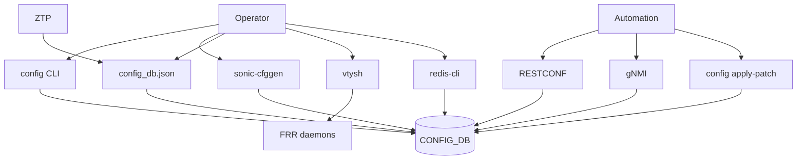
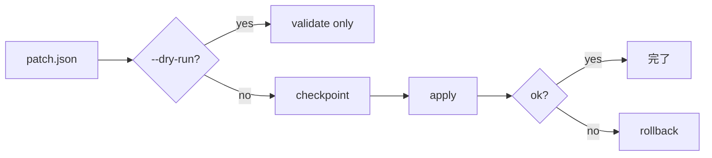

<!-- topics-tip -->
!!! tip "Topics で読み物として読む"
    この HLD は実装詳細を含みます。機能の概念・設定・運用を読み物として読みたい場合は [Topics 10 章: gNMI / OpenConfig / 管理プレーン](../topics/10-gnmi-openconfig/index.md) を参照。
<!-- /topics-tip -->

!!! info "裏取りステータス: code-verified / 概観文書"
    `sonic-utilities/config/main.py` で `apply-patch` / `replace` / `rollback` の 3 サブコマンドと `--dry-run` / `--ignore-non-yang-tables` / `--ignore-path` オプションを確認。`generic_config_updater/`、`sonic-buildimage/src/sonic-ztp`、`bgpcfgd` の存在も確認済み。本 HLD は概観文書で各機構の詳細は別 HLD に委ねる。

# SONiC NOS の設定手段一覧

## 読み手が知りたいこと

- [SONiC](../reference/glossary.md#term-sonic) で設定を入れる方法は何種類あり、どう使い分けるか
- 永続化されるのはどれか、再起動で消えるのはどれか
- 自動化／コントローラ統合に使えるのはどれか
- 「触ってはいけない」低レベル手段はどれか

## 入口は 10 種類、収束先は CONFIG_DB

SONiC は [CONFIG_DB](../reference/glossary.md#term-config_db)（[Redis](../reference/glossary.md#term-redis) db 4）に **複数の入口** を提供し、最終的に `/etc/sonic/config_db.json` で永続化する[^1]。



## どれを使うべきか（比較表）

| 手段 | 永続化 | 検証 | 大規模 | 主用途 |
|------|--------|-----|-------|------|
| `config` CLI | save 後 | あり | × | 手動運用 |
| `show` CLI | - | - | - | 閲覧 |
| `sonic-cfggen` | save 経由 | schema 依存 | △ | スクリプト |
| `config_db.json` 直編集 | reload 後 | 起動時のみ | × | オフライン管理 |
| RESTCONF | 即時 | [YANG](../reference/glossary.md#term-yang) | ○ | コントローラ |
| [gNMI](../reference/glossary.md#term-gnmi) | 即時 | YANG | ◎ | 大規模 + telemetry |
| Ansible / NAPALM | playbook 次第 | playbook | ◎ | IaC |
| [ZTP](../reference/glossary.md#term-ztp) | 初回起動時 | スクリプト次第 | ◎ | 工場出荷 |
| `vtysh` | しない | [FRR](../reference/glossary.md#term-frr) | × | routing 詳細 |
| `redis-cli` | しない | **無し** | × | デバッグ |
| `config apply-patch` | 即時 | dry-run | ○ | 構造化変更 |

## 各手段の要点

### CLI (`config` / `show`)

`config` は CONFIG_DB に直書き、`config save` で `/etc/sonic/config_db.json` に永続化[^1]:

```bash
config interface ip add Ethernet0 10.0.0.1/24
config save -y
```

`show` は [STATE_DB](../reference/glossary.md#term-state_db) / [APPL_DB](../reference/glossary.md#term-appl_db) の閲覧専用。

### `sonic-cfggen`

JSON ↔ Redis のブリッジ。スクリプト/自動化用。入力 JSON は SONiC schema に従う必要があり、不適合だと書き込み時エラー[^1]。

### `config_db.json` 直編集

オフライン編集の元締め。全設定を 1 ファイルで Git 管理可能。構文エラーで起動不能リスクあり[^1]。

### RESTCONF / gNMI

YANG モデルに基づく標準 API。RESTCONF は OpenConfig 対応でマルチベンダ向け、gNMI は gRPC ベースで telemetry streaming もサポート。**明示的に有効化 + 認証設定** が必須[^1]。

### Ansible / NAPALM

宣言的に interface / [BGP](../reference/glossary.md#term-bgp) / [VLAN](../reference/glossary.md#term-vlan) / [ACL](../reference/glossary.md#term-acl) を管理。CI/CD パイプライン統合に向く[^1]。

### ZTP

工場出荷後の初回 boot で DHCP option 67 または USB から設定スクリプトを取得し自動適用。ログは `/var/log/ztp.log`[^1]。

### `vtysh`（FRRouting）

BGP / OSPF の上級設定。**[vtysh](../reference/glossary.md#term-vtysh) だけの変更は永続化されない**。CONFIG_DB / FRR テンプレートに転記しないと再起動で失われる[^1]。

### `redis-cli` 直接操作

```bash
redis-cli -n 4 hset 'PORT|Ethernet0' admin_status up
```

**SONiC のバリデーションをバイパス** するため整合性破壊リスク。デバッグ用途限定[^1]。

### `config apply-patch`

JSON/YAML パッチで CONFIG_DB を **動的・即時** に変更し、checkpoint + rollback をサポート[^1]:

```bash
config apply-patch --dry-run patch.json    # 検証のみ
config apply-patch patch.json              # 適用
```



## 実装との乖離

!!! diff "HLD と実装の差分"

    本ページの monitor は `partially_implemented`。HLD は SONiC NOS の設定手段を 10 種類に整理する設計提案で、現行 master では中核となる `sonic-cfggen` / `config_db.json` / `redis-cli` / `vtysh` / RESTCONF / gNMI は実装されているが、`apply-patch` の checkpoint / rollback や ZTP boot failure リカバリ、入口横断の validation などは段階的取り込みで一部のみ。HLD の表は分類軸として有用だが、各入口の最新挙動は個別の `sonic-utilities` / `sonic-mgmt-framework` 実装で裏取りすること。

## 既知の問題

### `config load_minigraph` 失敗後に ConfigDB がロックされる（#145）

`config load_minigraph` の実行中に失敗（例: minigraph の hostname 不整合）すると、ConfigDB が空のままロック状態になり、その後の `config load_minigraph` が無限ハングするケースがある。

**回避策:**

```bash
# ConfigDB の初期化フラグを手動で設定
redis-cli -n 4 SET CONFIG_DB_INITIALIZED true
# その後 config load_minigraph を再実行
```

**根本原因の予防:** [minigraph.xml](../reference/glossary.md#term-minigraph.xml) 内の hostname は **全箇所で一致**させる必要がある。1 箇所だけ変更するとパース時に `KeyError` が発生する。

- 参照: [sonic-net/SONiC#145](https://github.com/sonic-net/SONiC/issues/145)

### klish ベース `sonic-cli` の `/tmp/klish.fifo` エラー（#781）

klish を使用する `sonic-cli` で設定コマンド実行時に `/tmp/klish.fifo` 関連のエラーが発生するケースがある。Python 2/3 混在環境でのスクリプトエンコーディング問題が原因の一つとして特定されている（buildimage#8506 で追跡中）。master でも未解決の場合あり。

```
sonic-switch(conf-if-EthernetX)# description test
/tmp/klish.fifo.XXXXX: 1: /tmp/klish.fifo...: Syntax error
```

- 参照: [sonic-net/SONiC#781](https://github.com/sonic-net/SONiC/issues/781)

## 制限事項

- vtysh の変更は永続化されない（CONFIG_DB / FRR テンプレート転記が必要）[^1]
- `redis-cli` 直接操作はバリデーション無し、不整合状態を作りうる[^1]
- ZTP boot failure はリカバリが面倒[^1]
- RESTCONF / gNMI は有効化と認証を別途設定[^1]
- `apply-patch` の checkpoint / rollback 実装の取り込みは要確認

## 干渉する機能

- **CONFIG_DB**: 全手段の収束先
- **`hostcfgd`**: CONFIG_DB → OS 側設定（systemd / 各種 conf）に反映
- **`bgpcfgd`** 等の orchestration daemon: CONFIG_DB → daemon 設定生成
- **`vtysh` ↔ `frr.conf` の整合**: 永続化は手作業

## トラブルシューティング

- 設定が再起動で消える → `config save -y` 忘れ、`config_db.json` の更新時刻を確認
- vtysh の変更が消える → CONFIG_DB / FRR テンプレートへの反映確認
- patch apply が反映されない → `hostcfgd` / `bgpcfgd` のログ確認
- ZTP が起動しない → `/var/log/ztp.log`、DHCP option 67 / USB 検出確認
- gNMI / RESTCONF 接続不可 → server 有効化と証明書/ユーザ設定確認

確認コマンド例:

```bash
# CLI / 設定パイプライン状態確認
show runningconfiguration all | head
config save -y
diff /etc/sonic/config_db.json <(show runningconfiguration all)
```


<!-- phase-boundary -->
## 実装フェーズ境界

!!! info "Phase 別の実装済 / 未実装 サマリ"
    本ページは `monitor: partially_implemented` で、HLD で示された一連の機能が **段階的に取り込まれている** 状態を扱う。フェーズ毎の実装境界を 1 枚の表に集約する (詳細は本ページ上部の `diff` admonition および [discrepancy-index](../reference/verification/discrepancy-index.md) を参照)。

    | Phase | 範囲 (機能 / 段階) | 実装済 (master 取り込み済) | 未実装 (HLD 提案のみ) |
    |---|---|---|---|
    | Phase 1 — 基本機能 | HLD §概要 / §設計の中核ユースケース | 取り込み済 — 本ページの「動作仕様」節および `diff` admonition の現状側を参照 | — (Phase 1 は実装済) |
    | Phase 2 — 拡張機能 | HLD §拡張 / §追加要件 / §周辺統合 | 一部のみ取り込み済 — 本ページ「動作仕様」の補足参照 | 未実装 / 未マージ — HLD §未対応箇所、本ページ「制限事項」および `diff` admonition の差分側に列挙 |
    | Phase 3 — 将来拡張 | HLD §Future Work / §将来課題 | — | 未実装 — HLD 提案段階。対応 PR は確認されていない (last_verified 時点) |

    凡例: 「実装済」=現行 master で動作確認できる範囲 / 「未実装」=HLD には記載があるが対応 PR が未マージまたは設計のみで code が存在しない範囲。
<!-- /phase-boundary -->

## 引用元

[^1]: `sonic-net/SONiC` `doc/configuration/SONiC_NOS_Configuration_Methods.md` @ `49bab5b5ff0e924f1ea52b3d9db0dfa4191a7c06`

## 関連ページ

- [Topic: BGP](../topics/02-bgp/index.md)
- [CLI: config-bgp](../reference/cli/config-bgp.md)

<!-- concerns hint:
- config apply-patch の checkpoint / rollback の sonic-utilities 取り込み確認
- ZTP の DHCP option 67 / USB 経路の現行実装確認
- RESTCONF / gNMI server 有効化手順の現行確認
-->

<!-- topics-back-ref -->
## 関連 Topics

- [Topics: SONiC 全体像と設定基盤](../topics/01-overview/index.md)

<!-- /topics-back-ref -->

<!-- glossary-links-injected: 32fbe70babcc -->

<!-- ops-entry -->
## 運用入口

この [HLD](../reference/glossary.md#term-hld) に対応する運用面の入口（CLI / CONFIG_DB / YANG / Runbook）を以下にまとめる。

### 関連 CLI

- `config`
- `show`
- [`sonic-cfggen`](../reference/cli/sonic-cfggen.md)
- `config save`
- `config reload`
- `config apply-patch`
- `vtysh`

<!-- /ops-entry -->

<!-- glossary-links-injected: 7ac8e66e1af3 -->
