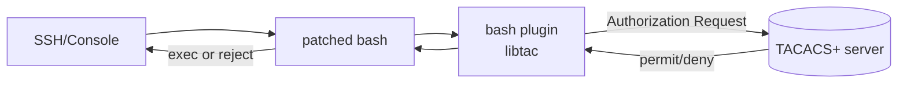
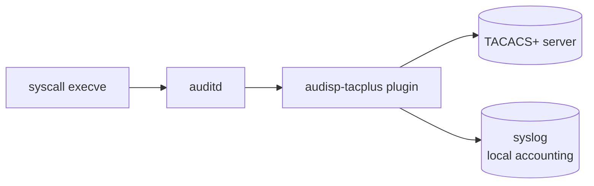
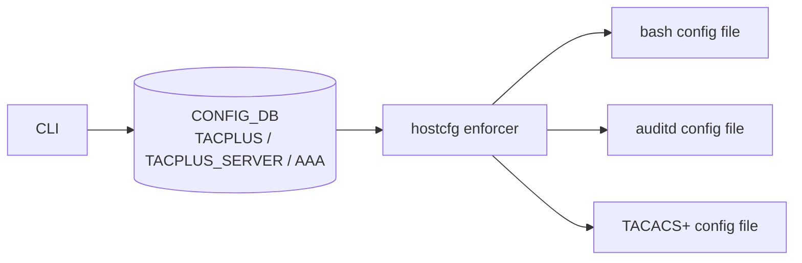

<!-- topics-tip -->
!!! tip "Topics で読み物として読む"
    この HLD は実装詳細を含みます。機能の概念・設定・運用を読み物として読みたい場合は [Topics 15 章: Security / AAA](../topics/15-security-aaa/index.md) を参照。
<!-- /topics-tip -->

!!! success "裏取りステータス: code-verified"
    `sonic-buildimage/files/build/versions-public/host-image/versions-deb-trixie` L6 で `audisp-tacplus==1.0.2`、L280 で `libtac2==1.4.1-1`、`files/build/versions-public/default/versions-git` L4 で `audisp-tacplus.git` の SHA を確認。各 `sonic-slave-{buster,bullseye,trixie,jessie}/Dockerfile.j2` に `# For audisp-tacplus` セクションがあり、ビルドスレーブ側に取り込み済み。`files/build_templates/sonic_debian_extension.j2` L318 で `libtac2_*.deb` をホストイメージにインストール。`sonic-utilities/config/aaa.py` L157-175 で `aaa authorization` / `aaa accounting` CLI を確認（verified at: 2026-05-09）。

# TACACS+ コマンド authorization / accounting（patched bash + `audisp-tacplus`）

## 概要

TACACS+ Authentication（既存）の上に **コマンド単位の authorization と accounting** を追加する [HLD](../reference/glossary.md#term-hld)[^1]:

- 既存: authentication / session authz / session accounting / コマンド authz（ローカル permission のみ）
- 追加: **コマンド authorization（TACACS+）** と **コマンド accounting（TACACS+）**

実装の柱は **bash patch + plugin** と **auditd + audisp-tacplus** の二段[^1]。

## 動作仕様

### Authorization（コマンドごとの実行許可）



- bash を patch して **disk command 実行直前に plugin を呼ぶ**[^1]
- plugin は TACACS+ Authentication と同じ設定を共有し、`libtac`（pam_tacplus 由来）でプロトコル処理[^1]
- 再帰コマンドは **トップレベルのみ**認可。bash built-in / function は認可対象外（ただし内部から実行ファイルを呼べばその実行ファイルは認可される）
- スクリプト経由（`python ./x.py`、`sh ./x.sh`）の認可は **インタープリタコマンドのみ**となるため、RO ユーザにスクリプト実行を許可する場合は **TACACS+ サーバ側で python/sh 等を block** する運用を推奨[^1]

#### Failover 設計

| 状況 | 挙動 |
|------|------|
| プライマリ TACACS+ 不達 | 次のサーバへ |
| 全サーバ不達 | TACACS+ 認可は失敗 |
| 認可失敗時 fallback | 設定可能。`local` を fallback にすれば Linux ローカル permission に従う |
| ローカルアカウントログイン | 当該セッションでは TACACS+ authn/authz を無効化（不達時の救済路）[^1] |

#### 代替案として却下された tacplus-auth[^1]

`tacplus-auth` は コマンドへの **シンボリックリンク + rbash** で制限する方式。新コマンド毎にリンク作成が必要、bash 機能の一部が失われるため不採用。

### Accounting（コマンドの監査ログ）



- **syscall event** を `auditd` で拾い、`audisp-tacplus` plugin が TACACS+ サーバに送る[^1]
- 記録イベント: コマンド開始 / 終了
- **docker container 内のコマンドは accounting 対象外**（docker daemon 由来の実行と区別不能）。`docker exec <ct> <cmd>` は対象[^1]
- `pam_tacplus` がセッション accounting（login/logout）を担当
- `/etc/sudoers` の `PASSWD_CMDS` 正規表現で **secret を `***` にマスク**してから送信[^1]

### hostcfg enforcer

`AAA Config` モジュールが [CONFIG_DB](../reference/glossary.md#term-config_db) から bash config / auditd config / TACACS+ config を生成する[^1]:



`AAA` テーブルは `authentication` / `authorization` / `accounting` の 3 種をキーとして持ち、各キーで `login`（実体は protocol リスト, e.g. `local,tacacs+`）、`fallback`、`failthrough` を管理[^1]。

> 注: 過去 HLD 上は `protocol` 属性として記載されたが、現行 `sonic-system-aaa` [YANG](../reference/glossary.md#term-yang) では `login` 属性として実装されており、互換性のため `login` のままとする[^1]。

## 関連 CLI[^1]

```bash
# Authorization
config aaa authorization local
config aaa authorization tacacs+
config aaa authorization tacacs+ local        # TACACS+ → local fallback

# Accounting
config aaa accounting local
config aaa accounting tacacs+
config aaa accounting tacacs+ local
config aaa accounting disable

# Counter
show tacacs+ counter
sonic-clear tacacscounters
```

カウンタ表示例[^1]:

```text
server1: 10.1.1.45
Messages sent: 24
Messages received: 20
Requests accepted: 14
Requests rejected: 8
Requests timeout: 2
Requests retransmitted: 1
Bad responses: 1
```

## 制限事項

| # | 内容 |
|---|------|
| 1 | コマンド + パラメータが **240 byte 超** の部分は drop（TACACS+ プロトコル制約。Cisco/Arista/Cumulus 等共通）[^1] |
| 2 | 最大 TACACS+ サーバ数 = **8**（hardcode）[^1] |
| 3 | TACACS+ と local 併用時、Linux file permission の都合で **local は常に TACACS+ の後**に評価される |
| 4 | docker 内 shell からの実行は authz/accounting を回避可能 → 管理者は TACACS+ 側で `docker exec` を制限すべき |
| 5 | 再帰コマンド回避策として、TACACS+ 側で `python` / `sh` / `find -exec` / `ld-linux.so` 等を block する運用が必要 |

## 干渉する機能

- **TACACS+ Authentication**: 本拡張は同じ TACACS+ 設定を再利用
- **bash**: bash 自体に patch を当てるため bash バージョン更新時に再 patch 必要
- **auditd**: auditd 動作に依存。auditd 停止時は TACACS+ accounting も止まる

## トラブルシューティング

- bash plugin / audisp-tacplus は `AAA|authentication.debug` を立てるとデバッグログ出力[^1]
- TACACS+ counter で reject / timeout / bad responses を観察
- syslog で authz/accounting イベントを確認
- 240 byte 超の長いコマンドは TACACS+ 側で truncate されるため、長尺ワンライナーをスクリプト化する運用が必要

確認コマンド例:

```bash
# TACACS+ サーバ設定確認
show tacacs
# TACACS+ counter（reject / timeout / bad responses）
show tacacs+ counter
show aaa
redis-cli -n 4 hgetall 'TACPLUS|global'
journalctl -u hostcfgd | grep -i tacacs | tail
```


## 引用元

[^1]: [sonic-net/SONiC doc/aaa/TACACS+ Design.md @ 49bab5b](https://github.com/sonic-net/SONiC/blob/49bab5b5ff0e924f1ea52b3d9db0dfa4191a7c06/doc/aaa/TACACS%2B%20Design.md)

<!-- topics-back-ref -->
## 関連 Topics

- [Topics: Security / AAA / FIPS / Hardening](../topics/15-security-aaa/index.md)

<!-- /topics-back-ref -->

<!-- glossary-links-injected: 20dbc11976b6 -->

<!-- ops-entry -->
## 運用入口

この HLD に対応する運用面の入口（CLI / CONFIG_DB / YANG / Runbook）を以下にまとめる。

### 関連 CLI

- `config aaa authorization`
- `config aaa accounting`
- `show tacacs+ counter`
- `sonic-clear tacacscounters`

### 関連 CONFIG_DB

- `TACPLUS`
- [TACPLUS_SERVER](../reference/config-db/tacplus-server.md)
- [AAA](../reference/config-db/aaa.md)

### 関連 YANG

- [sonic-system-aaa](../reference/yang/sonic-system-aaa.md)

<!-- /ops-entry -->
