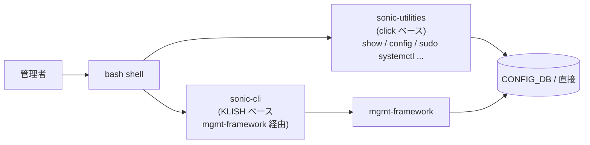
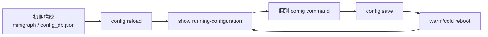

!!! info "裏取りステータス: code-verified（メタドキュメント）"
    元文書はユーザマニュアル全体（41KB）。このページは **読者の入口** として SONiC の運用 CLI 群と章構成を整理するインデックス。コマンド体系（`show` / `config` Click 群、`sonic-cli` KLISH、`generate_dump`/techsupport、minigraph 関連）の存在は `sonic-utilities/{show,config}/`、`sonic-utilities/scripts/generate_dump`、`sonic-utilities/tests/db_migrator_input/minigraph.xml` で確認済み。コマンド単位の詳細は別ページ（`docs/reference/cli/...`）を参照。

# SONiC User Manual の位置づけと SONiC CLI / 運用フローの全体像

## 概要

[SONiC](../reference/glossary.md#term-sonic) のユーザマニュアルは「日常運用と機能設定を一冊で把握する」ことを目的とした包括ガイド[^1]。このページでは、[HLD](../reference/glossary.md#term-hld) やリファレンスとマニュアルの **役割境界** を明確にし、利用者が次に読むべき場所を案内する。

| 種類 | 何が書いてあるか | このサイトでの居場所 |
|------|------------------|----------------------|
| User Manual | コマンド使い方・設定例・運用 tips | 個別機能ページ + reference/cli |
| HLD | 設計意図・内部 daemon 構成・[SAI](../reference/glossary.md#term-sai) 期待値 | architecture / area 別ページ |
| Reference | 機械抽出した CLI ツリー / [YANG](../reference/glossary.md#term-yang) / [CONFIG_DB](../reference/glossary.md#term-config_db) | `docs/reference/...` |

## 動作仕様（CLI 系統の二重化）

SONiC は歴史的に 2 系統の CLI が共存する:



- **`show` / `config` 系**（`sonic-utilities`）: Python click + 直接 [Redis](../reference/glossary.md#term-redis) 操作。歴史が長く、機能カバレッジが広い
- **`sonic-cli` (KLISH)**: モデル駆動。openconfig YANG への 1:1 マッピングが厚い

User Manual は両者の併用前提で書かれており、機能によって主に使う系統が異なる。

## 主要な運用フロー



- **初期投入**: `minigraph.xml`（旧）または `config_db.json`（推奨）を `/etc/sonic/` に配置 → `config load_minigraph` / `config reload`
- **永続化**: `config save -y` で `/etc/sonic/config_db.json` に書き戻す（`save-on-set` 系の自動保存もある）
- **trouble shoot**: `show techsupport` でログ・running config・SAI dump を一括収集

## 制限事項

- **マニュアル単独で完結しない**: 細部は HLD / 実コードを併読する前提
- **更新ペースが機能追加に追いつかない**: 新機能は HLD と CLI helptext が一次情報になることが多い
- **2 系統 CLI の差**: 同じ機能でも `config xxx` と `sonic-cli` で表現が違う（覚え分けが必要）

## 干渉する機能

- **Management Framework**: KLISH CLI を成立させる土台。同 area の別ページ参照
- **[GCU](../reference/glossary.md#term-gcu) / JSON patch ordering**: 大規模変更を `config reload` ではなく `apply-patch` で行うパスがあるため、運用に影響
- **Application Extension**: install した拡張がそれぞれ独自の `config` / `show` サブコマンドを足す

## トラブルシューティング

- どっちの CLI を使うべきか分からない → 機能ページ（このドキュメントサイトの当該 area）の「関連 CLI」を最初に見る
- `config reload` 時に長時間止まる → GCU `apply-patch` への置き換えを検討
- show techsupport が膨大 → 個別 `show` コマンド + journalctl で特定コンテナ単位に絞る

確認コマンド例:

```bash
# CLI / 設定パイプライン状態確認
show runningconfiguration all | head
config save -y
diff /etc/sonic/config_db.json <(show runningconfiguration all)
```


## 引用元

[^1]: `sonic-net/SONiC` `doc/user-manual/SONiC-User-Manual.md` @ `49bab5b5ff0e924f1ea52b3d9db0dfa4191a7c06`

<!-- concerns hint:
- User Manual の現行版（章構成変更）と HLD 集合との整合確認
- sonic-utilities (click) と sonic-cli (KLISH) の現行カバレッジ差分確認
- config save / save-on-set / GCU apply-patch の運用上の使い分け方針が現行で明示されているか確認
- minigraph.xml の deprecated 状況確認（現行 master の load_minigraph 実装）
- show techsupport の現行収集対象（plugin 機構）の確認
- application extension が CLI を拡張するパスの現行 entry-point 仕様確認
-->

<!-- topics-back-ref -->
## 関連 Topics

- [Topics: SONiC 全体像と設定基盤](../topics/01-overview/index.md)

<!-- /topics-back-ref -->

<!-- glossary-links-injected: 1103f073f6d0 -->

<!-- ops-entry -->
## 運用入口

この HLD に対応する運用面の入口（CLI / CONFIG_DB / YANG / Runbook）を以下にまとめる。

### 関連 CLI

- `show`
- `config`
- `sonic-cli`

<!-- /ops-entry -->

<!-- glossary-links-injected: 8ba32e5aa69d -->
