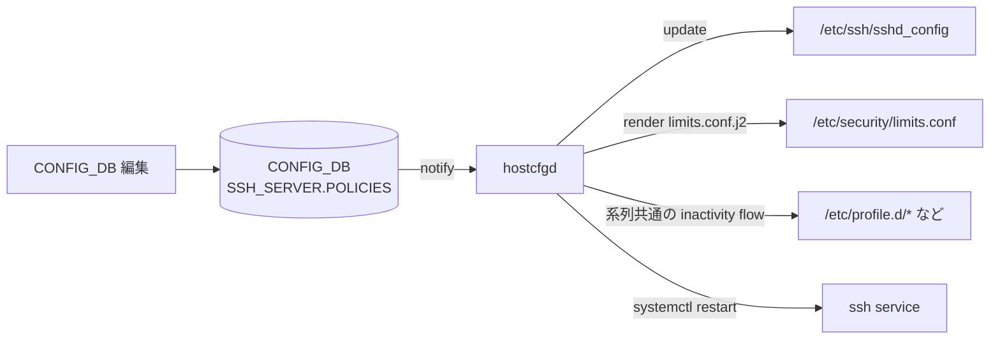
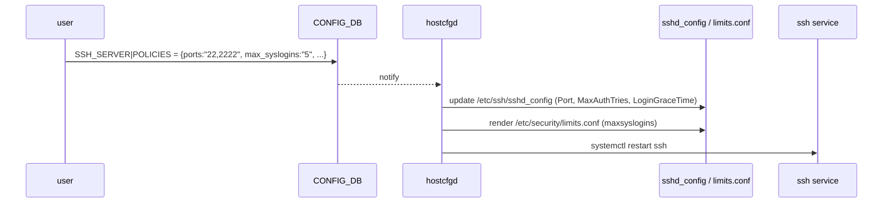

<!-- topics-tip -->
!!! tip "Topics で読み物として読む"
    この HLD は実装詳細を含みます。機能の概念・設定・運用を読み物として読みたい場合は [Topics 15 章: Security / AAA](../topics/15-security-aaa/index.md) を参照。
<!-- /topics-tip -->

!!! success "裏取りステータス: Code-verified"
    `sonic-host-services/scripts/hostcfgd` L1045 `class SshServer`、L2245-2478 で `init_data['SSH_SERVER']` を読み `self.config_db.subscribe('SSH_SERVER', make_callback(self.ssh_handler))` する経路を確認。`SSH_CONFG = "/etc/ssh/sshd_config"` (L32) に書き込み、`LIMITS_CONF_TEMPLATE = "/usr/share/sonic/templates/limits.conf.j2"` (L82) と `PAM_LIMITS_CONF = "/etc/pam.d/pam-limits-conf"` (L83) を render する `limits.conf.j2` も `sonic-host-services/data/templates/limits.conf.j2` で確認。L1412-1478 で `SSH_SERVER` から `pam_limits` / `limits.conf` を render（verified at: 2026-05-09）。

# SSH サーバ全体設定（SSH_SERVER.POLICIES）

## 概要

SONiC の SSH サーバは Debian 標準 `sshd` をそのまま使う構成で、運用ポリシーを変えるたびに `/etc/ssh/sshd_config` を直接書き換える必要があった。本機能は [CONFIG_DB](../reference/glossary.md#term-config_db) の `SSH_SERVER` テーブルに 5 種のポリシーを集約し、**`hostcfgd` がテーブル変更を購読して `sshd_config` などを更新 → SSH サービスを再起動** することで、CONFIG_DB だけで一貫した SSH 運用ポリシー管理を可能にする[^1]。

設定対象は次の 5 ポリシー[^1]。

| ポリシー | 説明 | 値域 | 既定 (Debian 由来) |
|---------|------|------|--------------------|
| `authentication_retries` | パスワード入力リトライ上限 | 1..100 | 6 |
| `login_timeout` | ログイン未完了 timeout | 1..600 (秒) | 120 |
| `ports` | sshd 待受ポート（複数指定可、カンマ区切り） | 1..65536 | 22 |
| `inactivity_timeout` | アイドルセッションの自動切断 | 0..35000 (分、0 = 無効) | 15 |
| `max_syslogins` | システム全体の並列ログイン上限 | 0..100 (0 = 無制限) | 0 |

各ポリシーの既定は Debian の sshd デフォルトをそのまま継承している。`inactivity_timeout` だけは Linux 全般での既存設定を踏襲して 15 分を採用している。

## 動作仕様

### 全体経路



`hostcfgd` は **ホスト直接動作（コンテナ内ではない）** のデーモンで、これは「ホスト側の SSH 設定ファイルを書き換える必要があるため」と [HLD](../reference/glossary.md#term-hld) で明示されている[^1]。

### 各ポリシーのマッピング先

| ポリシー | 反映先 | sshd 上の概念 |
|---------|--------|--------------|
| `authentication_retries` | `/etc/ssh/sshd_config` の `MaxAuthTries` | 認証試行上限 |
| `login_timeout` | `LoginGraceTime` | ログイン猶予時間（秒）|
| `ports` | `Port` （複数行可） | 待受ポート |
| `inactivity_timeout` | [hostcfgd](../reference/glossary.md#term-hostcfgd) の **既存 inactivity フロー** で `TMOUT` 系を更新 | シェルレベル idle |
| `max_syslogins` | `limits.conf.j2` 経由で `/etc/security/limits.conf` の `* - maxsyslogins <N>` | PAM レベルの全ユーザ並列ログイン上限 |

`max_syslogins` は jinja2 テンプレートで条件分岐される[^1]:

```jinja

* - maxsyslogins {{ max_sessions }}

```

`inactivity_timeout` 用の `TMOUT` は **Serial console 機能の HLD と同じ既存 inactivity フロー** に合流する設計（管理者シェル全般の自動ログアウト）。SSH 専用ではなく、シリアルと共通である[^1]。

### `ports` の構文

[YANG](../reference/glossary.md#term-yang) の正規表現で複数ポートを `,` 区切りで許可している[^1]。例: `"22,2222"`. 数字は 1..65536（YANG 上は 65536 までの上限が確認できる正規表現）。

### 起動シーケンス



設定変更ごとに **SSH サービスを再起動** する設計である。既存セッションへの影響は仕様上「再起動による瞬断」と理解する必要がある（Debian の `sshd` 既定挙動）。

<!-- evidence:
source: sonic-net/SONiC/doc/ssh_config/ssh_config.md#L62-L86 (sha: 49bab5b5ff0e924f1ea52b3d9db0dfa4191a7c06)
excerpt: |
  1. configDB - to include a dedicated table for configurations
  2. hostcfg demon - to update ssh config files once configDB relevant areas are modified
  3. OS ssh config files - specific for this stage we are only /etc/ssh/sshd_config is going to be modifed by the hostcfg demon.
  4. OS ssh service - to be restarted after each configuration change.
reasoning: 設定 → sshd_config 更新 → service 再起動 という反映経路の根拠。
-->

<!-- evidence-rendered:start -->
??? note "📋 検証エビデンス: sonic-net/SONiC/doc/ssh_config/ssh_config.md#L62-L86 (sha: 49bab5b5ff0e924f1ea52b3d9db0dfa4191a7c06)"

    **出典**:

    `sonic-net/SONiC/doc/ssh_config/ssh_config.md#L62-L86 (sha: 49bab5b5ff0e924f1ea52b3d9db0dfa4191a7c06)`

    **抜粋**:

    ```text
    1. configDB - to include a dedicated table for configurations
    2. hostcfg demon - to update ssh config files once configDB relevant areas are modified
    3. OS ssh config files - specific for this stage we are only /etc/ssh/sshd_config is going to be modifed by the hostcfg demon.
    4. OS ssh service - to be restarted after each configuration change.
    ```

    **判断根拠**: 設定 → sshd_config 更新 → service 再起動 という反映経路の根拠。

<!-- evidence-rendered:end -->

### 既定の出所

`init_cfg.json.j2` に既定値が埋め込まれており、ファクトリ起動時に `SSH_SERVER.POLICIES` が初期化される[^1]。

## 設定

### 関連する CONFIG_DB

| Table | Key | フィールド | 説明 |
|-------|-----|-----------|------|
| `SSH_SERVER` | `POLICIES` | `authentication_retries` | 1..100（既定 6）|
| | | `login_timeout` | 1..600 秒（既定 120）|
| | | `ports` | 文字列。`"22"` または `"22,2222"` 等 |
| | | `inactivity_timeout` | 0..35000 分（既定 15、0=無効）|
| | | `max_syslogins` | 0..100（既定 0=無制限）|

JSON サンプル[^1]:

```json
{
    "SSH_SERVER": {
        "POLICIES": {
            "authentication_retries": "6",
            "login_timeout": "120",
            "ports": "22",
            "inactivity_timeout": "15",
            "max_syslogins": "0"
        }
    }
}
```

### 関連する CLI

HLD 上では「**現状は CONFIG_DB を手動で編集**」しており、`config ssh ...` のような専用 CLI は Phase 1 では定義されていない。`config_db.json` 直接編集 / `sonic-cfggen` / [gNMI](../reference/glossary.md#term-gnmi) 経由で投入する想定。

### 関連する YANG

`sonic-ssh-server.yang` の `SSH_SERVER.POLICIES`[^1]:

```yang
container POLICIES {
    leaf authentication_retries { type uint8  { range 1..100; }   default 6; }
    leaf login_timeout         { type uint32 { range 1..600; }    default 120; }
    leaf ports                 { type string { pattern '([1-9]|[1-9]\d{1,3}|...|6553[0-6])(,...)*' ; }  default "22"; }
    leaf inactivity_timeout    { type uint32 { range 0..35000; }  default 15; }
    leaf max_syslogins         { type uint32 { range 0..100; }    default 0; }
}
```

### 設定例

```bash
# 待受ポートを 22 と 2222 の両方にし、最大同時ログインを 5 に制限
redis-cli -n 4 hset 'SSH_SERVER|POLICIES' ports "22,2222"
redis-cli -n 4 hset 'SSH_SERVER|POLICIES' max_syslogins 5

config save
```

設定後、hostcfgd が `/etc/ssh/sshd_config` を書き換え、ssh サービスを再起動する。既存セッションは切断される可能性がある。

## 干渉する機能

- **シリアルコンソール HLD (`SERIAL_CONSOLE.POLICIES`)**: `inactivity_timeout` は同じシェルレベル `TMOUT` フローを共有している。シリアル側 / SSH 側のどちらかで設定すると同じ値が両方に効く可能性。HLD では「既存の inactivity flow を使う」と明記されているため共有設計である[^1]。
- **PAM `limits.conf`**: `max_syslogins` は SSH 限定ではなく `* - maxsyslogins` として **全ユーザ全セッション** に適用される。シリアルログインも対象になる点に注意。
- **`ports` 変更**: 自分が SSH で繋いでいるセッションが切れる可能性がある。事前にコンソール経路を確保したうえで変更する。
- **fail2ban / 外部認可**: `authentication_retries` を上げすぎると brute-force 試行を検知しにくくなる。

## トラブルシューティング

- 設定が反映されない: `journalctl -u hostcfgd` で notification 受信ログを確認。`/etc/ssh/sshd_config` を `cat` して該当行が更新されているかチェック。
- ssh が落ちて戻ってこない: `ports` の YANG 正規表現に合わない値（範囲外、ゼロ詰め等）で sshd_config が壊れている可能性。コンソール経由で `/etc/ssh/sshd_config` を直接修正し `systemctl restart ssh`。
- `max_syslogins` を効かせたのに無制限のまま: `/etc/security/limits.conf` に該当行が出ているか、PAM がそれを読む構成（`session required pam_limits.so`）になっているかを確認。
- `inactivity_timeout` が SSH に効かない: `TMOUT` は login shell + interactive shell でのみ効く。`bash -c "command"` のような非対話起動では効かない。

確認コマンド例:

```bash
# SSH server 設定確認
show ssh
sudo sshd -T | head
redis-cli -n 4 hgetall 'SSH_SERVER|POLICIES'
```

## 引用元

[^1]: `sonic-net/SONiC` `doc/ssh_config/ssh_config.md` @ `49bab5b5ff0e924f1ea52b3d9db0dfa4191a7c06`

<!-- topics-back-ref -->
## 関連 Topics

- [Topics: Security / AAA / FIPS / Hardening](../topics/15-security-aaa/index.md)

<!-- /topics-back-ref -->

<!-- glossary-links-injected: ff031fbb8bc1 -->

<!-- ops-entry -->
## 運用入口

この HLD に対応する運用面の入口（CLI / CONFIG_DB / YANG / Runbook）を以下にまとめる。

### 関連 CONFIG_DB

- `SSH_SERVER`

### 関連 YANG

- [sonic-ssh-server](../reference/yang/sonic-ssh-server.md)

<!-- /ops-entry -->
