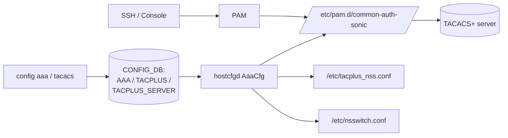

<!-- topics-tip -->
!!! tip "Topics で読み物として読む"
    この HLD は実装詳細を含みます。機能の概念・設定・運用を読み物として読みたい場合は [Topics 15 章: Security / AAA](../topics/15-security-aaa/index.md) を参照。
<!-- /topics-tip -->

!!! success "裏取りステータス: code-verified"
    `hostcfgd` の `class AaaCfg` で `AAA` / `TACPLUS` / `TACPLUS_SERVER` を購読し `/etc/pam.d/common-auth-sonic` と `/etc/tacplus_nss.conf` を生成、`pam_tacplus` の `source_ip` パッチ (`0006-Add-support-for-source-ip-address.patch`)、`sonic-utilities/config/aaa.py` の `config tacacs` CLI 群を確認済み（verified at: 2026-05-09）。

# TACACS+ 認証

## 読み手が知りたいこと

- [SONiC](../reference/glossary.md#term-sonic) で TACACS+ を有効化するとどこに何が書き込まれるか
- ローカル認証と TACACS+ の優先順位、フェイルオーバはどう決まるか
- なぜ `common-auth-sonic` が分離されているか
- 何を設定すれば動くか / 動かないときどこを見るか

## 全体構成（CONFIG_DB → hostcfgd → PAM/NSS）



[CONFIG_DB](../reference/glossary.md#term-config_db) を真実の相とし、`hostcfgd` の [AAA](../reference/glossary.md#term-aaa) モジュールが PAM/NSS 設定ファイルを書き換える[^1]。

## なぜ `common-auth-sonic` を分離するか

既存 `/etc/pam.d/common-auth` を直接編集すると cron など他サブシステムに波及する。SONiC は **専用ファイル `common-auth-sonic`** を作り、SSH / login だけがこれを参照するよう差し替える[^1]。

## なぜ `nss_tacplus` が必要か

TACACS+ ユーザは `/etc/passwd` に存在しない。`getpwnam` が失敗するとログインが切れるため、NSS プラグイン `nss_tacplus` で TACACS+ サーバからユーザ privilege を取得しローカルレコードを擬似提供する[^1]。

`/etc/nsswitch.conf` の `passwd` 行に `tacplus` を追記:

```text
passwd: compat tacplus
```

### 既定の権限テーブル

| user privilege | user info | gid | secondary groups | shell |
|----------------|-----------|-----|------------------|-------|
| 15 | `remote_user_su` | 1000 | `sudo,docker` | `/bin/bash` |
| 1〜14 | `remote_user` | 999 | `docker` | `/bin/bash` |

`/etc/tacplus_nss.conf` で privilege 範囲ごとに `user_priv` / `pw_info` / `shell` を再定義できる[^1]。ホームは `/home/<username>`。

## どう PAM ファイルを書き分けるか（3 パターン）

### パターン 1: 2 サーバ + `source_ip` + fail_through 無効

```text
auth [success=done ... auth_err=die] pam_unix.so nullok try_first_pass
auth [success=done ... auth_err=die] pam_tacplus.so server=A:49 secret=X source_ip=Y try_first_pass
auth [success=1 default=ignore]      pam_tacplus.so server=B:49 secret=X source_ip=Y try_first_pass
auth requisite pam_deny.so
```

`auth_err=die` で最初のサーバが認証エラーなら **次は試さない**[^1]。

### パターン 2: fail_through 有効

`auth_err=die` を外すと失敗時に次の TACACS+ 行へフォールスルーする[^1]。

### パターン 3: TACACS+ 優先 + root はローカル

冒頭に `pam_succeed_if user=root` を置いて root だけ TACACS+ をスキップさせる構造[^1]:

```text
auth [success=1 ...] pam_succeed_if.so user = root debug
auth [success=done ...] pam_tacplus.so ... try_first_pass
auth [success=1 default=ignore] pam_unix.so nullok try_first_pass
```

要件として **root はローカル限定**[^1]。

## なぜ `source_ip` が必要か

`pam_tacplus` 上流には送信元 IP 指定が無い。マルチホーム switch では TACACS+ サーバが特定の管理ネットワーク経由でのみ到達できることが多いため、SONiC は `source_ip` を加えるパッチを当てている[^1]。

## CONFIG_DB スキーマ

### `AAA`

```text
key = "authentication"
protocol    = LIST(local, tacacs+)
fallback    = "True"|"False"
failthrough = "True"|"False"
```

### `TACPLUS`（global）

```text
key = "global"
passkey   = 1*32VCHAR
auth_type = pap|chap|mschap
src_ip    = IPAddress
timeout   = 1-60
```

### `TACPLUS_SERVER`

```text
key = <server IP>
tcp_port  = 1-65535
passkey   = 1*32VCHAR
auth_type = pap|chap|mschap
priority  = 1-64
timeout   = 1-60
```

`TACPLUS_SERVER` は global を **個別に上書き**[^1]。

## 設定例

```bash
config tacacs src_ip 100.0.0.9
config tacacs add 10.65.254.222 --port 49 --key test123 --type pap --pri 1
config tacacs add 10.65.254.248 --port 49 --key test123 --type pap --pri 2
config aaa authentication login tacacs+
config aaa authentication failthrough enable
```

CLI 一覧:

```bash
config aaa authentication login {local | tacacs+}
config aaa authentication failthrough enable|disable
config tacacs {src_ip|timeout|authtype|passkey|add|delete} ...
show aaa
show tacacs
```

## 制限事項

- **root はローカルのみ**（要件として明示）[^1]
- `pam_tacplus` 上流に `source_ip` 未取込、SONiC 独自パッチで対応[^1]
- 本 [HLD](../reference/glossary.md#term-hld) は **認証** に限定。authorization / accounting は別設計
- ホームディレクトリ自動作成、ディスク逼迫時の挙動は未規定

## 干渉する機能

- **`hostcfgd`**: 本機能の本体。停止中は CONFIG_DB 変更が反映されない
- **`/etc/pam.d/common-auth`**: SONiC は触らない（cron 等への波及防止）
- **NSS の `passwd` ライン**: 他 NSS プラグイン（ldap 等）と共存させる場合は順序注意

## トラブルシューティング

- ホームディレクトリが無い → `nss_tacplus` の `getpwnam_r`、`/etc/tacplus_nss.conf` の権限テーブル確認
- `source_ip` 反映されない → PAM 設定行の `source_ip=` 有無、パッチ取り込み確認
- フェイルオーバしない → PAM の `auth_err=die` の有無、`failthrough enable` の整合確認
- root が TACACS+ に流れる → `pam_succeed_if user=root` 前置きの有無を確認

確認コマンド例:

```bash
# TACACS+ 認証状態確認
show tacacs
show aaa
redis-cli -n 4 hgetall 'TACPLUS|global'
journalctl -u hostcfgd | grep -i tacacs | tail
```


## 引用元

[^1]: `sonic-net/SONiC` `doc/aaa/TACACS+ Authentication.md` @ `49bab5b5ff0e924f1ea52b3d9db0dfa4191a7c06`

## 関連ページ
- [CLI: config aaa / tacacs](../reference/cli/config-aaa.md)
- [CONFIG_DB: TACPLUS_SERVER](../reference/config-db/tacplus-server.md)
- [YANG: sonic-system-aaa](../reference/yang/sonic-system-aaa.md)

<!-- topics-back-ref -->
## 関連 Topics

- [Topics: Security / AAA / FIPS / Hardening](../topics/15-security-aaa/index.md)

<!-- /topics-back-ref -->

<!-- ops-entry -->
## 運用入口

この HLD に対応する運用面の入口（CLI / CONFIG_DB / [YANG](../reference/glossary.md#term-yang) / Runbook）を以下にまとめる。

### 関連 CLI

- `config aaa authentication`
- `config tacacs`
- [`show aaa`](../reference/cli/show-aaa.md)
- `show tacacs`

### 関連 CONFIG_DB

- [AAA](../reference/config-db/aaa.md)
- `TACPLUS`
- [TACPLUS_SERVER](../reference/config-db/tacplus-server.md)

<!-- /ops-entry -->

<!-- glossary-links-injected: a9c18564f33f -->
