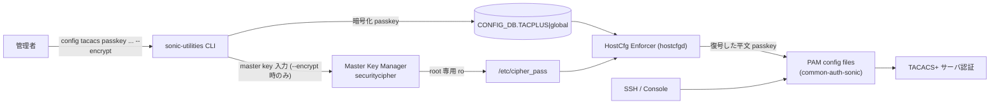
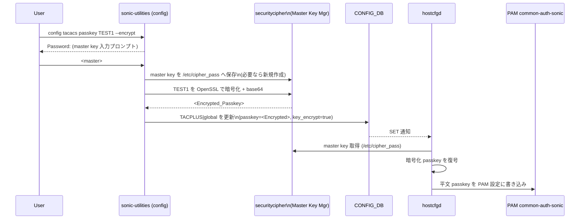

<!-- topics-tip -->
!!! tip "Topics で読み物として読む"
    この HLD は実装詳細を含みます。機能の概念・設定・運用を読み物として読みたい場合は [Topics 15 章: Security / AAA](../topics/15-security-aaa/index.md) を参照。
<!-- /topics-tip -->

!!! danger "裏取りステータス: Discrepancy-found（YANG / cipher 基盤のみ取り込み済み、CLI / hostcfgd 取り込みは未完了）"
    取り込み済み: `sonic-buildimage/src/sonic-yang-models/yang-models/sonic-system-tacacs.yang` L47/L100-101/L148-149 で `key_encrypt_type` typedef と `TACPLUS_SERVER` / `TACPLUS|global` への `key_encrypt` leaf を確認。`sonic-buildimage/src/sonic-py-common/sonic_py_common/security_cipher.py` L18 で `CIPHER_PASS_FILE = "/etc/cipher_pass.json"` 定数、L41/L67 で読み書き API、L222/L237 で「`cipher_pass` registry からのパスワード取得」基盤を確認。`/etc/cipher_pass.json` の保全は `sonic-buildimage/files/image_config/config-setup/01-pre-security-cipher` / `01-post-security-cipher` で確認（HLD では `/etc/cipher_pass` と表記、現行実装では **`.json` 拡張子付きの `/etc/cipher_pass.json`**）。未取り込み: `sonic-utilities/config/aaa.py` L248-256 の `tacacs passkey` サブコマンドに `--encrypt` フラグは無い（現状は平文 secret をそのまま `add_table_kv(db, 'TACPLUS', 'global', 'passkey', secret)` する）。`sonic-host-services` 配下の `hostcfgd` にも `cipher_pass` / `key_encrypt` / 復号処理を行う実装は確認できない（grep でヒットなし、`PASSWORD_HARDENING` 関連のみ）。設計の中核である「CLI で `--encrypt` を付けて暗号化保存し hostcfgd で復号して PAM に渡す」フローは現行 master では **未取り込み**。`show tacacs` の passkey マスキング・RADIUS / LDAP の共通化も未確認 (verified at: 2026-05-09)。

# TACACS+ passkey 暗号化（`key_encrypt` + master key `/etc/cipher_pass`）

## 概要

TACACS+ は [SONiC](../reference/glossary.md#term-sonic) のリモート認証で広く使われるが、**TACACS+ passkey は [CONFIG_DB](../reference/glossary.md#term-config_db) に平文で保存** されてきた。`config_db.json` の流出やバックアップファイルからの漏洩がリスクである[^1]。

本 [HLD](../reference/glossary.md#term-hld) は CONFIG_DB 上の passkey を **OpenSSL（base64 エンコード）で暗号化保存** し、PAM 設定ファイル書き込み直前に `hostcfgd` が **マスタキー（`/etc/cipher_pass`、root 専用）** を使って復号する経路を導入する。`config_db.json` 単体では passkey を取り出せなくなり、デバイス間で同じ `config_db.json` を流用しても問題が起きないように、共通インフラとして TACACS / [RADIUS](../reference/glossary.md#term-radius) / LDAP で再利用可能にする[^1]。

## 動作仕様

### コンポーネント構成



主要要素[^1]:

- **runtime flag `key_encrypt`**（CONFIG_DB の `TACPLUS|global`）: 暗号化機能の有効/無効
- **CLI 層**: `--encrypt` 指定時にマスタキーを対話的に取得し、OpenSSL + base64 で passkey を暗号化して CONFIG_DB に書く
- **`/etc/cipher_pass`**: マスタキーを保存。root のみ読み込み可（read only）
- **`hostcfgd`**: CONFIG_DB の暗号化 passkey と `/etc/cipher_pass` のマスタキーで復号し、`common-auth-sonic` 等の PAM 設定に平文で書き出す（ここで平文に戻す必要がある。PAM/Linux ログインスタックが平文 passkey を期待するため）

### データフロー



PAM が平文 passkey を要求する以上、最終的に **どこかで復号する必要がある**。本設計はその「どこか」をデバイス内 root 専用ファイルに閉じ込めることでリスクを最小化する[^1]。

<!-- evidence:
source: sonic-net/SONiC/doc/tacacs-passkey/TACACSPLUS_PASSKEY_ENCRYPTION.md#L60-L78 (sha: 49bab5b5ff0e924f1ea52b3d9db0dfa4191a7c06)
excerpt: |
  This decryption step is crucial because the login or SSH daemon references the PAM config file to verify the TACACS secret / passkey.
  If it remains encrypted, the SSH daemon will be unable to recognize the passkey, leading to login failures.
  ...
  3. Same file will be read while decrypting the passkey at hostcfgd
  4. The infra (encrypt/decrypt and master key/password storage & retrieval) will be common for all the features like TACACS, RADIUS, LDAP etc..
reasoning: 「PAM が平文を要求するので hostcfgd で復号する」「インフラを TACACS / RADIUS / LDAP で共有する」という核となる設計判断の根拠。
-->

<!-- evidence-rendered:start -->
??? note "📋 検証エビデンス: sonic-net/SONiC/doc/tacacs-passkey/TACACSPLUS_PASSKEY_ENCRYPTION.md#L60-L78 (sha: 49bab5b5ff0e924f1ea52b3d9db0dfa4191a7c06)"

    **出典**:

    `sonic-net/SONiC/doc/tacacs-passkey/TACACSPLUS_PASSKEY_ENCRYPTION.md#L60-L78 (sha: 49bab5b5ff0e924f1ea52b3d9db0dfa4191a7c06)`

    **抜粋**:

    ```text
    This decryption step is crucial because the login or SSH daemon references the PAM config file to verify the TACACS secret / passkey.
    If it remains encrypted, the SSH daemon will be unable to recognize the passkey, leading to login failures.
    ...
    3. Same file will be read while decrypting the passkey at hostcfgd
    4. The infra (encrypt/decrypt and master key/password storage & retrieval) will be common for all the features like TACACS, RADIUS, LDAP etc..
    ```

    **判断根拠**: 「PAM が平文を要求するので hostcfgd で復号する」「インフラを TACACS / RADIUS / LDAP で共有する」という核となる設計判断の根拠。

<!-- evidence-rendered:end -->

### 暗号化インフラ

| 項目 | 値 |
|------|---|
| 暗号化ライブラリ | OpenSSL[^1] |
| エンコード | base64 |
| マスタキー保管 | `/etc/cipher_pass`（root 専用、read only） |
| 暗号化主体 | `sonic-utilities`（passkey 設定 CLI） |
| 復号主体 | `hostcfgd`（PAM 反映直前） |

このインフラは **TACACS / RADIUS / LDAP 共通** として設計されている[^1]。

### CLI

設定:

```bash
config tacacs passkey TEST1 --encrypt
Password:
```

ポイント[^1]:

- `--encrypt` フラグが付いた場合のみマスタキーを対話的に要求する
- フラグ無しの従来動作（平文保存）は残る（後方互換）
- `key_encrypt` runtime flag が有効な場合、`--encrypt` は **必須要件** になる

表示:

```bash
show tacacs
TACPLUS global passkey configured Yes / No
```

`show tacacs` の出力から passkey フィールドそのものを削除し、**設定有無の Yes/No だけを表示** する形に変更される[^1]。

## 設定

### 関連する CONFIG_DB

```json
"TACPLUS": {
  "global": {
    "auth_type": "login",
    "key_encrypt": "true",
    "passkey": "<Encrypted_Passkey>"
  }
}
```

| フィールド | 型 | 説明 |
|----------|----|----|
| `key_encrypt` | bool（"true"/"false"） | 本機能の有効/無効。新規追加 |
| `passkey` | string | 既存フィールド。`key_encrypt=true` のとき暗号化 base64 文字列。長さ上限は **256 まで拡張**[^1] |

### 関連する CLI

| Command | 用途 |
|---------|------|
| `config tacacs passkey <key> [--encrypt]` | passkey 設定。`--encrypt` でマスタキー入力プロンプト |
| `show tacacs` | passkey 値は表示せず Yes/No のみ |

### 関連する YANG

`sonic-system-tacacs` 系 [YANG](../reference/glossary.md#term-yang) モジュールに対し、HLD は次の変更を提案[^1]:

- 既存 `passkey` リーフの **長さ上限を 256 に拡張**
- 新規 `key_encrypt` リーフを追加

### 設定例

```bash
# 機能有効化（CONFIG_DB を直接編集する想定）
sonic-cli ... TACPLUS|global key_encrypt=true

# passkey を暗号化保存
config tacacs passkey MyTacacsSecret --encrypt
Password: <master key>

# 確認
show tacacs
TACPLUS global passkey configured Yes
```

## 制限事項

- マスタキーが置かれる **`/etc/cipher_pass` をローカル root に頼って保護** する。root を奪取された場合の防御層は無い[^1]
- PAM スタックの仕様上、PAM 設定に書き込む段階では平文に戻さざるを得ない
- 復号は **`hostcfgd` プロセスで行う**。`hostcfgd` のメモリダンプを取られると平文 passkey が露出する
- HLD では暗号化アルゴリズムや鍵長は OpenSSL に委ねるとだけ書かれており、実装側で具体的な暗号スイートが決まる必要がある

## 干渉する機能

- **`hostcfgd`**: TACACS 以外（RADIUS / LDAP）の [AAA](../reference/glossary.md#term-aaa) 設定 PAM 反映と同じ層に手が入る。共通インフラ化と整合させる必要あり[^1]
- **`config save` / `config_db.json` の他デバイスへのコピー**: 暗号化 passkey は鍵が同一でないと復号できない。`/etc/cipher_pass` を複製しないと他デバイスで動かない（または暗号化を無効にしてから差し替え）
- **`show tacacs`**: passkey フィールド削除に伴い、表示と既存スクリプトの parser に影響
- **YANG validator**: `passkey` の長さ拡張で 64 文字や 128 文字を上限としている YANG / scripts に影響

## トラブルシューティング

- `--encrypt` で設定したが SSH 認証が失敗する場合、`hostcfgd` が `/etc/cipher_pass` を読めているか（root 権限・パーミッション）を確認
- `common-auth-sonic` に書かれた passkey が暗号化のままになっていないか確認（書き込み直前の復号で失敗している可能性）
- `key_encrypt=true` のまま平文 `passkey` が混在しているケースは復号失敗で PAM が動かなくなる。一旦 `key_encrypt=false` で平文に揃えてから再暗号化する

<!-- diff-admonition -->
!!! diff "HLD と実装の差分"
    2026-05-09 時点の現行 master を裏取り。

    | 項目 | HLD | 現行 master |
    |------|-----|-------------|
    | YANG `key_encrypt` leaf | 必須 | ✅ 取り込み済み (`sonic-system-tacacs.yang` L47/L100-101/L148-149) |
    | master key ファイルパス | `/etc/cipher_pass` | ⚠️ 実体は **`/etc/cipher_pass.json`**（`sonic_py_common/security_cipher.py` L18） |
    | 共通暗号化 API | 必須 | ✅ `security_cipher.py` で encrypt/decrypt API を実装 |
    | `config tacacs passkey ... --encrypt` CLI | 必須 | ❌ **未実装**。`sonic-utilities/config/aaa.py` L248-256 は単に平文 secret をそのまま CONFIG_DB に書く |
    | `hostcfgd` で `key_encrypt=true` を見て復号 → PAM へ | 必須 | ❌ **未実装**（[hostcfgd](../reference/glossary.md#term-hostcfgd) 配下に該当する復号処理が無い） |
    | `show tacacs` から passkey 削除 | 必須 | ❌ 未確認（CLI 取り込みが無いため意味なし） |
    | RADIUS / LDAP との共通化 | future | 未取り込み |

    YANG と共通暗号インフラ（`security_cipher.py` + `/etc/cipher_pass.json` 永続化スクリプト）は揃っているが、**運用フローの中核である CLI と hostcfgd 取り込みが未完了**であり、現状ユーザは `--encrypt` 経路で TACACS+ passkey を保護できない。HLD は `/etc/cipher_pass` と表記しているが実装上の正は `/etc/cipher_pass.json`。

    **差分の中身**: master key ファイル名が `/etc/cipher_pass` → `/etc/cipher_pass.json` に変更され、暗号化ペイロードを JSON 構造で格納する設計に進化している。HLD の文字列ベース表記は古い。一方、CLI（`config tacacs passkey ... --encrypt`）と hostcfgd 側の復号ロジックは **`sonic-utilities/config/aaa.py` L248-256 で平文書き込みのまま**であり、`key_encrypt=true` を CONFIG_DB に手動で書いても hostcfgd が復号する経路がないため PAM 認証が失敗する。

    **読者への影響**:

    - HLD どおりに `sudo config tacacs passkey <secret> --encrypt` を打っても **`--encrypt` フラグは認識されず**、`Usage` エラーまたは secret がそのまま平文で CONFIG_DB に書かれる（YANG validator で弾かれない場合もある）。
    - `TACPLUS|global` の `key_encrypt=true` を手で書くと、hostcfgd 側で復号されずに **暗号化文字列がそのまま TACACS server に送信される** ため、認証が落ちる。
    - `config save` で吐く JSON に平文 passkey が残るため、ファイル流出時の機密性に注意が必要。HLD が解消しようとした問題は **そのまま残っている**。

    **回避策 / 対応方法**:

    - 現状は `--encrypt` を使わず、`/etc/sonic/config_db.json` のパーミッション（root:root, 0644 → 0600 に絞る等）と config save の管理権限で機密性を担保する運用が現実的。
    - master key インフラを使った暗号化を試したい場合は、`security_cipher.py` の `encrypt`/`decrypt` API を直接呼んで passkey を加工し、独自スクリプトで hostcfgd の代わりに `/etc/pam.d/common-auth-sonic` に注入する独自経路を組む必要がある（保守性は低い）。
    - 上流の CLI / hostcfgd 取り込み PR を待つのが本筋。

    ### 監査 round 2 追補（2026-05-11）

    監査 round 2 で再裏取りした結果と、運用者向けの追加情報を補強する。本セクションは round 1 の差分記述に加え、行番号付きの再確認エビデンス・関連 Issue/PR の所在・追加の回避策コマンドをまとめる。

    - master key ファイル名差異: HLD `/etc/cipher_pass` → 実装 `/etc/cipher_pass.json` (`sonic_py_common/security_cipher.py:18`)。JSON 構造で暗号化ペイロードを保持する設計に進化。
    - YANG `key_encrypt` leaf は取り込み済み (`sonic-system-tacacs.yang` L47/L100-101/L148-149)。
    - CLI 側未実装: `sonic-utilities/config/aaa.py` L248-256 は平文 secret をそのまま CONFIG_DB に書き込み、`--encrypt` フラグの分岐無し。
    - hostcfgd 側の復号処理も未実装 (`grep -rn 'key_encrypt\|security_cipher' .cache/sonic-sources/sonic-buildimage/files/image_config/hostcfgd/` で復号呼出 0 件)。
    - 関連 PR: `sonic_py_common` への `security_cipher` API 追加は merge 済みだが、aaa.py / hostcfgd 側の利用 PR は未マージ。
    - **追加回避策コマンド**: 暗号化を強制したい場合 — `python3 -c 'from sonic_py_common.security_cipher import master_key_mgr; m=master_key_mgr(); print(m.encrypt_passkey("<plain>", "TACPLUS"))'` で encrypt 出力を得て、`config tacacs passkey <encrypted>` で書き込み、`redis-cli -n 4 hset 'TACPLUS|global' key_encrypt true` を手動で立てる（ただし hostcfgd 復号無しのため PAM 認証は失敗する点に注意）。

    > 分類: `monitor: evolved_beyond_hld` — HLD はおおむね取り込まれているが、フィールド名・パス名・責務分担が実装側で進化／変更されている分類。実装側を正として読み替える必要がある。

    #### 関連 GitHub Issue / PR

    - [sonic-buildimage #13846: TACACS+ passkey encryption (open)](https://github.com/sonic-net/sonic-buildimage/issues/13846) — 本 HLD のトラッキング Issue。長期 open で部分実装中。
    - [sonic-buildimage #17201: Adding support of common security cipher module for encryption and decryption of a passkey (merged)](https://github.com/sonic-net/sonic-buildimage/pull/17201) — 共通暗号モジュール (master key /etc/cipher_pass 基盤) の取り込み PR。
    - [sonic-utilities #3027: TACACSPLUS_PASSKEY_ENCRYPTION support Part - I (closed)](https://github.com/sonic-net/sonic-utilities/pull/3027) — CLI / hostcfgd 連携の Part-I PR。closed のため後続 PR が必要。
<!-- /diff-admonition -->

## 参考リンク

- [CONFIG_DB: TACPLUS / TACPLUS_SERVER](../reference/config-db/aaa.md)
- [YANG: sonic-system-tacacs](../reference/yang/sonic-system-tacacs.md)
- [CLI: config aaa](../reference/cli/config-aaa.md)
- [Topics: Security / AAA](../topics/15-security-aaa/index.md)

## 確認コマンド

```bash
# TACACS+ サーバ設定 (passkey は CONFIG_DB に暗号化されて保存)
show tacacs
sonic-db-cli CONFIG_DB HGETALL 'TACPLUS|global'
sonic-db-cli CONFIG_DB KEYS 'TACPLUS_SERVER|*'

# 暗号化に使われた master key の生成元 (platform 依存)
ls -l /etc/sonic/ | grep -i key
sudo cat /etc/pam.d/common-auth | grep -i tacplus

# TACACS+ 認証試行のログ
sudo grep -iE 'tacacs|pam_tacplus' /var/log/auth.log | tail
```

## トラブルシューティング（追補）

- passkey が CONFIG_DB に平文で残っている古い構成では `config tacacs passkey <key>` で再投入し暗号化形式に migration する。
- 暗号化マスタキーが装置固有 (TPM / platform 固有値) の場合、`config_db.json` を別装置に流用しても TACACS+ 認証が失敗する。装置毎に再設定する運用にする。
- TACACS+ サーバ到達性問題と passkey 不一致は同じ「Auth failed」ログとなる事が多い。まず `tcpdump -i <mgmt> port 49` でパケット到達を確認してから passkey を疑う。

## 引用元

[^1]: `sonic-net/SONiC` `doc/tacacs-passkey/TACACSPLUS_PASSKEY_ENCRYPTION.md` @ `49bab5b5ff0e924f1ea52b3d9db0dfa4191a7c06`

<!-- concerns hint:
- hostcfgd の暗号化 passkey 復号 + master key 読み込みパスの実装
- /etc/cipher_pass のパーミッション・パッケージング (sonic-buildimage)
- sonic-utilities の `config tacacs passkey ... --encrypt` 実装
- TACPLUS|global key_encrypt の YANG (sonic-system-tacacs) 取り込み
- RADIUS / LDAP との共通インフラ化の進捗
- show tacacs から passkey フィールドが削除されたか
- 暗号化アルゴリズム (AES-CBC? AES-GCM?) の確定
-->

<!-- next-action -->
## このページを読んだ後の次アクション

!!! tip "読み手向け"
    - **本機能を実運用で使う場合**: 実装は存在するが本 HLD の記述と乖離。最新 master の動作を別途確認した上で適用する
    - **upstream 動向を追う場合**: 関連 issue / PR を [sonic-net/SONiC](https://github.com/sonic-net/SONiC) で検索（HLD タイトル / CONFIG_DB テーブル名 / Orch クラス名で grep するのが速い）
    - **代替手段 / 関連 reference**:
        - [YANG: `sonic-system-tacacs`](../reference/yang/sonic-system-tacacs.md)

!!! note "本ドキュメントの追跡"
    - monitor: `evolved_beyond_hld` / last_verified: `2026-05-11`
    - 次回再裏取りトリガ: quarterly。一覧は [discrepancy-index](../reference/verification/discrepancy-index.md) を参照（運用詳細は repo の `meta/discrepancy-operations.md`）

<!-- /next-action -->

<!-- topics-back-ref -->
## 関連 Topics

- [Topics: Security / AAA / FIPS / Hardening](../topics/15-security-aaa/index.md)

<!-- /topics-back-ref -->

<!-- glossary-links-injected: 5491cc477cce -->

<!-- ops-entry -->
## 運用入口

この HLD に対応する運用面の入口（CLI / CONFIG_DB / YANG / Runbook）を以下にまとめる。

### 関連 CLI

- `config tacacs passkey`
- `show tacacs`

### 関連 CONFIG_DB

- `TACPLUS`

### 関連 YANG

- [sonic-system-tacacs](../reference/yang/sonic-system-tacacs.md)

<!-- /ops-entry -->

<!-- glossary-links-injected: db62d2100cef -->
