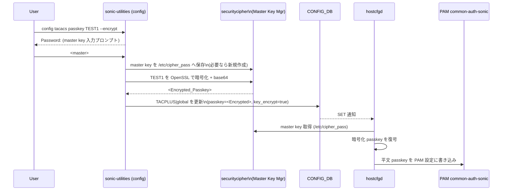

!!! warning "裏取りステータス: HLD-only"
    本ページは公式 HLD（Rev 0.1, 2023-11）のみを根拠に書かれている。`hostcfgd` の暗号化 passkey 復号処理、`sonic-utilities` の `--encrypt` フラグ、`/etc/cipher_pass` の取り扱い、共通暗号化インフラ（RADIUS / LDAP 共通化）は未確認。

# TACACS+ passkey 暗号化（`key_encrypt` + master key `/etc/cipher_pass`）

## 概要

TACACS+ は SONiC のリモート認証で広く使われるが、**TACACS+ passkey は CONFIG_DB に平文で保存** されてきた。`config_db.json` の流出やバックアップファイルからの漏洩がリスクである[^1]。

本 HLD は CONFIG_DB 上の passkey を **OpenSSL（base64 エンコード）で暗号化保存** し、PAM 設定ファイル書き込み直前に `hostcfgd` が **マスタキー（`/etc/cipher_pass`、root 専用）** を使って復号する経路を導入する。`config_db.json` 単体では passkey を取り出せなくなり、デバイス間で同じ `config_db.json` を流用しても問題が起きないように、共通インフラとして TACACS / RADIUS / LDAP で再利用可能にする[^1]。

## 動作仕様

### コンポーネント構成

```mermaid
flowchart LR
    USER[管理者] -->|config tacacs passkey ... --encrypt| CLI[sonic-utilities CLI]
    CLI -->|master key 入力 (--encrypt 時のみ)| MK[Master Key Manager\nsecuritycipher]
    MK -->|root 専用 ro| FILE[/etc/cipher_pass]
    CLI -->|暗号化 passkey| CFG[(CONFIG_DB.TACPLUS|global)]
    CFG --> HCE[HostCfg Enforcer (hostcfgd)]
    FILE --> HCE
    HCE -->|復号した平文 passkey| PAM[PAM config files\n(common-auth-sonic)]
    SSH[SSH / Console] --> PAM
    PAM --> AUTH[TACACS+ サーバ認証]
```

主要要素[^1]:

- **runtime flag `key_encrypt`**（CONFIG_DB の `TACPLUS|global`）: 暗号化機能の有効/無効
- **CLI 層**: `--encrypt` 指定時にマスタキーを対話的に取得し、OpenSSL + base64 で passkey を暗号化して CONFIG_DB に書く
- **`/etc/cipher_pass`**: マスタキーを保存。root のみ読み込み可（read only）
- **`hostcfgd`**: CONFIG_DB の暗号化 passkey と `/etc/cipher_pass` のマスタキーで復号し、`common-auth-sonic` 等の PAM 設定に平文で書き出す（ここで平文に戻す必要がある。PAM/Linux ログインスタックが平文 passkey を期待するため）

### データフロー



PAM が平文 passkey を要求する以上、最終的に **どこかで復号する必要がある**。本設計はその「どこか」をデバイス内 root 専用ファイルに閉じ込めることでリスクを最小化する[^1]。

<!-- evidence:
source: sonic-net/SONiC/doc/tacacs-passkey/TACACSPLUS_PASSKEY_ENCRYPTION.md#L60-L78 (sha: 49bab5b5ff0e924f1ea52b3d9db0dfa4191a7c06)
excerpt: |
  This decryption step is crucial because the login or SSH daemon references the PAM config file to verify the TACACS secret / passkey.
  If it remains encrypted, the SSH daemon will be unable to recognize the passkey, leading to login failures.
  ...
  3. Same file will be read while decrypting the passkey at hostcfgd
  4. The infra (encrypt/decrypt and master key/password storage & retrieval) will be common for all the features like TACACS, RADIUS, LDAP etc..
reasoning: 「PAM が平文を要求するので hostcfgd で復号する」「インフラを TACACS / RADIUS / LDAP で共有する」という核となる設計判断の根拠。
-->

### 暗号化インフラ

| 項目 | 値 |
|------|---|
| 暗号化ライブラリ | OpenSSL[^1] |
| エンコード | base64 |
| マスタキー保管 | `/etc/cipher_pass`（root 専用、read only） |
| 暗号化主体 | `sonic-utilities`（passkey 設定 CLI） |
| 復号主体 | `hostcfgd`（PAM 反映直前） |

このインフラは **TACACS / RADIUS / LDAP 共通** として設計されている[^1]。

### CLI

設定:

```bash
config tacacs passkey TEST1 --encrypt
Password:
```

ポイント[^1]:

- `--encrypt` フラグが付いた場合のみマスタキーを対話的に要求する
- フラグ無しの従来動作（平文保存）は残る（後方互換）
- `key_encrypt` runtime flag が有効な場合、`--encrypt` は **必須要件** になる

表示:

```bash
show tacacs
TACPLUS global passkey configured Yes / No
```

`show tacacs` の出力から passkey フィールドそのものを削除し、**設定有無の Yes/No だけを表示** する形に変更される[^1]。

## 設定

### 関連する CONFIG_DB

```json
"TACPLUS": {
  "global": {
    "auth_type": "login",
    "key_encrypt": "true",
    "passkey": "<Encrypted_Passkey>"
  }
}
```

| フィールド | 型 | 説明 |
|----------|----|----|
| `key_encrypt` | bool（"true"/"false"） | 本機能の有効/無効。新規追加 |
| `passkey` | string | 既存フィールド。`key_encrypt=true` のとき暗号化 base64 文字列。長さ上限は **256 まで拡張**[^1] |

### 関連する CLI

| Command | 用途 |
|---------|------|
| `config tacacs passkey <key> [--encrypt]` | passkey 設定。`--encrypt` でマスタキー入力プロンプト |
| `show tacacs` | passkey 値は表示せず Yes/No のみ |

### 関連する YANG

`sonic-system-tacacs` 系 YANG モジュールに対し、HLD は次の変更を提案[^1]:

- 既存 `passkey` リーフの **長さ上限を 256 に拡張**
- 新規 `key_encrypt` リーフを追加

### 設定例

```bash
# 機能有効化（CONFIG_DB を直接編集する想定）
sonic-cli ... TACPLUS|global key_encrypt=true

# passkey を暗号化保存
config tacacs passkey MyTacacsSecret --encrypt
Password: <master key>

# 確認
show tacacs
TACPLUS global passkey configured Yes
```

## 制限事項

- マスタキーが置かれる **`/etc/cipher_pass` をローカル root に頼って保護** する。root を奪取された場合の防御層は無い[^1]
- PAM スタックの仕様上、PAM 設定に書き込む段階では平文に戻さざるを得ない
- 復号は **`hostcfgd` プロセスで行う**。`hostcfgd` のメモリダンプを取られると平文 passkey が露出する
- HLD では暗号化アルゴリズムや鍵長は OpenSSL に委ねるとだけ書かれており、実装側で具体的な暗号スイートが決まる必要がある

## 干渉する機能

- **`hostcfgd`**: TACACS 以外（RADIUS / LDAP）の AAA 設定 PAM 反映と同じ層に手が入る。共通インフラ化と整合させる必要あり[^1]
- **`config save` / `config_db.json` の他デバイスへのコピー**: 暗号化 passkey は鍵が同一でないと復号できない。`/etc/cipher_pass` を複製しないと他デバイスで動かない（または暗号化を無効にしてから差し替え）
- **`show tacacs`**: passkey フィールド削除に伴い、表示と既存スクリプトの parser に影響
- **YANG validator**: `passkey` の長さ拡張で 64 文字や 128 文字を上限としている YANG / scripts に影響

## トラブルシューティング

- `--encrypt` で設定したが SSH 認証が失敗する場合、`hostcfgd` が `/etc/cipher_pass` を読めているか（root 権限・パーミッション）を確認
- `common-auth-sonic` に書かれた passkey が暗号化のままになっていないか確認（書き込み直前の復号で失敗している可能性）
- `key_encrypt=true` のまま平文 `passkey` が混在しているケースは復号失敗で PAM が動かなくなる。一旦 `key_encrypt=false` で平文に揃えてから再暗号化する

## 引用元

[^1]: `sonic-net/SONiC` `doc/tacacs-passkey/TACACSPLUS_PASSKEY_ENCRYPTION.md` @ `49bab5b5ff0e924f1ea52b3d9db0dfa4191a7c06`

<!-- concerns hint:
- hostcfgd の暗号化 passkey 復号 + master key 読み込みパスの実装
- /etc/cipher_pass のパーミッション・パッケージング (sonic-buildimage)
- sonic-utilities の `config tacacs passkey ... --encrypt` 実装
- TACPLUS|global key_encrypt の YANG (sonic-system-tacacs) 取り込み
- RADIUS / LDAP との共通インフラ化の進捗
- show tacacs から passkey フィールドが削除されたか
- 暗号化アルゴリズム (AES-CBC? AES-GCM?) の確定
-->
