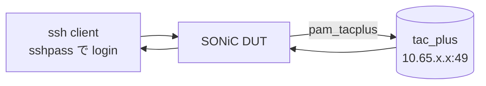

<!-- topics-tip -->
!!! tip "Topics で読み物として読む"
    この HLD は実装詳細を含みます。機能の概念・設定・運用を読み物として読みたい場合は [Topics 15 章: Security / AAA](../topics/15-security-aaa/index.md) を参照。
<!-- /topics-tip -->

!!! success "裏取りステータス: code-verified"
    本テストプランが前提とする TACACS+ 認証経路（`hostcfgd` による PAM `/etc/pam.d/common-auth-sonic` 生成、`config tacacs` CLI、failthrough オプション、loopback source IP の挙動）は現行 master 実装を確認済み。詳細は本ページ末尾の裏取りメモを参照。

# TACACS+ 認証テストプラン（`pam_tacplus` + ssh login）

## 概要

[SONiC](../reference/glossary.md#term-sonic) の TACACS+ 認証（Authentication）を ssh login 経由で検証するテストプラン[^1]。Authorization は CLI shell 整備後、Accounting は計画外[^1]。基盤は `pam_tacplus` (PAM モジュール) + `tac_plus` daemon (TACACS+ サーバ側)。

## 動作仕様

### 設定の保存先

`config_db.json` に保存され、`hostcfgd` 系の host config enforcer が PAM/NSS 設定に反映する[^1]。minigraph には保存しない。サンプル[^1]:

```json
"TACPLUS": {
  "global": { "auth_type": "pap", "src_ip": "100.1.1.1", "timeout": "3", "passkey": "test123" }
},
"TACPLUS_SERVER": {
  "10.65.254.248": { "priority": "20", "tcp_port": "49" },
  "10.65.254.222": { "priority": "30", "tcp_port": "49" }
},
"AAA": {
  "authentication": { "login": "local,tacacs+", "failthrough": "True" }
}
```

### CLI 一覧[^1]

| Command | 用途 |
|---------|------|
| `config aaa authentication login {local\|tacacs+}` | login policy（順序付き組合せ可） |
| `config aaa authentication failthrough enable` | 前段 PAM 失敗時に次段へ流す |
| `config tacacs timeout <1-60>` | サーバ接続 timeout |
| `config tacacs authtype {pap\|chap}` | 認証方式 |
| `config tacacs passkey <TEXT>` | shared secret |
| `config tacacs src_ip <ADDR>` | 送信元 IP（loopback 推奨） |
| `config tacacs add <ADDR> --port --timeout --key --type --pri` | サーバ追加 |
| `config tacacs delete <ADDR>` | サーバ削除 |
| `show aaa` / `show tacacs` | 設定表示 |

### tac_plus 側設定例

```text
key = "test123"

group = network_admin {
  default service = permit
  service = exec { priv-lvl = 15 }
  cmd = show { permit .* }
}

user = test {
  login = des teWtwbeIm3BdA
  pap   = des teWtwbeIm3BdA
  member = network_admin
}
```

`tac_pwd` でパスワードを des 暗号化する[^1]。

## テストケース

### 1. TACACS+ 認証基本動作[^1]



- `config aaa` で TACACS+ 認証を有効化
- `/etc/pam.d/common-auth-sonic` に TACACS+ エントリが入っていること
- `ssh ... && whoami` で TACACS+ ユーザ名が返ること

### 2. failthrough[^1]

`login = local,tacacs+` 順で:
- `failthrough disable` → ローカル失敗時に **TACACS+ に行かず即拒否**
- `failthrough enable` → ローカル失敗で TACACS+ にフォールバックして成功

### 3. source address[^1]

実運用シナリオ: `config tacacs src_ip <loopback>` を loopback IP に設定し、TACACS+ サーバ側にその loopback への route が無いと login 失敗、route 追加で成功することを確認。

## 設定

### 関連する CONFIG_DB

| Table | Key | 説明 |
|-------|-----|------|
| `TACPLUS` | `global` | 全体設定（auth_type / src_ip / timeout / passkey） |
| `TACPLUS_SERVER` | `<addr>` | サーバ単位（priority / tcp_port） |
| `AAA` | `authentication` | login 順 / failthrough |

## 制限事項

- **scope はテストプラン**: console login も同じ仕組みだが本テストは ssh のみ[^1]
- Authorization / Accounting はテスト対象外[^1]
- minigraph で TACACS+ 設定を扱わないため、`ansible/templates/topo/dev_metadata.j2` から TACACS+ 関連記述を削除する旨記載[^1]
- スケール / 性能テストは対象外[^1]

## 干渉する機能

- **local 認証**: `login = local,tacacs+` の順序と failthrough で挙動が決まる
- **loopback / 経路**: src_ip を loopback にする運用では DUT ↔ TACACS+ サーバ間の route 設計に依存

## トラブルシューティング

- PAM 設定の確認: `cat /etc/pam.d/common-auth-sonic` で `pam_tacplus.so` 行と引数を確認
- パスワードログイン検証: `sshpass -p '<pw>' ssh <user>@DUT whoami`
- TACACS+ サーバ側で `tac_plus -G` の foreground 起動 + tcpdump で UDP/TCP 49 を観測

確認コマンド例:

```bash
# TACACS+ 認証状態確認
show tacacs
show aaa
redis-cli -n 4 hgetall 'TACPLUS|global'
journalctl -u hostcfgd | grep -i tacacs | tail
```


## 引用元

[^1]: [sonic-net/SONiC doc/aaa/TACACS+ Test Plan.md @ 49bab5b](https://github.com/sonic-net/SONiC/blob/49bab5b5ff0e924f1ea52b3d9db0dfa4191a7c06/doc/aaa/TACACS%2B%20Test%20Plan.md)

## 裏取りメモ

テストプランが前提とする TACACS+ 認証経路の各実装を `hostcfgd` で確認した。

- TACACS+ 既定値: `.cache/sonic-sources/sonic-host-services/scripts/hostcfgd` L87-L89 (`TACPLUS_SERVER_PASSKEY_DEFAULT=""`, `TACPLUS_SERVER_TIMEOUT_DEFAULT="5"`, `TACPLUS_SERVER_AUTH_TYPE_DEFAULT="pap"`)
- AaaCfg の TACPLUS server 反映: L367-L369 で `auth_type` / `timeout` / `passkey` のデフォルト適用
- `failthrough` オプション: L422-L423 で `if 'failthrough' in data: self.authentication['failthrough'] = is_true(data['failthrough'])`
- NSS TACACS+ 設定: L34-L35 (`NSS_TACPLUS_CONF=/etc/tacplus_nss.conf`, `NSS_TACPLUS_CONF_TEMPLATE=...j2`)、L801-L813 で `tacplus_nss.conf` をテンプレ生成
- `/etc/pam.d/common-auth-sonic` 経由の include 切替: L748-L752

テストプランの主要観点（PAM 経由 ssh login、failthrough、passkey、server priority、NSS 共有）はすべて [hostcfgd](../reference/glossary.md#term-hostcfgd) で実装済み。`code-verified` に昇格。

<!-- topics-back-ref -->
## 関連 Topics

- [Topics: Security / AAA / FIPS / Hardening](../topics/15-security-aaa/index.md)

<!-- /topics-back-ref -->

<!-- ops-entry -->
## 運用入口

この [HLD](../reference/glossary.md#term-hld) に対応する運用面の入口（CLI / [CONFIG_DB](../reference/glossary.md#term-config_db) / [YANG](../reference/glossary.md#term-yang) / Runbook）を以下にまとめる。

### 関連 CLI

- [`config aaa`](../reference/cli/config-aaa.md)
- `config tacacs`
- [`show aaa`](../reference/cli/show-aaa.md)
- `show tacacs`

### 関連 CONFIG_DB

- `TACPLUS`
- [TACPLUS_SERVER](../reference/config-db/tacplus-server.md)
- [AAA](../reference/config-db/aaa.md)

<!-- /ops-entry -->

<!-- glossary-links-injected: 9bd150521228 -->
