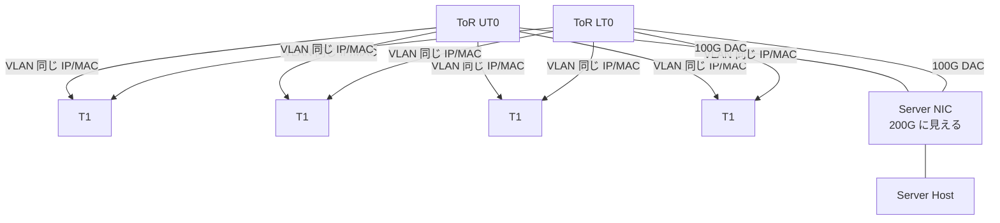
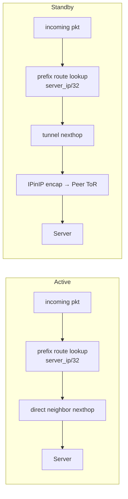

<!-- topics-tip -->
!!! tip "Topics で読み物として読む"
    この HLD は実装詳細を含む。機能の概念・設定・運用を読み物として読みたい場合は [Topics 05 章: Dual ToR / MUX / アクティブ冗長](../topics/05-dual-tor/index.md) を参照。
<!-- /topics-tip -->

!!! success "裏取りステータス: code-verified"
    `sonic-linkmgrd` に active-active 専用の state machine 一式 (`src/link_manager/LinkManagerStateMachineActiveActive.{cpp,h}`、`src/link_prober/LinkProberStateMachineActiveActive.{cpp,h}`) が存在し、`MuxOrch` は `cable_type == "active-active"`（`muxorch.cpp:2233`）で active-active 系処理を分岐する。新規 APP_DB / STATE_DB テーブル（`FORWARDING_STATE_COMMAND` / `FORWARDING_STATE_RESPONSE` / `HW_FORWARDING_STATE_PEER` / `HW_MUX_CABLE_TABLE_PEER`）は `sonic-swss-common/common/schema.h:145-149,465` に登録済み。`config mux mode detach` も `sonic-utilities/config/muxcable.py:351` の `click.Choice` に追加済み。warm reboot 対応は HLD 上 TBD のままで本ページの裏取り範囲外。

# Active-Active Dual ToR（gRPC ベース cable control + prefix-based neighbor）

## 読み手が知りたいこと

1. active-standby と何が違うのか？ **なぜ「両方 active」が可能** なのか？
2. 両 ToR が同じ [VLAN](../reference/glossary.md#term-vlan) IP / MAC を出して **NIC はどうトラフィックを分けている** のか？
3. cable 制御が y-cable I2C ではなく **gRPC** になったのはなぜか？
4. **[linkmgrd](../reference/glossary.md#term-linkmgrd) の状態判定** は active-standby とどう違うのか？
5. **prefix-based neighbor architecture** とは何で、何が嬉しいのか？
6. **両 ToR が standby に落ちる** ような縮退時に何が起きるか？
7. 設定とトラブルシュートで最低限見るものは？

## 1. active-standby との違い（要約）

active-active は **両 ToR が常時トラフィックを処理する** 設計[^1]。サーバ NIC は 2 本の 100Gbps DAC で UT0 / LT0 に接続し、ToR は同じ VLAN IP / MAC を提示する。NIC が 5-tuple でフローを分散し、ToR から gRPC 経由で active リンクの指示を受ける。

| 項目 | active-standby | active-active |
|------|---------------|--------------|
| 帯域 | 1 リンク分 | 2 リンク分 |
| Northbound | 両 ToR に複製 | NIC が分散 |
| cable control | I2C (smart y-cable) | gRPC over DAC (ToR ⇔ SoC NIC) |
| MuxOrch ingress drop | 必要 | 不要（NIC 側が制御） |
| state machine | y-cable 方向ベース | リンク健全性ベース（独立判断） |



T1 から見ると 2 つの [ECMP](../reference/glossary.md#term-ecmp) next hop が存在する[^1]。

## 2. NIC 側の役割（パケット振り分け）

NIC は同一 IP / MAC を 2 リンクで受け、northbound は **5-tuple で 2 リンクに分散** する。一部パケットは **両リンクへ複製** が必要[^1]:

| パケット種別 | 動作 |
|------------|-----|
| [ARP](../reference/glossary.md#term-arp) / IPv6 RS / NS / NA (133/135/136) | **両ポート複製** |
| ICMP / ICMPv6 heartbeat (Loopback2 宛) | **両ポート複製** |
| gRPC reply (Loopback3_Port0_IP / Port1_IP 宛) | **対応ポートにのみ送信** |
| その他 | NIC が任意リンクを選択 |

各 ToR は別の loopback IP を持ち、NIC は gRPC 応答先をそれで決める。

## 3. cable 制御が gRPC な理由（Transceiver Daemon）

SoC NIC 側で gRPC server が動作。linkmgrd は xcvrd 経由で以下の RPC を発行[^1]:

- `DualToRActive`
    - port 単位で self / peer の forwarding state を query / set
    - port 単位で self / peer のサーバ側 link state を query
- `GracefulRestart`: SoC からの shutdown / restart 通知

ToR は NIC に **admin forwarding state** (active/standby) を gRPC で通知する。NIC 側は別途 **operational forwarding state** を持ち、自身が link down を検知した場合は admin=active でも送信を停止する。**ToR の制御権と NIC の即時反応を両立** する仕組み[^1]。

## 4. linkmgrd の状態判定

active-standby と異なり、active-active では **self と peer をそれぞれ独立に判定** する[^1]。link prober は流用:

- default 100ms で ICMP heartbeat を送出（payload TLV に ToR GUID）
- 3 連続損失で unhealthy
- ICMP reply は NIC が両 ToR に複製するため **peer の health も観測可能**

### Link Prober の 4 状態

| 状態 | 意味 |
|------|------|
| `LinkProberUnknown` | 初期 / ICMP reply 受信なし |
| `LinkProberActive` | self ToR ID 入りの reply を受信 |
| `LinkProberPeerUnknown` | peer ToR ID 入りの reply 未受信 |
| `LinkProberPeerActive` | peer ToR ID 入りの reply を受信 |

### 状態決定表

| Default Route | Link State | LP self | LP peer | Link Manager State | gRPC self | gRPC peer |
|---|---|---|---|---|---|---|
| Available | Up | Active | Active | Active | set active | no-op |
| Available | Up | Active | Unknown | Active | set active | set standby |
| Available | Up | Unknown | * | Standby | set standby | no-op |
| Available | Down | * | * | Standby | set standby | no-op |
| Missing | * | * | * | Standby | set standby | no-op |

**default route 監視**: T1 への default route が消えると northbound パケロスが起きるため、linkmgrd は default route 消失中は ICMP probing を停止し unhealthy を fake する（無効化可）[^1]。

## 5. prefix-based neighbor architecture

active-standby の旧設計では [SAI](../reference/glossary.md#term-sai) neighbor + nexthop で **暗黙 host route (/32 or /128)** が SDK 内に作られ、active/standby 切替で neighbor を add/remove していた。これを変更[^1]:

- neighbor entry は `SAI_NEIGHBOR_ENTRY_ATTR_NO_HOST_ROUTE=true` で作る（**暗黙 host route なし**）
- 別途 `server_ip/32` (or `/128`) **prefix route** を明示的に作る
- 切替は **prefix route の next hop を直接 neighbor next hop ↔ tunnel next hop で更新するだけ**
- neighbor entry 自体は **永続化**（状態遷移で削除しない）



利点: **stability + 性能** 改善、**mux toggle latency が短い**[^1]。

`MuxCfgOrch` が `MUX_CABLE` を読み、`TunnelOrch` が `MUX_TUNNEL` を購読して [IPinIP](../reference/glossary.md#term-ipinip) tunnel を作成し、`MuxOrch` が prefix route の next hop を更新する。

## 6. 縮退ケース

### 両 ToR が standby

両 ToR が standby になると **gRPC traffic も tunnel 経由** で投げられ blackhole する。`MuxOrch` は **neighbor が NIC IP の場合 Tunnelmgrd 通知を skip** し、kernel route を tunnel 化しない。standby 中でも **gRPC 制御プレーン traffic は local で送出** され NIC に到達する[^1]。

### BGP update delay

[BGP](../reference/glossary.md#term-bgp) セッション確立直後、T0 が default route を学習する前に T1 から traffic が降りる時期がある。standby T0 は tunnel 経由で peer に投げるが、default route が無いと tunnel 経路自体が解決できず blackhole する。対策として **BGP update delay 10 秒**[^1]。

### ingress drop ACL の skip

active-standby では standby 移行時に MuxOrch が ingress drop [ACL](../reference/glossary.md#term-acl) を貼っていたが、NIC 側の admin state 切替が gRPC で完了する前に upstream traffic が drop される間隙が問題。active-active では **standby 切替時の ingress drop ACL を貼らない**（best effort forwarding）[^1]。

### gRPC unreachable

forwarding は止めず、定期的に gRPC server health を確認しつつ admin state を再同期[^1]。

## 7. 設定と CLI

### 関連する CONFIG_DB

| Table | Key | 説明 |
|-------|-----|------|
| `MUX_CABLE` | `<PORT>` | `cable_type=active-active` で本機能を選択。`server_ipv4 / ipv6 / soc_ipv4` も保持 |
| `MUX_TUNNEL` | (定義) | TunnelOrch が IPinIP tunnel を作る根拠 |

### 新規 APP_DB / STATE_DB

| Table | Key | 役割 |
|-------|-----|-----|
| `APP_DB.FORWARDING_STATE_COMMAND` | `<PORT>` | linkmgrd → xcvrd: `probe / set_active_self / set_standby_self / set_standby_peer` |
| `APP_DB.FORWARDING_STATE_RESPONSE` | `<PORT>` | xcvrd の応答（`response_peer ∈ {active, standby, unknown, error}`） |
| `APP_DB.PORT_TABLE_PEER` | `<PORT>` | xcvrd が peer link 状態を linkmgrd に通知 |
| `APP_DB.HW_FORWARDING_STATE_PEER` | `<PORT>` | linkmgrd → xcvrd: peer の admin forwarding state |
| `STATE_DB.HW_MUX_CABLE_TABLE_PEER` | `<PORT>` | xcvrd が peer の admin forwarding state を書き戻し |

### CLI

| Command | 用途 |
|---------|------|
| `show mux status` | port / status / server_status / health / hwstatus / last_switchover_time |
| `show mux config` | peer ToR / cable_type / mux state / soc_ipv4 |
| `show mux tunnel-route [--json] <port>` | tunnel route の kernel / asic 存在確認 |
| `config mux mode <auto\|manual\|active\|standby\|detach> <port>` | mux 動作モード |

### 設定例

```bash
# 既定（auto: self / peer 双方の failover を有効化）
config mux mode auto Ethernet4

# メンテナンス時に self の failover のみ・peer 側を触らない
config mux mode detach Ethernet4

# 強制 active 化（manual 固定）
config mux mode active Ethernet4
```

`show mux status` 例[^1]:

```text
PORT        STATUS    SERVER_STATUS    HEALTH    HWSTATUS    LAST_SWITCHOVER_TIME
Ethernet4   active    active           healthy   consistent  2023-Mar-27 07:57:43
```

`HEALTH=healthy` の条件: port up + self link probe reply 受信 + `STATUS == SERVER_STATUS`（または `SERVER_STATUS=unknown`） + T1 default route 存在[^1]。

## 8. トラブルシューティング

| 症状 | 最初に見る場所 |
|------|---------------|
| `HEALTH=unhealthy` | port up / link probe reply / default route の順に確認 |
| `HWSTATUS=inconsistent` | ToR 側 admin state と NIC 側 admin state の乖離 → gRPC 通信ログ / xcvrd ログ |
| standby 切替で traffic 断 | `show mux tunnel-route <port>` で prefix route の next hop を確認 |
| 両 ToR standby で通信不能 | linkmgrd の rescue ロジックと default route 状態 |

確認コマンド例:

```bash
# Dual ToR / MUX 状態確認
show mux status
show mux config
redis-cli -n 6 hgetall 'MUX_CABLE_TABLE|Ethernet0'
redis-cli -n 4 hgetall 'MUX_CABLE|Ethernet0'
```


## 制限事項

- **warm reboot** は [HLD](../reference/glossary.md#term-hld) で TBD
- gRPC server / ToR の認証は HLD で詳細未定
- 両 ToR standby 時の tunneled control plane traffic は NIC IP 局所送出に依存
- BGP update delay 10 秒は active-active 専用。session 確立後 routing convergence が遅延
- ingress drop ACL 不在のため standby 期の上り traffic がベストエフォート

## 実装との乖離 / 補足

現行 master（2026-05 時点）の実コード裏取り結果:

- **linkmgrd active-active state machine**: `sonic-linkmgrd/src/link_manager/LinkManagerStateMachineActiveActive.{cpp,h}` および `src/link_prober/LinkProberStateMachineActiveActive.{cpp,h}` が active-standby と並列に存在。`PeerActiveState` / `PeerUnknownState` / `PeerWaitState` も `src/link_prober/` に追加されており、self / peer 独立判定が実装されている。
- **MuxOrch の active-active 分岐**: `sonic-swss/orchagent/muxorch.cpp:2233` で `cable_type_str == "active-active"` 判定。prefix-based neighbor の SAI 属性（`SAI_NEIGHBOR_ENTRY_ATTR_NO_HOST_ROUTE`）と prefix route の組合せは [muxorch](../reference/glossary.md#term-muxorch) / neighorch 内で扱う。
- **新規 APP_DB / [STATE_DB](../reference/glossary.md#term-state_db) テーブル**: `sonic-swss-common/common/schema.h` に `APP_FORWARDING_STATE_COMMAND_TABLE_NAME` (145行)、`APP_FORWARDING_STATE_RESPONSE_TABLE_NAME` (146行)、`APP_PEER_HW_FORWARDING_STATE_TABLE_NAME` (149行)、`STATE_PEER_HW_FORWARDING_STATE_TABLE_NAME` (465行) が定義済み。
- **`config mux mode detach`**: `sonic-utilities/config/muxcable.py:351` で `click.Choice(["active","auto","manual","standby","detach"])` として `detach` を受け付ける。

## 関連トピック

- [Topics: Dual ToR](../topics/05-dual-tor/index.md) — Dual ToR 全体像と active-standby との対比
- [active-standby dual ToR](active-standby-dual-tor.md)

## 引用元

[^1]: `sonic-net/SONiC` `doc/dualtor/active_active_hld.md` @ `49bab5b5ff0e924f1ea52b3d9db0dfa4191a7c06`

<!-- concerns hint:
- linkmgrd の active-active state machine 実装存在確認（sonic-linkmgrd）
- MuxOrch の prefix-based neighbor (SAI_NEIGHBOR_ENTRY_ATTR_NO_HOST_ROUTE=true + prefix route) 実装確認
- 新規 APP_DB / STATE_DB テーブル（FORWARDING_STATE_COMMAND, PORT_TABLE_PEER, HW_FORWARDING_STATE_PEER, HW_MUX_CABLE_TABLE_PEER）の現行スキーマ確認
- config mux mode detach の sonic-utilities / xcvrd 取り込み確認
- BGP update delay 10s 設定の現行 master 取り込み確認
- ingress drop ACL skip の MuxOrch 実装確認
-->

<!-- topics-back-ref -->
## 関連 Topics

- [Topics: Dual-ToR と Mux 制御](../topics/05-dual-tor/index.md)

<!-- /topics-back-ref -->

<!-- glossary-links-injected: fa77d98b9e28 -->
