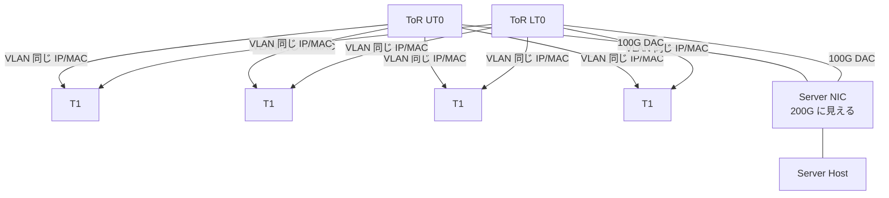
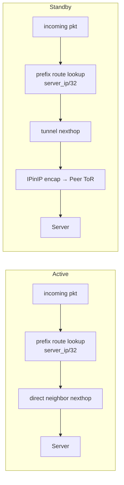

!!! warning "裏取りステータス: HLD-only"
    `linkmgrd` の active-active 用 state machine、`MuxOrch` の prefix-based neighbor 実装（`SAI_NEIGHBOR_ENTRY_ATTR_NO_HOST_ROUTE=true` + 別 prefix route）、`HW_FORWARDING_STATE_PEER` などの新規 APP_DB / STATE_DB テーブル、`config mux mode detach` の `xcvrd` への取り込みは実コードでの裏取り未済。warm reboot 対応は HLD では TBD。

# Active-Active Dual ToR（gRPC ベース cable control + prefix-based neighbor）

## 概要

active-active dual ToR は **active-standby dual ToR の進化形** であり、**両 ToR が常時トラフィックを処理する** 設計である。サーバ NIC は 2 本の 100Gbps DAC を介して上下 2 つの ToR (UT0 / LT0) と接続し、ToR は同じ VLAN IP / MAC を提示する。NIC は 5-tuple 単位でフローを 2 リンクに分散し、ToR から `gRPC` 経由で「どのリンクを active にするか」の指示を受ける[^1]。

active-standby との主な違い[^1]:

| 項目 | active-standby | active-active |
|------|---------------|--------------|
| 帯域 | 1 リンク分 | 2 リンク分 |
| Northbound | 両 ToR に複製 | NIC が分散 |
| cable control | I2C (smart y-cable) | gRPC over DAC (ToR ⇔ SoC NIC) |
| MuxOrch ingress drop | 必要 | 不要（NIC 側が制御） |
| state machine | y-cable 方向ベース | リンク健全性ベース（独立判断） |

## 動作仕様

### クラスタトポロジ



両 ToR が **同じ VLAN IP / MAC** を T1 に広告し、T1 から見ると 2 つの ECMP next hop が存在する[^1]。

### サーバ NIC 側要件

NIC は **同一 IP / MAC を 2 リンクで受ける** 前提で southbound を上位スタックに渡し、northbound は **5-tuple ベースで 2 リンクへ分散** する。一部のパケットは **両リンクへ複製** する必要がある[^1]:

| パケット種別 | 動作 |
|------------|-----|
| ARP / IPv6 RS / NS / NA (133/135/136) | **両ポート複製** |
| ICMP / ICMPv6 heartbeat (Loopback2 宛) | **両ポート複製** |
| gRPC reply (Loopback3_Port0_IP / Port1_IP 宛) | **対応ポートにのみ送信**（Port が UP の場合） |
| その他 | NIC が任意のリンクを選択 |

各 ToR は **個別の loopback IP** を持ち、NIC はそれを基に gRPC 応答先を決定する。

### CONFIG_DB / APP_DB / STATE_DB 拡張

新規スキーマ[^1]:

| Table | Key | フィールド | 役割 |
|-------|-----|-----------|-----|
| `CONFIG_DB.MUX_CABLE` | `<PORT>` | `cable_type: active-standby \| active-active` | cable 種別 |
| `APP_DB.FORWARDING_STATE_COMMAND` | `<PORT>` | `command: probe / set_active_self / set_standby_self / set_standby_peer` | linkmgrd → xcvrd への問い合わせ・設定要求 |
| `APP_DB.FORWARDING_STATE_RESPONSE` | `<PORT>` | `response`, `response_peer ∈ {active, standby, unknown, error}` | xcvrd の応答 |
| `APP_DB.PORT_TABLE_PEER` | `<PORT>` | `oper_status: up/down` | xcvrd が peer link 状態を linkmgrd に通知 |
| `APP_DB.HW_FORWARDING_STATE_PEER` | `<PORT>` | `state: active/standby/unknown` | linkmgrd → xcvrd: peer の admin forwarding state 設定要求 |
| `STATE_DB.HW_MUX_CABLE_TABLE_PEER` | `<PORT>` | `state` | xcvrd が peer の admin forwarding state を linkmgrd に書き戻し |

### linkmgrd の役割

linkmgrd は active-standby から **link prober** をそのまま流用する[^1]:

- **default 100ms** で ICMP heartbeat を送出（src MAC = SVI MAC、payload TLV に ToR GUID を載せる）
- **3 連続損失** で unhealthy と判定
- ICMP reply は NIC が両 ToR に複製するため **peer の health も観測可能**

#### Link Prober の 4 状態

| 状態 | 意味 |
|------|------|
| `LinkProberUnknown` | 初期 / ICMP reply 受信なし |
| `LinkProberActive` | self ToR ID 入りの reply を受信 |
| `LinkProberPeerUnknown` | peer ToR ID 入りの reply 未受信（peer link 不調の可能性） |
| `LinkProberPeerActive` | peer ToR ID 入りの reply を受信 |

#### admin / operational forwarding state

ToR は NIC に **admin forwarding state** (active/standby) を gRPC で通知する。NIC 側は別途 **operational forwarding state** を持ち、自身が link down を検知した場合は admin が `active` であってもそのリンクへの送信を停止する[^1]。これで「ToR 側の制御権」と「NIC の即時反応」を両立する。

#### active-active 状態決定

active-standby のように y-cable 方向で同期せず、**self / peer をそれぞれ独立に判定** する[^1]:

- self: link prober が active かつ link state が up → admin = active、それ以外 → standby
- peer rescue: 自身 active かつ peer の heartbeat reply が無い → peer を standby と判定
- gRPC unreachable: forwarding は止めず、定期的に gRPC server health を確認しつつ admin state を再同期

#### default route 監視

T1 への default route が消えると northbound パケロスが起きるため、**linkmgrd は default route 監視を行い、消失中は ICMP probing を停止し unhealthy を fake する**（無効化可）[^1]。

#### 状態決定表

| Default Route | Link State | LP self | LP peer | Link Manager State | gRPC self | gRPC peer |
|---|---|---|---|---|---|---|
| Available | Up | Active | Active | Active | set active | no-op |
| Available | Up | Active | Unknown | Active | set active | set standby |
| Available | Up | Unknown | * | Standby | set standby | no-op |
| Available | Down | * | * | Standby | set standby | no-op |
| Missing | * | * | * | Standby | set standby | no-op |

### Orchagent 側

#### IPinIP tunnel + MuxOrch

orchagent 起動時に **peer ToR への IPinIP tunnel** を作る。`MuxOrch` は linkmgrd の状態変化を購読し、neighbor prefix route の next hop を **直接 next hop ↔ tunnel next hop** で切り替える[^1]:

- `MuxCfgOrch`: `MUX_CABLE` を読み port ↔ server IP マップを `MuxOrch` に渡す
- `TunnelOrch`: `MUX_TUNNEL` を購読し、tunnel object と termination / decap entry を作成（`SAI_NEXT_HOP_TYPE_TUNNEL_ENCAP` を MuxOrch が next hop として参照）
- `MuxOrch`: linkmgrd の state 変化に応じ neighbor prefix route の next hop を更新

#### prefix-based neighbor architecture

従来は SAI neighbor + nexthop で **暗黙的 host route (/32 or /128)** が SDK に作られ、active/standby 切替で neighbor を **add/remove** していた。これを以下に変更する[^1]:

- neighbor entry は `SAI_NEIGHBOR_ENTRY_ATTR_NO_HOST_ROUTE = true` で作る（**暗黙 host route なし**）
- 別途 `server_ip/32` (または `/128`) **prefix route** を明示的に作る
- prefix route の next hop を直接 neighbor next hop ↔ tunnel next hop で **更新するだけ** にする
- neighbor entry 自体は **永続化** され、状態遷移で削除しない



利点[^1]:

- 状態遷移で neighbor add/remove を行わないため **stability + 性能** 改善
- next hop 変更だけなので **mux toggle latency が短い**

### Transceiver Daemon と gRPC

SoC NIC 側で gRPC server が動作。linkmgrd は xcvrd 経由で以下の RPC を発行する[^1]:

- `DualToRActive`
    - port 単位で self / peer の forwarding state を query
    - port 単位で self / peer のサーバ側 link state を query
    - port 単位で self / peer の forwarding state を set
- `GracefulRestart`: SoC からの shutdown / restart 通知

### gRPC traffic の特殊扱い

両 ToR が standby になると gRPC traffic も tunnel 経由で投げられ blackhole する。これを防ぐため `MuxOrch` は **neighbor が NIC IP の場合 Tunnelmgrd への通知を skip** し、kernel route を tunnel 化させない。これで standby 中でも **gRPC 制御プレーン traffic は local で送出** され、NIC に到達できる[^1]。

### BGP update delay

active-active T0 は BGP セッション確立後、T1 に default route が広告される前に T1 から traffic が降りてくる時期がある。standby T0 は tunnel 経由で peer に投げるが、自身に default route が無ければ tunnel 経路自体が解決できず blackhole する。対策として **BGP update delay 10 秒** を導入し、T0 が T1 から default を学習する時間を確保する[^1]。

### ingress drop ACL の skip

旧設計では standby 移行時に `MuxOrch` が **ingress drop ACL** を貼っていたが、NIC 側の admin state 切替が gRPC 経由で完了する前に upstream traffic が drop される間隙が問題だった。新設計では **standby 切替時の ingress drop ACL を貼らない** ことで、その間隙でも best effort で forwarding する[^1]。

## 設定

### 関連する CONFIG_DB

| Table | Key | 説明 |
|-------|-----|------|
| `MUX_CABLE` | `<PORT>` | `cable_type=active-active` で本機能を選択。`server_ipv4 / ipv6 / soc_ipv4` も保持 |
| `MUX_TUNNEL` | (定義) | TunnelOrch が IPinIP tunnel を作る根拠 |

### 関連する CLI

| Command | 用途 |
|---------|------|
| `show mux status` | port / status / server_status / health / hwstatus / last_switchover_time |
| `show mux config` | peer ToR / cable_type / mux state / soc_ipv4 |
| `show mux tunnel-route [--json] <port>` | server_ipv4 / server_ipv6 / soc_ipv4 の tunnel route が kernel / asic に存在するか |
| `config mux mode <auto\|manual\|active\|standby\|detach> <port>` | mux 動作モード設定 |

### 設定例

```bash
# 既定動作（auto: self / peer 双方の failover を有効化）
config mux mode auto Ethernet4

# メンテナンス時に self の failover のみ有効・peer 側を触らない
config mux mode detach Ethernet4

# 強制 active 化（toggle 後 manual モードで固定）
config mux mode active Ethernet4
```

`show mux status` 例[^1]:

```text
PORT        STATUS    SERVER_STATUS    HEALTH    HWSTATUS    LAST_SWITCHOVER_TIME
Ethernet4   active    active           healthy   consistent  2023-Mar-27 07:57:43
Ethernet8   active    active           healthy   consistent  2023-Mar-27 07:59:33
```

`HEALTH` は以下を満たすと `healthy`[^1]:

- port status が up
- self link probe の reply 受信
- `STATUS` と `SERVER_STATUS` 一致 or `SERVER_STATUS=unknown`
- T1 への default route 存在

## 制限事項

- **warm reboot** は HLD で TBD[^1]
- gRPC server (SoC) と ToR の信頼関係 / 認証は HLD では詳細未定
- **両 ToR が standby** の状況では tunneled control plane traffic も blackhole する。NIC IP 宛 traffic を local で送る特別扱いに依存
- BGP update delay (10 秒) は active-active 専用設定。session 確立後の routing convergence が遅延する
- ingress drop ACL を貼らない方針は **standby 期の上り traffic が ToR に届く** ため、ベストエフォート前提

## 干渉する機能

- **`linkmgrd` (sonic-linkmgrd)**: state machine + link prober + default route 監視
- **`xcvrd` (transceiver daemon)**: gRPC client / server の橋渡し
- **`orchagent` (`MuxCfgOrch` / `TunnelOrch` / `MuxOrch`)**: prefix route と tunnel next hop の切替
- **`bgpd`**: 両 ToR が同じ VLAN を広告。update delay の追加
- **NIC ファームウェア**: 5-tuple 分散 + ARP/NDP 複製 + gRPC reply 振り分けの仕様遵守

## トラブルシューティング

- `show mux status` の `HEALTH=unhealthy` → port up / link probe reply / default route の有無を順に確認
- `HWSTATUS=inconsistent` → ToR 側 admin state と NIC 側 admin state が乖離。gRPC 通信ログ / xcvrd ログ確認
- standby 切替で traffic 断 → prefix route の next hop が tunnel に切り替わっているか `show mux tunnel-route <port>` で確認
- 両 ToR が standby 化して通信不能 → linkmgrd の rescue ロジック / default route 状態を確認

## 引用元

[^1]: `sonic-net/SONiC` `doc/dualtor/active_active_hld.md` @ `49bab5b5ff0e924f1ea52b3d9db0dfa4191a7c06`

<!-- concerns hint:
- linkmgrd の active-active state machine 実装存在確認（sonic-linkmgrd）
- MuxOrch の prefix-based neighbor (SAI_NEIGHBOR_ENTRY_ATTR_NO_HOST_ROUTE=true + prefix route) 実装確認
- 新規 APP_DB / STATE_DB テーブル（FORWARDING_STATE_COMMAND, PORT_TABLE_PEER, HW_FORWARDING_STATE_PEER, HW_MUX_CABLE_TABLE_PEER）の現行スキーマ確認
- config mux mode detach の sonic-utilities / xcvrd 取り込み確認
- BGP update delay 10s 設定の現行 master 取り込み確認
- ingress drop ACL skip の MuxOrch 実装確認
-->
