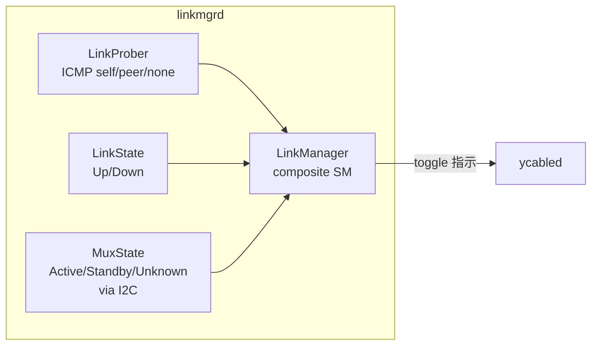

# Active-Standby Dual ToR 概念

このページは [Active-Standby Dual ToR（概要ハブ）](active-standby-dual-tor.md) の派生ページで、**構成・要件・[linkmgrd](../reference/glossary.md#term-linkmgrd) サブモジュール** に絞って整理する。設定・運用は [active-standby-dual-tor-operations.md](active-standby-dual-tor-operations.md)、内部実装は [active-standby-dual-tor-internals.md](active-standby-dual-tor-internals.md)、制限事項は [active-standby-dual-tor-limitations.md](active-standby-dual-tor-limitations.md) を参照。

## 1. 構成と要件

**2 台の ToR (UTO / LTO) と 1 台のサーバ NIC を smart y-cable で接続** し、片側を active、もう片側を standby として運用する構成[^1]。`linkmgrd` が link health を監視し、不健全を検知すると **standby 側が自発的に active へ昇格** する。standby 側で受けたトラフィックは **[IPinIP](../reference/glossary.md#term-ipinip) tunnel** で peer ToR に転送する。

要件は **「リンク or ToR 障害時に健全な側へ切り替えられること」** に尽きる[^1]。

ToR ↔ NIC の動作[^1]:

- ToR → NIC: 両リンクは UP 状態だが **active 側のみ** が NIC に転送
- NIC → ToR: **両 ToR にブロードキャスト**（standby 側でドロップまたは tunnel）
- mux switchover で **link down は発生しない**
- ToR → NIC 方向では切替時に **数パケットの破損 / drop** がありうる
- NIC → ToR 方向は **無瞬断**

routing 側[^1]:

- 両 ToR は **同じ [VLAN](../reference/glossary.md#term-vlan) 設定 + 同じ virtual MAC** を保持し T1 に同じ prefix を広告
- 同じ port が **両 ToR で active / standby** に分かれる
- standby ToR で受けた server 宛 traffic は **L3 IPinIP tunnel** で peer ToR に転送

## 2. linkmgrd（4 サブモジュール）

### LinkProber

ICMP payload に **ToR ID (UUID) を TLV エンコード** し ICMP echo を server に送る。応答 ICMP の payload から[^1]:

| イベント | 意味 | 遷移先 |
|---------|------|-------|
| `ICMP_NONE` | `LINK_PROBE.TIMEOUT * INTERVAL` ms 受信なし | LinkProberStateUnknown |
| `ICMP_SELF` | 自 ToR ID 入り reply 受信 | LinkProberStateActive |
| `ICMP_PEER` | peer ToR ID 入り reply 受信 | LinkProberStateStandby |

IPv4 / IPv6 双方を送るが **判定は IPv4 のみ**。IPv6 はモニタ用で interval が長い[^1]。

### MuxState (I2C 経由)

y-cable の I2C レジスタ（例: Credo の `B132 @ page 4`）から [MUX](../reference/glossary.md#term-mux) 方向を取得[^1]: `MuxActive` / `MuxStandby` / `MuxUnknown`（I2C 応答なし = cable 故障 / 電源 OFF）。

### LinkManager（合成状態機械）

LinkProber + LinkState + MuxState の合成状態。**standby ToR が能動的に switchover を駆動** する設計（両 ToR が同時に切替を試みるのを防ぐ）[^1]。詳細な遷移表は [active-standby-dual-tor-internals.md](active-standby-dual-tor-internals.md) を参照。

## 関連ページ

- [Active-Standby Dual ToR（概要ハブ）](active-standby-dual-tor.md)
- [active-standby-dual-tor-operations.md](active-standby-dual-tor-operations.md) — 設定・CLI
- [active-standby-dual-tor-internals.md](active-standby-dual-tor-internals.md) — Orch / state machine / neighbor 取扱い
- [active-standby-dual-tor-limitations.md](active-standby-dual-tor-limitations.md) — 制限事項

## 引用元

[^1]: `sonic-net/SONiC` `doc/dualtor/dualtor_active_standby_hld.md` @ `49bab5b5ff0e924f1ea52b3d9db0dfa4191a7c06`

<!-- glossary-links-injected: de79ad2c6d94 -->
