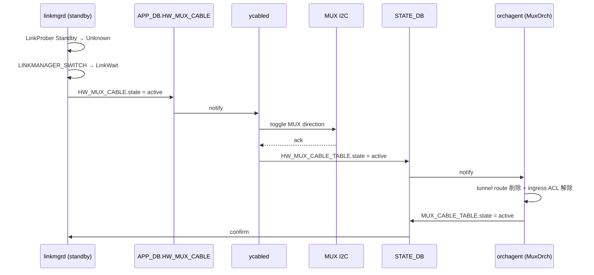

# Active-Standby Dual ToR 内部実装

このページは [Active-Standby Dual ToR（概要ハブ）](active-standby-dual-tor.md) の派生ページで、**state machine / [orchagent](../reference/glossary.md#term-orchagent) / neighbor 取扱い / I2C スイッチオーバ** の内部実装に絞って整理する。概念は [active-standby-dual-tor-concepts.md](active-standby-dual-tor-concepts.md)、設定は [active-standby-dual-tor-operations.md](active-standby-dual-tor-operations.md)、制限事項は [active-standby-dual-tor-limitations.md](active-standby-dual-tor-limitations.md) を参照。

## 1. LinkManager 状態遷移表

LinkProber + LinkState + MuxState の合成状態。**standby ToR が能動的に switchover を駆動** する設計（両 ToR が同時に切替を試みるのを防ぐ）[^1]。

LinkUp 時:

| MuxState \ LinkProber | Active | Standby | Unknown |
|---|---|---|---|
| Active | Noop | LINKMANAGER_CHECK → MuxWait | LINKMANAGER_CHECK → LinkWait（heartbeat 一時停止） |
| Standby | LINKMANAGER_CHECK → MuxWait | Noop | **LINKMANAGER_SWITCH** → LinkWait |
| MuxWait | Noop | Noop | Noop |
| LinkWait | LINKMANAGER_CHECK → MuxWait | LINKMANAGER_CHECK → MuxWait | Noop |
| MuxFailure | Faulty Cable | Faulty Cable | Faulty Cable |

LinkDown 時:

| MuxState \ LinkProber | Active | Standby | Unknown |
|---|---|---|---|
| Active | Noop | Noop | LINKMANAGER_SWITCH → LinkWait |
| Standby | Noop | Noop | LINKMANAGER_SWITCH → LinkWait |
| MuxFailure | Faulty Cable | Faulty Cable | Faulty Cable |

active → unknown 遷移時は `linkprober_suspend_timer` で一時的に heartbeat を停止し、対向 standby が早期に takeover できるようにする[^1]。

## 2. TunnelOrch

`CONFIG_DB.TUNNEL` の `MUX_TUNNEL` entry を購読し[^1]:

- [IPinIP](../reference/glossary.md#term-ipinip) tunnel object 作成（`tunnel_type=IPINIP`、`dst_ip=Loopback0`、`dscp_mode=uniform`、`encap_ecn_mode=standard`、`ecn_mode=copy_from_outer`、`ttl_mode=pipe`）
- decap entry / tunnel termination 作成
- `SAI_NEXT_HOP_TYPE_TUNNEL_ENCAP` を MuxOrch の next hop として供給

## 3. MuxOrch

[linkmgrd](../reference/glossary.md#term-linkmgrd) の状態変化を購読し[^1]:

1. tunnel route 追加 / 削除
2. **standby port での ingress drop [ACL](../reference/glossary.md#term-acl)** 追加 / 削除
3. neighbor entry の取り扱い（後述）

[HLD](../reference/glossary.md#term-hld) は neighbor 取扱い 3 案（route+neighbor 共存 / orchagent delete / ACL redirect）を比較するが最終採用案を明示していない。**現行 master は「neighbor + standalone tunnel route」併用案** を採用（`sonic-swss/orchagent/muxorch.cpp:2444-2460` の `createStandaloneTunnelRoute()` / `removeStandaloneTunnelRoute()`）。

### Rollback 動作

orchagent が遷移失敗した場合[^1]: 元状態に rollback → APP_DB に新状態 → ycabled が [STATE_DB](../reference/glossary.md#term-state_db) に書き戻し → orchagent が STATE_DB に `unknown` を書く → linkmgrd が再判定。orchagent は state 変化に対して **idempotent** であること。

## 4. neighbor の特殊扱い

standby ToR では [ARP](../reference/glossary.md#term-arp) request が drop されるため、通常の neighbor 学習が成立しない。次の仕掛けを併用する[^1]:

### Proxy ARP（IPv4）

server-to-server traffic を必ず L3 経路に乗せるため `proxy_arp` を有効化し、server 発トラフィックに `dst_mac = ToR router MAC` を強制する。standby ToR で受けたパケットを encap して active ToR に流せる[^1]。

### Proxy NDP（IPv6）

IPv6 は subnet レベル proxy が無いため明示的に neighbor entry を入れる[^1]:

```bash
sysctl -w net.ipv6.conf.Vlan1000.proxy_ndp=1
ip -6 neigh add proxy fc02:1000::3 dev Vlan1000
```

`nbrmgrd` が `MUX_CABLE|<PORT>` を購読し各 server IPv6 を proxy entry として登録する案がある。

### GARP / unsolicited NA

standby ToR は **active 側が出す GARP** で ARP 表を学習[^1]:

```bash
echo 1 > /proc/sys/net/ipv4/conf/Vlan1000/arp_accept
```

IPv6 は `accept_untracked_na=1` を kernel に backport して unsolicited NA を受理する。

### Neighbor miss の 4 ケース

1. **active 側で encap パケット受信時の miss**: standby から encap されてきた最初のパケットを active が decap した時、neighbor 未学習だと **encap パケット全体が CPU trap** される。kernel は decap して ARP 送出を行えないため、**Loopback0 宛 + Portchannel uplink 入り** のパケットを listen する Python サービスが内部 dst IP に **ping を打って ARP/NS を kernel に発行させる**[^1]
2. **片側リンク down**: `PEER_SWITCH` table がある dual-tor 環境では ARP 未解決 entry を **zero mac + type=tunnel** で APP_DB の `NEIGH` に書き、tunnel route を peer に install。`arp_update` が定期的に再学習試行[^1]
3. **Directed Broadcast**: HW フラッディングで standby port を含めた挙動が単一 ToR と異なる（HLD では TBD）
4. **standby で IPv6 neighbor が FAILED 化**: `accept_untracked_na=1` + `arp_update` script が `FAILED` を `INCOMPLETE` に書き換え、active 側 NA で resolve[^1]

## 5. y-cable I2C 障害（ycabled）

旧 `xcvrd` を `ycabled` に改名[^1]。`APP_DB.HW_MUX_CABLE` を購読し I2C 経由で [MUX](../reference/glossary.md#term-mux) を toggle する。`i2c_retry_count` 回失敗で `MUX_FAIL` を `STATE_DB.HW_MUX_CABLE_TABLE` に書く。報告状態（コード上の定数名 → 実 DB 文字列値）: `MUX_XCVRD_ACTIVE` → `active` / `MUX_XCVRD_STANDBY` → `standby` / `MUX_XCVRD_UNKNOWN` → `unknown`。`STATE_DB.HW_MUX_CABLE_TABLE` の `state` フィールドには小文字の文字列値 (`active` / `standby` / `unknown`) が書き込まれる。

### switchover シーケンス（standby → active）



## 6. 実装との乖離 / 補足

現行 master（2026-05 時点）の実コード裏取り結果:

- **linkmgrd の構成**: HLD は LinkProber / MuxState / LinkState / LinkManager の 4 サブモジュールと記述。実装は `sonic-linkmgrd/src/` 配下に `link_prober/` / `mux_state/` / `link_manager/` の 3 ディレクトリ + `DbInterface.cpp`（state_db / app_db 通信を担う）の構成で概ね一致。
- **MuxOrch の neighbor 取扱い**: HLD の 3 案のうち **「neighbor entry を残して standby 側は zero-MAC + standalone tunnel route」案** を採用。
- **`PEER_SWITCH` テーブル / `PeerSwitchOrch`**: `sonic-swss/orchagent/orchdaemon.cpp:469` で `CFG_PEER_SWITCH_TABLE_NAME` をハンドラに登録、`muxorch.cpp:2190` で `MuxOrch::handlePeerSwitch` ハンドラを設定。
- **ycabled**: `sonic-platform-daemons/sonic-ycabled/ycable/ycable.py` に独立 daemon として存在（旧 xcvrd から分離）。
- **STATE_DB スキーマ**: `MUX_METRICS_TABLE` (`schema.h:460`)、`LINK_PROBE_STATS` (462行)、`MUX_METRICS_TABLE_PEER` (464行)、APP_DB の `MUX_CABLE_RESPONSE_TABLE` (143行) すべて取り込み済み。
- **arp_update**: `sonic-buildimage/files/scripts/arp_update` に存在。
- **dualtor neighbor 監視**: `sonic-utilities/scripts/dualtor_neighbor_check.py` に補助スクリプト。

## 関連ページ

- [Active-Standby Dual ToR（概要ハブ）](active-standby-dual-tor.md)
- [active-standby-dual-tor-concepts.md](active-standby-dual-tor-concepts.md) — 構成と要件
- [active-standby-dual-tor-operations.md](active-standby-dual-tor-operations.md) — 設定・CLI
- [active-standby-dual-tor-limitations.md](active-standby-dual-tor-limitations.md) — 制限事項

## 引用元

[^1]: `sonic-net/SONiC` `doc/dualtor/dualtor_active_standby_hld.md` @ `49bab5b5ff0e924f1ea52b3d9db0dfa4191a7c06`

<!-- glossary-links-injected: 3dc47e5d23ad -->
