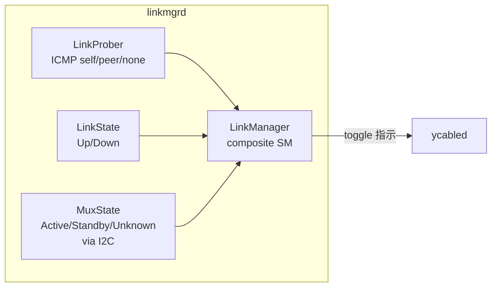
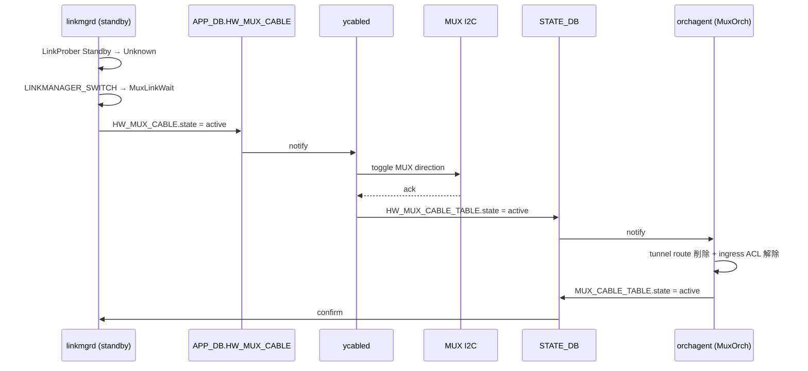

!!! success "裏取りステータス: code-verified"
    `sonic-linkmgrd` の `src/link_manager/`・`src/link_prober/`・`src/mux_state/` ディレクトリ構成と、`LinkManagerStateMachineActiveStandby.{cpp,h}` の存在を確認。`MuxOrch` は HLD の 3 案のうち **「neighbor + standalone tunnel route」併用案** を採用しており、`muxorch.cpp:2444-2460` の `createStandaloneTunnelRoute` / `removeStandaloneTunnelRoute` がそれに該当する。`ycabled` は `sonic-platform-daemons/sonic-ycabled/` 配下に実装済みで `xcvrd` から分離されている。`MUX_METRICS_TABLE` / `LINK_PROBE_STATS` / `MUX_CABLE_RESPONSE_TABLE` / `MUX_METRICS_TABLE_PEER` などの STATE_DB / APP_DB スキーマも `sonic-swss-common/common/schema.h:143,460-464` に登録済み。`arp_update` スクリプトは `sonic-buildimage/files/scripts/arp_update` に存在。詳細は後段「実装との乖離 / 補足」。

# Active-Standby Dual ToR（y-cable + linkmgrd state machine + IPinIP tunnel）

## 概要

active-standby dual ToR は **2 台の ToR (UTO / LTO) と 1 台のサーバ NIC を smart y-cable で接続** し、片側を active、もう片側を standby として運用する構成である。`linkmgrd` が link health を監視し、不健全を検知すると **standby 側が自発的に active へ昇格** する。standby 側で受けたトラフィックは **IPinIP tunnel** で peer ToR に転送する[^1]。

要件は単純で **「リンク or ToR 障害時に健全な側へ切り替えられること」** に尽きる[^1]。

ToR ↔ NIC の動作[^1]:

- ToR → NIC: 両リンクは UP 状態だが **active 側のみ** が NIC に転送
- NIC → ToR: **両 ToR にブロードキャスト**（standby 側でドロップまたは tunnel）
- mux switchover で **link down は発生しない**
- ToR → NIC 方向では切替時に **数パケットの破損 / drop** がありうる
- NIC → ToR 方向は **無瞬断**

routing 側[^1]:

- 両 ToR は **同じ VLAN 設定 + 同じ virtual MAC** を保持し T1 に同じ prefix を広告
- 同じ port が **両 ToR で active / standby** に分かれる
- standby ToR で受けた server 宛 traffic は **L3 IPinIP tunnel** で peer ToR に転送

## 動作仕様

### linkmgrd 4 サブモジュール



#### LinkProber

ICMP payload に **ToR ID (UUID) を TLV エンコード** し、ICMP echo を server に送る。応答 ICMP の payload を見て[^1]:

| イベント | 意味 | 遷移先 |
|---------|------|-------|
| `ICMP_NONE` | `LINK_PROBE.TIMEOUT * INTERVAL` ms 受信なし | LinkProberStateUnknown |
| `ICMP_SELF` | 自 ToR ID が含まれる reply 受信 | LinkProberStateActive |
| `ICMP_PEER` | peer ToR ID が含まれる reply 受信 | LinkProberStateStandby |

ICMP プローブは **IPv4 と IPv6 の双方** を送るが、**判定は IPv4 のみ**。IPv6 はモニタ用で **interval が長い**[^1]。

#### MuxState (I2C 経由)

y-cable の I2C レジスタ (例: Credo の `B132 @ page 4`) から **MUX 方向**を取得する[^1]:

- `MuxActive`: MUX が自 ToR を向く
- `MuxStandby`: MUX が peer ToR を向く
- `MuxUnknown`: I2C 応答なし（cable 故障 / 電源 OFF）

#### LinkManager 状態遷移表

LinkManager は LinkProber + LinkState + MuxState の合成状態。**standby ToR が能動的に switchover を駆動** する設計（両 ToR が同時に切替を試みるのを防ぐ）[^1]。

LinkUp 時:

| MuxState \ LinkProber | Active | Standby | Unknown |
|---|---|---|---|
| Active | Noop | LINKMANAGER_CHECK → MuxWait | LINKMANAGER_CHECK → LinkWait（heartbeat 一時停止） |
| Standby | LINKMANAGER_CHECK → MuxWait | Noop | **LINKMANAGER_SWITCH** → LinkWait |
| MuxWait | Noop | Noop | Noop |
| LinkWait | LINKMANAGER_CHECK → MuxWait | LINKMANAGER_CHECK → MuxWait | Noop |
| MuxFailure | Faulty Cable | Faulty Cable | Faulty Cable |

LinkDown 時:

| MuxState \ LinkProber | Active | Standby | Unknown |
|---|---|---|---|
| Active | Noop | Noop | LINKMANAGER_SWITCH → LinkWait |
| Standby | Noop | Noop | LINKMANAGER_SWITCH → LinkWait |
| MuxFailure | Faulty Cable | Faulty Cable | Faulty Cable |

active → unknown 遷移時は **`linkprober_suspend_timer` で一時的に heartbeat を停止** し、対向 standby が早期に takeover できるようにする[^1]。

### orchagent (`MuxCfgOrch` / `MuxOrch` / `TunnelOrch`)

#### MuxCfgOrch

`CONFIG_DB.MUX_CABLE` を購読し **port → server IP** マップを `MuxOrch` に渡す[^1]。

#### TunnelOrch

`CONFIG_DB.TUNNEL` の `MUX_TUNNEL` entry を購読し[^1]:

- IPinIP tunnel object 作成（`tunnel_type=IPINIP`、`dst_ip=Loopback0`、`dscp_mode=uniform`、`encap_ecn_mode=standard`、`ecn_mode=copy_from_outer`、`ttl_mode=pipe`）
- decap entry / tunnel termination 作成
- `SAI_NEXT_HOP_TYPE_TUNNEL_ENCAP` を `MuxOrch` の next hop として供給

#### MuxOrch

linkmgrd の状態変化を購読し[^1]:

1. tunnel route 追加 / 削除
2. **standby port での ingress drop ACL** 追加 / 削除
3. neighbor entry の取り扱い（後述）

#### neighbor 取扱い 3 案

HLD は 3 つのアプローチを比較する[^1]:

| 案 | 概要 |
|---|---|
| route + neighbor 共存 | route が優先。IPv6 で `MUX_CABLE` の server IP が prefix なら `MuxOrch` がその subnet 内 IPv6 neighbor 全件分の route を入れる |
| orchagent delete | route 追加時に neighbor entry を削除 / 逆も。IPv6 では route を `/80` で持つ |
| ACL redirect | dst prefix match で next hop を tunnel encap にする ACL entry を ACL drop と同一 table に置く |

最終採用案は HLD 上明示されていない（実コード裏取り対象）。

#### Rollback 動作

linkmgrd の指示で orchagent が遷移失敗した場合[^1]:

1. orchagent は元の状態に rollback
2. APP_DB に新状態を書き ycabled が読む
3. ycabled が STATE_DB に書き戻し
4. orchagent が STATE_DB に `unknown` を書く → linkmgrd が再判定

orchagent は **state 変化に対して idempotent** であること。

### Neighbor 管理

#### Proxy ARP

server-to-server traffic を必ず L3 経路に乗せるため **proxy ARP を有効化** し、すべての server 発トラフィックに `dst_mac = ToR router MAC` を強制する。これで standby ToR で受けたパケットを encap して active ToR に流せる[^1]。

#### Proxy NDP (IPv6)

IPv6 は `proxy_arp` のような subnet レベル proxy が無いため、明示的に neighbor entry を入れる[^1]:

```bash
sysctl -w net.ipv6.conf.Vlan1000.proxy_ndp=1
ip -6 neigh add proxy fc02:1000::3 dev Vlan1000
```

`nbrmgrd` が `MUX_CABLE|<PORT>` を購読し各 server IPv6 を proxy entry として登録する案がある。entry が prefix の場合は IPv6 NDP 同期で対応する。

#### GARP

standby ToR は ARP request を MUX で drop されるため、ARP 表を **active 側の GARP** から学習する[^1]:

```bash
echo 1 > /proc/sys/net/ipv4/conf/Vlan1000/arp_accept
```

IPv6 は `accept_untracked_na=1` を kernel に backport して unsolicited NA を受理する。

#### Neighbor 特殊ケース

##### (1) 装填トンネル後の active ToR で neighbor miss

standby から encap されてきた最初のパケットを active が decap した時、neighbor 未学習だと **encap パケット全体が CPU trap** される。kernel は decap して ARP 送出を行えないため、**Loopback0 宛 + Portchannel uplink 入り** のパケットを listen する Python サービスが内部 dst IP に **ping を打って ARP/NS を kernel に発行させる**[^1]。

##### (2) 片側リンク down での neighbor miss

ARP 未学習の neighbor 宛パケットは CPU trap される。`PEER_SWITCH` table が存在する dual-tor 環境では[^1]:

1. ARP 未解決 entry を **zero mac + type=tunnel** で APP_DB の `NEIGH` に書く
2. `MuxOrch` / `neighorch` が **tunnel route を peer に install**
3. `arp_update` が定期的に再学習を試行

##### (3) Directed Broadcast

ハードウェアフラッディングで standby port を含めた挙動が単一 ToR と異なるため別途対応が必要（HLD では TBD）[^1]。

##### (4) standby ToR で IPv6 neighbor が FAILED 化

active で `REACHABLE` でも standby では unsolicited NA を学習しないと `FAILED` 化する。switchover 時に traffic が止まるのを防ぐため[^1]:

- `accept_untracked_na=1` を有効化
- `arp_update` script が **`FAILED` を `INCOMPLETE` に書き換え**、active 側の `arp_update` が NA を発行 → standby 側で resolve

### MUX Driver (`ycabled`)

旧 `xcvrd` を `ycabled` に改名[^1]。`APP_DB.HW_MUX_CABLE` を購読し I2C 経由で MUX 方向を toggle する。`i2c_retry_count` 回失敗で MUX_FAIL を `STATE_DB.HW_MUX_CABLE_TABLE` に書く。報告状態は[^1]:

- `MUX_XCVRD_ACTIVE`
- `MUX_XCVRD_STANDBY`
- `MUX_XCVRD_FAIL`

### switchover シーケンス（active 化）



## 設定

### 関連する CONFIG_DB

| Table | Key | フィールド | 説明 |
|-------|-----|-----------|------|
| `MUX_LINKMGR` | `LINK_PROBE` | `interval_v4` / `interval_v6` / `timeout` / `suspend_timer` / `positive_signal_count` / `negative_signal_count` | linkmgrd のチューニング |
| `localhost MUX_DRIVER` | - | `i2c_retry_count` | ycabled の MUX 失敗判定回数 |
| `MUX_CABLE` | `<PORT>` | `state ∈ {active, standby, auto, manual}`, `server_ipv4`, `server_ipv6` | port 単位 mux 設定 |
| `PEER_SWITCH` | `<switchname>` | `address_ipv4` | peer ToR の loopback |
| `TUNNEL` | `MUX_TUNNEL` | `tunnel_type=IPINIP`, `dst_ip`, `dscp_mode`, `encap_ecn_mode`, `ecn_mode`, `ttl_mode` | IPinIP tunnel 定義 |
| `DEVICE_METADATA` | `localhost` | `type=ToRRouter`, `peer_switch`, `subtype=DualTor` | dual ToR 識別 |

### 関連する APP_DB

| Table | Key | フィールド | 説明 |
|-------|-----|-----------|------|
| `MUX_CABLE` | `<PORT>` | `state ∈ {active, standby, unknown}` | linkmgrd ↔ swss |
| `HW_MUX_CABLE` | `<PORT>` | `state ∈ {active, standby}` | orchagent ↔ ycabled |
| `MUX_CABLE_COMMAND` | `<PORT>` | `command ∈ {probe, link_status_peer}` | linkmgrd → ycabled |
| `MUX_CABLE_RESPONSE` | `<PORT>` | `response`, `link_status_peer` | ycabled → linkmgrd |

### 関連する STATE_DB

| Table | フィールド | 説明 |
|-------|-----------|------|
| `MUX_CABLE_TABLE` | `state ∈ {active, standby, unknown, error}` | orchagent が書く |
| `HW_MUX_CABLE_TABLE` | `state ∈ {active, standby, unknown}` | ycabled が書く（`unknown` は I2C リトライ尽き） |
| `MUX_LINKMGR_TABLE` | `state ∈ {healthy, unhealthy, uninitialized}` | linkmgrd が書く合成状態 |
| `MUX_METRICS_TABLE` | `<app>_switch_<state>_start/end` | 切替計測用 timestamp |
| `MUX_SWITCH_CAUSE` | `cause`, `time` | 最後の switchover 原因 |
| `LINK_PROBE_STATS` | `link_prober_<state>_start/end`, `pck_loss_count`, `pck_expected_count` | プローブ統計 |

### 関連する CLI

| Command | 用途 |
|---------|------|
| `config muxcable mode {active\|auto\|manual\|standby} {<port>\|all} [--json]` | mux モード切替 |
| `show muxcable config [<port>] [--json]` | 設定状態（peer ToR / probe interval / state / server IP） |
| `show muxcable status [<port>] [--json]` | 動作状態（STATUS / HEALTH） |

### 設定例

```bash
# 自動 failover
config muxcable mode auto Ethernet4

# 手動で active 化（標準的な maintenance 操作）
config muxcable mode active Ethernet4

# 全ポートを auto に
config muxcable mode auto all
```

`config muxcable mode active` の戻り値[^1]:

| RC | 出力 | 意味 |
|----|------|------|
| 100 | `{"Ethernet4":"OK"}` | 既に active |
| 100 | `{"Ethernet4":"INPROGRESS"}` | 標準 standby から切替中（健全性確認後 healthy 化） |
| 1 | - | 失敗 |
| 0 | - | 成功 |

## 制限事項

- ToR → NIC 方向の switchover では **数パケットの破損 / drop が発生し得る**[^1]
- standby ToR は ARP request が drop されるため、neighbor 学習を **GARP / unsolicited NA** に依存
- IPv6 neighbor が standby 側で `FAILED` 化する問題は **`accept_untracked_na` + `arp_update` 修正** に依存
- HLD では neighbor 取扱い 3 案のうち最終採用案を明示していない
- directed broadcast は HLD 上 TBD
- y-cable I2C 失敗時の MUX_FAIL 復旧シナリオは HLD 上限定的
- LinkManager は LinkProber より低頻度で動作（hysteresis 抑制目的）し、応答に固有の遅延がある

## 干渉する機能

- **`linkmgrd` (sonic-linkmgrd)**: state machine 主体
- **`orchagent` (`MuxCfgOrch` / `MuxOrch` / `TunnelOrch`)**: SAI 反映 + tunnel + ACL drop
- **`ycabled` (旧 `xcvrd`)**: I2C 経由の MUX 制御
- **`nbrmgrd` / `arp_update` / kernel sysctl**: proxy ARP / GARP / NDP / proxy_ndp / accept_untracked_na
- **decap-after-tunnel CPU trap 対策の Python service**: 6.3.5.1 の neighbor miss 解消用
- **`bgpd`**: 両 ToR が同じ VLAN を広告

## トラブルシューティング

- `show muxcable status` で `HEALTH=UNHEALTHY` → `MUX_LINKMGR_TABLE` の state、`LINK_PROBE_STATS.pck_loss_count` を確認
- standby 側で server 宛 traffic が永久 black-hole → `NEIGH` table の zero mac entry / tunnel route の有無を確認
- I2C ループで `MUX_CABLE_TABLE.state=error` → `i2c_retry_count` 設定とハードウェア接続 / cable 個体を確認
- standby → active への switchover に時間がかかる → `MUX_METRICS_TABLE` の `<app>_switch_active_*` で各コンポーネント所要時間を見る
- IPv6 のみ traffic が standby → active 切替で断 → `accept_untracked_na` 設定と `arp_update` の `FAILED → INCOMPLETE` 書き換えが動いているか確認

## 実装との乖離 / 補足

現行 master（2026-05 時点）の実コード裏取り結果:

- **linkmgrd の構成**: HLD は LinkProber / MuxState / LinkState / LinkManager の 4 サブモジュールと記述。実装は `sonic-linkmgrd/src/` 配下に `link_prober/` / `mux_state/` / `link_manager/` の 3 ディレクトリ + `DbInterface.cpp`（state_db / app_db 通信を担う）の構成で、概ね一致。`LinkManagerStateMachineActiveStandby.{cpp,h}` がメインの遷移実装。
- **MuxOrch の neighbor 取扱い**: HLD の 3 案のうち **「neighbor entry を残して standby 側は zero-MAC + standalone tunnel route」案** が採用されている。`sonic-swss/orchagent/muxorch.cpp:2444-2460` の `createStandaloneTunnelRoute()` / `removeStandaloneTunnelRoute()` がその実装で、neighbor 削除案や ACL redirect 案ではない。
- **`PEER_SWITCH` テーブル / `PeerSwitchOrch`**: `sonic-swss/orchagent/orchdaemon.cpp:469` で `CFG_PEER_SWITCH_TABLE_NAME` をハンドラに登録、`muxorch.cpp:2190` で `MuxOrch::handlePeerSwitch` ハンドラを設定。
- **ycabled**: `sonic-platform-daemons/sonic-ycabled/ycable/ycable.py` に独立 daemon として存在（旧 xcvrd から分離）。
- **STATE_DB スキーマ**: `MUX_METRICS_TABLE` (`schema.h:460`)、`LINK_PROBE_STATS` (462行)、`MUX_METRICS_TABLE_PEER` (464行)、APP_DB の `MUX_CABLE_RESPONSE_TABLE` (143行) はすべて取り込み済み。
- **arp_update**: `sonic-buildimage/files/scripts/arp_update` に存在。具体的な FAILED → INCOMPLETE 書き換えロジック / `accept_untracked_na` カーネル backport の現状は本ページでは詳細裏取り未済（HLD 末尾の TBD に近い領域）。
- **dualtor neighbor 監視**: `sonic-utilities/scripts/dualtor_neighbor_check.py` に補助スクリプトが存在。

## 引用元

[^1]: `sonic-net/SONiC` `doc/dualtor/dualtor_active_standby_hld.md` @ `49bab5b5ff0e924f1ea52b3d9db0dfa4191a7c06`

<!-- concerns hint:
- linkmgrd の LinkProber / MuxState / LinkState / LinkManager 4 サブモジュールの現行実装確認
- MuxOrch の neighbor handling 3 案のうちどれが採用されているか確認
- ycabled の I2C リトライ + MUX_FAIL 報告ロジック実装確認
- 6.3.5.1 の Loopback0 宛 encap パケット listen + ping 駆動 service の所在確認
- 6.3.5.2 の zero mac neighbor + tunnel route 自動 install の neighsyncd / muxorch 実装確認
- arp_update の FAILED → INCOMPLETE 書き換えの取り込み確認
- accept_untracked_na の kernel backport 状況確認
-->
