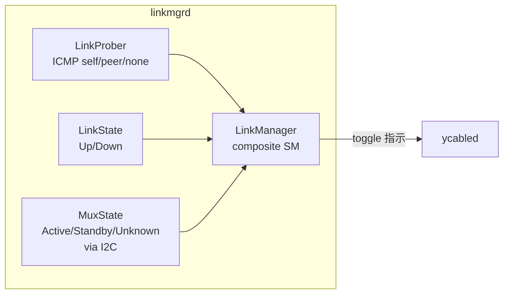
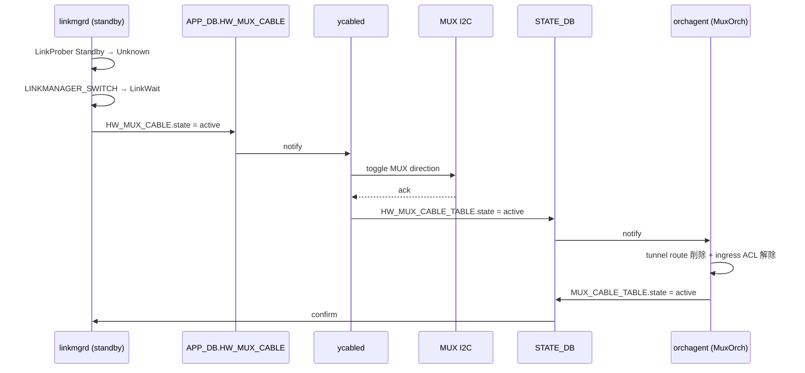

<!-- topics-tip -->
!!! tip "Topics で読み物として読む"
    この HLD は実装詳細を含む。機能の概念・設定・運用を読み物として読みたい場合は [Topics 05 章: Dual ToR / MUX / アクティブ冗長](../topics/05-dual-tor/index.md) を参照。
<!-- /topics-tip -->

!!! success "裏取りステータス: code-verified"
    `sonic-linkmgrd` の `src/link_manager/`・`src/link_prober/`・`src/mux_state/` ディレクトリ構成と、`LinkManagerStateMachineActiveStandby.{cpp,h}` の存在を確認。`MuxOrch` は HLD の 3 案のうち **「neighbor + standalone tunnel route」併用案** を採用しており、`muxorch.cpp:2444-2460` の `createStandaloneTunnelRoute` / `removeStandaloneTunnelRoute` がそれに該当する。`ycabled` は `sonic-platform-daemons/sonic-ycabled/` 配下に実装済みで `xcvrd` から分離されている。`MUX_METRICS_TABLE` / `LINK_PROBE_STATS` / `MUX_CABLE_RESPONSE_TABLE` / `MUX_METRICS_TABLE_PEER` などの STATE_DB / APP_DB スキーマも `sonic-swss-common/common/schema.h:143,460-464` に登録済み。`arp_update` スクリプトは `sonic-buildimage/files/scripts/arp_update` に存在。詳細は後段「実装との乖離 / 補足」。

# Active-Standby Dual ToR（y-cable + linkmgrd state machine + IPinIP tunnel）

!!! info "章分割済み"
    本ページは大型 HLD の **概要ハブ** として保持。詳細は以下の派生ページを参照:

    - [active-standby-dual-tor-concepts.md](active-standby-dual-tor-concepts.md) — 構成と要件、linkmgrd サブモジュール
    - [active-standby-dual-tor-operations.md](active-standby-dual-tor-operations.md) — CONFIG_DB / APP_DB / STATE_DB / CLI / トラブルシューティング
    - [active-standby-dual-tor-internals.md](active-standby-dual-tor-internals.md) — state machine 遷移表、MuxOrch、neighbor 取扱い、I2C シーケンス
    - [active-standby-dual-tor-limitations.md](active-standby-dual-tor-limitations.md) — 制限事項と既知の課題

## 読み手が知りたいこと

1. dual ToR の基本構成と **要件** は？
2. **誰が** active/standby を判定して切り替えるのか？
3. **standby ToR で受けたサーバ宛トラフィック** はどう転送されるのか？
4. **neighbor / [ARP](../reference/glossary.md#term-arp) / [NDP](../reference/glossary.md#term-ndp)** の特殊扱いはなぜ必要？
5. y-cable I2C 障害時はどうなる？
6. **CLI / DB** の最小セットは？
7. switchover 遅延を測りたいときに見るテーブルは？

## 1. 構成と要件

**2 台の ToR (UTO / LTO) と 1 台のサーバ NIC を smart y-cable で接続** し、片側を active、もう片側を standby として運用する構成[^1]。`linkmgrd` が link health を監視し、不健全を検知すると **standby 側が自発的に active へ昇格** する。standby 側で受けたトラフィックは **[IPinIP](../reference/glossary.md#term-ipinip) tunnel** で peer ToR に転送する。

要件は **「リンク or ToR 障害時に健全な側へ切り替えられること」** に尽きる[^1]。

ToR ↔ NIC の動作[^1]:

- ToR → NIC: 両リンクは UP 状態だが **active 側のみ** が NIC に転送
- NIC → ToR: **両 ToR にブロードキャスト**（standby 側でドロップまたは tunnel）
- mux switchover で **link down は発生しない**
- ToR → NIC 方向では切替時に **数パケットの破損 / drop** がありうる
- NIC → ToR 方向は **無瞬断**

routing 側[^1]:

- 両 ToR は **同じ [VLAN](../reference/glossary.md#term-vlan) 設定 + 同じ virtual MAC** を保持し T1 に同じ prefix を広告
- 同じ port が **両 ToR で active / standby** に分かれる
- standby ToR で受けた server 宛 traffic は **L3 IPinIP tunnel** で peer ToR に転送

## 2. linkmgrd（4 サブモジュール）



### LinkProber

ICMP payload に **ToR ID (UUID) を TLV エンコード** し ICMP echo を server に送る。応答 ICMP の payload から[^1]:

| イベント | 意味 | 遷移先 |
|---------|------|-------|
| `ICMP_NONE` | `LINK_PROBE.TIMEOUT * INTERVAL` ms 受信なし | LinkProberStateUnknown |
| `ICMP_SELF` | 自 ToR ID 入り reply 受信 | LinkProberStateActive |
| `ICMP_PEER` | peer ToR ID 入り reply 受信 | LinkProberStateStandby |

IPv4 / IPv6 双方を送るが **判定は IPv4 のみ**。IPv6 はモニタ用で interval が長い[^1]。

### MuxState (I2C 経由)

y-cable の I2C レジスタ（例: Credo の `B132 @ page 4`）から [MUX](../reference/glossary.md#term-mux) 方向を取得[^1]: `MuxActive` / `MuxStandby` / `MuxUnknown`（I2C 応答なし = cable 故障 / 電源 OFF）。

### LinkManager 状態遷移表

LinkProber + LinkState + MuxState の合成状態。**standby ToR が能動的に switchover を駆動** する設計（両 ToR が同時に切替を試みるのを防ぐ）[^1]。

LinkUp 時:

| MuxState \ LinkProber | Active | Standby | Unknown |
|---|---|---|---|
| Active | Noop | LINKMANAGER_CHECK → MuxWait | LINKMANAGER_CHECK → LinkWait（heartbeat 一時停止） |
| Standby | LINKMANAGER_CHECK → MuxWait | Noop | **LINKMANAGER_SWITCH** → LinkWait |
| MuxWait | Noop | Noop | Noop |
| LinkWait | LINKMANAGER_CHECK → MuxWait | LINKMANAGER_CHECK → MuxWait | Noop |
| MuxFailure | Faulty Cable | Faulty Cable | Faulty Cable |

LinkDown 時:

| MuxState \ LinkProber | Active | Standby | Unknown |
|---|---|---|---|
| Active | Noop | Noop | LINKMANAGER_SWITCH → LinkWait |
| Standby | Noop | Noop | LINKMANAGER_SWITCH → LinkWait |
| MuxFailure | Faulty Cable | Faulty Cable | Faulty Cable |

active → unknown 遷移時は `linkprober_suspend_timer` で一時的に heartbeat を停止し、対向 standby が早期に takeover できるようにする[^1]。

## 3. standby で受けたパケットの転送（orchagent + tunnel）

### TunnelOrch

`CONFIG_DB.TUNNEL` の `MUX_TUNNEL` entry を購読し[^1]:

- IPinIP tunnel object 作成（`tunnel_type=IPINIP`、`dst_ip=Loopback0`、`dscp_mode=uniform`、`encap_ecn_mode=standard`、`ecn_mode=copy_from_outer`、`ttl_mode=pipe`）
- decap entry / tunnel termination 作成
- `SAI_NEXT_HOP_TYPE_TUNNEL_ENCAP` を MuxOrch の next hop として供給

### MuxOrch

[linkmgrd](../reference/glossary.md#term-linkmgrd) の状態変化を購読し[^1]:

1. tunnel route 追加 / 削除
2. **standby port での ingress drop [ACL](../reference/glossary.md#term-acl)** 追加 / 削除
3. neighbor entry の取り扱い（後述）

[HLD](../reference/glossary.md#term-hld) は neighbor 取扱い 3 案（route+neighbor 共存 / [orchagent](../reference/glossary.md#term-orchagent) delete / ACL redirect）を比較するが最終採用案を明示していない。**現行 master は「neighbor + standalone tunnel route」併用案** を採用（後段「実装との乖離 / 補足」参照）。

### Rollback 動作

orchagent が遷移失敗した場合[^1]: 元状態に rollback → APP_DB に新状態 → ycabled が [STATE_DB](../reference/glossary.md#term-state_db) に書き戻し → orchagent が STATE_DB に `unknown` を書く → linkmgrd が再判定。orchagent は state 変化に対して **idempotent** であること。

## 4. neighbor の特殊扱い

standby ToR では ARP request が drop されるため、通常の neighbor 学習が成立しない。次の仕掛けを併用する[^1]:

### Proxy ARP（IPv4）

server-to-server traffic を必ず L3 経路に乗せるため `proxy_arp` を有効化し、server 発トラフィックに `dst_mac = ToR router MAC` を強制する。standby ToR で受けたパケットを encap して active ToR に流せる[^1]。

### Proxy NDP（IPv6）

IPv6 は subnet レベル proxy が無いため明示的に neighbor entry を入れる[^1]:

```bash
sysctl -w net.ipv6.conf.Vlan1000.proxy_ndp=1
ip -6 neigh add proxy fc02:1000::3 dev Vlan1000
```

`nbrmgrd` が `MUX_CABLE|<PORT>` を購読し各 server IPv6 を proxy entry として登録する案がある。

### GARP / unsolicited NA

standby ToR は **active 側が出す GARP** で ARP 表を学習[^1]:

```bash
echo 1 > /proc/sys/net/ipv4/conf/Vlan1000/arp_accept
```

IPv6 は `accept_untracked_na=1` を kernel に backport して unsolicited NA を受理する。

### Neighbor miss の 4 ケース

1. **active 側で encap パケット受信時の miss**: standby から encap されてきた最初のパケットを active が decap した時、neighbor 未学習だと **encap パケット全体が CPU trap** される。kernel は decap して ARP 送出を行えないため、**Loopback0 宛 + Portchannel uplink 入り** のパケットを listen する Python サービスが内部 dst IP に **ping を打って ARP/NS を kernel に発行させる**[^1]
2. **片側リンク down**: `PEER_SWITCH` table がある dual-tor 環境では ARP 未解決 entry を **zero mac + type=tunnel** で APP_DB の `NEIGH` に書き、tunnel route を peer に install。`arp_update` が定期的に再学習試行[^1]
3. **Directed Broadcast**: HW フラッディングで standby port を含めた挙動が単一 ToR と異なる（HLD では TBD）
4. **standby で IPv6 neighbor が FAILED 化**: `accept_untracked_na=1` + `arp_update` script が `FAILED` を `INCOMPLETE` に書き換え、active 側 NA で resolve[^1]

## 5. y-cable I2C 障害（ycabled）

旧 `xcvrd` を `ycabled` に改名[^1]。`APP_DB.HW_MUX_CABLE` を購読し I2C 経由で MUX を toggle する。`i2c_retry_count` 回失敗で `MUX_FAIL` を `STATE_DB.HW_MUX_CABLE_TABLE` に書く。報告状態（コード上の定数名 → 実 DB 文字列値）: `MUX_XCVRD_ACTIVE` → `active` / `MUX_XCVRD_STANDBY` → `standby` / `MUX_XCVRD_UNKNOWN` → `unknown`。`STATE_DB.HW_MUX_CABLE_TABLE` の `state` フィールドには小文字の文字列値 (`active` / `standby` / `unknown`) が書き込まれる。

### switchover シーケンス（standby → active）



## 6. 設定（CONFIG_DB / APP_DB / STATE_DB / CLI）

### CONFIG_DB

| Table | Key | フィールド | 説明 |
|-------|-----|-----------|------|
| `MUX_LINKMGR` | `LINK_PROBE` | `interval_v4` / `interval_v6` / `timeout` / `suspend_timer` / `positive_signal_count` / `negative_signal_count` | linkmgrd チューニング |
| `localhost MUX_DRIVER` | - | `i2c_retry_count` | ycabled の MUX 失敗判定回数 |
| `MUX_CABLE` | `<PORT>` | `state ∈ {active, standby, auto, manual}`, `server_ipv4`, `server_ipv6` | port 単位 mux 設定 |
| `PEER_SWITCH` | `<switchname>` | `address_ipv4` | peer ToR の loopback |
| `TUNNEL` | `MUX_TUNNEL` | `tunnel_type=IPINIP`, `dst_ip`, `dscp_mode`, `encap_ecn_mode`, `ecn_mode`, `ttl_mode` | IPinIP tunnel 定義 |
| `DEVICE_METADATA` | `localhost` | `type=ToRRouter`, `peer_switch`, `subtype=DualTor` | dual ToR 識別 |

### APP_DB / STATE_DB

| Table | フィールド | 説明 |
|-------|-----------|------|
| `APP_DB.MUX_CABLE` | `state ∈ {active, standby, unknown}` | linkmgrd ↔ swss |
| `APP_DB.HW_MUX_CABLE` | `state ∈ {active, standby}` | orchagent ↔ ycabled |
| `APP_DB.MUX_CABLE_COMMAND` | `command ∈ {probe, link_status_peer}` | linkmgrd → ycabled |
| `APP_DB.MUX_CABLE_RESPONSE` | `response`, `link_status_peer` | ycabled → linkmgrd |
| `STATE_DB.MUX_CABLE_TABLE` | `state ∈ {active, standby, unknown, error}` | orchagent |
| `STATE_DB.HW_MUX_CABLE_TABLE` | `state ∈ {active, standby, unknown}` | ycabled |
| `STATE_DB.MUX_LINKMGR_TABLE` | `state ∈ {healthy, unhealthy, uninitialized}` | linkmgrd 合成 |
| `STATE_DB.MUX_METRICS_TABLE` | `<app>_switch_<state>_start/end` | 切替計測 |
| `STATE_DB.MUX_SWITCH_CAUSE` | `cause`, `time` | 最後の switchover 原因 |
| `STATE_DB.LINK_PROBE_STATS` | `pck_loss_count`, `pck_expected_count` 等 | プローブ統計 |

### CLI

| Command | 用途 |
|---------|------|
| `config muxcable mode {active\|auto\|manual\|standby} {<port>\|all} [--json]` | mux モード切替 |
| `show muxcable config [<port>] [--json]` | 設定状態 |
| `show muxcable status [<port>] [--json]` | 動作状態（STATUS / HEALTH） |

```bash
config muxcable mode auto Ethernet4
config muxcable mode active Ethernet4
config muxcable mode auto all
```

`config muxcable mode active` の戻り値[^1]:

| RC | 出力 | 意味 |
|----|------|------|
| 100 | `{"Ethernet4":"OK"}` | 既に active |
| 100 | `{"Ethernet4":"INPROGRESS"}` | 切替中 |
| 0 / 1 | - | 成功 / 失敗 |

## 7. トラブルシューティング

| 症状 | 最初に見る場所 |
|------|---------------|
| `HEALTH=UNHEALTHY` | `MUX_LINKMGR_TABLE.state` と `LINK_PROBE_STATS.pck_loss_count` |
| standby 側 server 宛 traffic が永続 black-hole | `NEIGH` table の zero mac entry / tunnel route の有無 |
| `MUX_CABLE_TABLE.state=error`（I2C ループ） | `i2c_retry_count` 設定とハードウェア / cable 個体 |
| switchover に時間がかかる | `MUX_METRICS_TABLE` の `<app>_switch_active_*` |
| IPv6 のみ切替で断 | `accept_untracked_na` と `arp_update` の `FAILED → INCOMPLETE` 書き換え |

### コマンド例

下記コマンドで MUX/ToR の状態と切替動作を確認できる。

```bash
# Dual ToR mux 状態と切替メトリクス
show muxcable status
show muxcable config
redis-cli -n 6 keys 'MUX_CABLE_TABLE:*'
redis-cli -n 6 hgetall 'MUX_LINKMGR_TABLE|Ethernet0'
redis-cli -n 6 hgetall 'LINK_PROBE_STATS|Ethernet0'
```

## 制限事項

- ToR → NIC 方向 switchover で **数パケットの破損 / drop** あり[^1]
- standby ToR は ARP request drop で **GARP / unsolicited NA に依存**
- IPv6 neighbor `FAILED` 問題は kernel patch + `arp_update` 修正に依存
- HLD では neighbor 取扱い 3 案の最終採用案を明示していない（実コード裏取りで確定: standalone tunnel route 案）
- directed broadcast は HLD 上 TBD
- y-cable I2C 失敗時の MUX_FAIL 復旧シナリオは HLD 上限定的
- LinkManager は LinkProber より低頻度（hysteresis 抑制）

## 干渉する機能

- **`linkmgrd`**: state machine 主体
- **`orchagent` (`MuxCfgOrch` / `MuxOrch` / `TunnelOrch`)**: [SAI](../reference/glossary.md#term-sai) 反映 + tunnel + ACL drop
- **`ycabled` (旧 `xcvrd`)**: I2C 経由の MUX 制御
- **`nbrmgrd` / `arp_update` / kernel sysctl**: proxy ARP / GARP / NDP / proxy_ndp / accept_untracked_na
- **decap-after-tunnel CPU trap 対策の Python service**: 6.3.5.1 の neighbor miss 解消用
- **`bgpd`**: 両 ToR が同じ VLAN を広告

## 実装との乖離 / 補足

現行 master（2026-05 時点）の実コード裏取り結果:

- **linkmgrd の構成**: HLD は LinkProber / MuxState / LinkState / LinkManager の 4 サブモジュールと記述。実装は `sonic-linkmgrd/src/` 配下に `link_prober/` / `mux_state/` / `link_manager/` の 3 ディレクトリ + `DbInterface.cpp`（state_db / app_db 通信を担う）の構成で概ね一致。
- **MuxOrch の neighbor 取扱い**: HLD の 3 案のうち **「neighbor entry を残して standby 側は zero-MAC + standalone tunnel route」案** が採用。`sonic-swss/orchagent/muxorch.cpp:2444-2460` の `createStandaloneTunnelRoute()` / `removeStandaloneTunnelRoute()` がその実装。
- **`PEER_SWITCH` テーブル / `PeerSwitchOrch`**: `sonic-swss/orchagent/orchdaemon.cpp:469` で `CFG_PEER_SWITCH_TABLE_NAME` をハンドラに登録、`muxorch.cpp:2190` で `MuxOrch::handlePeerSwitch` ハンドラを設定。
- **ycabled**: `sonic-platform-daemons/sonic-ycabled/ycable/ycable.py` に独立 daemon として存在（旧 xcvrd から分離）。
- **STATE_DB スキーマ**: `MUX_METRICS_TABLE` (`schema.h:460`)、`LINK_PROBE_STATS` (462行)、`MUX_METRICS_TABLE_PEER` (464行)、APP_DB の `MUX_CABLE_RESPONSE_TABLE` (143行) すべて取り込み済み。
- **arp_update**: `sonic-buildimage/files/scripts/arp_update` に存在。`FAILED → INCOMPLETE` 書き換え / `accept_untracked_na` の現状詳細は本ページでは未深掘り。
- **dualtor neighbor 監視**: `sonic-utilities/scripts/dualtor_neighbor_check.py` に補助スクリプト。

## 関連トピック

- [Topics: Dual ToR](../topics/05-dual-tor/index.md) — Dual ToR 全体像
- [active-active dual ToR](active-active-dual-tor.md)

## 引用元

[^1]: `sonic-net/SONiC` `doc/dualtor/dualtor_active_standby_hld.md` @ `49bab5b5ff0e924f1ea52b3d9db0dfa4191a7c06`

<!-- concerns hint:
- linkmgrd の LinkProber / MuxState / LinkState / LinkManager 4 サブモジュールの現行実装確認
- MuxOrch の neighbor handling 3 案のうちどれが採用されているか確認
- ycabled の I2C リトライ + MUX_FAIL 報告ロジック実装確認
- 6.3.5.1 の Loopback0 宛 encap パケット listen + ping 駆動 service の所在確認
- 6.3.5.2 の zero mac neighbor + tunnel route 自動 install の neighsyncd / muxorch 実装確認
- arp_update の FAILED → INCOMPLETE 書き換えの取り込み確認
- accept_untracked_na の kernel backport 状況確認
-->

<!-- topics-back-ref -->
## 関連 Topics

- [Topics: Dual-ToR と Mux 制御](../topics/05-dual-tor/index.md)

<!-- /topics-back-ref -->


## 参考リンク

本ページに関連する参照ドキュメント:

- [`config muxcable mode` CLI リファレンス](../reference/cli/config-muxcable.md)
- [`show muxcable config` CLI リファレンス](../reference/cli/show-muxcable.md)
- [`show muxcable status` CLI リファレンス](../reference/cli/show-muxcable.md)
- [`config muxcable` CLI リファレンス](../reference/cli/config-muxcable.md)
- [`show muxcable` CLI リファレンス](../reference/cli/show-muxcable.md)

<!-- augmented-links: v1 -->

<!-- glossary-links-injected: b5409080014b -->
