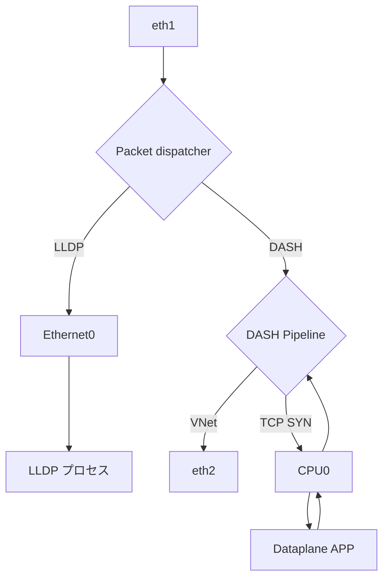
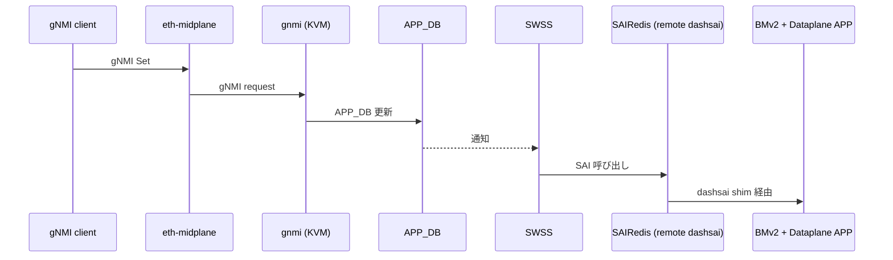

!!! warning "裏取りステータス: HLD-only"
    本ページは公式 HLD のみを根拠に書かれている。BMv2 / VPP / dashsai / saidash の現行 master 取り込み状況、`vms-kvm-dpu` トポロジの ansible playbook、`gnmi_cli_py` の Python 2 依存等は未確認。HLD は 「DPU SONiC KVM image with dataplane will be released at the next stage」と記載しており、書きかけの段階でドキュメント化された設計である。

# DASH SONiC KVM（BMv2 ベース仮想 DPU）

## 概要

DASH SONiC KVM は **物理 DPU を持たずに DASH（Disaggregated APIs for SONiC Hosts）の検証ができる仮想スイッチイメージ** である。目的は 2 つ[^1]:

1. **POC 兼検証用**: 物理ハードウェアを用意せずに DASH のコントロールプレーン・データプレーンを開発・テストできる testbed を提供
2. **CI**: `sonic-buildimage` / `sonic-swss` などの SONiC 系リポジトリの Azure Pipelines CI に DASH を組み込む

データプレーンは **BMv2（P4 simple_switch）** をベースに、フロー作成や resimulation など BMv2 単体では弱い部分を **VPP** で補強する構成。SAI 互換は `dashsai`（リモート shim サーバ + クライアント）で sairedis から見えるようにしている。

## 動作仕様

### モジュール構成

```mermaid
flowchart TB
    subgraph DPU_KVM[DPU SONiC KVM]
      direction TB
      ETH0[Ethernet0,1,...\nsystem port] --> DAPP[Dataplane APP\n(VPP + saidash.so)]
      LINE[eth1, eth2, ...\nline port] --> BMV2
      DAPP -- DPDK / CPU port --> BMV2[BMv2 simple_switch\n(P4 dataplane)]
      DAPP -- gRPC --> BMV2
      DAPP -- shim --> SAIRED[SAIRedis\n(remote dashsai client)]
      SAIRED --> SWSS[SWSS]
      SWSS --> APPDB[(APP_DB)]
      GNMI[GNMI] --> APPDB
      OTHER[BGP / LLDP / etc.]
    end
    EXT[gNMI client]<-->|midplane / mgmt port| GNMI
```

| モジュール | 役割 |
|----------|------|
| BMv2 | P4 でデータプレーン処理。元々ハードウェア DPU が担う層 |
| Dataplane APP | VPP フレームワーク + `saidash` 共有ライブラリ。BMv2 と gRPC で会話。BMv2 が苦手なフロー処理を VPP で補う |
| `saidash` / `dashsai` | SAI の DASH 部分を BMv2 にマッピングする実装。**dashsai client/server は shim** で sairedis を BMv2 に繋ぐ |
| SAIRedis | 物理仮想 SONiC では `saivs` を読むが、本構成では **remote dashsai client** をロードする[^1] |
| SWSS | 物理 DPU と **ほぼ同一**[^1]。特別変更不要 |
| GNMI / APP_DB | 物理 DPU と同一構造。後述の 2 モードで動作 |
| その他 | BGP, LLDP, etc. を物理 DPU と同じ構成で残す[^1] |

### ポート種別

KVM 内のインタフェースは 3 種類に分かれる[^1]:

| 種別 | 用途 | 備考 |
|-----|------|------|
| `Ethernet0`, `Ethernet1`, ... | system port | BGP / LLDP 等のプロトコルが send/recv に使う |
| `eth1`, `eth2`, ... | line port | KVM の実 IF。Ethernet と **1 対 1 対応** |
| CPU port (DPDK) | Dataplane APP 用 | BMv2 から CPU パスでパケットが上がる |

### モード（DPU mode / single device mode）

GNMI と APP_DB は物理デバイスと同一だが、KVM では 2 つの動かし方が想定される[^1]:

- **DPU モード**: 物理 SmartSwitch と同様、設定は外部 NPU の GNMI 経由で midplane（`eth-midplane`）に流れる
- **Single device モード**: KVM 内に GNMI サーバを立てて、外部から直接 set すれば SWSS にローカル forward される

### データプレーン経路

BMv2 上の P4 logic がパケットの出口を決める。HLD 例[^1]:



ポイント:

- 通常 VNet トラフィックは BMv2 内の DASH Pipeline で完結し `eth2` に出る
- TCP SYN など **フロー作成が必要なパケット** は CPU0 で Dataplane APP に上がり、VPP 側でフローを作って戻す
- LLDP のような制御プレーン向けは Ethernet ポートに dispatch して上位プロセスに渡す

### コントロールプレーン経路



Single device モードでは `MID` を経由せず、KVM 内の GNMI に直接接続する経路もある[^1]。

<!-- evidence:
source: sonic-net/SONiC/doc/dash/dash-sonic-kvm.md#L40-L66 (sha: 49bab5b5ff0e924f1ea52b3d9db0dfa4191a7c06)
excerpt: |
  Due to the P4 and BMv2 limitation, such as flow creation, flow resimulation and etc, in this virtual DPU,
  our implementation is based on the VPP framework with the CPU interface to enhance the dataplane engine ...
  this dataplane APP loads the generated shared library, saidash, which communicates with BMv2 via GRPC.
reasoning: 「BMv2 単体では DASH 機能が足りないので VPP + saidash で補う」「SAIRedis は remote dashsai client をロードする」という構成根拠。
-->

### KVM testbed セットアップ（single device モード）

`sonic-mgmt` を使って `vms-kvm-dpu` トポロジを立てる[^1]。

```bash
# sonic-mgmt コンテナ内
cd /data/sonic-mgmt/ansible

./testbed-cli.sh -t vtestbed.yaml -m veos_vtb add-topo  vms-kvm-dpu password.txt
./testbed-cli.sh -t vtestbed.yaml -m veos_vtb deploy-mg vms-kvm-dpu veos_vtb password.txt
```

DPU への SSH:

```bash
sshpass -p 'password' ssh \
  -o TCPKeepAlive=yes -o ServerAliveInterval=30 \
  -o UserKnownHostsFile=/dev/null -o StrictHostKeyChecking=no \
  admin@10.250.0.101
```

デフォルト管理 IP は `10.250.0.101`、デフォルトパスワードは `password`。

### gNMI クライアント

DASH テスト実行時、`sonic-mgmt` 内の `/tmp/<UUID>/` に CA / クライアント証明書が生成される[^1]。クライアントとして `gnmi_cli_py`（Python 2 依存）を使い、PTF コンテナにデフォルトでインストールされている。

DUT 側では gnmi-native を停止して証明書付きで起動し直す必要がある:

```bash
docker exec gnmi supervisorctl stop gnmi-native
docker exec gnmi bash -c "/usr/sbin/telemetry -logtostderr --port 50052 \
  --server_crt /etc/sonic/telemetry/gnmiserver.crt \
  --server_key /etc/sonic/telemetry/gnmiserver.key \
  --ca_crt /etc/sonic/telemetry/gnmiCA.pem \
  -gnmi_native_write=true -v=10 >/root/gnmi.log 2>&1 &"
```

クライアント例（DASH テーブル更新）:

```bash
python2 /root/gnxi/gnmi_cli_py/py_gnmicli.py \
  --timeout 30 -t 10.0.0.88 -p 50052 -xo sonic-db \
  -rcert /root/gnmiCA.pem -pkey /root/gnmiclient.key -cchain /root/gnmiclient.crt \
  -m set-update \
  --xpath /APPL_DB/localhost/DASH_APPLIANCE_TABLE[key=123] \
          /APPL_DB/localhost/DASH_VNET_TABLE[key=Vnet1] \
  --value $/root/update1 $/root/update2
```

`update1`, `update2` は対応 protobuf。

### DPU + VPP NPU testbed

HLD では `5.2 DPU with VPP NPU testbed` 節は **TBD**[^1]。

## 設定

### 関連する CONFIG_DB

KVM 自体の追加 CONFIG_DB スキーマは無い。物理 DPU と同じ DASH 系テーブル（`DASH_VNET_TABLE`, `DASH_APPLIANCE_TABLE` 等）を APP_DB / CONFIG_DB に投入する。

### 関連する CLI

KVM testbed 用の CLI は `testbed-cli.sh`（sonic-mgmt 側）。SONiC 内部の DASH CLI は本 HLD のスコープ外。

### 関連する YANG

該当なし（KVM 環境固有のスキーマは無い）。

## 制限事項

- **データプレーン付き DPU SONiC KVM image は HLD 時点で未公開**。通常の `sonic-vs.img.gz` のみ取得可能[^1]
- BMv2 の限界（フロー作成・resimulation）を VPP で補う実装は **dashsai に強く依存**。dashsai 未対応の SAI API は **mock 実装**される（`DTEL` 等）[^1]
- gNMI クライアント `gnmi_cli_py` は **Python 2 依存**。PTF 以外の環境ではインストールが面倒[^1]
- DPU + VPP NPU testbed は HLD 時点で **TBD**

## 干渉する機能

- **物理 SmartSwitch**: SWSS / GNMI / APP_DB は物理 DPU と互換のため、両者でテスト共通化が可能
- **`sonic-mgmt`**: `vms-kvm-dpu` トポロジが必要。EOS コンテナや veos_vtb の前提条件あり
- **CI（Azure Pipelines）**: 本 KVM が CI のターゲット。BMv2 / VPP の build 時間が CI に影響する
- **DASH 系 HLD（VNet, ENI Forwarding 等）**: 本 KVM はそれらの検証実装

## トラブルシューティング

- testbed 起動が失敗する場合、`sonic-mgmt` の前提（cEOS イメージ・SSH 鍵）が揃っているか確認
- DPU に SSH できない場合、デフォルト IP `10.250.0.101` と `password` を確認
- `gnmi_cli_py` がエラーになる場合、Python 2 環境で実行しているか確認
- DASH テーブル更新が反映されない場合、KVM 内の GNMI が証明書付きで再起動されているかを確認

## 引用元

[^1]: `sonic-net/SONiC` `doc/dash/dash-sonic-kvm.md` @ `49bab5b5ff0e924f1ea52b3d9db0dfa4191a7c06`

<!-- concerns hint:
- BMv2 / VPP / saidash / dashsai server-client の現行 master 取り込み状況
- vms-kvm-dpu トポロジ ansible playbook の所在
- gnmi_cli_py の Python 2 依存（移行計画）
- DPU SONiC KVM image (with dataplane) のリリース有無
- DPU + VPP NPU testbed (5.2) の進捗
- saivs / dashsai client の SAIRedis ロード切替の実装
-->
