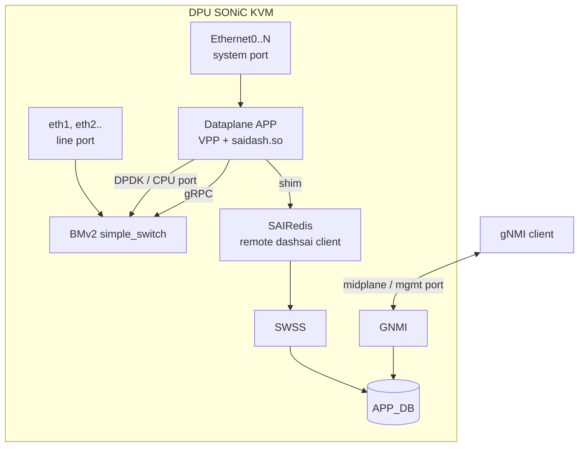
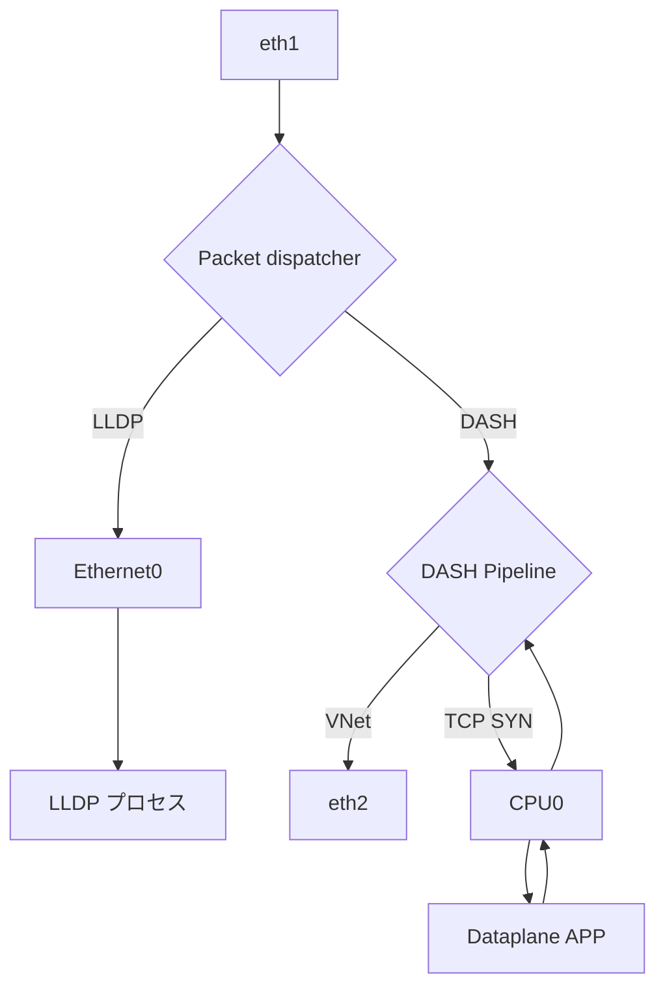
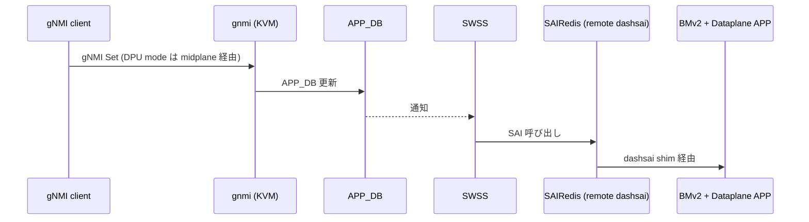

<!-- topics-tip -->
!!! tip "Topics で読み物として読む"
    この HLD は実装詳細を含みます。機能の概念・設定・運用を読み物として読みたい場合は [Topics 13 章: DASH / SmartSwitch](../topics/13-dash-smartswitch/index.md) を参照。
<!-- /topics-tip -->

!!! success "裏取りステータス: Code-verified"
    `sonic-sairedis` `configure.ac:49-50` / `debian/rules:40-41` で `--with-dashsai` / `dashsai` build profile を確認。BMv2 は `sonic-slave-trixie/Dockerfile.j2:583`, `sonic-slave-bullseye/Dockerfile.j2:438,622`, `docker-syncd-vs` / `docker-gbsyncd-vs` / `docker-ptf` versions-deb で `p4lang-bmv2==1.15.0-9` を確認。`vms-kvm-dpu` トポロジは HLD L117-118 / L132 で `testbed-cli.sh` コマンドを確認（verified at: 2026-05-09）。
    HLD §「DPU SONiC KVM image with dataplane will be released at the next stage」「5.2 DPU+VPP NPU testbed (TBD)」のとおり、データプレーン同梱イメージ・VPP NPU testbed は TBD。

# DASH SONiC KVM（BMv2 ベース仮想 DPU）

## 何のための機能か

物理 [DPU](../reference/glossary.md#term-dpu) を持たずに [DASH](../reference/glossary.md#term-dash)（Disaggregated APIs for [SONiC](../reference/glossary.md#term-sonic) Hosts）を検証する仮想スイッチイメージ。目的は 2 つ[^1]:

1. **POC / 開発**: 物理 HW なしで DASH のコントロール・データプレーンを開発・テスト
2. **CI**: `sonic-buildimage` / `sonic-swss` の Azure Pipelines に DASH を組み込む

データプレーンは **BMv2 (P4 simple_switch)** を中核に、フロー作成・resimulation 等で BMv2 が苦手な部分を **VPP** で補強。[SAI](../reference/glossary.md#term-sai) 互換は `dashsai`（remote shim サーバ + クライアント）が担う。

## どう動くか

### モジュール構成



| モジュール | 役割 |
|----------|------|
| BMv2 | P4 でデータプレーン処理。元来 HW DPU が担う層 |
| Dataplane APP | VPP + `saidash` 共有 lib。BMv2 と gRPC、フロー処理を VPP で補う |
| `saidash` / `dashsai` | SAI の DASH 部分を BMv2 にマップする shim |
| SAIRedis | 通常の vs は `saivs` だが、本構成は **remote dashsai client** をロード |
| SWSS / GNMI / APP_DB | 物理 DPU と同一構造 |

### ポート種別

| 種別 | 用途 |
|-----|------|
| `Ethernet0..` | system port（[BGP](../reference/glossary.md#term-bgp)/[LLDP](../reference/glossary.md#term-lldp) 等プロトコル用） |
| `eth1, eth2..` | line port。KVM 実 IF。Ethernet と 1 対 1 対応 |
| CPU port ([DPDK](../reference/glossary.md#term-dpdk)) | Dataplane APP 用。BMv2 ↔ CPU パス |

### 動作モード

- **DPU モード**: 物理 [SmartSwitch](../reference/glossary.md#term-smartswitch) と同様、外部 [NPU](../reference/glossary.md#term-npu) が `eth-midplane` 経由で GNMI Set
- **Single device モード**: KVM 内 GNMI に直接接続し SWSS へローカル forward

### データプレーン経路



- 通常 VNet トラフィックは BMv2 内 DASH Pipeline で完結し `eth2` に出る
- フロー作成が必要な TCP SYN は CPU0 経由で Dataplane APP に上がり VPP がフローを作って戻す
- LLDP 等の制御プレーンは Ethernet ポートへ dispatch

### コントロールプレーン経路



<!-- evidence:
source: sonic-net/SONiC/doc/dash/dash-sonic-kvm.md#L40-L66 (sha: 49bab5b5ff0e924f1ea52b3d9db0dfa4191a7c06)
excerpt: |
  Due to the P4 and BMv2 limitation, such as flow creation, flow resimulation and etc, in this virtual DPU,
  our implementation is based on the VPP framework with the CPU interface to enhance the dataplane engine ...
  this dataplane APP loads the generated shared library, saidash, which communicates with BMv2 via GRPC.
reasoning: BMv2 単体では足りないので VPP + saidash で補い、SAIRedis は remote dashsai client をロードする構成根拠。
-->

<!-- evidence-rendered:start -->
??? note "📋 検証エビデンス: sonic-net/SONiC/doc/dash/dash-sonic-kvm.md#L40-L66 (sha: 49bab5b5ff0e924f1ea52b3d9db0dfa4191a7c06)"

    **出典**:

    `sonic-net/SONiC/doc/dash/dash-sonic-kvm.md#L40-L66 (sha: 49bab5b5ff0e924f1ea52b3d9db0dfa4191a7c06)`

    **抜粋**:

    ```text
    Due to the P4 and BMv2 limitation, such as flow creation, flow resimulation and etc, in this virtual DPU,
    our implementation is based on the VPP framework with the CPU interface to enhance the dataplane engine ...
    this dataplane APP loads the generated shared library, saidash, which communicates with BMv2 via GRPC.
    ```

    **判断根拠**: BMv2 単体では足りないので VPP + saidash で補い、SAIRedis は remote dashsai client をロードする構成根拠。

<!-- evidence-rendered:end -->

## どう使うか

### testbed セットアップ（single device モード）

```bash
# sonic-mgmt コンテナ内
cd /data/sonic-mgmt/ansible
./testbed-cli.sh -t vtestbed.yaml -m veos_vtb add-topo  vms-kvm-dpu password.txt
./testbed-cli.sh -t vtestbed.yaml -m veos_vtb deploy-mg vms-kvm-dpu veos_vtb password.txt
```

デフォルト管理 IP `10.250.0.101` / パスワード `password`。SSH:

```bash
sshpass -p 'password' ssh -o StrictHostKeyChecking=no admin@10.250.0.101
```

### gNMI クライアント

`sonic-mgmt` 内 `/tmp/<UUID>/` に CA / クライアント証明書が生成される。`gnmi_cli_py`（**Python 2 依存**）が PTF コンテナにプリインストール。DUT で gnmi-native を停止し証明書付きで再起動が必要[^1]:

```bash
docker exec gnmi supervisorctl stop gnmi-native
docker exec gnmi bash -c "/usr/sbin/telemetry -logtostderr --port 50052 \
  --server_crt /etc/sonic/telemetry/gnmiserver.crt \
  --server_key /etc/sonic/telemetry/gnmiserver.key \
  --ca_crt /etc/sonic/telemetry/gnmiCA.pem \
  -gnmi_native_write=true -v=10 >/root/gnmi.log 2>&1 &"
```

クライアント例:

```bash
python2 /root/gnxi/gnmi_cli_py/py_gnmicli.py \
  --timeout 30 -t 10.0.0.88 -p 50052 -xo sonic-db \
  -rcert /root/gnmiCA.pem -pkey /root/gnmiclient.key -cchain /root/gnmiclient.crt \
  -m set-update \
  --xpath /APPL_DB/localhost/DASH_APPLIANCE_TABLE[key=123] \
          /APPL_DB/localhost/DASH_VNET_TABLE[key=Vnet1] \
  --value $/root/update1 $/root/update2
```

## 設定

KVM 自体には追加 [CONFIG_DB](../reference/glossary.md#term-config_db) スキーマ・CLI・[YANG](../reference/glossary.md#term-yang) は無い。物理 DPU と同じ DASH テーブル（`DASH_VNET_TABLE`, `DASH_APPLIANCE_TABLE` 等）を APP_DB / CONFIG_DB に投入する。testbed 操作は `testbed-cli.sh`（[sonic-mgmt](../reference/glossary.md#term-sonic-mgmt)）。

## 制限事項

- **データプレーン付き DPU SONiC KVM image は [HLD](../reference/glossary.md#term-hld) 時点で未公開**（通常 `sonic-vs.img.gz` のみ）。
- `dashsai` 未対応 SAI API（`DTEL` 等）は **mock 実装**[^1]。
- `gnmi_cli_py` が Python 2 依存。
- **DPU + VPP NPU testbed (HLD §5.2) は TBD**。

## 干渉する機能

- **物理 SmartSwitch**: SWSS / GNMI / APP_DB が互換のため、テスト共通化可能。
- **sonic-mgmt**: `vms-kvm-dpu` トポロジ・cEOS image・SSH 鍵が前提。
- **CI**: BMv2 / VPP の build 時間が CI 全体に影響。
- **DASH 系 HLD（VNet, [ENI](../reference/glossary.md#term-eni) Forwarding 等）**: 本 KVM はそれらの検証実装。

## トラブルシューティング

- testbed 起動失敗: `sonic-mgmt` 前提（cEOS, SSH 鍵）の確認。
- DPU に SSH 不可: IP `10.250.0.101` / pw `password` の確認。
- `gnmi_cli_py` エラー: Python 2 環境で実行しているか確認。
- DASH テーブル更新が反映されない: KVM 内 GNMI を証明書付きで再起動しているか確認。

### コマンド例

DASH ENI / [VNET](../reference/glossary.md#term-vnet) 経路と DPU 上のデータパスを確認する。

```bash
# DASH / ENI の状態
show dash eni
show dash vnet
redis-cli -n 4 keys 'DASH_ENI_TABLE:*'
docker exec swss orchagent_restart_check 2>&1 | tail
```

## 関連トピック

- [Topics: GNMI / OpenConfig](../topics/10-gnmi-openconfig/index.md) — [gNMI](../reference/glossary.md#term-gnmi) 経由の DASH 設定
- [sonic-dash-hld](sonic-dash-hld.md) — DASH の全体像

## 引用元

[^1]: `sonic-net/SONiC` `doc/dash/dash-sonic-kvm.md` @ `49bab5b5ff0e924f1ea52b3d9db0dfa4191a7c06`

<!-- topics-back-ref -->
## 関連 Topics

- [Topics: DASH と SmartSwitch](../topics/13-dash-smartswitch/index.md)
- [Topics: Lab / Virtual SONiC / Developer Entry](../topics/21-lab-vs-developer/index.md)

<!-- /topics-back-ref -->

<!-- glossary-links-injected: 8ba32e5aa69d -->
