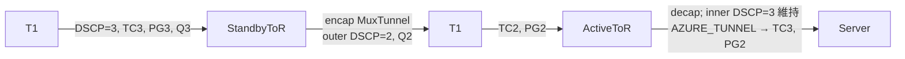
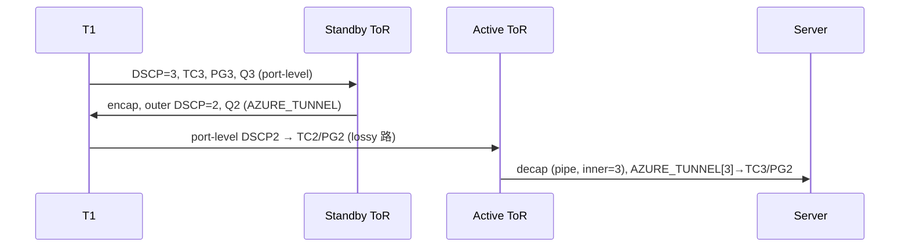

<!-- topics-tip -->
!!! tip "Topics で読み物として読む"
    この HLD は実装詳細を含みます。機能の概念・設定・運用を読み物として読みたい場合は [Topics 05 章: Dual ToR / MUX / アクティブ冗長](../topics/05-dual-tor/index.md) を参照。
<!-- /topics-tip -->

!!! warning "裏取りステータス: Discrepancy-found"
    実装は概ね HLD どおりだが、PFC watchdog フィールド名が `pfc_wd_sw_enable`（HLD）→ `pfcwd_sw_enable`（実装）と異なる。詳細は末尾「実装との乖離」を参照（verified at: 2026-05-09）。

# トンネルトラフィックの DSCP / TC リマップ（Dual-ToR PFC デッドロック回避）

## なぜ必要か

Dual-ToR（Active / Standby）でサーバ側輻輳が起きると **upper / lower 両 ToR に [PFC](../reference/glossary.md#term-pfc) pause が同時に伝搬** する。Standby ToR は南向きトラフィックを **同じキューでバウンスバック** して T1 経由で Active ToR に送るため、T1 ↔ ToR 間で pause が固着する **PFC デッドロック** が起きる[^1]。

本機能は tunnel encap 時に **キュー / [DSCP](../reference/glossary.md#term-dscp) を別系統に書き換え**、decap 時にポート単位マップを **AZURE_TUNNEL** で上書きして TC / PG を再設定し、バウンスバック経路と通常経路を別キューに分離する。`202012` / `202205` を最初のターゲットとし、[SAI](../reference/glossary.md#term-sai) 新規 tunnel 属性が前提[^1]。

## どう動くか

### バウンスバックの経路分離



Standby が受けた南向きパケットは MuxTunnel ([IPinIP](../reference/glossary.md#term-ipinip)) で対向 Active ToR に encap される。元の TC/Queue をそのまま使うと往復が同一キューで連結し pause が解けない。[HLD](../reference/glossary.md#term-hld) は **encap 側で DSCP/Queue を書き換え**、**decap 側でポート単位 TC/PG を上書き** する 2 段で経路を分ける。

### 追加 QoS マップ（AZURE_TUNNEL 系）

Dual-ToR 限定 (`DEVICE_METADATA['localhost']['subtype'] = 'DualToR'`) で `qos_config.j2` がレンダリングする[^1]。

| 用途 | テーブル | 備考 |
|------|---------|------|
| decap outer DSCP → TC | `DSCP_TO_TC_MAP\|AZURE_TUNNEL` | `5→1`, `33→8`, `48→7` を変更 |
| decap TC → PG | `TC_TO_PRIORITY_GROUP_MAP\|AZURE_TUNNEL` | TC3→PG2, TC4→PG6 |
| encap TC → Queue | `TC_TO_QUEUE_MAP\|AZURE_TUNNEL` | TC3→Q2, TC4→Q6 |
| encap (TC, color) → DSCP | `TC_TO_DSCP_MAP\|AZURE_TUNNEL` | **新設**。`sonic-tc-dscp.yang` 新規追加 |

ポート側 `AZURE` マップも `TC2→PG2`, `TC6→PG6` を有効化して追加 lossy PG (PG2 / PG6) を成立させる。

### TUNNEL テーブル拡張

```json
"TUNNEL": {
  "MuxTunnel0": {
    "dscp_mode": "pipe",
    "tunnel_type": "IPINIP",
    "decap_dscp_to_tc_map": "[DSCP_TO_TC_MAP|AZURE_TUNNEL]",
    "decap_tc_to_pg_map": "[TC_TO_PRIORITY_GROUP_MAP|AZURE_TUNNEL]",
    "encap_tc_to_queue_map": "[TC_TO_QUEUE_MAP|AZURE_TUNNEL]",
    "encap_tc_color_to_dscp_map": "[TC_TO_DSCP_MAP|AZURE_TUNNEL]"
  }
}
```

ポイント:

- `dscp_mode = pipe` に変更（従来 `uniform`）。decap 時 outer DSCP を捨て inner DSCP を保つ。
- `encap_tc_color_to_dscp_map` は新規キー。SAI `SAI_TUNNEL_ATTR_ENCAP_QOS_TC_AND_COLOR_TO_DSCP_MAP` に対応。

### 追加 lossless キューと PFCWD の分離

PG2 / PG6 を lossy として有効化する一方、追加 lossless キュー（Q2 / Q6）に対しては PFC watchdog を必ずしも有効にしたくない。そのため `PORT_QOS_MAP` に新フィールドが追加される[^1]:

| フィールド | 意味 |
|-----------|------|
| `pfc_enable` | PFC 有効キュー |
| `pfc_wd_sw_enable` | PFC watchdog をソフトウェアで有効化するキュー（**実装名は `pfcwd_sw_enable`**） |

旧構成から `db_migrator` が自動派生する。

### SAI 属性と orch 連携

| SAI 属性 | 役割 |
|----------|------|
| `SAI_TUNNEL_ATTR_ENCAP_QOS_TC_AND_COLOR_TO_DSCP_MAP` | encap 時 outer DSCP リマップ |
| `SAI_TUNNEL_ATTR_ENCAP_QOS_TC_TO_QUEUE_MAP` | encap 時 送出キュー |
| `SAI_TUNNEL_ATTR_DECAP_QOS_DSCP_TO_TC_MAP` | decap 時 outer DSCP→TC 上書き |
| `SAI_TUNNEL_ATTR_DECAP_QOS_TC_TO_PRIORITY_GROUP_MAP` | decap 時 TC→PG 上書き |

[orchagent](../reference/glossary.md#term-orchagent): `tunneldecaporch` が DECAP 側、`muxorch::create_tunnel` が ENCAP 側を投入する。

### 終端オブジェクトの分離

`MuxTunnel` と通常 IPinIP が同じ Loopback (`10.1.0.32`) を `dst_ip` として共有すると、decap terminator が衝突して追加属性を片方だけに付与できない[^1]:

| 種別 | terminator | 理由 |
|------|-----------|------|
| `MuxTunnel` | `P2P` | 対向 ToR Loopback を `src_ip` に持てる |
| 通常 IPinIP | `P2MP` | 従来どおり |

### バウンスバック経路の DSCP=3 例



<!-- evidence:
source: sonic-net/SONiC/doc/qos/tunnel_dscp_remapping.md#L283-L302 (sha: 49bab5b5ff0e924f1ea52b3d9db0dfa4191a7c06)
excerpt: |
  Bounced back traffic from Standby ToR to T1 ... outer DSCP is rewritten to 2 ...
  Traffic is delivered in Queue 2 ...
  At Active ToR ... DSCP_TO_TC_MAP|AZURE_TUNNEL ... TC_TO_PRIORITY_GROUP_MAP|AZURE_TUNNEL ... PG 2
reasoning: バウンスバック経路の DSCP/TC/PG/Queue 遷移の根拠。
-->

<!-- evidence-rendered:start -->
??? note "📋 検証エビデンス: sonic-net/SONiC/doc/qos/tunnel_dscp_remapping.md#L283-L302 (sha: 49bab5b5ff0e924f1ea52b3d9db0dfa4191a7c06)"

    **出典**:

    `sonic-net/SONiC/doc/qos/tunnel_dscp_remapping.md#L283-L302 (sha: 49bab5b5ff0e924f1ea52b3d9db0dfa4191a7c06)`

    **抜粋**:

    ```text
    Bounced back traffic from Standby ToR to T1 ... outer DSCP is rewritten to 2 ...
    Traffic is delivered in Queue 2 ...
    At Active ToR ... DSCP_TO_TC_MAP|AZURE_TUNNEL ... TC_TO_PRIORITY_GROUP_MAP|AZURE_TUNNEL ... PG 2
    ```

    **判断根拠**: バウンスバック経路の DSCP/TC/PG/Queue 遷移の根拠。

<!-- evidence-rendered:end -->

## 設定

### CONFIG_DB

| Table | Key | フィールド | 用途 |
|-------|-----|-----------|------|
| `DSCP_TO_TC_MAP` | `AZURE_TUNNEL` | DSCP→TC | decap |
| `TC_TO_PRIORITY_GROUP_MAP` | `AZURE_TUNNEL` | TC→PG | decap |
| `TC_TO_QUEUE_MAP` | `AZURE_TUNNEL` | TC→Queue | encap |
| `TC_TO_DSCP_MAP` | `AZURE_TUNNEL` | TC→DSCP | encap（新設） |
| `TUNNEL` | `MuxTunnel0` | `decap_dscp_to_tc_map` 等 | マップ紐付け |
| `PORT_QOS_MAP` | `Ethernet*` | `pfcwd_sw_enable` | PFCWD 対象キュー（新設、実装名） |

### CLI / YANG

CLI 追加は HLD 上なし。設定は `qos_config.j2` 経由で生成され `db_migrator` が旧構成から派生する。[YANG](../reference/glossary.md#term-yang) は `sonic-tc-dscp`（新設）と `sonic-port-qos-map`（フィールド追加）。

## 干渉する機能

- **MuxTunnel**: 本機能の主対象。terminator が `P2P` に分離。
- **通常 IPinIP**: terminator は `P2MP` 維持。属性付与なし。
- **PFC watchdog**: `pfc_enable` と `pfcwd_sw_enable` の分離が前提。migrator 未適用だと旧挙動。
- **port-level `AZURE` マップ**: ポート側も書き換わるためプラットフォーム固有上書きと衝突しうる。

## トラブルシューティング

- バウンスバックでも pause 伝搬: `MuxTunnel0` の encap マップが [ASIC_DB](../reference/glossary.md#term-asic_db) (`SAI_TUNNEL_ATTR_ENCAP_QOS_*`) に反映されているか。
- decap 後 TC が想定外: `dscp_mode=pipe` か（`uniform` だと outer が inner に被さって `AZURE_TUNNEL` の効きが見えない）。
- PFCWD 対象キューがずれる: `db_migrator` で `pfcwd_sw_enable` が生成されたか、または手動投入を確認。
- terminator 競合: MuxTunnel と通常 IPinIP の両方を立てている場合、orchagent が P2P / P2MP に分離しているか。

<!-- diff-admonition -->
!!! diff "HLD と実装の差分"
    verified at: 2026-05-09。

    - **PFCWD フィールド名**: HLD `pfc_wd_sw_enable` に対し、master 実装は `pfcwd_sw_enable`（アンダースコア位置違い）。`sonic-utilities/scripts/db_migrator.py:1186-1193` で `pfc_enable` から派生。[CONFIG_DB](../reference/glossary.md#term-config_db) / YANG (`sonic-port-qos-map`) も実装名を正とする。
    - `tunneldecaporch.cpp:834,1084`（`DECAP_QOS_*`）、`muxorch.cpp:259,2347`（`SAI_TUNNEL_PEER_MODE_P2P`）、`qos_config.j2:441`（Dual-ToR 限定 `AZURE_TUNNEL` 出力）は HLD どおり実装。

    **影響**: HLD 表記そのままで [config_db.json](../reference/glossary.md#term-config_db.json) テンプレートを書くと YANG validation で弾かれるか orchagent が無視する。upgrade 環境では `db_migrator.py` 最新版を走らせ `pfcwd_sw_enable` が生成されているか確認する。

    **確認コマンド**:

    ```bash
    redis-cli -n 4 keys 'PORT_QOS_MAP|*' \
      | while read k; do redis-cli -n 4 hgetall "$k" | grep -E 'pfc(wd)?_sw_enable'; done
    ```

    > 分類: `monitor: evolved_beyond_hld` — HLD は取り込み済みだがフィールド名が実装側で変更。

    #### 関連 GitHub Issue / PR

    - [GitHub Issue / PR の関連リンクは未確認] — Dual-ToR PFC デッドロック回避向けトンネル DSCP / TC リマップは dualtor 系 PR と SAI tunnel TC リマップ機能の組み合わせで段階的に取り込まれており、HLD 単独の上流 Issue は確認できず。
<!-- /diff-admonition -->

### コマンド例

トンネル DSCP マップと再書換ポリシーを確認する。

```bash
# トンネル DSCP / マップ
show tunnel
redis-cli -n 4 keys 'TUNNEL_DECAP_TABLE:*'
redis-cli -n 4 hgetall 'TC_TO_DSCP_MAP|AZURE'
redis-cli -n 1 keys 'ASIC_STATE:SAI_OBJECT_TYPE_TUNNEL:*' | head
```

## 制限事項

- **Dual-ToR (active-standby) 限定**: `qos_config.j2` は `subtype == DualToR` のときだけ `AZURE_TUNNEL` マップと `MuxTunnel0` の DSCP/TC リマップ属性を出力する。Single-ToR / 通常 IPinIP トポロジでは適用されない。
- **`dscp_mode=pipe` 前提**: outer DSCP を独立に書き換えるため `decap_dscp_to_tc_map` を効かせるには pipe モード必須。`uniform` モードでは outer が inner に被さって本機能の効きが見えない。
- **`pfcwd_sw_enable` の派生は upgrade 経路でのみ自動**: `db_migrator.py` を経由しない新規構築では `pfc_enable` から `pfcwd_sw_enable` が生成されない。`config_db.json` テンプレートで明示投入する必要がある。
- **port-level `AZURE` マップ衝突**: 同一ポートでプラットフォーム固有の port-level マップを上書きしている環境では、`MuxTunnel0` 側の terminator が `P2P` に分離していることが前提となり、`P2MP` のままだと per-port マップが優先されて期待動作にならない。
- **HLD フィールド名との乖離**: HLD の `pfc_wd_sw_enable` をそのまま CONFIG_DB に投入すると YANG validation で弾かれる（実装名は `pfcwd_sw_enable`）。

## 関連トピック

- [Topics: QoS / Buffer](../topics/08-qos-buffer/index.md) — DSCP/TC/PG/Queue/PFC の全体像
- [Topics: Dual ToR](../topics/05-dual-tor/index.md) — Dual-ToR MuxTunnel と本機能の関係
- [active-standby dual ToR](active-standby-dual-tor.md)

## 確認コマンド

```bash
# DSCP_TO_TC_MAP / TC_TO_DSCP_MAP / TUNNEL の現状 CONFIG_DB 設定
sonic-db-cli CONFIG_DB KEYS 'DSCP_TO_TC_MAP|*'
sonic-db-cli CONFIG_DB KEYS 'TC_TO_DSCP_MAP|*'
sonic-db-cli CONFIG_DB KEYS 'TUNNEL|*'

# tunnel decap 経路で適用されている QoS map を ASIC_DB 経由で確認
sonic-db-cli ASIC_DB KEYS 'ASIC_STATE:SAI_OBJECT_TYPE_TUNNEL:*'

# tunnel に紐付く SAI QoS map 種別 (DECAP_DSCP_TO_TC / ENCAP_TC_TO_DSCP)
docker exec swss saidump | grep -A2 -E 'TUNNEL|DECAP_DSCP_TO_TC|ENCAP_TC_TO_DSCP' | head
```

### 追加確認事項

- decap 後の DSCP が期待通り再書き換えされない場合、`DSCP_TO_TC_MAP` と `TC_TO_DSCP_MAP` の TUNNEL 適用 (`config qos remap` / `TUNNEL` テーブル) を確認する。
- [ASIC](../reference/glossary.md#term-asic) が DSCP 透過 (`SAI_TUNNEL_DECAP_TTL_MODE_PIPE_MODEL` の挙動差) の場合、`saidump` で `SAI_TUNNEL_ATTR_DECAP_QOS_DSCP_TO_TC_MAP` が NULL でないか確認する。
- VxLAN / IPinIP 共存環境では tunnel 種別ごとに別 map を要する場合があり、orchagent ログ (`grep -i tunnel /var/log/swss/swss.rec`) で適用順序を追う。

## 実装との乖離

`monitor: evolved_beyond_hld` — `monitor: evolved_beyond_hld` の HLD と実装の差分。 本ページ末尾近くの `!!! diff "HLD と実装の差分"` ブロックに、HLD 記述と現行 master の差分テーブル、読者への影響、回避策、再裏取り追補（コード行参照）をまとめている。本セクションはその概要見出しであり、詳細はそのブロックを参照のこと。

## 引用元

[^1]: `sonic-net/SONiC` `doc/qos/tunnel_dscp_remapping.md` @ `49bab5b5ff0e924f1ea52b3d9db0dfa4191a7c06`

<!-- next-action -->
## このページを読んだ後の次アクション

!!! tip "読み手向け"
    - **本機能を実運用で使う場合**: 実装は存在するが本 HLD の記述と乖離。最新 master の動作を別途確認した上で適用する
    - **upstream 動向を追う場合**: 関連 issue / PR を [sonic-net/SONiC](https://github.com/sonic-net/SONiC) で検索（HLD タイトル / CONFIG_DB テーブル名 / Orch クラス名で grep するのが速い）
    - **代替手段 / 関連 reference**:
        - [CONFIG_DB: DSCP_TO_TC_MAP](../reference/config-db/dscp-to-tc-map.md)
        - [CONFIG_DB: TC_TO_QUEUE_MAP](../reference/config-db/tc-to-queue-map.md)
        - [CONFIG_DB: TUNNEL](../reference/config-db/tunnel.md)
        - [CONFIG_DB: PORT_QOS_MAP](../reference/config-db/port-qos-map.md)

!!! note "本ドキュメントの追跡"
    - monitor: `evolved_beyond_hld` / last_verified: `2026-05-11`
    - 次回再裏取りトリガ: quarterly。一覧は [discrepancy-index](../reference/verification/discrepancy-index.md) を参照（運用詳細は repo の `meta/discrepancy-operations.md`）

<!-- /next-action -->

<!-- topics-back-ref -->
## 関連 Topics

- [Topics: VXLAN / EVPN / VNET オーバーレイ](../topics/03-vxlan-evpn/index.md)
- [Topics: Dual-ToR と Mux 制御](../topics/05-dual-tor/index.md)

<!-- /topics-back-ref -->

<!-- glossary-links-injected: c006405759d8 -->
