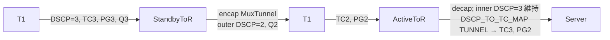
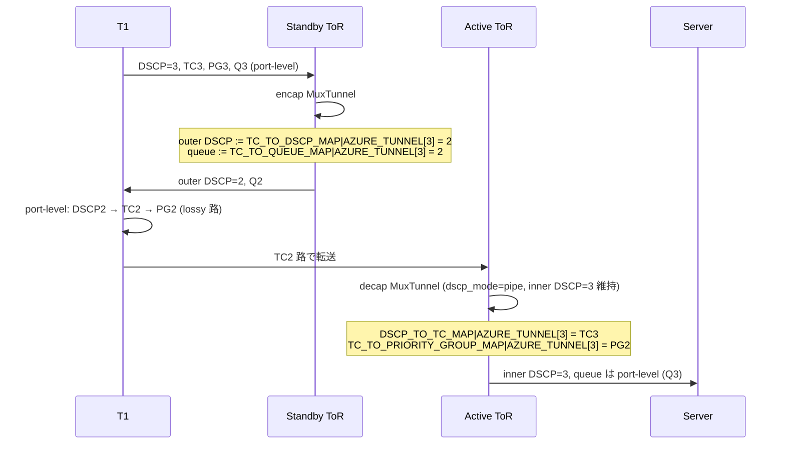

!!! warning "裏取りステータス: Discrepancy-found"
    主要実装は現行 master で確認済みだが、HLD と実装で **PFC watchdog 用フィールド名に差異** がある。詳細は本文末尾「実装との乖離」を参照（verified at: 2026-05-09）。

# トンネルトラフィックの DSCP / TC リマップ（Dual-ToR PFC デッドロック回避）

## 概要

Dual-ToR（Active / Standby）構成では、サーバ側で輻輳が起きると **upper / lower 両方の ToR に PFC pause が同時に伝搬** する状況が起こり得る。Standby ToR はサウスバウンド（T1 → ToR → サーバ）方向に来たトラフィックを **同じキューでバウンスバック** して T1 を介して Active ToR に流すため、輻輳ポイントが解消されても T1 ↔ ToR 間で pause が固着する **PFC デッドロック** が発生する[^1]。

本機能は、tunnel encap 時に **キュー / DSCP を別系統に書き換え**、tunnel decap 時に **port 単位のマップを上書きして TC / PG を再設定** することで、バウンスバック経路と通常経路を物理的に別キューへ分離する。SAI に新規追加された tunnel 属性を使うため、`202012` / `202205` ブランチを最初のターゲットにすると HLD は明記している[^1]。

## 動作仕様

### バウンスバック経路と問題

Standby ToR が受け取った南向きトラフィックは、対向 ToR (Active 側) へ MuxTunnel (IPinIP) で encap して送り返される。元のポート単位の TC / Queue がそのまま使われると、T1 → Standby ToR → T1 の往復が同一キューで連結し、PFC pause が解消しない。HLD は **encap 側で DSCP / Queue を変える** のと、**decap 側で受信ポート単位 TC / PG を上書きする** の 2 段で経路を分離する。



### SWSS スキーマ追加

新規・更新される QoS マップは 4 つ。`AZURE_TUNNEL` 系として既存の `AZURE` 系と並置される[^1]。

| 用途 | テーブル | 備考 |
|------|---------|------|
| decap 時 outer DSCP → TC | `DSCP_TO_TC_MAP\|AZURE_TUNNEL` | 既存 `AZURE` から `5→1`, `33→8`, `48→7` を変更 |
| decap 時 TC → PG | `TC_TO_PRIORITY_GROUP_MAP\|AZURE_TUNNEL` | TC3→PG2, TC4→PG6 にずらす |
| encap 時 TC → Queue | `TC_TO_QUEUE_MAP\|AZURE_TUNNEL` | TC3→Q2, TC4→Q6 等 |
| encap 時 (TC, color) → DSCP | `TC_TO_DSCP_MAP\|AZURE_TUNNEL` | **新設**。`sonic-tc-dscp.yang` を新規追加 |

ポート側マップ (`AZURE`) も合わせて更新される。`TC_TO_PRIORITY_GROUP_MAP|AZURE` は `TC2→PG2`, `TC6→PG6` を有効化し、tunnel 側で使う追加 lossy PG (PG2 / PG6) を成立させる[^1]。

これらは Dual-ToR 限定で生成される: `DEVICE_METADATA['localhost']['subtype'] = 'DualToR'` のときのみ `qos_config.j2` がレンダリングする。

### TUNNEL テーブルの更新

既存 `TUNNEL|MuxTunnel0` を以下のように拡張する[^1]。

```json
"TUNNEL": {
    "MuxTunnel0": {
        "dscp_mode": "pipe",
        "dst_ip": "10.1.0.32",
        "ecn_mode": "copy_from_outer",
        "encap_ecn_mode": "standard",
        "ttl_mode": "pipe",
        "tunnel_type": "IPINIP",
        "decap_dscp_to_tc_map": "[DSCP_TO_TC_MAP|AZURE_TUNNEL]",
        "decap_tc_to_pg_map": "[TC_TO_PRIORITY_GROUP_MAP|AZURE_TUNNEL]",
        "encap_tc_to_queue_map": "[TC_TO_QUEUE_MAP|AZURE_TUNNEL]",
        "encap_tc_color_to_dscp_map": "[TC_TO_DSCP_MAP|AZURE_TUNNEL]"
    }
}
```

注目点は次の 2 つ。

- `dscp_mode` は **`pipe` に変更**（従来の `uniform` ではない）。decap 時 outer DSCP を捨てて inner DSCP を保つ。
- `encap_tc_color_to_dscp_map` が **新規キー**。SAI の `SAI_TUNNEL_ATTR_ENCAP_QOS_TC_AND_COLOR_TO_DSCP_MAP` に対応する。

### 追加 lossless キューと PFCWD の分離

PG2 / PG6 が新たに lossy として有効になる一方で、追加 lossless キュー（Q2 / Q6 系）に対しては **PFC watchdog を必ずしも有効化したくない** という要件があるため、`PORT_QOS_MAP` に新フィールド `pfc_wd_sw_enable` が追加される[^1]。

| フィールド | 意味 |
|------------|------|
| `pfc_enable` | PFC を有効にするキュー一覧 |
| `pfc_wd_sw_enable` | PFC watchdog をソフトウェア側で有効にするキュー一覧 |

例:

```json
"PORT_QOS_MAP": {
    "Ethernet0": {
        "pfc_enable": "3,4,2,6",
        "pfc_wd_sw_enable": "3,4"
    }
}
```

旧構成からの移行で互換性を保つため、`db_migrator` を更新して既存 `pfc_enable` から `pfc_wd_sw_enable` を派生させる必要がある。新フィールドのため `sonic-port-qos-map.yang` の更新も伴う。

### SAI 属性

新規・既存を問わず、本機能で使う tunnel SAI 属性は次の 4 つ[^1]。

| SAI 属性 | 役割 |
|----------|------|
| `SAI_TUNNEL_ATTR_ENCAP_QOS_TC_AND_COLOR_TO_DSCP_MAP` | encap で outer DSCP を (TC, color) からリマップ |
| `SAI_TUNNEL_ATTR_ENCAP_QOS_TC_TO_QUEUE_MAP` | encap で送出キューを TC からリマップ |
| `SAI_TUNNEL_ATTR_DECAP_QOS_DSCP_TO_TC_MAP` | decap で outer DSCP → TC をポート単位マップから上書き |
| `SAI_TUNNEL_ATTR_DECAP_QOS_TC_TO_PRIORITY_GROUP_MAP` | decap で TC → PG をポート単位マップから上書き |

orchagent 側では:

- `tunneldecaporch`: decap tunnel 作成時に `DECAP_QOS_*` を投入。
- `muxorch::create_tunnel`: encap 側 `ENCAP_QOS_*` を投入。

### 終端オブジェクトの分離

`MuxTunnel` と通常の IPinIP tunnel が **同じ Loopback (`10.1.0.32`) を `dst_ip`** として使うと、decap terminator がぶつかって追加属性を一方だけに付与できない。HLD は次のように **terminator を 2 つに分離** する[^1]。

| トンネル種別 | terminator type | 理由 |
|--------------|-----------------|------|
| `MuxTunnel` | `P2P` | 対向 ToR の Loopback を `src_ip` に持てる |
| 通常 IPinIP | `P2MP` | `src_ip` 不定。従来どおり |

### バウンスバック経路の例（DSCP=3 トラフィック）



<!-- evidence:
source: sonic-net/SONiC/doc/qos/tunnel_dscp_remapping.md#L283-L302 (sha: 49bab5b5ff0e924f1ea52b3d9db0dfa4191a7c06)
excerpt: |
  Bounced back traffic from Standby ToR to T1 ... outer DSCP is rewritten to 2 ...
  Traffic is delivered in Queue 2 ...
  At Active ToR ... DSCP_TO_TC_MAP|AZURE_TUNNEL ... TC_TO_PRIORITY_GROUP_MAP|AZURE_TUNNEL ... PG 2
reasoning: バウンスバック経路の DSCP/TC/PG/Queue 遷移の根拠。
-->

## 設定

### 関連する CONFIG_DB

| Table | Key | フィールド | 用途 |
|-------|-----|-----------|------|
| `DSCP_TO_TC_MAP` | `AZURE_TUNNEL` | DSCP → TC | tunnel decap 用 |
| `TC_TO_PRIORITY_GROUP_MAP` | `AZURE_TUNNEL` | TC → PG | tunnel decap 用 |
| `TC_TO_QUEUE_MAP` | `AZURE_TUNNEL` | TC → Queue | tunnel encap 用 |
| `TC_TO_DSCP_MAP` | `AZURE_TUNNEL` | TC → DSCP | tunnel encap 用（新設） |
| `TUNNEL` | `MuxTunnel0` | `decap_dscp_to_tc_map` 等 | tunnel に上記マップを紐付け |
| `PORT_QOS_MAP` | `Ethernet*` | `pfc_wd_sw_enable` | PFCWD のキュー一覧（新設） |

### 関連する CLI

HLD 上に新規 SONiC CLI の追加記述は無い。設定は `qos_config.j2` で生成される `config_db.json` の更新と、`db_migrator` 経由で旧構成から派生する。

### 関連する YANG

- `sonic-tc-dscp.yang` — `TC_TO_DSCP_MAP` を表す **新設モジュール**
- `sonic-port-qos-map.yang` — `pfc_wd_sw_enable` フィールド追加

### 設定例

```json
{
    "TUNNEL": {
        "MuxTunnel0": {
            "dscp_mode": "pipe",
            "tunnel_type": "IPINIP",
            "decap_dscp_to_tc_map": "[DSCP_TO_TC_MAP|AZURE_TUNNEL]",
            "encap_tc_color_to_dscp_map": "[TC_TO_DSCP_MAP|AZURE_TUNNEL]"
        }
    }
}
```

## 干渉する機能

- **MuxTunnel**: 本機能の主対象。terminator が `P2P` に分離される変更が入る。
- **通常の IPinIP tunnel**: terminator は `P2MP` 維持。属性は付かない。
- **PFC watchdog**: `pfc_enable` と `pfc_wd_sw_enable` の分離が前提。`db_migrator` を当てないと WD が無条件に有効化される旧挙動になる可能性。
- **port-level `AZURE` マップ**: `TC2→PG2`, `TC6→PG6` を成立させるためポート側マップも書き換わる。同テーブルを上書きしているプラットフォーム固有設定があると衝突する可能性。

## トラブルシューティング

- バウンスバック経路でも輻輳が伝搬する場合: `MuxTunnel0` に `encap_tc_to_queue_map` / `encap_tc_color_to_dscp_map` が反映されているか CONFIG_DB と ASIC_DB（`SAI_TUNNEL_ATTR_ENCAP_QOS_*`）で確認する。
- decap 後の TC が想定外: `dscp_mode=pipe` になっているかを確認。`uniform` のままだと outer DSCP がそのまま inner に上書きされ、`DSCP_TO_TC_MAP|AZURE_TUNNEL` の効きが見えなくなる。
- PFCWD の対象キューが想定と違う: `db_migrator` が `pfc_wd_sw_enable` を生成しているか、または手動で `PORT_QOS_MAP` に入っているかを確認。
- terminator の競合: `MuxTunnel` と通常 IPinIP の両方を作っているのに decap 属性が片方にしか反映されない場合、terminator 分離 (P2P / P2MP) が orchagent で実装されているか裏取り。

## 実装との乖離

実コード裏取りで判明した HLD との差分（verified at: 2026-05-09）:

- **PFCWD フィールド名**: HLD は `pfc_wd_sw_enable` と表記しているが、現行 master では `pfcwd_sw_enable`（アンダースコアの位置が異なる）として実装されている。`sonic-utilities/scripts/db_migrator.py:1186-1193` で `pfc_enable` から `pfcwd_sw_enable` を派生している。CONFIG_DB / YANG (`sonic-port-qos-map`) を読む際は実装側の名称に合わせる必要がある。
- 一方、`tunneldecaporch.cpp:834,1084`（`SAI_TUNNEL_ATTR_DECAP_QOS_DSCP_TO_TC_MAP` / `..._TC_TO_PRIORITY_GROUP_MAP`）、`muxorch.cpp:259,2347`（MuxTunnel の `SAI_TUNNEL_PEER_MODE_P2P`）、`files/build_templates/qos_config.j2:441` の Dual-ToR 限定 `AZURE_TUNNEL` 出力は HLD どおり実装されていることを確認した。

## 引用元

[^1]: `sonic-net/SONiC` `doc/qos/tunnel_dscp_remapping.md` @ `49bab5b5ff0e924f1ea52b3d9db0dfa4191a7c06`
