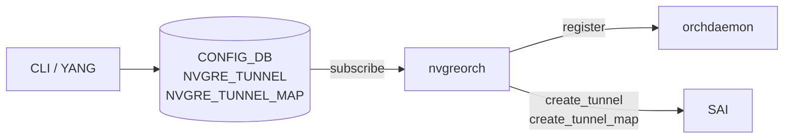
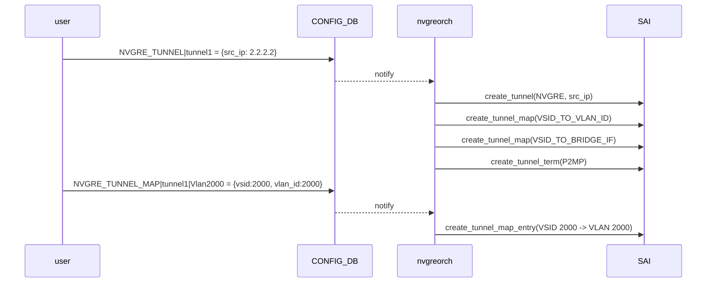

<!-- topics-tip -->
!!! tip "Topics で読み物として読む"
    この HLD は実装詳細を含みます。機能の概念・設定・運用を読み物として読みたい場合は [Topics 03 章: VXLAN / EVPN とオーバーレイ](../topics/03-vxlan-evpn/index.md) を参照。
<!-- /topics-tip -->

!!! note "裏取りステータス: code-verified"
    verifier-batch-18 で確認: `sonic-swss/orchagent/orchdaemon.cpp:361-` で `NvgreTunnelOrch` / `NvgreTunnelMapOrch` を生成、`sonic-swss/orchagent/nvgreorch.{cpp,h}` 実体、`sonic-utilities/config/plugins/nvgre_tunnel.py` の自動生成 CLI を確認。

# NVGRE トンネル（nvgreorch / decap mapper）

## 何のための機能か

NVGRE (Network Virtualization using Generic Routing Encapsulation) は L3 上に多数の仮想 L2 セグメントを張る方式。VxLAN と同じ「L2 over L3」だが GRE を使い 24 bit VSID でテナントを識別する。本機能は [SONiC](../reference/glossary.md#term-sonic) に **NVGRE の decap 受信側** を追加し、外部から来た NVGRE フレームを内側の [VLAN](../reference/glossary.md#term-vlan) または Bridge にマップして転送できるようにする。**Phase 1 は decap のみ、encap mapper はスコープ外**[^1]。

カウンタは非対応。[SAI](../reference/glossary.md#term-sai) 1.9 以上が必須[^1]。

## どう動くか

### コンポーネント



新規 orch `nvgreorch` を `orchdaemon` に登録し、[CONFIG_DB](../reference/glossary.md#term-config_db) を購読する。トンネル作成時に **VLAN マッパーと Bridge マッパーの両方を既定で生成** するので、`vlan_id` を渡しても、後から bridge マップを足しても動く[^1]。

### CONFIG_DB スキーマ

```text
NVGRE_TUNNEL|<tunnel_name>
    src_ip = <ipv4 or ipv6>

NVGRE_TUNNEL_MAP|<tunnel_name>|<tunnel_map_name>
    vsid    = <0..16777214>      # 24 bit
    vlan_id = <1..4094>
```

### SAI マッピング

| 概念 | SAI |
|------|-----|
| トンネル種別 | `SAI_TUNNEL_TYPE_NVGRE` |
| Decap mapper (VLAN) | `SAI_TUNNEL_MAP_TYPE_VSID_TO_VLAN_ID` |
| Decap mapper (Bridge) | `SAI_TUNNEL_MAP_TYPE_VSID_TO_BRIDGE_IF` |
| 終端 | `SAI_TUNNEL_TERM_TABLE_ENTRY_TYPE_P2MP` |

P2MP 終端で受けるため対向 `src_ip` は不定でよい。

<!-- evidence:
source: sonic-net/SONiC/doc/nvgre_tunnel/nvgre_tunnel.md#L181-L188 (sha: 49bab5b5ff0e924f1ea52b3d9db0dfa4191a7c06)
excerpt: |
  | NVGRE tunnel type | SAI_TUNNEL_TYPE_NVGRE |
  | Decap mapper | SAI_TUNNEL_MAP_TYPE_VSID_TO_VLAN_ID |
  | Decap mapper | SAI_TUNNEL_MAP_TYPE_VSID_TO_BRIDGE_IF |
  | NVGRE tunnel termination entry type | SAI_TUNNEL_TERM_TABLE_ENTRY_TYPE_P2MP |
reasoning: SAI 種別と P2MP 終端、二系統の decap mapper の根拠。
-->

<!-- evidence-rendered:start -->
??? note "📋 検証エビデンス: sonic-net/SONiC/doc/nvgre_tunnel/nvgre_tunnel.md#L181-L188 (sha: 49bab5b5ff0e924f1ea52b3d9db0dfa4191a7c06)"

    **出典**:

    `sonic-net/SONiC/doc/nvgre_tunnel/nvgre_tunnel.md#L181-L188 (sha: 49bab5b5ff0e924f1ea52b3d9db0dfa4191a7c06)`

    **抜粋**:

    ```text
    | NVGRE tunnel type | SAI_TUNNEL_TYPE_NVGRE |
    | Decap mapper | SAI_TUNNEL_MAP_TYPE_VSID_TO_VLAN_ID |
    | Decap mapper | SAI_TUNNEL_MAP_TYPE_VSID_TO_BRIDGE_IF |
    | NVGRE tunnel termination entry type | SAI_TUNNEL_TERM_TABLE_ENTRY_TYPE_P2MP |
    ```

    **判断根拠**: SAI 種別と P2MP 終端、二系統の decap mapper の根拠。

<!-- evidence-rendered:end -->

### トンネル作成シーケンス



### 削除と起動の挙動

- **カスケード削除しない**。ユーザが先にマップを全削除する責務。依存が残った tunnel の delete は拒否[^1]。
- Warm / Fast boot **影響なし**。通常起動と同じシーケンスで再投入[^1]。

## 設定

### CONFIG_DB

| Table | Key | フィールド | 説明 |
|-------|-----|-----------|------|
| `NVGRE_TUNNEL` | `<tunnel_name>` | `src_ip` | 送信元 IP (v4/v6) |
| `NVGRE_TUNNEL_MAP` | `<tunnel_name>\|<tunnel_map_name>` | `vsid` | 0..16,777,214 |
| | | `vlan_id` | 1..4094 |

### CLI

| Command | 用途 |
|---------|------|
| `config nvgre-tunnel add <name> --src-ip <IP>` | トンネル追加 |
| `config nvgre-tunnel delete <name>` | トンネル削除（マップ全削除後）|
| `config nvgre-tunnel-map add <tunnel> <map_name> --vlan-id <ID> --vsid <VSID>` | マップ追加 |
| `config nvgre-tunnel-map delete <tunnel> <map_name>` | マップ削除 |
| `show nvgre-tunnel` / `show nvgre-tunnel-map` | 一覧 |

CLI は [YANG](../reference/glossary.md#term-yang) から auto-generation tool で生成[^1]。

### YANG

`sonic-nvgre-tunnel` モジュールに 2 コンテナを定義[^1]:

```yang
container NVGRE_TUNNEL {
    list NVGRE_TUNNEL_LIST {
        key "tunnel_name";
        leaf src_ip { mandatory true; type inet:ip-address; }
    }
}
container NVGRE_TUNNEL_MAP {
    list NVGRE_TUNNEL_MAP_LIST {
        key "tunnel_name tunnel_map_name";
        leaf vlan_id { mandatory true; type uint16 { range 1..4094; } }
        leaf vsid    { mandatory true; type uint32 { range 0..16777214; } }
    }
}
```

### 設定例

```bash
config nvgre-tunnel add tunnel1 --src-ip 2.2.2.2
config nvgre-tunnel-map add tunnel1 Vlan2000 --vlan-id 2000 --vsid 2000

show nvgre-tunnel
# tunnel1   2.2.2.2

show nvgre-tunnel-map
# tunnel1   Vlan2000   2000   2000
```

## 制限事項

- **decap のみ**（encap は範囲外）
- カウンタ非対応
- トンネル数の上限は SAI / [ASIC](../reference/glossary.md#term-asic) リソース依存。超過時は SAI エラーで `nvgreorch` が abort

## 干渉する機能

- **VxLAN**: 同じ L2 over L3 だがカプセル化と orch が別系統。両方有効化可だが ASIC 依存でリソース競合あり。
- **Bridge / VLAN**: VLAN マッパー / Bridge マッパー両方を `nvgreorch` が既定で作るため後付け bridge にも対応。
- **Warm / Fast boot**: 影響なし。

## トラブルシューティング

- decap が効かない: `redis-cli -n 4 keys 'NVGRE_TUNNEL*'` で CONFIG_DB、続いて `ASIC_DB` で `SAI_OBJECT_TYPE_TUNNEL` / `SAI_TUNNEL_TYPE_NVGRE` を確認。
- `nvgreorch` abort: SAI / ASIC リソース上限。tunnel / map 数を減らす。
- 削除拒否: 紐付く `NVGRE_TUNNEL_MAP` を先に削除。
- SAI バージョン: 1.9 未満ベンダーは未対応。`syncd` の SAI バージョン確認。

### コマンド例

トンネル [DSCP](../reference/glossary.md#term-dscp) マップと再書換ポリシーを確認する。

```bash
# トンネル DSCP / マップ
show tunnel
redis-cli -n 4 keys 'TUNNEL_DECAP_TABLE:*'
redis-cli -n 4 hgetall 'TC_TO_DSCP_MAP|AZURE'
redis-cli -n 1 keys 'ASIC_STATE:SAI_OBJECT_TYPE_TUNNEL:*' | head
```

## 関連トピック

- [Topics: VXLAN / EVPN](../topics/03-vxlan-evpn/index.md) — L2 over L3 トンネルの基礎
- [vxlan-sonic](vxlan-sonic.md)

## 引用元

[^1]: `sonic-net/SONiC` `doc/nvgre_tunnel/nvgre_tunnel.md` @ `49bab5b5ff0e924f1ea52b3d9db0dfa4191a7c06`

<!-- topics-back-ref -->
## 関連 Topics

- [Topics: VXLAN / EVPN / VNET オーバーレイ](../topics/03-vxlan-evpn/index.md)

<!-- /topics-back-ref -->

<!-- glossary-links-injected: ec18b66e3507 -->
