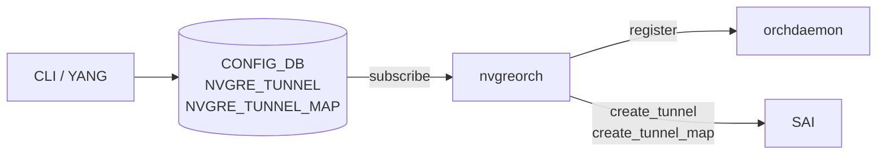
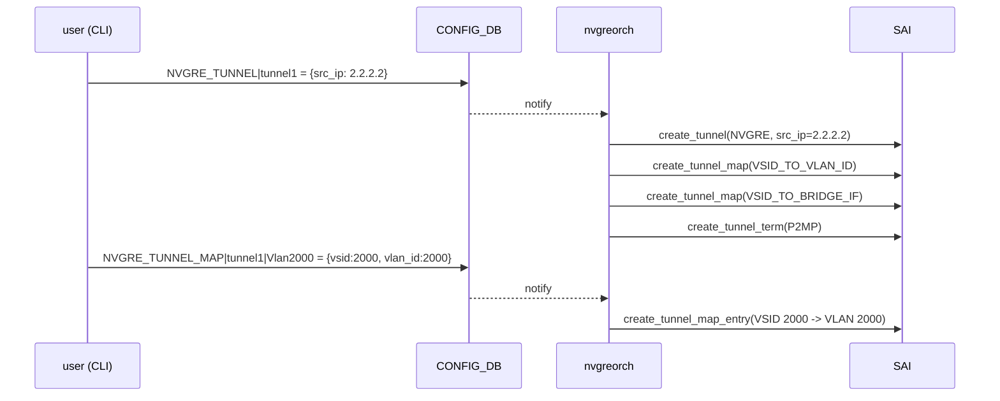

!!! note "裏取りステータス: code-verified"
    verifier-batch-18 で確認:

    - `sonic-swss/orchagent/orchdaemon.cpp:361-` で `NvgreTunnelOrch(m_configDb, CFG_NVGRE_TUNNEL_TABLE_NAME)` および `NvgreTunnelMapOrch(m_configDb, CFG_NVGRE_TUNNEL_MAP_TABLE_NAME)` を生成
    - `sonic-swss/orchagent/nvgreorch.{cpp,h}` 実体が存在
    - `sonic-utilities/config/plugins/nvgre_tunnel.py` に `config nvgre-tunnel add/del` 等の自動生成 CLI

# NVGRE トンネル（nvgreorch / decap mapper）

## 概要

NVGRE (Network Virtualization using Generic Routing Encapsulation) は、L3 ネットワーク上に多数の仮想 L2 セグメントをトンネル経由で実装するための方式である。VxLAN と同じファミリの「L2 over L3」だが、カプセル化に GRE を使い、24 bit の VSID (Virtual Subnet Identifier) でテナントを識別する。本機能は SONiC に NVGRE トンネル **の decap 受信側機能** を追加するもので、外部からカプセル化されてきた NVGRE フレームを、内側の VLAN または Bridge にマップして転送できるようにする。Phase 1 設計として **encap mapper は範囲外**、decap のみが対象である[^1]。

カウンタ統計は本 HLD のスコープ外。NVGRE トンネルの SAI 実装は **SAI 1.9 以上** を要求する[^1]。

## 動作仕様

### コンポーネント構成



新規 orchestration agent `nvgreorch` を `orchdaemon` に登録し、CONFIG_DB の `NVGRE_TUNNEL` / `NVGRE_TUNNEL_MAP` を購読する。トンネル作成時に **VLAN マッパーと Bridge マッパーの両方を既定で生成** するので、ユーザは `vlan_id` を渡しても、bridge ベースのマッピングを後から付け足しても動作する設計になっている[^1]。

### CONFIG_DB スキーマ

```text
NVGRE_TUNNEL|<tunnel_name>
    src_ip = <ipv4 or ipv6>

NVGRE_TUNNEL_MAP|<tunnel_name>|<tunnel_map_name>
    vsid    = <0..16777214>
    vlan_id = <1..4094>
```

- `src_ip` は IPv4 / IPv6 どちらも許容（YANG では `inet:ip-address`）。
- VSID は 24 bit のため最大値は `16,777,214`。
- VLAN ID は標準範囲 `1..4094`。

### SAI マッピング

| NVGRE 概念 | SAI 属性 / 列挙値 |
|-----------|---------------------|
| トンネル種別 | `SAI_TUNNEL_TYPE_NVGRE` |
| Decap mapper（VLAN）| `SAI_TUNNEL_MAP_TYPE_VSID_TO_VLAN_ID` |
| Decap mapper（Bridge）| `SAI_TUNNEL_MAP_TYPE_VSID_TO_BRIDGE_IF` |
| 終端エントリ | `SAI_TUNNEL_TERM_TABLE_ENTRY_TYPE_P2MP` |

`P2MP` 終端で受けるため、対向側 `src_ip` は不定でも構わない。

<!-- evidence:
source: sonic-net/SONiC/doc/nvgre_tunnel/nvgre_tunnel.md#L181-L188 (sha: 49bab5b5ff0e924f1ea52b3d9db0dfa4191a7c06)
excerpt: |
  | NVGRE tunnel type | SAI_TUNNEL_TYPE_NVGRE |
  | Decap mapper | SAI_TUNNEL_MAP_TYPE_VSID_TO_VLAN_ID |
  | Decap mapper | SAI_TUNNEL_MAP_TYPE_VSID_TO_BRIDGE_IF |
  | NVGRE tunnel termination entry type | SAI_TUNNEL_TERM_TABLE_ENTRY_TYPE_P2MP |
reasoning: SAI 種別と P2MP 終端、二系統の decap mapper の根拠。
-->

### トンネル作成シーケンス



### 削除の注意

トンネル削除は **ユーザが先にすべての関連設定（マップ）を削除する責務** を負う。`nvgreorch` がカスケード削除する設計ではなく、依存が残った tunnel の delete は拒否される旨が HLD に明記されている[^1]。

### Warm/Fast boot

本機能は warm/fast boot に **影響を与えない** と HLD は明記している[^1]。トンネルの再作成は通常起動と同様のシーケンスで行われる。

### 制限事項

- **decap のみ** 対応。NVGRE encap は本 Phase の範囲外。
- カウンタ未対応。
- トンネル数の上限は SONiC 側では定めず、SAI / ASIC のリソース上限に到達したら SAI エラーで `nvgreorch` が abort する。

## 設定

### 関連する CONFIG_DB

| Table | Key | フィールド | 説明 |
|-------|-----|-----------|------|
| `NVGRE_TUNNEL` | `<tunnel_name>` | `src_ip` | トンネル送信元 IP（v4/v6） |
| `NVGRE_TUNNEL_MAP` | `<tunnel_name>\|<tunnel_map_name>` | `vsid` | 0..16,777,214 |
| | | `vlan_id` | 1..4094 |

### 関連する CLI

| Command | 用途 |
|---------|------|
| `config nvgre-tunnel add <name> --src-ip <IP>` | トンネル追加 |
| `config nvgre-tunnel delete <name>` | トンネル削除（マップ削除済みであること）|
| `config nvgre-tunnel-map add <tunnel> <map_name> --vlan-id <ID> --vsid <VSID>` | VLAN/VSID マップ追加 |
| `config nvgre-tunnel-map delete <tunnel> <map_name>` | マップ削除 |
| `show nvgre-tunnel` | トンネル一覧 |
| `show nvgre-tunnel-map` | マップ一覧 |

CLI は YANG モデルから **CLI auto-generation tool** で生成する設計になっている[^1]。

### 関連する YANG

`sonic-nvgre-tunnel` モジュールに `NVGRE_TUNNEL` / `NVGRE_TUNNEL_MAP` の 2 コンテナを定義[^1]。

```yang
module sonic-nvgre-tunnel {
    container NVGRE_TUNNEL {
        list NVGRE_TUNNEL_LIST {
            key "tunnel_name";
            leaf src_ip { mandatory true; type inet:ip-address; }
        }
    }
    container NVGRE_TUNNEL_MAP {
        list NVGRE_TUNNEL_MAP_LIST {
            key "tunnel_name tunnel_map_name";
            leaf vlan_id { mandatory true; type uint16 { range 1..4094; } }
            leaf vsid    { mandatory true; type uint32 { range 0..16777214; } }
        }
    }
}
```

### 設定例

```bash
config nvgre-tunnel add tunnel1 --src-ip 2.2.2.2
config nvgre-tunnel-map add tunnel1 Vlan2000 --vlan-id 2000 --vsid 2000

show nvgre-tunnel
# TUNNEL NAME    SRC IP
# tunnel1        2.2.2.2

show nvgre-tunnel-map
# TUNNEL NAME    TUNNEL MAP NAME    VLAN ID    VSID
# tunnel1        Vlan2000           2000       2000
```

## 干渉する機能

- **VxLAN**: 同じく L2 over L3 だがカプセル化方式と orch が別系統。`nvgreorch` と `vxlanorch` は独立。両方を有効にすることはできるが、リソース競合は ASIC 依存。
- **Bridge / VLAN**: NVGRE decap mapper は VLAN ベースと Bridge ベースの両方を `nvgreorch` が **既定で両方作る**。後から bridge 経由のマップ追加にも対応できる。
- **Warm/Fast boot**: 設計上の影響なしと HLD で明記。`nvgreorch` は通常起動と同じシーケンスで CONFIG_DB を再投入する想定。

## トラブルシューティング

- decap が効かない場合: `redis-cli -n 4 keys 'NVGRE_TUNNEL*'` で CONFIG_DB を確認、その後 `ASIC_DB` で `SAI_OBJECT_TYPE_TUNNEL` および `SAI_TUNNEL_TYPE_NVGRE` のオブジェクトが作成されているかを確認する。
- `nvgreorch` が abort する場合: SAI / ASIC のリソース上限到達が疑われる。tunnel / tunnel map の数を減らす。
- 削除が拒否される場合: 紐付く `NVGRE_TUNNEL_MAP` を先に削除する。HLD は明示的にカスケード削除しない設計と記載[^1]。
- SAI バージョンの問題: SAI 1.9 未満のベンダーでは未対応。`syncd` の SAI バージョンを確認する。

## 引用元

[^1]: `sonic-net/SONiC` `doc/nvgre_tunnel/nvgre_tunnel.md` @ `49bab5b5ff0e924f1ea52b3d9db0dfa4191a7c06`
