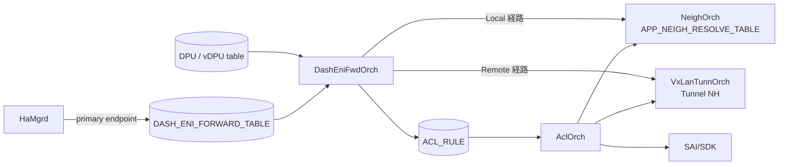
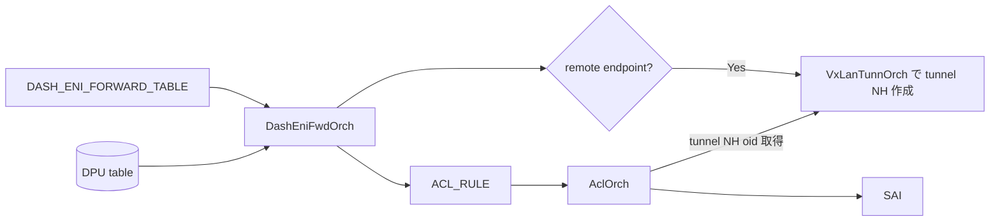
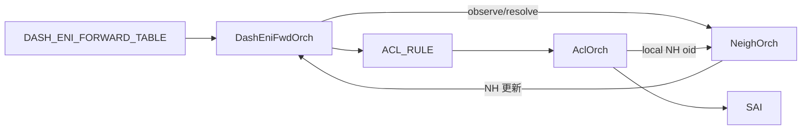

!!! warning "裏取りステータス: HLD-only"
    本ページは公式 HLD（Rev 0.2, 2025-10）のみを根拠に書かれている。`DashEniFwdOrch` の実装、`ENI_REDIRECT` ACL_TABLE_TYPE の AclOrch 取り込み、`ACL_RULE.REDIRECT` の tunnel nexthop 表記拡張、`VIP_TABLE` のスキーマ確定は未確認。

# SmartSwitch ENI Based Forwarding（DashEniFwdOrch / ENI_REDIRECT ACL）

## 概要

SmartSwitch（NPU + 複数 DPU）構成で NPU ↔ DPU 間のトラフィック転送モデルには 2 つの選択肢がある[^1]:

1. **VIP ベース**: コントローラが DPU 単位で Virtual IP を払い出し、ホストはそれをゲートウェイにする。実装は単純だが DPU ごとに VIP を消費しコスト高
2. **ENI ベース転送（本 HLD）**: ホストはスイッチ単位の VIP のみを使い、NPU 上で **ENI（Elastic Network Interface）単位の ACL ルールでローカル DPU またはリモート DPU へリダイレクト** する

ENI ベースは VIP 消費を 1 cluster 単位まで削減でき、ENI を SmartSwitch を跨いで配置できる柔軟性も持つ。コスト効率からこちらが採用される[^1]。

実装はスイッチに **ENI と DPU の対応関係** を理解させ、INGRESS ACL（`ENI_REDIRECT` 型）でパケットを `local nexthop` または `tunnel nexthop` にリダイレクトする形を取る。新しい orchagent `DashEniFwdOrch` がこの ACL を生成する。

## 動作仕様

### パケット経路の 3 ケース

```mermaid
flowchart LR
    H[Host] -->|VIP=スイッチ宛て| NPU
    subgraph cluster["T1 cluster"]
      NPU --> ACL[ENI_REDIRECT ACL]
      ACL -->|case 1: local active ENI| LD[Local DPU]
      ACL -->|case 2: local standby ENI\n(remote が active)| RT[Remote NPU+DPU\n VxLAN]
      ACL -->|case 3: ENI が無いスイッチ| RT
    end
```

3 ケース[^1]:

- **Case 1**: パケットが着地した NPU に **active ENI** がある → ローカル DPU へ
- **Case 2**: パケットが着地した NPU に **standby ENI** がある（active が他 NPU） → 他 NPU に向けて L3 VxLAN
- **Case 3**: パケットが着地した NPU に該当 ENI が無い → これも remote へ転送

### スコープ・スケール

- 対象は **Floating NIC (FNIC) シナリオのみ**[^1]
- スケール（FNIC + Private Link 想定）:
  - hosted ENI 数 × 2（Tunnel Termination 用 + 通常用）
  - + non-hosted ENI 数 × 1（Tunnel Termination 不要）
- 例: T1 8 台 / DPU 4 / ENI 64 / HA 2 倍 → cluster 内 1024 ENI、T1 1 台にホストされる ENI 256 → ACL ルール `256*2 + (1024-256) = 1280`[^1]

### Phase 分け

| Phase | 内容 |
|-------|------|
| Phase 1 | `HaMgrd` が `DASH_ENI_FORWARD_TABLE` を書き、orchagent は **primary endpoint のみ** ACL ルールに変換。Tunnel Termination ルールも生成。BFD は使わない |
| Phase 2 | local / remote DPU に BFD セッションを張り、BFD の状態で primary / secondary を切替。local NEIGH down も処理 |

本 HLD の主目的は Phase 1 の機構を確立すること[^1]。

### コンポーネント構成



`DashEniFwdOrch` の責務:

- `DASH_ENI_FORWARD_TABLE` を購読し、各 ENI について endpoint が **local / remote** のいずれかを DPU テーブルから判別
- Local の場合: `NeighOrch` を介してネクストホップ解決（必要なら `APP_NEIGH_RESOLVE_TABLE` に書く）
- Remote の場合: `VxLanTunnOrch` で tunnel nexthop を生成
- 結果を `ACL_RULE` テーブルに書き、`AclOrch` 経由で SAI/SDK に下ろす

### ACL テーブル定義（`ENI_REDIRECT`）

```json
{
  "ACL_TABLE_TYPE": {
    "ENI_REDIRECT": {
      "MATCHES": ["DST_IP", "DST_IPV6", "INNER_DST_MAC", "TUNNEL_TERM"],
      "ACTIONS": ["REDIRECT_ACTION"],
      "BIND_POINTS": ["PORT"]
    }
  },
  "ACL_TABLE": {
    "ENI": {
      "STAGE": "INGRESS",
      "TYPE": "ENI_REDIRECT",
      "PORTS": ["<Ingress front panel ports>"]
    }
  }
}
```

要点:

- `INGRESS` ACL。マッチ条件は **外側 DST_IP / DST_IPV6（VIP）+ INNER_DST_MAC（ENI MAC）+ TUNNEL_TERM** の組み合わせ
- アクションは `REDIRECT_ACTION` のみ
- BIND_POINTS は前面パネルポート

### ACL ルールの 2 種類

ENI 属性が次の場合を例にする[^1]:

```
MAC: aa:bb:cc:dd:ee:ff
TUNNEL_VNI: 4000
VIP: 1.1.1.1/32
VNET: Vnet1000
```

#### 通常ルール（PRIORITY 9996）

```json
{
  "ACL_RULE": {
    "ENI:Vnet1000_AABBCCDDEEFF": {
      "PRIORITY": "9996",
      "DST_IP": "1.1.1.1/32",
      "INNER_DST_MAC": "aa:bb:cc:dd:ee:ff",
      "REDIRECT": "<local/tunnel nexthop>"
    }
  }
}
```

FNIC では **`outbound_eni_mac_lookup` と `outbound_vni` は無関係**（常に INNER_DST_MAC でマッチする）[^1]。

#### Tunnel Termination ルール（PRIORITY 9997, 高優先）

```json
{
  "ACL_RULE": {
    "ENI:Vnet1000_AABBCCDDEEFF_TERM": {
      "PRIORITY": "9997",
      "DST_IP": "1.1.1.1/32",
      "INNER_DST_MAC": "aa:bb:cc:dd:ee:ff",
      "TUNN_TERM": "true",
      "REDIRECT": "<local nexthop oid>"
    }
  }
}
```

#### なぜ Tunnel Termination ルールが必要か

HA failover の遷移期に「旧 active が standby になったが、旧 standby はまだ standby のまま」という曖昧状態が短時間生じる。この状態で remote にループバックするとパケットがピンポンして輻輳・ドロップが起きる[^1]。

```mermaid
flowchart LR
    P[着信パケット] --> CHK{TUNNEL_TERM?\n(VxLAN decap 後)}
    CHK -->|Yes| LOCAL[必ず local nexthop へ\n(高優先 9997)]
    CHK -->|No| LOOK[通常ルール 9996]
```

「**Tunnel decap 後のパケットは必ずローカルに留める**」というルールを高優先で挿入し、ループを防ぐ。

### REDIRECT のスキーマ拡張

既存の `ACL_RULE.REDIRECT` は次のいずれかを取る[^1]:

- 物理ポート名（`Ethernet10`）
- LAG 名（`PortChannel5`）
- IP（`10.0.0.1`）
- IP@VRF（`10.0.0.2@Vrf2`）
- IP@IF（`10.0.0.3@Ethernet1`）
- nexthop group（`10.0.0.1,10.0.0.3@Ethernet1`）

本 HLD ではここに **tunnel nexthop 表記** を追加する。

```
redirect_action = "<remote PA>@<tunnel_name>,<vni>"
例: "2.2.2.1@tunnel_name,100"
```

これにより `AclOrch` が `VxLanTunnOrch` から tunnel nexthop OID を解決して SAI に下ろせる。

### Local / Remote nexthop 解決フロー

リモート（VxLAN）:



ローカル:



`DashEniFwdOrch` は隣接解決を `APP_NEIGH_RESOLVE_TABLE_NAME` に書いて `NeighOrch` に促せる[^1]。

<!-- evidence:
source: sonic-net/SONiC/doc/smart-switch/high-availability/eni-based-forwarding.md#L182-L211 (sha: 49bab5b5ff0e924f1ea52b3d9db0dfa4191a7c06)
excerpt: |
  When the HA failover happens, the used-to-be active becomes standby, but the used-to-be standby is still unchanged.
  ... To solve this, ACL rules with high priority are added and the redirect should always be to local nexthop
  "ENI:Vnet1000_AABBCCDDEEFF_TERM": { "PRIORITY": "9997", ... "TUNN_TERM": "true", "REDIRECT": "<local nexthop oid>" }
reasoning: HA failover 過渡期のループ防止と、Tunnel Termination ルールが高優先 (9997) で local nexthop に留める設計の根拠。
-->

## 設定

### 関連する CONFIG_DB

| Table | 役割 |
|-------|------|
| `ACL_TABLE_TYPE.ENI_REDIRECT` | INGRESS ACL の型定義（match 4 つ + REDIRECT_ACTION + PORT bind） |
| `ACL_TABLE.ENI` | INGRESS / type=ENI_REDIRECT / 前面パネルポート bind |
| `ACL_RULE` | ENI 単位の通常ルール + Tunnel Termination ルール |
| `DASH_ENI_FORWARD_TABLE` | HaMgrd → DashEniFwdOrch への入力 |
| `VIP_TABLE` | スイッチ VIP の一時格納先（HLD は「現状一時テーブル」と明記）[^1] |

### 関連する CLI

専用 CLI は HLD で言及されていない。

### 関連する YANG

該当 YANG モジュールは HLD で言及されていない。

## 制限事項

- **対象は FNIC シナリオのみ**[^1]。FNIC 以外の DASH シナリオはスコープ外
- VIP 配置は T1 cluster 共通だが、それを保持する場所が「現状 `VIP_TABLE` という一時テーブル」と HLD で明記。最終形は未確定[^1]
- Phase 1 では BFD によるエンドポイント切替なし。card レベル故障の検知遅延がある
- Warm boot / Fast boot に対する追加処理は無い（impact なし）[^1]

## 干渉する機能

- **DASH HA HLD**: 本 HLD は HA HLD のフォワーディング層を切り出したもの。`DASH_ENI_FORWARD_TABLE` のスキーマは HA detailed design 側で定義
- **`AclOrch`**: `ENI_REDIRECT` 型 ACL_TABLE_TYPE の取り込みと、tunnel nexthop 表記の REDIRECT 解釈拡張
- **`VxLanTunnOrch` / `NeighOrch`**: nexthop 解決のバックエンド
- **`HaMgrd`**: `DASH_ENI_FORWARD_TABLE` の唯一の書き手（Phase 1）

## トラブルシューティング

- 着信トラフィックが正しい DPU に行かない場合、まず `redis-cli -n 4 hgetall "DASH_ENI_FORWARD_TABLE|<eni>"` で endpoint が正しいか確認
- ACL ルールが ASIC に反映されているかは `AclOrch` ログと SAI ACL カウンタで確認
- HA failover 直後の輻輳は Tunnel Termination ルール（PRIORITY 9997）が SET されているかを確認
- リモート経路でドロップが続く場合 `VxLanTunnOrch` の tunnel NH OID と `ACL_RULE.REDIRECT` の `<PA>@<tunnel>,<vni>` 表記の整合を確認

## 引用元

[^1]: `sonic-net/SONiC` `doc/smart-switch/high-availability/eni-based-forwarding.md` @ `49bab5b5ff0e924f1ea52b3d9db0dfa4191a7c06`

<!-- concerns hint:
- DashEniFwdOrch が現行 master の sonic-swss に存在するか
- ENI_REDIRECT ACL_TABLE_TYPE の AclOrch 取り込み
- ACL_RULE.REDIRECT の tunnel nexthop 表記 ("<PA>@<tunnel>,<vni>") のパーサ実装
- DASH_ENI_FORWARD_TABLE スキーマの最新形 (HA detailed design 側)
- VIP_TABLE の最終的な所在 (CONFIG_DB? APP_DB?)
- Phase 2 の BFD 連携
-->
