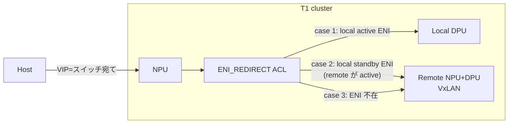
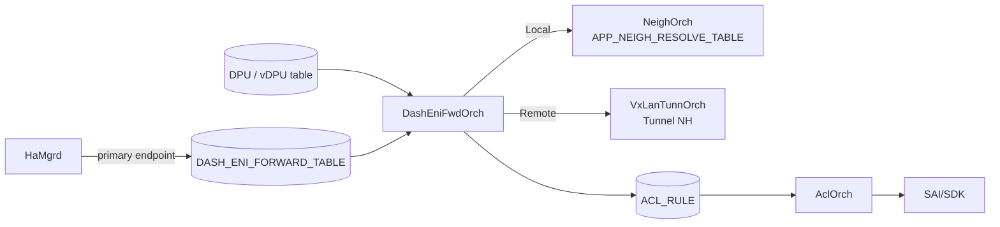

<!-- topics-tip -->
!!! tip "Topics で読み物として読む"
    この HLD は実装詳細を含みます。機能の概念・設定・運用を読み物として読みたい場合は [Topics 13 章: DASH / SmartSwitch](../topics/13-dash-smartswitch/index.md) を参照。
<!-- /topics-tip -->

!!! success "裏取りステータス: code-verified"
    `sonic-swss/orchagent/dash/dashenifwdorch.h:69` で `TABLE_TYPE = "ENI_REDIRECT"`、L92 で `class DashEniFwdOrch : public Orch2, public Observer`、L51-58 で `DpuRegistry / EniNH / LocalEniNH / RemoteEniNH / EniAclRule / EniInfo / EniFwdCtx*` を確認。`dashenifwdinfo.cpp:6` で `EniAclRule::BASE_PRIORITY = 9996`、L194 で `BASE_PRIORITY + type_` により通常 9996 / TUNN_TERM 9997 を生成。`orchdaemon.{h,cpp}` への組み込み、mock `dashenifwdorch_ut.cpp` も確認（verified at: 2026-05-09）。

# SmartSwitch ENI Based Forwarding（DashEniFwdOrch / ENI_REDIRECT ACL）

## なぜ必要か

[SmartSwitch](../reference/glossary.md#term-smartswitch)（[NPU](../reference/glossary.md#term-npu) + 複数 [DPU](../reference/glossary.md#term-dpu)）で NPU↔DPU の転送モデルは 2 案[^1]:

1. **VIP ベース**: コントローラが DPU ごとに VIP を払い出す。実装単純だが DPU ごとに VIP を消費しコスト高。
2. **[ENI](../reference/glossary.md#term-eni) ベース転送（本 [HLD](../reference/glossary.md#term-hld)）**: ホストは **スイッチ単位の VIP のみ** を使い、NPU 上で ENI 単位の [ACL](../reference/glossary.md#term-acl) ルールで local / remote DPU にリダイレクト。

ENI ベースは VIP 消費を 1 cluster 単位まで削減でき、ENI を SmartSwitch を跨いで配置できる柔軟性も得られる。

## どう動くか

### パケット経路の 3 ケース



- **Case 1**: 着地 NPU に **active ENI** → ローカル DPU へ
- **Case 2**: 着地 NPU に **standby ENI**（active が他 NPU） → L3 VxLAN で remote
- **Case 3**: 着地 NPU に ENI 無し → remote 転送

### スコープと Phase 分け

- 対象は **FNIC (Floating NIC) のみ**[^1]
- スケール例: T1 8 / DPU 4 / ENI 64 / HA 2x → cluster 1024 ENI、T1 1 台ホスト 256 → ACL `256*2 + (1024-256) = 1280`

| Phase | 内容 |
|-------|------|
| Phase 1（本 HLD） | `HaMgrd` が `DASH_ENI_FORWARD_TABLE` を書き、[orchagent](../reference/glossary.md#term-orchagent) が **primary endpoint のみ** ACL 化。Tunnel Termination ルールも生成。[BFD](../reference/glossary.md#term-bfd) 未使用 |
| Phase 2 | local / remote DPU に BFD を張り、状態で primary / secondary を切替 |

### コンポーネント構成



`DashEniFwdOrch` は `DASH_ENI_FORWARD_TABLE` を購読、DPU テーブルで local / remote を判別し、Local なら `NeighOrch`、Remote なら `VxLanTunnOrch` で nexthop を作って `ACL_RULE` に書く。

### ACL テーブル定義（`ENI_REDIRECT`）

```json
{
  "ACL_TABLE_TYPE": {
    "ENI_REDIRECT": {
      "MATCHES": ["DST_IP", "DST_IPV6", "INNER_DST_MAC", "TUNNEL_TERM"],
      "ACTIONS": ["REDIRECT_ACTION"],
      "BIND_POINTS": ["PORT"]
    }
  },
  "ACL_TABLE": {
    "ENI": { "STAGE": "INGRESS", "TYPE": "ENI_REDIRECT", "PORTS": ["..."] }
  }
}
```

INGRESS、外側 DST_IP/IPv6（VIP）+ INNER_DST_MAC（ENI MAC）+ TUNNEL_TERM の組合せでマッチ。

### ACL ルール 2 種類

ENI が `MAC=aa:bb:cc:dd:ee:ff / VIP=1.1.1.1/32 / VNET=Vnet1000` の場合:

**通常ルール (PRIORITY 9996)**:

```json
"ENI:Vnet1000_AABBCCDDEEFF": {
  "PRIORITY": "9996", "DST_IP": "1.1.1.1/32",
  "INNER_DST_MAC": "aa:bb:cc:dd:ee:ff",
  "REDIRECT": "<local/tunnel nexthop>"
}
```

FNIC では `outbound_eni_mac_lookup` / `outbound_vni` は無関係（常に INNER_DST_MAC でマッチ）[^1]。

**Tunnel Termination ルール (PRIORITY 9997, 高優先)**:

```json
"ENI:Vnet1000_AABBCCDDEEFF_TERM": {
  "PRIORITY": "9997", "DST_IP": "1.1.1.1/32",
  "INNER_DST_MAC": "aa:bb:cc:dd:ee:ff",
  "TUNN_TERM": "true",
  "REDIRECT": "<local nexthop oid>"
}
```

#### なぜ TUNN_TERM ルールが必要か

HA failover の過渡期に「旧 active が standby に降格、旧 standby はまだ standby」の曖昧状態が生じる。この間に remote ループバックするとパケットがピンポンし輻輳・ドロップが起きる。**tunnel decap 後のパケットは必ず local に留める** という高優先ルールでループを防ぐ[^1]。

### REDIRECT スキーマ拡張

既存 `ACL_RULE.REDIRECT` は `Ethernet10` / `PortChannel5` / `10.0.0.1` / `10.0.0.2@Vrf2` / `10.0.0.3@Ethernet1` / nexthop group などを取れる。本 HLD は **tunnel nexthop 表記** を追加[^1]:

```text
"<remote PA>@<tunnel_name>,<vni>"
例: "2.2.2.1@tunnel_name,100"
```

`AclOrch` が `VxLanTunnOrch` から tunnel NH OID を解決して [SAI](../reference/glossary.md#term-sai) に下ろせる。

<!-- evidence:
source: sonic-net/SONiC/doc/smart-switch/high-availability/eni-based-forwarding.md#L182-L211 (sha: 49bab5b5ff0e924f1ea52b3d9db0dfa4191a7c06)
excerpt: |
  When the HA failover happens, the used-to-be active becomes standby, but the used-to-be standby is still unchanged.
  ... ACL rules with high priority are added and the redirect should always be to local nexthop
  "ENI:Vnet1000_AABBCCDDEEFF_TERM": { "PRIORITY": "9997", ... "TUNN_TERM": "true", "REDIRECT": "<local nexthop oid>" }
reasoning: HA failover 過渡期のループ防止と、Tunnel Termination ルールが高優先 (9997) で local に留める設計の根拠。
-->

<!-- evidence-rendered:start -->
??? note "📋 検証エビデンス: sonic-net/SONiC/doc/smart-switch/high-availability/eni-based-forwarding.md#L182-L211 (sha: 49bab5b5ff0e924f1ea52b3d9db0dfa4191a7c06)"

    **出典**:

    `sonic-net/SONiC/doc/smart-switch/high-availability/eni-based-forwarding.md#L182-L211 (sha: 49bab5b5ff0e924f1ea52b3d9db0dfa4191a7c06)`

    **抜粋**:

    ```text
    When the HA failover happens, the used-to-be active becomes standby, but the used-to-be standby is still unchanged.
    ... ACL rules with high priority are added and the redirect should always be to local nexthop
    "ENI:Vnet1000_AABBCCDDEEFF_TERM": { "PRIORITY": "9997", ... "TUNN_TERM": "true", "REDIRECT": "<local nexthop oid>" }
    ```

    **判断根拠**: HA failover 過渡期のループ防止と、Tunnel Termination ルールが高優先 (9997) で local に留める設計の根拠。

<!-- evidence-rendered:end -->

## 設定

### CONFIG_DB

| Table | 役割 |
|-------|------|
| `ACL_TABLE_TYPE.ENI_REDIRECT` | INGRESS ACL 型（match 4 + REDIRECT + PORT bind） |
| `ACL_TABLE.ENI` | INGRESS / `ENI_REDIRECT` / 前面ポート bind |
| `ACL_RULE` | ENI 単位の通常 (9996) + TUNN_TERM (9997) ルール |
| `DASH_ENI_FORWARD_TABLE` | HaMgrd → DashEniFwdOrch 入力 |
| `VIP_TABLE` | スイッチ VIP の一時格納先（HLD 上「現状一時テーブル」と明記）[^1] |

### CLI / YANG

専用 CLI・[YANG](../reference/glossary.md#term-yang) は HLD では言及なし。

## 制限事項

- 対象は **FNIC のみ**。それ以外の [DASH](../reference/glossary.md#term-dash) シナリオはスコープ外。
- `VIP_TABLE` は一時テーブル扱い。最終形未確定[^1]。
- Phase 1 は BFD 連動なし。card レベル故障の検知遅延あり。
- Warm boot / Fast boot に追加処理なし[^1]。

## 干渉する機能

- **DASH HA HLD**: 本 HLD はそのフォワーディング層切り出し。`DASH_ENI_FORWARD_TABLE` スキーマは HA detailed design 側。
- **AclOrch**: `ENI_REDIRECT` 型と tunnel nexthop 表記の REDIRECT 解釈拡張。
- **VxLanTunnOrch / NeighOrch**: nexthop 解決のバックエンド。
- **HaMgrd**: `DASH_ENI_FORWARD_TABLE` の唯一の書き手（Phase 1）。

## トラブルシューティング

- 着信が正しい DPU に行かない: `redis-cli -n 4 hgetall "DASH_ENI_FORWARD_TABLE|<eni>"` で endpoint 確認。
- ACL が [ASIC](../reference/glossary.md#term-asic) に下りない: `AclOrch` ログと SAI ACL カウンタ。
- failover 直後の輻輳: TUNN_TERM ルール (PRIORITY 9997) が SET されているか。
- Remote 経路で drop: `VxLanTunnOrch` の tunnel NH OID と `ACL_RULE.REDIRECT` の `<PA>@<tunnel>,<vni>` 表記の整合。

### コマンド例

SmartSwitch DPU の ENI 転送状態と HA を確認する。

```bash
# SmartSwitch DPU / ENI
show chassis modules status
redis-cli -n 4 keys 'DPU|*'
redis-cli -n 4 keys 'DASH_ENI_TABLE:*'
docker exec database redis-cli -n 6 keys 'CHASSIS_MODULE_TABLE|*'
```

## 関連トピック

- [Topics: ACL / CoPP / Mirror](../topics/07-acl-copp-mirror/index.md) — ACL_TABLE_TYPE / REDIRECT 概観
- [Topics: VXLAN / EVPN](../topics/03-vxlan-evpn/index.md) — VxLAN tunnel nexthop
- [sonic-dash-hld](sonic-dash-hld.md)
- [vnet-local-endpoint-forwarding](vnet-local-endpoint-forwarding.md)

## 引用元

[^1]: `sonic-net/SONiC` `doc/smart-switch/high-availability/eni-based-forwarding.md` @ `49bab5b5ff0e924f1ea52b3d9db0dfa4191a7c06`

<!-- topics-back-ref -->
## 関連 Topics

- [Topics: DASH と SmartSwitch](../topics/13-dash-smartswitch/index.md)

<!-- /topics-back-ref -->

<!-- glossary-links-injected: c006405759d8 -->
