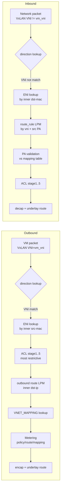

# SONiC-DASH 概念

このページは [SONiC-DASH 概観](sonic-dash-hld.md) の派生ページで、**概念・用語・シナリオ意味論** に絞って整理する。設定・運用は [sonic-dash-hld-operations.md](sonic-dash-hld-operations.md)、Orch / [SAI](../reference/glossary.md#term-sai) / DB スキーマ詳細は [sonic-dash-hld-internals.md](sonic-dash-hld-internals.md) を参照。

## 1. DASH が解く問題

[DASH](../reference/glossary.md#term-dash)（Disaggregated APIs for [SONiC](../reference/glossary.md#term-sonic) Hosts）は、[SmartSwitch](../reference/glossary.md#term-smartswitch) [DPU](../reference/glossary.md#term-dpu) や appliance card 上に多数の **顧客 VM 向け仮想 NIC ([ENI](../reference/glossary.md#term-eni))** を収容し、各 ENI に対する [VNet](../reference/glossary.md#term-vnet) / [ACL](../reference/glossary.md#term-acl) / metering / Service Tunnel / Private Link 等のデータプレーン処理を SDN コントローラから gRPC ([gNMI](../reference/glossary.md#term-gnmi)) 経由で構成する仕組み[^1]。通常の SONiC [NPU](../reference/glossary.md#term-npu) でなく **DPU 専用** に最適化されており、`switch_type: dpu` / `DEVICE_METADATA.subtype: SmartSwitch` で起動する。

DASH が目標とするスケール（[HLD](../reference/glossary.md#term-hld) §1.4）[^1]:

| 項目 | 期待値 |
|------|--------|
| [VNET](../reference/glossary.md#term-vnet) | 1024（ソフト上限） |
| ENI / カード | 32 |
| ENI あたり outbound route | 100k |
| ENI あたり inbound route | 10k |
| NSG / ENI | 10（5 ステージ ACL の上限） |
| ACL rule / NSG | 1000 |
| ACL prefix / ENI | 10 × 100k |
| CA-PA mapping / カード | 8M |
| 同時 active connection / ENI | 1M（双方向 TCP/UDP） |
| CPS | 3M |
| Metering bucket / ENI | 4000 |

通常の SONiC スイッチでは扱わない桁のオブジェクト数で、HLD §1.6 の "Design Considerations" は **bulk update**、**メモリのフレキシブル割り当て**（最大スケールを事前確保しない）、**API の冪等性**、**silent failure 禁止** 等を必須要件として明記している[^1]。

## 2. オブジェクトモデル {#vnet-mapping}

```text
APPLIANCE (sip / vm_vni / local_region_id)
  └── ENI (mac_address, underlay_ip, vnet, admin_state, mode={vm_mode,floating_nic_mode})
        ├── VNet（VNI / address_spaces / peer_list）
        ├── DASH_ENI_ROUTE → ROUTE_GROUP
        │     └── DASH_ROUTE (prefix → routing_type, ...)
        ├── DASH_ROUTE_RULE (vni, prefix, priority → vnet, pa_validation)  ; inbound
        ├── DASH_ACL_IN/OUT (stage 1..5 → ACL_GROUP)
        │     └── DASH_ACL_RULE (priority, action, terminating, tags/prefixes/ports)
        ├── DASH_METER_POLICY → DASH_METER_RULE (per ENI, per metering class)
        └── DASH_PA_VALIDATION (補助検証)
```

VNet を介して **CA-PA マッピング**（[DASH_VNET_MAPPING_TABLE](#vnet-mapping)）が outbound encap / inbound decap を駆動する。ENI と VNet は多対多ではなく **ENI は 1 つの VNet に所属**、ただし outbound route で `vnet_direct` や別 VNet への peering が可能である[^1]。

## 3. routing_type と action_type

`DASH_ROUTING_TYPE_TABLE` がパケット処理の中核となる **抽象アクション** を定義する[^1]:

| routing_type | 主用途 | 主な action_type |
|--------------|--------|------------------|
| `vnet` | VNet 内転送（mapping 表を引く） | `maprouting` |
| `vnet_direct` | overlay_ip を指定して mapping 表を引く | `maprouting` |
| `vnet_encap` | mapping 表のエントリから VxLAN encap | `staticencap` (vxlan) |
| `direct` | encap せず IP ルーティング（インターネット等） | `direct` |
| `appliance` | 旧 PL-NSG 用（DEPRECATED、`DASH_TUNNEL` へ移行） | `appliance` |
| `servicetunnel` | ST：IPv4→IPv6 transposition + NVGRE/VxLAN | `4to6` + `staticencap` |
| `privatelink` | PL：ST 拡張、private endpoint 経由 | `4to6` + `staticencap` |
| `drop` | パケット破棄 | `drop` |

v2.2 で `action_type` フィールドは `routing_type` に改名され、`DASH_ROUTE_TABLE.routing_type` には `{vnet, vnet_direct, direct, servicetunnel, drop}` のみ許容となった[^1]。

## 4. 主要シナリオ（HLD §1.1 / §2 / §3.6）

### 4.1 VNet ↔ VNet（基本）

ENI から outbound パケットが出る → LPM で `DASH_ROUTE` を引く → `routing_type=vnet` の場合は同 ENI の VNet に紐づく `DASH_VNET_MAPPING_TABLE` を **inner dst-ip** で再引き → underlay PA に向けて VxLAN encap、VNI は mapping エントリの `use_dst_vni` に応じて選択（false なら ENI の VNet VNI）[^1]。

### 4.2 Service Tunnel (ST)

storage 等の共有サービスにアクセスする経路。`routing_type=servicetunnel` で IPv4 → IPv6 への transposition（下位 32bit を IPv4 として保持、上位 96bit に region/vnet/subnet を符号化）と NVGRE/VxLAN による外側 encap を組み合わせる[^1]。

### 4.3 Private Link (PL)

ST の拡張。顧客 VNet 内の private endpoint から共有サービスへアクセスする際、ENI 側で **pl_sip_encoding** / **pl_underlay_sip** によりソース IPv6 transposition を行い、共有サービス側で逆変換する。`DASH_VNET_MAPPING_TABLE.routing_type=privatelink` で overlay_sip_prefix / overlay_dip_prefix を指定する[^1]。

### 4.4 PL-NSG（Private Link Network Security Group）

PL に NSG（追加 encap 経由のセキュリティチェイン）を挟む。旧 `DASH_ROUTING_APPLIANCE_TABLE` で実装されていたが v2.4 で **DASH_TUNNEL_TABLE** に置き換えられた[^1]。

### 4.5 FastPath（v1.6）

ICMP redirect を契機に flow のうち片側のみを accelerated 経路に更新する仕組み。TCP のみ対象、UDP は不可。詳細は HLD §2.5 と DASH 上流リポの `fast-path-icmp-flow-redirection.md` を参照[^1]。

### 4.6 Floating NIC (FNIC, v2.4)

VM ライブマイグレーション時に ENI 設定を移動先 DPU が追従するためのモード。ENI 作成時のみ `mode=floating_nic_mode` を指定でき、後から `vm_mode` には変更不可[^1]。

## 5. ACL のステージング

DASH ACL は **3 stage** (NSG) を v1 で導入し、v1.4 で **2 stage** が追加されて計 5 stage となった。HLD §1.7 の要件[^1]:

- **stage1..stage3**: 顧客 NSG。各 stage に v4/v6 ACL group を独立に bind
- **stage4..stage5**: Azure 内部 / VNET レベル
- ACL group は ENI に bind 済みの間は rule 編集不可（再構築 → 再 bind が必要）
- ただし **tag 展開（prefix の出し入れ）は bind 中でも許容**
- 各 rule は `terminating` true なら停止、false なら次 stage へ
- **ACL Tag**: prefix → tag マッピングを保ち、ACL rule では tag list で match。memory 最適化のため最大 24k prefix/tag、512 tag/prefix、4k tag/ENI

`DASH_ACL_RULE` の主フィールド: `priority, action(allow/deny), terminating, protocol[], src_tag[], dst_tag[], src_addr[], dst_addr[], src_port[], dst_port[]`。**同一 rule で src_tag と src_addr を併記する設計は想定外**（dst 側との混在は可）[^1]。

## 6. メータリング

HLD §1.5 / §2.4 の要件[^1]:

- `(ENI, metering_class_id)` 単位で `tx_counter` / `rx_counter`（UINT64、bytes）を持つ
- bucket 種別の優先順は **Policy → Route → Mapping**、ただし mapping エントリの `override` フラグで mapping を最優先化可能
- ENI 削除で関連 bucket は自動削除
- inbound でも route rule や mapping bucket を流用可能

config 上は `DASH_METER_POLICY` / `DASH_METER_RULE`（prefix → metering_class）を作り、`DASH_ENI.v4_meter_policy_id` / `v6_meter_policy_id` で ENI に紐付ける。route / mapping 側にも `metering_class_or` / `metering_class_and` で bit 操作で class id を合成する仕組みがある[^1]。

## 7. パケットフロー（高位）



詳細図 (svg) は upstream HLD `doc/images/dash/dash-hld-outbound-packet-processing-pipeline.svg` 等を参照[^1]。

## 8. 用語

| 略語 | 説明 |
|------|------|
| [DASH](../reference/glossary.md#term-dash) | Disaggregated APIs for SONiC Hosts |
| [ENI](../reference/glossary.md#term-eni) | Elastic Network Interface（≒ VM の vNIC、vPort と等価） |
| VNI | VxLAN Network Identifier |
| [VTEP](../reference/glossary.md#term-vtep) | VxLAN Tunnel End Point |
| VNET | Virtual Network |
| ST | Service Tunnel |
| PL | Private Link |
| NSG | Network Security Group |
| FNIC | Floating NIC |
| CA / PA | Customer Address / Provider Address |
| SLB | Software Load Balancer |
| [MUX](../reference/glossary.md#term-mux) | Software MUX（SLB の trafic director） |

## 関連ページ

- [SONiC-DASH 概観](sonic-dash-hld.md) — 元 HLD ページ
- [sonic-dash-hld-internals.md](sonic-dash-hld-internals.md) — DASH APP DB スキーマ、SAI mapping、Orch 内部実装
- [sonic-dash-hld-operations.md](sonic-dash-hld-operations.md) — CLI / 設定例 / トラブルシュート

## 引用元

[^1]: `sonic-net/SONiC` `doc/dash/dash-sonic-hld.md` @ `49bab5b5ff0e924f1ea52b3d9db0dfa4191a7c06`

<!-- topics-back-ref -->
## 関連 Topics

- [Topics: DASH と SmartSwitch](../topics/13-dash-smartswitch/index.md)

<!-- /topics-back-ref -->

<!-- glossary-links-injected: f73cf2a78869 -->
