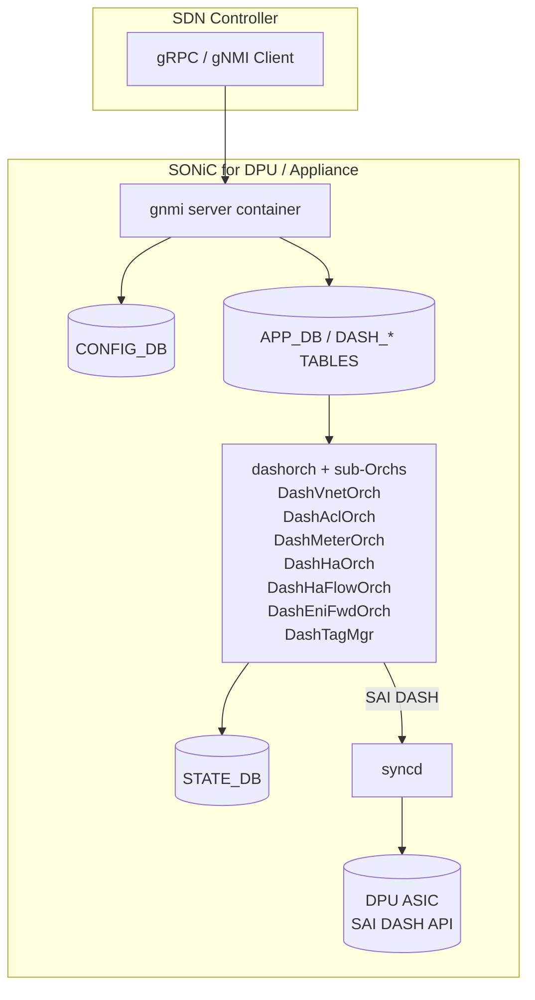

# SONiC-DASH 内部実装

このページは [SONiC-DASH 概観](sonic-dash-hld.md) の派生ページで、**DASH APP DB スキーマ / [SAI](../reference/glossary.md#term-sai) マッピング / Orch 構成** を扱う。概念は [sonic-dash-hld-concepts.md](sonic-dash-hld-concepts.md)、CLI / 設定例は [sonic-dash-hld-operations.md](sonic-dash-hld-operations.md) を参照。

## 1. アーキテクチャ全体



[DASH](../reference/glossary.md#term-dash) のオブジェクト群は **[CONFIG_DB](../reference/glossary.md#term-config_db) ではなく DASH APP_DB**（既存 APP_DB を流用、`DASH_` プレフィックス付き）に格納される。理由は [HLD](../reference/glossary.md#term-hld) §3 が明記する通り「SDN コントローラから投入される SDN state は L2/L3 switch state と性質が違い、永続化や reboot 越え扱いが別」だからである[^1]。warmboot 時のみ APP_DB DASH エントリが保持される。

オーケストレーションは新規 daemon **`dashorch`** が担当し、複数の sub-Orch (`DashVnetOrch` / `DashAclOrch` / `DashMeterOrch` / `DashHaOrch` 等) で機能を分割している（`sonic-swss/orchagent/dash/` 配下、`class DashOrch : public ZmqOrch`）[^2]。Orch は処理結果を [STATE_DB](../reference/glossary.md#term-state_db) に書き戻し、SDN 側は STATE_DB の confirm を見て次の段階に進む（HLD §1.6 #15 silent failure 禁止要件）[^1]。

## 2. DASH APP DB テーブル一覧

HLD §3.2 で定義される主要テーブル[^1]:

### 2.1 APPLIANCE / VNET / ENI

```text
DASH_APPLIANCE_TABLE:{appliance_id}
    sip                        ; encap 用 source IP
    vm_vni                     ; 方向判定で「VM 由来」と認識する reserved VNI
    local_region_id            ; v2.1 で追加
    outbound_direction_lookup  ; dst_mac/src_mac (default src_mac)
    trusted_vnis_list          ; v2.6.1 で trusted_vnis → trusted_vnis_list に改名

DASH_VNET_TABLE:{vnet_name}
    vni, guid, version, address_spaces(O), peer_list(O)

DASH_ENI_TABLE:{eni_mac}
    eni_id, mac_address, qos, underlay_ip, admin_state
    vnet, pl_sip_encoding(O), pl_underlay_sip(O)
    v4_meter_policy_id(O), v6_meter_policy_id(O)
    disable_fast_path_icmp_flow_redirection(O)
    mode(O: floating_nic_mode/vm_mode, create-only)
    trusted_vnis_list(O)
```

### 2.2 ROUTING TYPE / ROUTE / ROUTE_RULE

```text
DASH_ROUTING_TYPE_TABLE:{routing_type}: [
    { action_name, action_type, encap_type(O), vni(O) }, ...
]

DASH_ENI_ROUTE_TABLE:{eni}
    group_id

DASH_ROUTE_GROUP_TABLE:{group_id}
    guid, version

DASH_ROUTE_TABLE:{group_id}:{prefix}     ; outbound LPM
    routing_type (={vnet, vnet_direct, direct, servicetunnel, drop})
    vnet(O), appliance(O, DEPRECATED), overlay_ip(O)
    overlay_sip_prefix(O), overlay_dip_prefix(O)
    underlay_sip(O), underlay_dip(O)
    metering_class_or(O), metering_class_and(O)
    tunnel(O)

DASH_ROUTE_RULE_TABLE:{eni}:{vni}:{prefix/tag}:{priority}  ; inbound, v2.6 で priority がキーへ移動
    action_type, protocol(O), vnet(O), pa_validation(O)
    metering_class_or(O), metering_class_and(O), region(O)
```

### 2.3 VNET_MAPPING / PA_VALIDATION / TUNNEL / PORT_MAP

```text
DASH_VNET_MAPPING_TABLE:{vnet}:{ip_address}
    routing_type, underlay_ip, mac_address(O)
    use_dst_vni(O), use_pl_sip_eni(O)
    overlay_sip_prefix(O), overlay_dip_prefix(O)
    routing_appliance_id(O, OBSOLETED)
    tunnel(O), port_map(O)
    metering_class_or(O)

DASH_PA_VALIDATION_TABLE:{vni}
    addresses

DASH_TUNNEL_TABLE:{tunnel_name}        ; v2.4 で追加。ECMP nexthop 対応
    endpoints, encap_type(create-only), vni(create-only)
    metering_class_or(O)

DASH_OUTBOUND_PORT_MAP_TABLE:{map_id}                    ; v2.5
    guid
DASH_OUTBOUND_PORT_MAP_RANGE_TABLE:{map_id}:{port_range} ; v2.5
    action ({SKIP_MAPPING, MAP_PRIVATE_LINK_SERVICE})
    backend_ip, backend_port_base
```

### 2.4 ACL / TAG

```text
DASH_PREFIX_TAG_TABLE:{tag_name}
    ip_version, prefix_list

DASH_ACL_IN_TABLE:{eni}:{stage}
DASH_ACL_OUT_TABLE:{eni}:{stage}
    v4_acl_group_id(O), v6_acl_group_id(O)

DASH_ACL_GROUP_TABLE:{group_id}
    ip_version, guid, version

DASH_ACL_RULE_TABLE:{group_id}:{rule_num}
    priority, action(allow/deny), terminating
    protocol(O), src_tag(O), dst_tag(O)
    src_addr(O), dst_addr(O), src_port(O), dst_port(O)
```

### 2.5 METER

```text
DASH_METER_POLICY:{meter_policy_id}            ip_version
DASH_METER_RULE:{policy_id}:{rule_num}         priority, ip_prefix, metering_class
DASH_METER:{eni}:{metering_class_id}           metadata(O), tx_counter, rx_counter
```

## 3. APP_DB → SAI DASH API マッピング

HLD §3.2.17 に詳細表があり[^1]、主要なものを抜粋する:

| APP_DB | フィールド | SAI 属性 |
|--------|-----------|---------|
| `DASH_APPLIANCE_TABLE` | sip | `sai_vip_entry_t.vip` |
| | vm_vni | `sai_direction_lookup_entry_t.VNI` |
| | local_region_id | `SAI_DASH_APPLIANCE_ATTR_LOCAL_REGION_ID` |
| | trusted_vnis_list | `sai_global_trusted_vni_entry_t.vni_range` |
| `DASH_VNET_TABLE` | vni | `SAI_VNET_ATTR_VNI` (`SAI_OBJECT_TYPE_VNET`) |
| `DASH_ENI_TABLE` | mac_address | `sai_eni_ether_address_map_entry_t.address` |
| | underlay_ip | `SAI_ENI_ATTR_VM_UNDERLAY_DIP` |
| | vnet | `SAI_ENI_ATTR_VNET_ID` |
| | pl_sip_encoding | `SAI_ENI_ATTR_PL_SIP`, `SAI_ENI_ATTR_PL_SIP_MASK` |
| | mode | `SAI_ENI_ATTR_DASH_ENI_MODE` |
| `DASH_ENI_ROUTE_TABLE` | group_id | `SAI_ENI_ATTR_OUTBOUND_ROUTING_GROUP_ID` |
| `DASH_ROUTE_GROUP_TABLE` | (key) | `SAI_OBJECT_TYPE_OUTBOUND_ROUTING_GROUP` |
| `DASH_ROUTE_TABLE` | prefix | `sai_outbound_routing_entry_t.destination` |
| | routing_type | `SAI_OUTBOUND_ROUTING_ENTRY_ATTR_ACTION` |
| | vnet | `SAI_OUTBOUND_ROUTING_ENTRY_ATTR_DEST_VNET_ID` |
| | tunnel | `SAI_OUTBOUND_ROUTING_ENTRY_ATTR_DASH_TUNNEL_ID` |
| | metering_class_or/and | `SAI_OUTBOUND_ROUTING_ENTRY_ATTR_METER_CLASS_OR/AND` |
| `DASH_VNET_MAPPING_TABLE` | underlay_ip | `SAI_OUTBOUND_CA_TO_PA_ENTRY_ATTR_UNDERLAY_DIP` |
| | mac_address | `SAI_OUTBOUND_CA_TO_PA_ENTRY_ATTR_OVERLAY_DMAC` |
| | use_dst_vni | `SAI_OUTBOUND_CA_TO_PA_ENTRY_ATTR_USE_DST_VNET_VNI` |
| | tunnel | `SAI_OUTBOUND_CA_TO_PA_ENTRY_ATTR_DASH_TUNNEL_ID` |
| | port_map | `SAI_OUTBOUND_CA_TO_PA_ENTRY_ATTR_OUTBOUND_PORT_MAP_ID` |
| | (vnet, underlay_ip) | `sai_pa_validation_entry_t` (action=permit) |
| `DASH_ROUTE_RULE_TABLE` | (eni, vni, prefix) | `sai_inbound_routing_entry_t` キー |
| | pa_validation | `SAI_INBOUND_ROUTING_ENTRY_ATTR_ACTION = PA_VALIDATE/.../NONE` |
| `DASH_ACL_GROUP_TABLE` | ip_version | `SAI_DASH_ACL_GROUP_ATTR_IP_ADDR_FAMILY` |
| `DASH_ACL_RULE_TABLE` | priority | `SAI_DASH_ACL_RULE_ATTR_PRIORITY` |
| | action / terminating | `SAI_DASH_ACL_RULE_ATTR_ACTION`（非 terminating は `AND_CONTINUE`） |
| | src_addr / dst_addr | `SAI_DASH_ACL_RULE_ATTR_SIP/DIP` |
| `DASH_ACL_IN_TABLE` | stage | `SAI_ENI_ATTR_INBOUND_V4_stageN_DASH_ACL_GROUP_ID` |
| `DASH_OUTBOUND_PORT_MAP_TABLE` | (key) | `SAI_OBJECT_TYPE_OUTBOUND_PORT_MAP` |
| `DASH_OUTBOUND_PORT_MAP_RANGE_TABLE` | action | `SAI_OUTBOUND_PORT_MAP_PORT_RANGE_ENTRY_ATTR_ACTION` |

完全な表は HLD §3.2.17 を参照のこと[^1]。

## 4. dashorch サブ Orch 構成

`sonic-swss/orchagent/dash/` 配下に以下の sub-Orch が存在する（裏取り 2026-05-26）[^2]:

| ファイル / クラス | 担当 APP_DB | 役割 |
|-------------------|-------------|------|
| `dashorch.{h,cpp}` `DashOrch` | DASH_APPLIANCE / DASH_ENI / DASH_QOS / DASH_ROUTING_TYPE / DASH_ENI_ROUTE / DASH_ROUTE_GROUP / DASH_ROUTE / DASH_ROUTE_RULE | 中核 orch、`ZmqOrch` 派生で SDN との zmq バルク投入を受ける |
| `dashvnetorch.{h,cpp}` `DashVnetOrch` | DASH_VNET / DASH_VNET_MAPPING_TABLE | VNET 作成と CA-PA mapping、PA validation の構築 |
| `dashaclorch.{h,cpp}` `DashAclOrch` | DASH_ACL_IN/OUT / DASH_ACL_GROUP / DASH_ACL_RULE / DASH_PREFIX_TAG_TABLE | ACL group/rule の atomic 構築と [ENI](../reference/glossary.md#term-eni) bind、tag 展開 |
| `dashmeterorch.{h,cpp}` `DashMeterOrch` | DASH_METER_POLICY / DASH_METER_RULE / DASH_METER | metering bucket と policy |
| `dashhaorch.{h,cpp}` `DashHaOrch` | ([SmartSwitch](../reference/glossary.md#term-smartswitch) HA 状態同期) | HA peer [DPU](../reference/glossary.md#term-dpu) 間の DASH 状態同期 |
| `dashhafloworch.{h,cpp}` `DashHaFlowOrch` | (HA flow sync) | active connection の HA peer 同期 |
| `dashenifwdorch.{h,cpp}` `DashEniFwdOrch` | (ENI fwd) | SmartSwitch ENI-based forwarding |
| `dashcounter.{h,cpp}` | (counters) | counter polling |
| `dashportmaporch.{h,cpp}` | DASH_OUTBOUND_PORT_MAP / DASH_OUTBOUND_PORT_MAP_RANGE | PL redirect map (v2.5) |
| `dashtunnelorch.{h,cpp}` | DASH_TUNNEL_TABLE | tunnel object (v2.4) |
| `dashtagmgr.{h,cpp}` | (tag map cache) | DashAclOrch の tag → prefix 展開キャッシュ |

各 sub-Orch は `ZmqOrch` を継承して **SDN からの bulk update** をネイティブに受ける（HLD §1.6 #1, #2 の bulk 要件）。HLD §1.6 #15 silent failure 禁止に従い、SAI から非ゼロが返れば STATE_DB に error を書く[^1]。

## 5. 暗黙削除 (Implicit deletion)

HLD §1.8 で規定される **「キャッシュされない子オブジェクトは親削除時に同一 SAI API で暗黙削除する」** 規約[^1]:

| 親テーブル | 子テーブル | 子 SAI 型 |
|------------|-----------|----------|
| `DASH_ROUTE_GROUP_TABLE` | `DASH_ROUTE_TABLE` | `sai_outbound_routing_entry_t` |
| `DASH_ACL_GROUP_TABLE` | `DASH_ACL_RULE_TABLE` | [ACL](../reference/glossary.md#term-acl) rule ID |
| `DASH_VNET_TABLE` | `DASH_VNET_MAPPING_TABLE` | `sai_outbound_ca_to_pa_entry_t`<br>`sai_pa_validation_entry_t`<br>`sai_outbound_routing_entry_t`（dst_vnet 一致のみ） |
| `DASH_OUTBOUND_PORT_MAP_TABLE` | `DASH_OUTBOUND_PORT_MAP_RANGE_TABLE` | `sai_outbound_port_map_port_range_entry_t` |

また、**全 ENI から unbind された route group は [orchagent](../reference/glossary.md#term-orchagent) と SAI で自動削除** され、route 情報がキャッシュされていないため再 bind 不可となる。再利用するには `DASH_ROUTE_GROUP_TABLE` から作り直す必要がある[^1]。

## 6. SWSS Lite と Underlay {#swss-lite-underlay}

[SONiC](../reference/glossary.md#term-sonic) for DPU は **`switch_type=dpu`** で起動し、通常の switch 向け Orch の大半（[teamd](../reference/glossary.md#term-teamd-teamsyncd-teammgrd), nat, sflow, dhcp_relay, radv, macsec, resttapi）を無効化する。**有効** な container は database / swss / [syncd](../reference/glossary.md#term-syncd) / bgp / snmp / telemetry / lldp / pmon / gnmi のみ[^1]。

Underlay は通常の SAI で、appliance は接続 Peer (SmartSwitch / network device) と [BGP](../reference/glossary.md#term-bgp) セッションを張り、自分が advertise する VIP PA の経路を Peer から default route として受け取る。**[ECMP](../reference/glossary.md#term-ecmp) は 2 peer を前提** とし、LPM リソースは underlay 側にほとんど確保しない設計（HLD §3.3.5）[^1]。

encap behavior は **[DSCP](../reference/glossary.md#term-dscp) uniform / TTL pipe**（HLD §3.3.6）。DSCP は decap 前のオリジナル outer から copy し、内部 customer header の DSCP は **変更禁止**[^1]。

## 7. Protobuf 符号化（APP_DB 圧縮）

メモリ削減のため DASH APP_DB エントリは **protobuf 化** が選択可能。redis ハッシュの field 名を固定 `pb`、値を protobuf binary とする。型対応は HLD §3.2.18 表参照（`ip address → IpAddress`, `vni → uint32`, `l4 port → ValueOrRange` 等）[^1]。

## 8. STATE_DB

各 DASH テーブルの programming 状態は対応する `STATE_DB:DASH_*_TABLE_STATE` に書かれ、SDN コントローラは get で確認する。これにより HLD §1.6 #15 の silent failure 禁止が成立する[^1]。

## 関連ページ

- [SONiC-DASH 概観](sonic-dash-hld.md) — 元 HLD ページ
- [sonic-dash-hld-concepts.md](sonic-dash-hld-concepts.md) — 概念とシナリオ意味論
- [sonic-dash-hld-operations.md](sonic-dash-hld-operations.md) — CLI / 設定例 / トラブルシュート
- [SmartSwitch HA hamgrd 設計（concepts）](../architecture/smartswitch-high-availability-manager-daemon-hamgrd-design-concepts.md)

## 引用元

[^1]: `sonic-net/SONiC` `doc/dash/dash-sonic-hld.md` @ `49bab5b5ff0e924f1ea52b3d9db0dfa4191a7c06`
[^2]: `sonic-net/sonic-swss` `orchagent/dash/dashorch.{h,cpp}`, `dashvnetorch.{h,cpp}`, `dashaclorch.{h,cpp}`, `dashmeterorch.{h,cpp}`, `dashhaorch.{h,cpp}`, `dashhafloworch.{h,cpp}`, `dashenifwdorch.{h,cpp}`, `dashcounter.{h,cpp}`, `dashportmaporch.{h,cpp}`, `dashtunnelorch.{h,cpp}`, `dashtagmgr.{h,cpp}` @ master

<!-- topics-back-ref -->
## 関連 Topics

- [Topics: DASH と SmartSwitch](../topics/13-dash-smartswitch/index.md)

<!-- /topics-back-ref -->

<!-- glossary-links-injected: 9b5292ec1ce3 -->
