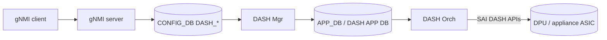

<!-- topics-tip -->
!!! tip "Topics で読み物として読む"
    この HLD は実装詳細を含みます。機能の概念・設定・運用を読み物として読みたい場合は [Topics 13 章: DASH / SmartSwitch](../topics/13-dash-smartswitch/index.md) を参照。
<!-- /topics-tip -->

!!! success "裏取りステータス: Code-verified（中核アーキテクチャの抜粋範囲のみ）"
    `sonic-swss/orchagent/dash/dashorch.h` L63 `class DashOrch : public ZmqOrch`、`dashvnetorch.cpp` L49-50 で `APP_DASH_VNET_TABLE_NAME` / `APP_DASH_VNET_MAPPING_TABLE_NAME` 操作、`dashaclorch.cpp` / `dashmeterorch.cpp` / `dashhaorch.cpp` / `dashhafloworch.cpp` / `dashenifwdorch.cpp` / `dashcounter.cpp` で各 Orch を確認。`sonic-buildimage/src/sonic-yang-models/yang-models/sonic-dash.yang` L36 `container DASH_VNET` / L119 `container DASH_ENI` で YANG を確認、`sonic-buildimage/src/sonic-dash-api` を確認（verified 2026-05-09）。**詳細仕様（FastPath / Service Tunnel / Private Link / Floating NIC / PL-NSG）は本ページの抜粋範囲外であり完全な裏取りではない**。章単位分割は別 issue で実施。

# SONiC-DASH（Disaggregated APIs for SONiC Hosts）アーキテクチャ概観

## 概要

DASH（**Disaggregated APIs for SONiC Hosts**）は、SmartSwitch DPU や appliance card 上で SONiC スタックが多数の **ENI (Elastic Network Interface)** を扱い、各 ENI に対する VNet / ACL / metering / Service Tunnel / Private Link 等のデータプレーン処理を行うための仕組み[^1]。本ファイルは DASH を SONiC 内に乗せるための実装側 HLD（API / Orch / Config DB / APP DB スキーマ）を扱う。一般 DASH 概念は [DASH 高位 HLD](https://github.com/sonic-net/DASH/tree/main/documentation/general/dash-high-level-design.md) を参照。

## 動作仕様

### 構成オブジェクト（抜粋）

```text
ENI (Elastic Network Interface)
└── VNet（VxLAN VNI / underlay 設定）
    ├── Outbound routing rules → routing_type（vnet, vnet_direct, direct, ...）
    ├── Inbound routing rules（PA Validation 含む）
    ├── ACL（v4/v6, Inbound/Outbound, ACL Group + Tag）
    ├── Metering (per-ACL / per-rule)
    ├── Service Tunnel (ST)
    └── Private Link (PL)
```

ENI ごとに上記のオブジェクト群がぶら下がる。複数 ENI を 1 DPU 上で並走させるのが DASH の設計目標。

### 主要 CONFIG_DB / DASH APP DB テーブル（v2.6.1 時点）

```text
DASH_APPLIANCE              ; appliance 1 つの基本情報、local Region ID
DASH_VNET                   ; VNet 定義（VNI 等）
DASH_ENI                    ; ENI 個別属性
DASH_ENI_ROUTE              ; ENI 単位のルートグループ参照
DASH_ROUTE_GROUP            ; route rule の集合
DASH_ROUTE                  ; outbound route rule（priority キー込み）
DASH_ROUTE_RULE             ; inbound route rule
DASH_PA_VALIDATION          ; inbound PA validation
DASH_VNET_MAPPING_TABLE     ; outbound VNI 解決
DASH_ACL_GROUP / DASH_ACL_RULE
DASH_METER_*
DASH_TUNNEL                 ; Service Tunnel / inner encap
DASH_PL_*                   ; Private Link
DASH_FNIC_*                 ; Floating NIC（v2.4 で追加）
DASH_PL_REDIRECT_MAP        ; v2.5 で追加
```

完全なフィールドリストは HLD §3 を参照。

### モジュール構成



DPU 上の DASH SAI 実装が、ENI に対する **outbound routing → ACL → metering** や **inbound PA validation → ACL → routing** のパイプラインを実行する。詳細は HLD §2 のパケットフロー図を参照[^1]。

### 主要シナリオ（HLD §1.1 抜粋）

- **VNet 内転送**: ENI → outbound route → VxLAN encap → リモート VTEP
- **Service Tunnel (ST)**: VNet 内とは別経路で SLB / NSG への中継
- **Private Link (PL)**: 別 VNet 上のサービスに対する private endpoint 経由のアクセス
- **PL-NSG**: Private Link with Network Security Group
- **FastPath**: 一部のフローを accelerated 経路で最適化（v1.6）
- **Floating NIC (FNIC)**: VM 移動時に ENI 設定をフォローする抽象（v2.4）

### Scaling 要件（HLD §1.4）

- ENI 数: 数千〜数万（DPU プラットフォーム依存）
- ルート数: ENI あたり 数千 〜 数 100k
- ACL ルール: ENI あたり数千

## 設定

### 関連する CONFIG_DB

| Prefix | 説明 |
|--------|------|
| `DASH_*` | 上記テーブル群すべて |

ユーザはコントローラ／gNMI 経由で投入。手書き想定なし。

### 関連する CLI

HLD には CLI 体系の正式定義は無く、gNMI / RestAPI 経由の設定を主とする。`show dash` 系の表示 CLI が存在し得るが、HLD §3.4 を参照。

### 関連する YANG

DASH は OpenConfig 由来の API 設計を採るが、SONiC 内部の YANG 反映は HLD で詳細規定なし。

### 設定例

`HLD §3.6 Example Configuration` を参照。例として 1 ENI に outbound 経路と ACL を入れるシナリオが示されている。

## 制限事項

- HLD 全体は 118KB 超で、本ページは中核オブジェクトと参照リンクに留める。**詳細仕様は必ず HLD `doc/dash/dash-sonic-hld.md` を参照すること**。
- DASH は DPU / SmartSwitch 専用機能で、通常の SONiC NPU 上では動かない。
- 各オブジェクトのフィールドは v2.0 以降頻繁に更新（v2.4 で `DASH_TUNNEL` / FNIC、v2.5 で PL redirect map、v2.6 で route rule priority のキー化、v2.6.1 で `trusted_vnis` → `trusted_vnis_list` 改名）[^1]。
- SAI DASH API は OCP SAI とは別ツリーで開発されており、community SAI への取り込み状況は時期によって異なる。

## 干渉する機能

- **VxLAN / VNet (既存 SONiC NPU 機能)**: DASH の VNet と既存 NPU 上の VNET は概念的には同様だが、実装パスは独立（DASH は DPU 側 SAI で完結）。
- **ACL / Metering**: DASH のものは ENI 単位で独立。NPU 側 ACL とは別。
- **SmartSwitch HA**: ハイアベイラビリティペア DPU 間で DASH 状態を同期する設計が別 HLD（`smart-switch-ha-hld.md`）で扱われ、`pinned_state` 等で本ページの後発機能と連動する。
- **Floating NIC (FNIC)**: VM ライブマイグレーション時の ENI 追従。複雑な状態機械を持つ。

## トラブルシューティング

- ENI が出ない → DASH_APPLIANCE / DASH_ENI / DASH_VNET の参照整合を確認。
- 外向き / 内向きで ACL 適用順が想定と違う → HLD §2 のパケットフロー図と routing_type の対応を確認。
- メータリングの値が出ない → DASH_METER_* テーブルが対応する ACL ルールに紐付いているかを確認。

## 引用元

[^1]: `sonic-net/SONiC` `doc/dash/dash-sonic-hld.md` @ `49bab5b5ff0e924f1ea52b3d9db0dfa4191a7c06`

<!-- topics-back-ref -->
## 関連 Topics

- [Topics: DASH と SmartSwitch](../topics/13-dash-smartswitch/index.md)
