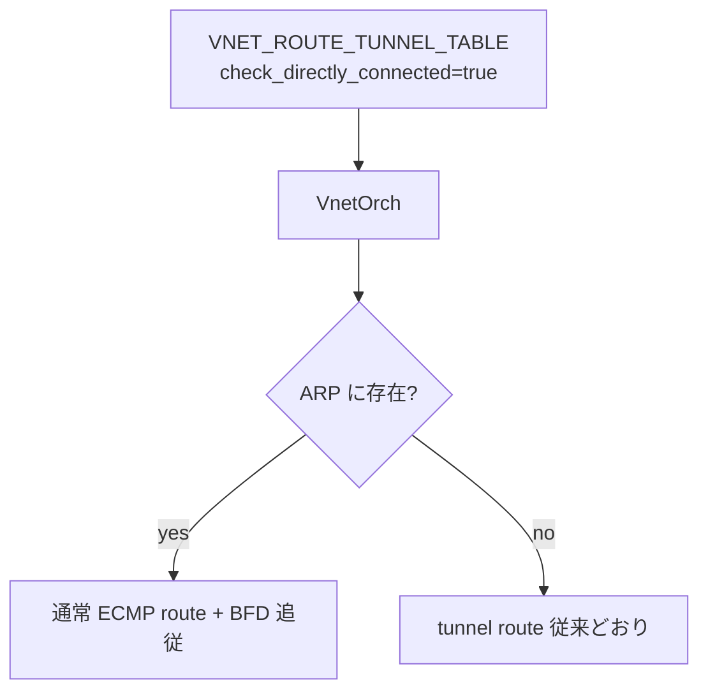
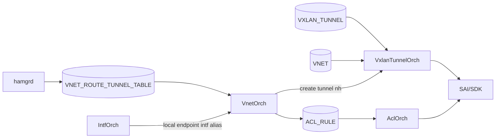

<!-- topics-tip -->
!!! tip "Topics で読み物として読む"
    この HLD は実装詳細を含みます。機能の概念・設定・運用を読み物として読みたい場合は [Topics 03 章: VXLAN / EVPN とオーバーレイ](../topics/03-vxlan-evpn/index.md) を参照。
<!-- /topics-tip -->

!!! success "裏取りステータス: code-verified"
    `sonic-swss/orchagent/vnetorch.cpp:3213,3251-3253,3306,3334` で `check_directly_connected` のパースと `isPartiallyLocal` ガードを確認。`sonic-swss/orchagent/tunneltermhelper.h:12-15` で `VNET_TUNNEL_TERM_ACL_TABLE_TYPE = "VNET_LOCAL_ENDPOINT_REDIRECT"`、`VNET_TUNNEL_TERM_ACL_TABLE = "VNET_LOCAL_ENDPOINT"`、`BASE_PRIORITY = 9998`、`SUFFIX = "TUNN_TERM"` を確認。`sonic-dash-ha/crates/hamgrd` 側にも `check_directly_connected` あり（verified at: 2026-05-09）。

# VNET の Local Endpoint Forwarding（DPU 直結 nexthop の最適化）

## なぜ必要か

Smart Switch（[NPU](../reference/glossary.md#term-npu) + 複数 [DPU](../reference/glossary.md#term-dpu)）の HA では NPU から **local DPU** / **remote DPU** へパケットを送り分ける。全体像は `smart-switch-ha-hld.md` の 4.2 節（data path HA）が担い、本ページはその上で 2 つの最適化を定義する小さな拡張[^1]:

1. **directly connected nexthop**: local DPU が NPU から直結（[ARP](../reference/glossary.md#term-arp) で見える）なら tunnel route ではなく **通常の [ECMP](../reference/glossary.md#term-ecmp) route** で扱う。
2. **failover transient state のドロップ防止**: failover の瞬間に **high-priority [ACL](../reference/glossary.md#term-acl)** で `TUNNEL_TERM` を見て必ず **local nexthop** にリダイレクトする。

## どう動くか

### `VNET_ROUTE_TUNNEL_TABLE` の拡張

optional フィールド `check_directly_connected` を追加[^1]:

```text
key   = VNET_ROUTE_TUNNEL_TABLE:<vnet_name>:<prefix>
field = check_directly_connected = BOOLEAN  (optional)
```

`true` の場合、`VnetOrch` は ARP テーブルを引いて directly connected か確認する:

- 直結なら tunnel route ではなく **通常 ECMP route**（VxLAN ECMP と同じく [BFD](../reference/glossary.md#term-bfd) liveness に追従[^1]）
- そうでなければ従来どおり tunnel route



これは "Overlay ECMP enhancements - support for directly connected nexthops" の延長線上の設計[^1]。

### Failover transient state の問題

HA failover では一瞬「旧 active が standby に降格、旧 standby はそのまま standby」という **両方 standby に近い transient state** ができ、この間に正規ルートを通るとパケットがドロップしうる。対策は **high-priority ACL** で **TUNNEL_TERM フラグ（tunnel decap 済）** のパケットを local nexthop に強制リダイレクトする[^1]。

### ACL の構造と連携モジュール



`check_directly_connected=true` のエンドポイントが ARP で確認できる場合のみ ACL を立てる。全シナリオで作ると [TCAM](../reference/glossary.md#term-tcam) を浪費するため **local endpoint と確定したもののみ** に限定する[^1]。

| モジュール | 役割 |
|------------|------|
| `hamgrd` | HA 状態管理。`VNET_ROUTE_TUNNEL_TABLE` 書き込み源 |
| `VnetOrch` | tunnel nexthop 作成、ARP 確認、ACL 投入の起点 |
| `VxlanTunnelOrch` | tunnel nexthop の [SAI](../reference/glossary.md#term-sai) 投入 |
| `IntfOrch` | local endpoint interface alias の解決 |
| `AclOrch` | ACL を SAI に降ろす |

### ACL テーブルタイプとルール

新規 `VNET_LOCAL_ENDPOINT_REDIRECT`[^1]:

| 観点 | 値 |
|------|----|
| `MATCHES` | `DST_IP`, `DST_IPV6`, `TUNNEL_TERM` |
| `ACTIONS` | `REDIRECT_ACTION` |
| `BIND_POINTS` | `PORT`, `PORTCHANNEL` |

```json
{
  "ACL_TABLE": {
    "VNET_LOCAL_ENDPOINT": { "STAGE": "INGRESS", "TYPE": "VNET_LOCAL_ENDPOINT_REDIRECT", "PORTS": ["..."] }
  },
  "ACL_RULE": {
    "VNET_LOCAL_ENDPOINT:<vnet>_<prefix>_IN_TUNN_TERM": {
      "PRIORITY": "9998", "DST_IP": "1.1.1.1/32",
      "TUNN_TERM": "true", "REDIRECT": "<local nexthop interface>"
    }
  }
}
```

priority 9998 で通常 forwarding より先に効く。tunnel decap 後 (`TUNN_TERM=true`) で DST が当該 prefix のパケットは必ず local へ。

<!-- evidence:
source: sonic-net/SONiC/doc/smart-switch/high-availability/vnet_local_endpoint_forwarding.md#L31-L34 (sha: 49bab5b5ff0e924f1ea52b3d9db0dfa4191a7c06)
excerpt: |
  During an HA failover, the HA pair briefly enters a transient state...
  To handle this scenario, **high-priority** ACL rules matching tunnel termination flag are used to ensure redirects always go to the local nexthop.
reasoning: failover transient 対策として high-priority ACL + TUNNEL_TERM match を使う中核ロジックの根拠。
-->

<!-- evidence-rendered:start -->
??? note "📋 検証エビデンス: sonic-net/SONiC/doc/smart-switch/high-availability/vnet_local_endpoint_forwarding.md#L31-L34 (sha: 49bab5b5ff0e924f1ea52b3d9db0dfa4191a7c06)"

    **出典**:

    `sonic-net/SONiC/doc/smart-switch/high-availability/vnet_local_endpoint_forwarding.md#L31-L34 (sha: 49bab5b5ff0e924f1ea52b3d9db0dfa4191a7c06)`

    **抜粋**:

    ```text
    During an HA failover, the HA pair briefly enters a transient state...
    To handle this scenario, **high-priority** ACL rules matching tunnel termination flag are used to ensure redirects always go to the local nexthop.
    ```

    **判断根拠**: failover transient 対策として high-priority ACL + TUNNEL_TERM match を使う中核ロジックの根拠。

<!-- evidence-rendered:end -->

## 設定

### CONFIG_DB

| Table | Key | フィールド | 用途 |
|-------|-----|-----------|------|
| `VNET_ROUTE_TUNNEL_TABLE` | `<vnet>:<prefix>` | `check_directly_connected` (BOOL, opt) | 直結チェック opt-in |
| `ACL_TABLE` | `VNET_LOCAL_ENDPOINT` | `STAGE`, `TYPE`, `PORTS` | 専用 ACL テーブル |
| `ACL_RULE` | `..._IN_TUNN_TERM` | `PRIORITY=9998`, `DST_IP`, `TUNN_TERM`, `REDIRECT` | 自動投入 redirect |

`hamgrd` が `VNET_ROUTE_TUNNEL_TABLE` を編集してパイプラインが起動。ACL 系は `VnetOrch` が必要に応じて自動投入[^1]。

### CLI / YANG

直接の CLI / [YANG](../reference/glossary.md#term-yang) は [HLD](../reference/glossary.md#term-hld) 内に定義なし。Smart Switch / HA 管理 CLI 経由で `VNET_ROUTE_TUNNEL_TABLE` が更新される運用前提。

## 制限事項

- `check_directly_connected` は optional（無指定なら従来の tunnel route のみ）
- ACL は ARP で neighbor 確認できた場合のみ追加。ARP 未解決の間は failover 保護効果が得られない[^1]
- ACL TCAM を消費。directly connected nexthop が多いとリソース上限リスク
- HLD 上 **packet flow diagram は TODO** マーキング。詳細は smart-switch-ha-hld 4.2 章および Overlay ECMP enhancements 3.3 章を併読[^1]

## 干渉する機能

- **smart-switch-ha-hld 4.2**: 本ページは「local endpoint 判別時の最適化」のみを定義。NPU→DPU 全体は本体 HLD 参照[^1]
- **Overlay ECMP enhancements**: directly connected nexthop の扱いは 3.3 章を踏襲。BFD 連動 ECMP も同経路[^1]
- **BFD**: 通常 ECMP route は BFD で生死判定、UP→DOWN で ECMP メンバから外れる
- **VxlanTunnelOrch**: tunnel nexthop 作成はこちらの責務
- **AclOrch**: priority 9998 ACL がポート bind されるため既存運用 ACL と priority 競合に注意[^1]

## トラブルシューティング

- failover 直後の DROP: `VNET_LOCAL_ENDPOINT:*` ACL が投入されているか、`check_directly_connected=true` か、ARP 解決済みか。
- 直結 DPU を生かせず tunnel route: `check_directly_connected=true` を設定し `VnetOrch` ログで ARP 確認結果を見る。
- ACL 数が肥大: directly connected nexthop が多い環境。prefix 単位の見積もりが必要。
- redirect 先が想定外: `IntfOrch` 経由の local nexthop interface alias を `VnetOrch` ログで追う。

### コマンド例

VNet 経路とローカル endpoint 設定を確認する。

```bash
# VNet route / endpoint
show vnet routes all
show vnet endpoint
redis-cli -n 4 keys 'VNET|*'
redis-cli -n 4 keys 'VNET_ROUTE_TUNNEL_TABLE|*'
```

## 関連トピック

- [Topics: ACL / CoPP / Mirror](../topics/07-acl-copp-mirror/index.md) — ACL_TABLE_TYPE / TUNNEL_TERM match
- [Topics: VRF / ECMP](../topics/04-vrf-ecmp/index.md) — Overlay ECMP enhancement の延長
- [smartswitch-eni-based-forwarding](smartswitch-eni-based-forwarding.md)
- [sonic-dash-hld](sonic-dash-hld.md)

## 引用元

[^1]: `sonic-net/SONiC` `doc/smart-switch/high-availability/vnet_local_endpoint_forwarding.md` @ `49bab5b5ff0e924f1ea52b3d9db0dfa4191a7c06`

<!-- glossary-links-injected: 4d9f23481e68 -->
