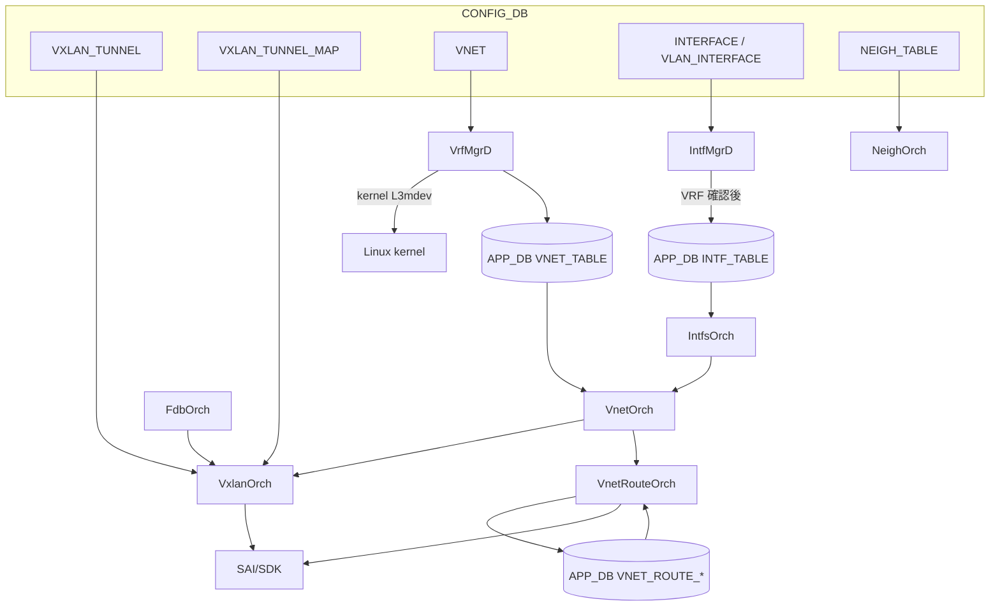
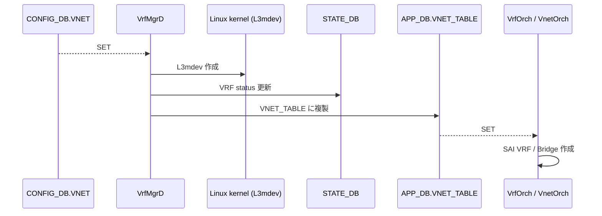

# VXLAN / VNet 内部実装

このページは [VXLAN / VNet 全体設計（概要ハブ）](vxlan-sonic.md) の派生ページで、**Orch 群と [SAI](../reference/glossary.md#term-sai) 連携の内部実装** に絞って整理する。概念は [vxlan-sonic-concepts.md](vxlan-sonic-concepts.md)、運用は [vxlan-sonic-operations.md](vxlan-sonic-operations.md)、制限事項は [vxlan-sonic-limitations.md](vxlan-sonic-limitations.md) を参照。

## 1. orchagent 役割分担

| Orch | 役割 |
|------|------|
| `VxlanOrch`（実コードは `VxlanTunnelOrch` 等に分割） | [VXLAN](../reference/glossary.md#term-vxlan) tunnel object、encap/decap mapper、tunnel termination |
| `VnetOrch` / `VnetRouteOrch` | VNet 単位の [VRF](../reference/glossary.md#term-vrf) / BRIDGE、ピアリング、VNet 経路 |
| `VrfMgrD` / `VrfOrch` | kernel L3mdev と SAI VRF の同期 |
| `IntfMgrD` / `IntfsOrch` | VNet 配下の [RIF](../reference/glossary.md#term-rif) |
| `FdbOrch` | remote [VTEP](../reference/glossary.md#term-vtep) の MAC 学習 |

## 2. VxlanOrch（実装は VxlanTunnelOrch 等に分割）

VXLAN の中核。tunnel オブジェクト + mapper + termination を作る。[EVPN](../reference/glossary.md#term-evpn) remote VTEP の動的生成も `vxlanorch.cpp` 内（`TNL_CREATION_SRC_EVPN`）。実コードでは下記のクラスに分割されている:

- `VxlanTunnelOrch` (`sonic-swss/orchagent/vxlanorch.h:268`)
- `VxlanTunnelMapOrch` (`vxlanorch.h:414`)
- `VxlanVrfMapOrch` (`vxlanorch.h:462`)
- `EvpnRemoteVnip2pOrch` (`vxlanorch.h:499`)
- `EvpnRemoteVnip2mpOrch` (`vxlanorch.h:512`)
- `EvpnNvoOrch` (`vxlanorch.h:541`)

## 3. VrfMgrD / VrfOrch

- `VrfMgrD`: VNet 設定から kernel L3mdev を作成 + [STATE_DB](../reference/glossary.md#term-state_db) に状態出力
- `VrfOrch`: 通常 VRF を APP_DB から SAI に投入（RouteOrch が利用）[^1]

## 4. VnetOrch / VnetRouteOrch

- `VnetOrch` (`sonic-swss/orchagent/vnetorch.h:250`): VNet 単位の ingress/egress **VRF または BRIDGE** を SAI に作成。`peer_list` を保持
- `VnetRouteOrch` (`vnetorch.h:504`): `VNET_ROUTE_TABLE` → subnet/local route、`VNET_ROUTE_TUNNEL_TABLE` → tunnel nexthop 経路 を SAI に投入。`peer_list` がある場合はピア VNet にも経路を複製[^1]
- 補助 Orch: `MonitorOrch` (`vnetorch.h:362`)、`BfdMonitorOrch` (`vnetorch.h:381`)、`VNetCfgRouteOrch` (`vnetorch.h:618`)

## 5. IntfMgrD / IntfsOrch / FdbOrch

- `IntfMgrD`: kernel 側 routing IF を L3mdev に enslave。STATE_DB の VRF 確立を待ってから APP_DB の `INTF_TABLE` に書く
- `IntfsOrch`: `INTF_TABLE` + VRF 情報で SAI RIF を作成。VNet 用は `VnetOrch` API 経由
- `FdbOrch`: VxlanOrch をメンバに持ち、**remote VTEP で学習した MAC** を `app-fdb-table` 経由で SAI に書く[^1]

## 6. SAI 属性対応表

| VXLAN コンポーネント | SAI 属性 |
|---------------------|----------|
| VXLAN tunnel 種別 | `SAI_TUNNEL_TYPE_VXLAN` |
| Encap mapper | `SAI_TUNNEL_MAP_TYPE_VIRTUAL_ROUTER_ID_TO_VNI` |
| Decap mapper | `SAI_TUNNEL_MAP_TYPE_VNI_TO_VIRTUAL_ROUTER_ID` |
| Nexthop tunnel | `SAI_NEXT_HOP_TYPE_TUNNEL_ENCAP` |
| Tunnel termination | `SAI_TUNNEL_TERM_TABLE_ENTRY_TYPE_P2MP` |
| VXLAN MAC | `SAI_SWITCH_ATTR_VXLAN_DEFAULT_ROUTER_MAC` |
| VXLAN UDP port | `SAI_SWITCH_ATTR_VXLAN_DEFAULT_PORT` |

## 関連ページ

- [VXLAN / VNet 全体設計（概要ハブ）](vxlan-sonic.md) — 元 [HLD](../reference/glossary.md#term-hld) ページ
- [vxlan-sonic-concepts.md](vxlan-sonic-concepts.md) — 概念・用語
- [vxlan-sonic-operations.md](vxlan-sonic-operations.md) — 設定・運用
- [vxlan-sonic-limitations.md](vxlan-sonic-limitations.md) — 制限事項

## 引用元

[^1]: `sonic-net/SONiC` `doc/vxlan/Vxlan_hld.md` @ `49bab5b5ff0e924f1ea52b3d9db0dfa4191a7c06`

<!-- glossary-links-injected: 0726817b0ba1 -->
